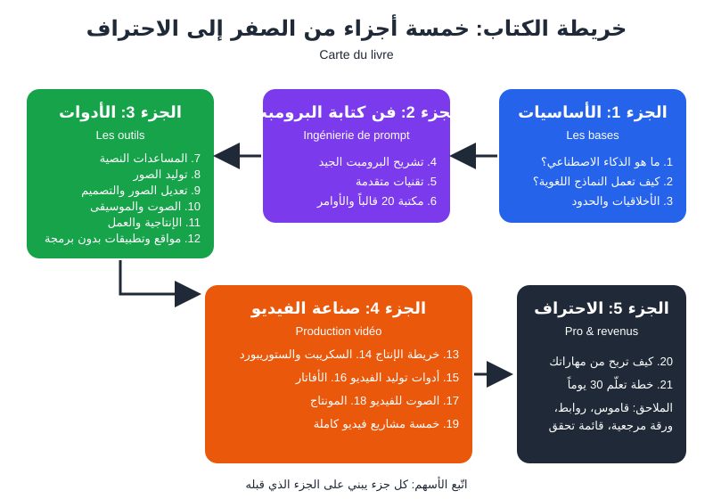

# المقدمة

---

> ## الذكاء الاصطناعي من الصفر إلى الاحتراف
> ### الأدوات، البرومبتات، وصناعة الفيديو
>
> **L'Intelligence Artificielle, du zéro au pro : outils, prompts et production vidéo**
>
> 📅 **تاريخ الكتابة:** أكتوبر 2026
> 🌍 **اللغة:** العربية، مع المصطلحات المفتاحية بالفرنسية
> 📖 **عدد الفصول:** 21 فصلاً + ملاحق

---

## مرحباً بك

فيديو إعلاني لمتجر صغير كان يحتاج فريقاً وأياماً. اليوم ينجز جزءاً كبيراً منه طالب في وهران أو صاحبة محل حلويات في فاس، من الهاتف، في ساعة أو ساعتين، بمساعدة الذكاء الاصطناعي (**Intelligence Artificielle — IA**).

لكن الأداة وحدها لا تكفي. الفرق الحقيقي في **طريقة التفكير**: كيف تكتب الأمر النصي (**Prompt**)، كيف تختار الأداة، وكيف تربط الأدوات في سلسلة عمل (**Workflow**) واضحة. هذا ما يعلّمك إياه الكتاب، خطوة بخطوة.

## لمن هذا الكتاب؟

| أنت... | ستستفيد في... |
|---|---|
| 🌱 مبتدئ تماماً | فهم الأساس واستعمال أول أداة بثقة |
| 🎓 طالب أو باحث عن عمل | مهارة مطلوبة في العمل الحر (**Freelance**) |
| 📱 صانع محتوى | إنتاج أسرع وأجمل للفيديو والمنشورات |
| 🛍️ صاحب مشروع صغير | إعلانات وصور ونصوص بميزانية صغيرة |
| 💼 موظف أو أستاذ | توفير الوقت في الرسائل والتقارير والدروس |

لا رياضيات ولا برمجة هنا: نحن **مستخدمون أذكياء** للأدوات.

> 💡 **نصيحة:** إذا كنت تستطيع إرسال رسالة على واتساب، فأنت تستطيع متابعة هذا الكتاب.

## كيف تقرأه؟

1. **المبتدئ:** الجزآن الأول والثاني بالترتيب، فهما الأساس.
2. **من يعرف الأساسيات:** اقفز إلى الأداة التي تهمّك (الجزء 3) أو إلى الفيديو (الجزء 4).
3. **من يريد برنامجاً جاهزاً:** اتبع **خطة 30 يوماً** في الفصل 21.

### ما ستجده في كل صفحة

- **المصطلحات:** بالعربية ثم بالفرنسية بخط عريض أول مرة، مثل: التعلّم الآلي (**Apprentissage automatique**). وفي الملاحق قاموس كامل.
- **البرومبتات الجاهزة:** بالفرنسية في كتلة قابلة للنسخ:

```
Agis comme un expert en marketing. Rédige trois slogans courts pour une pâtisserie artisanale à Fès.
```

- لأدوات الصور والفيديو والموسيقى نضيف نسخة إنجليزية، لأنها تفهمها أدق:

🇬🇧 بالإنجليزية:

```
Traditional Moroccan pastries on a copper tray, soft morning light --ar 4:5
```

- **صور الواجهات:** رسوم توضيحية للأدوات فيها علامات حمراء مرقّمة ① ② ③ وشرح كل رقم تحتها. الواجهات الحقيقية تتغير، فابحث عن **الوظيفة** لا عن مكان الزر.
- **المربعات:** 💡 نصيحة · ⚠️ تحذير · ✅ مثال صحيح · ❌ مثال خاطئ.
- **نهاية كل فصل:** 📝 خلاصة في نقاط، و🛠️ تمرين واحد لا تتجاوزه.

## ما تحتاجه قبل أن تبدأ

| ما تحتاجه | لماذا؟ |
|---|---|
| 📱 هاتف أو 💻 حاسوب | الهاتف يكفي لأغلب التمارين |
| 📧 بريد إلكتروني | للتسجيل في الأدوات (خصّص بريداً للتجارب) |
| 📒 ملف ملاحظات | لحفظ أفضل البرومبتات |
| ⏱️ 30–60 دقيقة يومياً | الاستمرارية أهم من الساعات الطويلة |

> 💡 **نصيحة:** ابدأ بالنسخ المجانية (**Version gratuite**)، ولا تدفع إلا حين تصبح الحدود المجانية عائقاً حقيقياً.

> ⚠️ **تحذير:** الأدوات والأسعار والواجهات تتغير كل بضعة أشهر، لذلك لا نذكر أسعاراً دقيقة. لكن **المبادئ** تبقى: بنية البرومبت، منطق السكريبت، حركات الكاميرا، أسس المونتاج. ولا تُدخل أبداً كلمات سر أو بيانات بنكية أو بيانات زبائنك في أي أداة (الفصل 3).

## خريطة الكتاب



*الشكل 0-1: خريطة الكتاب، كل جزء يبني على الذي قبله.*

| الجزء | الفصول | ماذا ستتعلم |
|---|---|---|
| 1. الأساسيات | 1–3 | ما هو الذكاء الاصطناعي، كيف يعمل النموذج اللغوي، الأخلاقيات |
| 2. هندسة البرومبت | 4–6 | البرومبت الجيد، التقنيات المتقدمة، مكتبة قوالب |
| 3. الأدوات | 7–12 | النصوص، الصور، الصوت، الأتمتة، المواقع بدون برمجة |
| 4. صناعة الفيديو | 13–19 | من السكريبت إلى المونتاج، وخمسة مشاريع كاملة |
| 5. الاحتراف والربح | 20–21 | تحويل المهارة إلى دخل، وخطة 30 يوماً |

## كلمة أخيرة

الفرق بين المبتدئ والمحترف هو **الممارسة اليومية**. اقرأ والأداة مفتوحة أمامك: انسخ، جرّب، غيّر كلمة، قارن.

هيا بنا. ➡️ [الفصل 1: ما هو الذكاء الاصطناعي؟](ch01.md)
