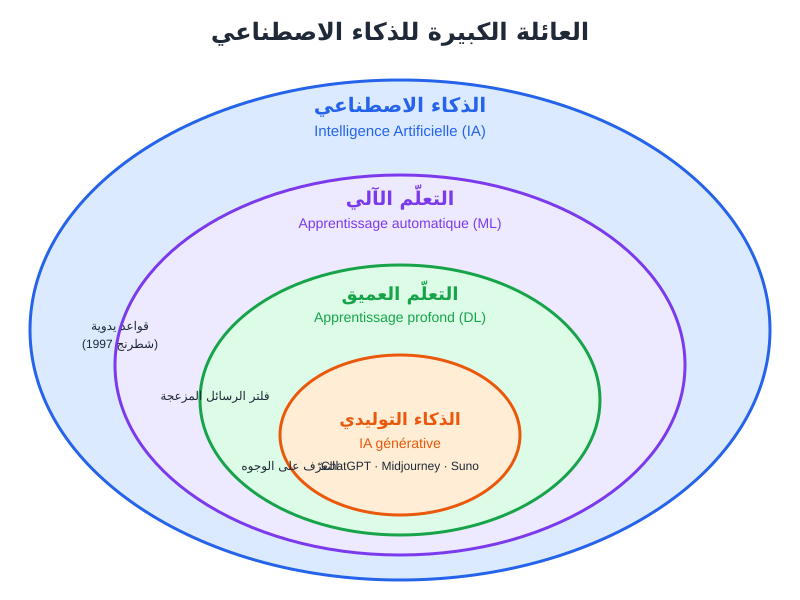
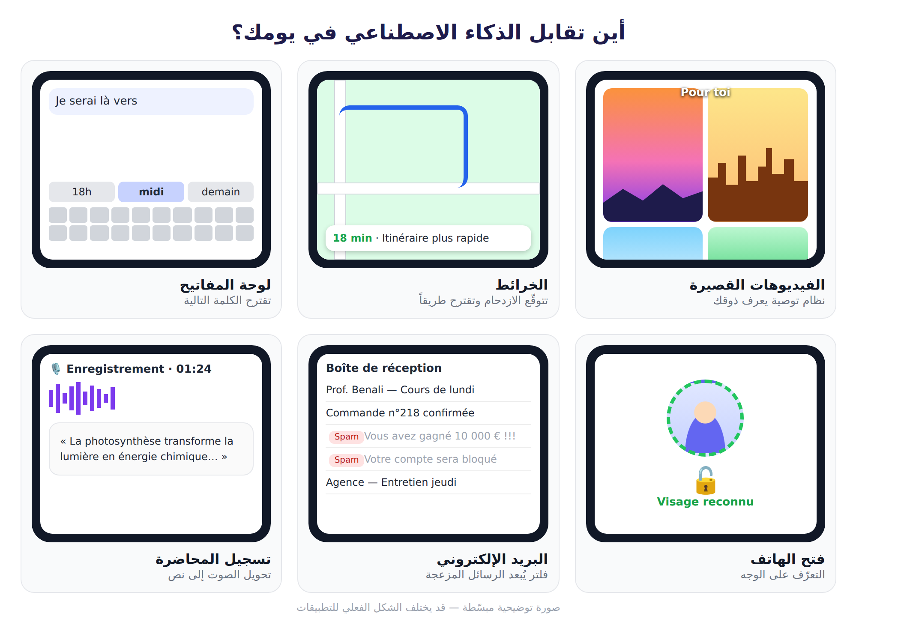
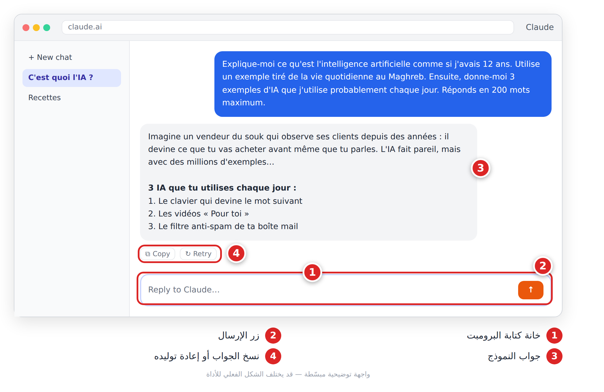

# الجزء الأول: أساسيات الذكاء الاصطناعي

# الفصل 1: ما هو الذكاء الاصطناعي؟ (**Intelligence artificielle**)

## 🎯 ماذا ستتعلم في هذا الفصل

- الفرق بين الذكاء الاصطناعي والبرنامج التقليدي.
- أهم المحطات في تاريخه.
- التعلّم الآلي والتعلّم العميق والذكاء التوليدي.
- ما يستطيعه الذكاء الاصطناعي وما لا يستطيعه.
- أول محادثة لك مع مساعد ذكي.

## 1-1 تعريف بسيط: آلة تتعلّم من الأمثلة

كيف تعلّم طفلاً التمييز بين القط والكلب؟ لا تعطيه قواعد. تريه صوراً كثيرة وتقول: «هذا قط»، «هذا كلب». بعد مدة يتعرّف على قط لم يره من قبل.

الذكاء الاصطناعي (**Intelligence Artificielle — IA**) يعمل بفكرة قريبة:

> **الذكاء الاصطناعي** مجال يصنع برامج تؤدي مهاماً كنا نظنها تحتاج ذكاءً بشرياً: فهم اللغة، التعرّف على الصور، الترجمة، الكتابة، الرسم، وتأليف الموسيقى.

هو **لا يفكّر مثل الإنسان**. هو بارع في اكتشاف الأنماط (**Motifs**) داخل كميات ضخمة من البيانات (**Données**)، ثم استعمالها للتوقّع أو الإنتاج.

| | البرنامج التقليدي | برنامج الذكاء الاصطناعي |
|---|---|---|
| كيف يُصنع؟ | المبرمج يكتب كل القواعد | يستخرج القواعد من الأمثلة |
| مثال | آلة حاسبة | فلتر الرسائل المزعجة |
| أمام حالة جديدة | يفشل بلا قاعدة | يحاول التعميم |
| الأخطاء | نادرة ومتوقعة | ممكنة، وأحياناً غريبة |

> 💡 **نصيحة:** حين تسمع «الذكاء الاصطناعي قرّر...»، ترجمها إلى «البرنامج حسب الاحتمال الأكبر بناءً على ما تعلّمه».

## 1-2 القصة في خمسة تواريخ

| السنة | الحدث |
|---|---|
| 1956 | ظهور مصطلح «الذكاء الاصطناعي» في مؤتمر دارتموث |
| 1997 | حاسوب Deep Blue يهزم بطل العالم في الشطرنج |
| 2012 | التعلّم العميق يتفوّق في التعرّف على الصور |
| 2017 | ظهور بنية المحوِّل (**Transformer**)، حرف T في GPT |
| 2022 | إطلاق ChatGPT للعموم، وانفجار الاهتمام |

بعدها جاءت أدوات الصور والفيديو والموسيقى، والنماذج متعددة الوسائط (**Modèles multimodaux**) التي تفهم النص والصورة والصوت معاً.

## 1-3 ضيّق أم عام؟

- **الذكاء الضيّق (IA faible / étroite):** متخصّص في مهمة أو مجال. كل ما نستعمله اليوم تقريباً من هذا النوع، حتى ChatGPT.
- **الذكاء العام (IA générale — AGI):** ذكاء يؤدي **أي** مهمة فكرية بشرية. **لم يتحقق بعد**، والعلماء مختلفون حول موعده وتعريفه.

> ⚠️ **تحذير:** عناوين مثل «الذكاء الاصطناعي أصبح واعياً!» مضلّلة. النص المقنع ليس دليلاً على الوعي.

## 1-4 العائلة الكبيرة

هذه المصطلحات ليست مترادفة، بل دوائر متداخلة:



*الشكل 1-1: العلاقة بين الذكاء الاصطناعي والتعلّم الآلي والتعلّم العميق والذكاء التوليدي.*

1. **التعلّم الآلي (Apprentissage automatique):** نعطي البرنامج أمثلة فيستنتج القواعد. مثال: من 2000 طلبية سابقة، يتوقّع أن من اشترت قفطاناً في رمضان قد تشتري حذاءً تقليدياً بعده.
2. **الشبكات العصبية (Réseaux de neurones):** «مصنع» بطبقات متتالية؛ الأولى ترى البكسلات، التالية الخطوط، ثم الأشكال، والأخيرة تقرّر: «قط بنسبة 94%». التدريب هو ضبط ملايين «الأوزان» (**Poids**) داخلها.
3. **التعلّم العميق (Apprentissage profond):** شبكات بطبقات كثيرة جداً. يحتاج بيانات ضخمة وقدرة حسابية كبيرة.
4. **الذكاء التوليدي (IA générative):** لا يصنّف فقط، بل **يُنشئ** محتوى جديداً:

| المحتوى | أمثلة أدوات |
|---|---|
| نص | ChatGPT، Claude، Gemini |
| صورة | Midjourney، مولّد الصور في ChatGPT |
| فيديو | Runway، Kling |
| موسيقى | Suno |
| صوت | أدوات التعليق الصوتي (**Voix off**) |

> ❌ **مثال خاطئ:** «الذكاء الاصطناعي = ChatGPT.»
> ✅ **مثال صحيح:** «ChatGPT تطبيق واحد من الذكاء التوليدي، وهو جزء صغير من مجال واسع.»

## 1-5 أين تقابله كل يوم؟

ربما تستعمل الذكاء الاصطناعي عشرات المرات يومياً دون أن تنتبه:



*الشكل 1-2: ست لحظات يومية يعمل فيها الذكاء الاصطناعي في هاتفك.*

لاحظ الفرق: أغلب هذه الأمثلة **تصنّف أو تتوقّع** (هل الرسالة مزعجة؟ ما الطريق الأسرع؟). أما كتابة نص أو صنع صورة فهي **توليد**.

## 1-6 يستطيع... ولا يستطيع

| يستطيع جيداً | يجد صعوبة في |
|---|---|
| كتابة مسودات وتلخيص النصوص | ضمان صحة المعلومات 100% |
| اقتراح أفكار كثيرة | فهم سياقك دون أن تشرحه |
| الترجمة وإعادة الصياغة | الحسابات الطويلة دون خطأ |
| توليد صور وفيديو وموسيقى | معرفة الأحداث بعد تاريخ تدريبه |

> **القاعدة الذهبية: الذكاء الاصطناعي مساعد ممتاز، لكنك أنت المسؤول عن النتيجة.**

## 1-7 أول تجربة

1. افتح مساعد محادثة (ChatGPT، Claude، Gemini، Le Chat...) وسجّل الدخول.
2. الصق هذا البرومبت في خانة الكتابة:

```
Explique-moi ce qu'est l'intelligence artificielle comme si j'avais 12 ans.
Utilise un exemple tiré de la vie quotidienne au Maghreb (souk, café, école).
Ensuite, donne-moi 3 exemples d'IA que j'utilise probablement chaque jour sans le savoir.
Réponds en 200 mots maximum.
```

3. اضغط زر الإرسال واقرأ الجواب.
4. اطلب متابعة:

```
Maintenant, explique la différence entre apprentissage automatique et apprentissage profond avec une analogie culinaire (la préparation du couscous).
```



*الشكل 1-3: أول محادثة مع مساعد ذكاء اصطناعي.*

> 💡 **نصيحة:** نكتب البرومبتات بالفرنسية لأنها لغة عمل شائعة في المغرب العربي والنماذج تفهمها جيداً. لتحصل على الجواب بالعربية أضف: `Réponds en arabe.`

## 📝 الخلاصة

- الذكاء الاصطناعي يكتشف الأنماط في البيانات؛ لا يفكّر مثل الإنسان.
- كل ما نستعمله اليوم ذكاء **ضيّق**؛ الذكاء **العام** لم يتحقق.
- الذكاء الاصطناعي يحتوي التعلّم الآلي، الذي يحتوي التعلّم العميق، ومنه الذكاء التوليدي (الشكل 1-1).
- الذكاء التوليدي **يُنشئ** نصوصاً وصوراً وفيديو وموسيقى.
- أنت المسؤول عن مراجعة كل ما ينتجه.

## 🛠️ تمرين

**«يومي مع الذكاء الاصطناعي»:** سجّل خلال يوم كامل كل تطبيق فيه ذكاء اصطناعي تستعمله، ثم أرسل القائمة بهذا البرومبت وقارن تصنيفه بتصنيفك:

```
Voici la liste des applications que j'ai utilisées aujourd'hui : [colle ta liste ici].
Pour chacune, indique le type d'IA (recommandation, reconnaissance, IA générative...) et une explication en une phrase.
Présente le résultat sous forme de tableau.
```
