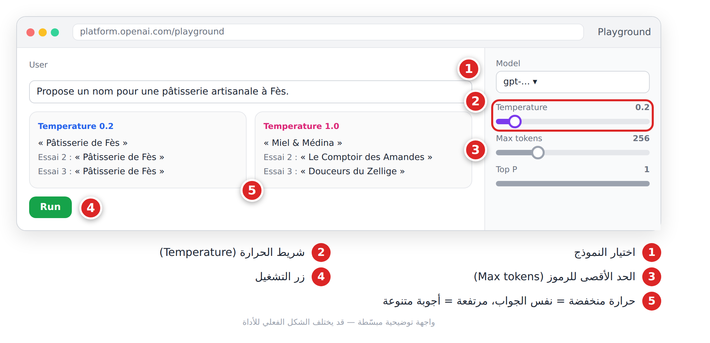
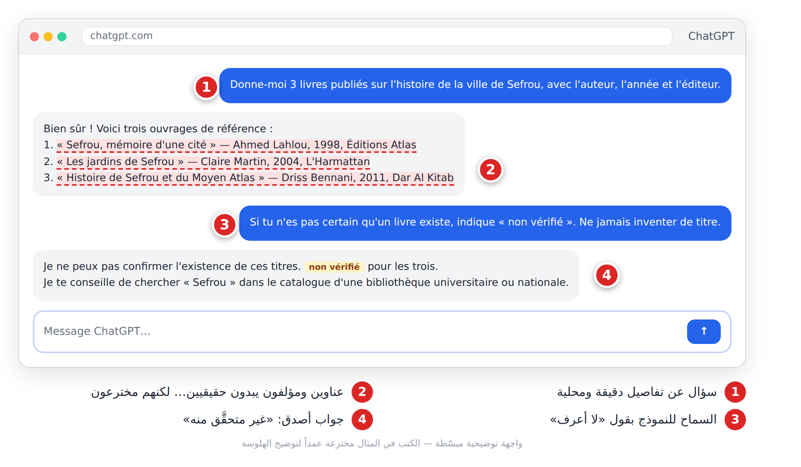

# الفصل 2: كيف تعمل النماذج اللغوية؟

## 2-1 «إكمال تلقائي» عملاق

اكتب في هاتفك «السلام عليكم، كيف...» فيقترح «حالك». هذا إكمال تلقائي (**Saisie prédictive**).

النموذج اللغوي الكبير (**Grand modèle de langage — LLM**) مثل ChatGPT أو Claude أو Gemini هو نسخة عملاقة من هذه الفكرة:

> **يتوقّع الجزء التالي الأكثر مناسبة من النص، يضيفه، ثم يتوقّع الذي بعده... حتى يكتمل الجواب.**

بسبب حجمه الهائل، تظهر من هذه العملية البسيطة قدرات مدهشة: الشرح، التلخيص، الترجمة، كتابة الكود.


*الشكل 2-1: النموذج يعطي احتمالاً لكل كلمة ممكنة، ثم يختار واحدة حسب إعداد الحرارة.*

«كبير» تعني: مليارات المعاملات (**Paramètres**)، وكميات ضخمة من نصوص التدريب.

## 2-2 بيانات التدريب: الطالب الذي قرأ كل شيء

تخيّل «يوسف»، قرأ ملايين الكتب وصفحات الويب، لكنه لم يخرج من غرفته، ولا يتذكر مصادره، وتوقّف عن القراءة في تاريخ معيّن.

| يوسف | النموذج |
|---|---|
| قرأ كثيراً جداً | تدرّب على كميات هائلة من النصوص |
| لا يتذكر المصدر | لا يستطيع دائماً ذكر مصدر دقيق |
| توقّف في تاريخ معيّن | له تاريخ توقف للمعرفة (**Date limite des connaissances**) |
| لم يخرج من الغرفة | لا يعرف الأحداث الجارية إلا بأداة بحث |

**مراحل الصنع باختصار:**

1. **التدريب المسبق (Pré-entraînement):** يقرأ ويتعلّم توقّع الكلمة التالية.
2. **الضبط الدقيق (Fine-tuning):** يتعلّم من أمثلة محادثات جيدة.
3. **تقييم البشر:** مقيّمون يختارون أفضل الأجوبة، فيصبح أنفع وأكثر أماناً.

> ⚠️ **تحذير:** بيانات الإنترنت تحمل أخطاءه وتحيّزاته، والنموذج قد يكرّرها (الفصل 3). والعربية، خاصة الدارجة، أقل حضوراً من الإنجليزية والفرنسية، فالنتائج فيها أقل دقة غالباً.

## 2-3 الرموز (Jetons): عملة النموذج

النموذج لا يقرأ كلمات، بل يقطّع النص إلى **رموز** (**Tokens / Jetons**)، كقطع ليغو: كلمة شائعة = قطعة، وكلمة طويلة = عدة قطع.


*الشكل 2-2: تقطيع جملة إلى رموز (توضيحي؛ التقطيع الحقيقي يختلف من نموذج لآخر).*

**لماذا يهمّك؟**

- **الحدود:** لكل نموذج حد أقصى من الرموز في المرة الواحدة.
- **التكلفة:** الخدمات عبر واجهة البرمجة (**API**) تُحسب غالباً بالرموز.
- **العربية** تُقطَّع غالباً إلى رموز أكثر من الإنجليزية لنفس المعنى.
- **أخطاء غريبة:** عدّ الحروف أو عكس كلمة قد يفشل، لأنه يرى قطعاً لا حروفاً.

## 2-4 نافذة السياق: السبّورة

النموذج يعمل أمام سبّورة محدودة الحجم اسمها **نافذة السياق** (**Fenêtre de contexte**). عليها: التعليمات الخفية (**Prompt système**)، رسائلك، أجوبته، والملفات الملصقة. **لا يرى إلا ما على السبّورة**.

النتائج العملية:

1. في المحادثات الطويلة جداً قد «ينسى» تعليمات البداية.
2. كل محادثة جديدة تبدأ من الصفر، إلا إذا كانت خاصية الذاكرة (**Mémoire**) مفعّلة.
3. مع الملفات الطويلة جداً قد تضيع تفاصيل الوسط.

> 💡 **نصيحة:** في مهمة طويلة ذكّره بالقواعد كل فترة: `Rappel : ton chaleureux, 80 mots max, pas d'emojis.` وعند تغيير الموضوع، افتح محادثة جديدة.

## 2-5 الحرارة (Température): دقة أم إبداع؟

الحرارة إعداد يتحكم في **كيف يختار** النموذج من قائمة الاحتمالات. تشبيه: طبّاخ يتبع وصفة جدته حرفياً (حرارة منخفضة)، أو طبّاخ مغامر يجرّب توابل جديدة (حرارة مرتفعة).

| الحرارة | السلوك | استعمالات |
|---|---|---|
| منخفضة (0–0.3) | ثابت ومتوقّع | ملخصات، استخراج معلومات، كود |
| متوسطة (0.5–0.7) | توازن | معظم الكتابة اليومية |
| مرتفعة (0.8 فما فوق) | متنوّع ومفاجئ | أفكار، أسماء علامات، قصص |

في تطبيقات المحادثة العادية لا تظهر الحرارة غالباً. تجدها في أدوات المطوّرين:



*الشكل 2-3: نفس البرومبت بحرارتين مختلفتين.*

ويمكنك تقليد أثرها بالكلمات:

```
Sois précis et factuel. Ne propose qu'une seule réponse, la plus probable.
```

```
Sois très créatif et surprenant. Propose 15 idées originales, même audacieuses.
```

## 2-6 الهلوسة: عندما يخترع بثقة

الهلوسة (**Hallucination**) هي معلومة **مختلقة** تُقدَّم بأسلوب واثق: كتاب غير موجود، رقم مخترع، رابط وهمي. السبب: مهمة النموذج **توقّع نص محتمل**، لا **التحقق من الحقيقة**؛ مثل تلميذ يخاف أن يقول «لا أعرف».



*الشكل 2-4: هلوسة نموذجية، وكيف يتغيّر الجواب عندما تسمح للنموذج بقول «لا أعرف».*

**تزيد الهلوسة مع:** التفاصيل الدقيقة (تواريخ، أرقام، أسماء)، طلب المراجع والروابط، المواضيع المحلية، الأحداث الحديثة، والأسئلة الموجِّهة.

**كيف تقلّلها:**

1. أعطه النص بنفسك واطلب الاعتماد عليه فقط:

```
Réponds uniquement à partir du texte ci-dessous. Si la réponse n'y figure pas, écris « Information non disponible dans le texte ».
Texte : """[colle ton texte ici]"""
Question : [ta question]
```

2. اسمح له بقول «لا أعرف»:

```
Si tu n'es pas sûr d'une information, dis-le clairement au lieu d'inventer.
```

3. تحقّق دائماً من الأرقام والأسماء والمراجع في مصادر موثوقة.

> ⚠️ **تحذير:** لا تضع أبداً في بحث أو مقال مرجعاً قدّمه نموذج لغوي دون أن تجده بنفسك.

## 📝 الخلاصة

- النموذج اللغوي «إكمال تلقائي» عملاق يتوقّع الرمز التالي مراراً.
- له تاريخ توقف للمعرفة، ويعمل بـ**الرموز**؛ العربية تستهلك رموزاً أكثر.
- **نافذة السياق** هي ذاكرة المحادثة الوحيدة؛ ما يخرج منها يُنسى.
- **الحرارة** توازن بين الدقة والإبداع.
- **الهلوسة** طبيعية في هذه النماذج: أعطِ المصادر، اسمح بـ«لا أعرف»، وتحقّق.

## 🛠️ تمرين

**«اصطد الهلوسة»:** أرسل هذا البرومبت، ثم ابحث عن كل كتاب في موقع مكتبة. كم واحداً موجوداً فعلاً؟ أعد السؤال في محادثة جديدة مع إضافة سطر «لا تخترع» من القسم 2-6، وقارن.

```
Donne-moi 5 livres publiés sur l'histoire de la ville de [petite ville de ta région], avec l'auteur, l'année et l'éditeur.
```
