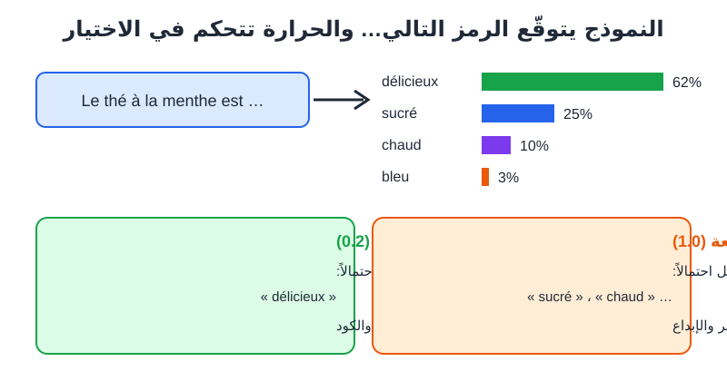
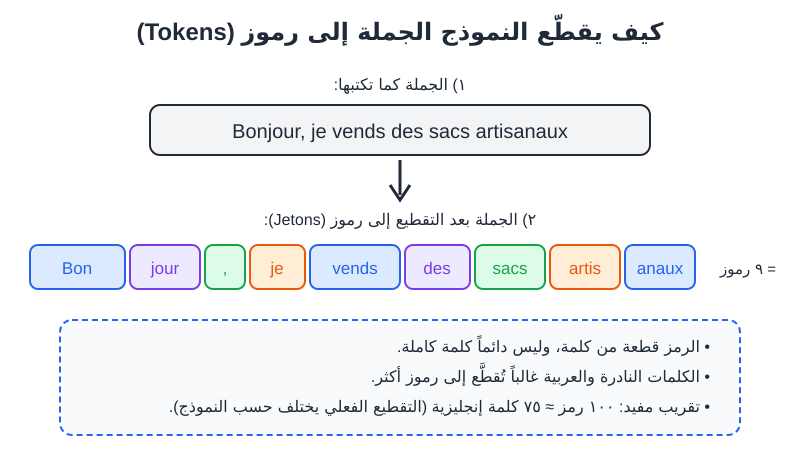

# الفصل 2: كيف تعمل النماذج اللغوية؟

## 🎯 ماذا ستتعلم في هذا الفصل

- ما هو النموذج اللغوي الكبير (**Grand modèle de langage — LLM**) بتشبيهات بسيطة.
- كيف «يتعلّم» النموذج من بيانات التدريب (**Données d'entraînement**).
- ما هي الرموز (**Tokens / Jetons**) ولماذا تهمّك.
- ما هي نافذة السياق (**Fenêtre de contexte**) ولماذا «ينسى» النموذج أحياناً.
- ما هي الحرارة (**Température**) وكيف تؤثر على الإبداع.
- لماذا «يهلوس» النموذج (**Hallucinations**) وكيف تقلّل ذلك.

---

## 2-1 النموذج اللغوي: «إكمال تلقائي» عملاق

افتح لوحة المفاتيح في هاتفك واكتب: «السلام عليكم، كيف...». سيقترح عليك الهاتف: «حالك». هذا إكمال تلقائي (**Saisie prédictive**) بسيط.

النموذج اللغوي الكبير (**Grand modèle de langage — LLM**) مثل ChatGPT أو Claude أو Gemini هو، في جوهره، **نسخة عملاقة ومتطورة جداً من هذا الإكمال التلقائي**. مهمته الأساسية:

> **أن يتوقّع الكلمة (أو جزء الكلمة) التالية الأكثر مناسبة، بناءً على كل ما سبقها.**

ثم يضيف هذه الكلمة، ويتوقّع التي بعدها، وهكذا، حتى يكتمل الجواب. هذا كل شيء! لكن بسبب حجم النموذج الهائل وكمية النصوص التي تدرّب عليها، تظهر من هذه العملية البسيطة قدرات مدهشة: الشرح، التلخيص، الترجمة، كتابة الكود، وحتى الاستدلال.



*الشكل 2-1: النموذج يعطي احتمالاً لكل كلمة ممكنة، ثم يختار واحدة حسب إعداد الحرارة.*

### لماذا «كبير»؟
كلمة «كبير» تعني أمرين:
1. **عدد المعاملات (Paramètres):** وهي «الأوزان» التي تحدّثنا عنها في الفصل 1. النماذج الحالية تحتوي على مليارات منها.
2. **حجم بيانات التدريب:** كميات ضخمة من النصوص، تُقاس بآلاف المليارات من الرموز.

> 💡 **نصيحة:** لا تحتاج أن تعرف الأرقام الدقيقة لكل نموذج (والشركات لا تنشرها دائماً). يكفيك أن تفهم أن «أكبر» يعني غالباً «أقدر»، لكنه أيضاً أبطأ وأغلى.

---

## 2-2 بيانات التدريب: مكتبة بحجم الإنترنت

### تشبيه الطالب الذي قرأ كل شيء
تخيّل طالباً اسمه «يوسف» قرأ ملايين الكتب والمقالات وصفحات الويب والمنتديات ورموز البرمجة... لكنه:
- لم يخرج من غرفته أبداً.
- لا يتذكر من أين قرأ كل معلومة.
- توقف عن القراءة في تاريخ معيّن.

هذا بالضبط وضع النموذج اللغوي:

| خاصية يوسف | ما يقابلها في النموذج |
|---|---|
| قرأ كثيراً جداً | تدرّب على كميات هائلة من النصوص |
| لا يتذكر المصدر | لا يستطيع دائماً ذكر مصدر دقيق لمعلومة |
| توقف في تاريخ معيّن | له تاريخ توقف للمعرفة (**Date limite des connaissances**) |
| لم يخرج من الغرفة | لا يعرف ما يحدث الآن، إلا إذا أُعطي أداة بحث على الإنترنت |

### مراحل صنع النموذج (بتبسيط)
1. **التدريب المسبق (Pré-entraînement):** النموذج يقرأ كمية هائلة من النصوص ويتعلّم توقّع الكلمة التالية. النتيجة: نموذج «يعرف» اللغة والمعلومات، لكنه لا يجيد الحوار بعد.
2. **الضبط الدقيق (Ajustement fin / Fine-tuning):** يتدرّب على أمثلة لمحادثات جيدة (سؤال ← جواب مفيد).
3. **التعلّم من تقييم البشر:** مقيّمون يقارنون أجوبة النموذج ويختارون الأفضل، فيتعلّم النموذج أن يكون مفيداً وآمناً وصادقاً أكثر.

> ⚠️ **تحذير:** بما أن بيانات التدريب جاءت من الإنترنت، فهي تحمل أخطاء الإنترنت وتحيّزاته. النموذج قد يكرر معلومة خاطئة شائعة، أو يعكس صورة نمطية. سنعود لهذا في الفصل 3.

### وماذا عن اللغة العربية؟
النصوص العربية على الإنترنت أقل بكثير من الإنجليزية، واللهجات (الدارجة المغربية، الجزائرية، التونسية...) أقل بعد. لذلك:
- الفصحى تعمل جيداً عموماً.
- الدارجة تعمل بشكل متفاوت، وقد يخلط النموذج بين اللهجات.
- الإنجليزية والفرنسية غالباً تعطي نتائج أدق في المواضيع التقنية.

---

## 2-3 الرموز (Tokens / Jetons): عملة النموذج

النموذج لا يقرأ الحروف ولا الكلمات كما نقرؤها نحن. هو يقطّع النص إلى قطع صغيرة تسمى **الرموز** (**Tokens**، وبالفرنسية **Jetons**).



*الشكل 2-2: كيف تُقطَّع جملة إلى رموز. التقطيع هنا توضيحي، والتقطيع الحقيقي يختلف من نموذج لآخر.*

### تشبيه قطع الليغو
فكّر في الرموز كقطع ليغو. الكلمات الشائعة مثل «le» أو «the» هي قطعة واحدة. الكلمات الطويلة أو النادرة تُبنى من عدة قطع. والنموذج «يفكّر» ويحسب بهذه القطع، لا بالكلمات.

### لماذا يهمّك هذا؟
1. **الحدود:** كل نموذج له حد أقصى من الرموز يستطيع التعامل معه في المرة الواحدة (انظر نافذة السياق أدناه).
2. **التكلفة:** الخدمات المدفوعة عبر واجهة البرمجة (**API**) تحسب السعر غالباً بعدد الرموز (في المدخلات والمخرجات).
3. **اللغة العربية:** النص العربي يُقطَّع غالباً إلى رموز أكثر من نص إنجليزي بنفس المعنى، أي أنه «يستهلك» من الحد أكثر.
4. **الأخطاء الغريبة:** لأن النموذج يرى قطعاً لا حروفاً، قد يخطئ في مهام تبدو سهلة مثل «كم حرف (r) في كلمة strawberry؟» أو عكس كلمة حرفاً بحرف.

> 💡 **نصيحة:** تقريب مفيد للإنجليزية: 100 رمز ≈ 75 كلمة. للفرنسية والعربية العدد أقل من الكلمات لكل 100 رمز. لا تحفظ الرقم بدقة؛ يكفي أن تعرف أن النص الطويل = رموز كثيرة.

> 🖼️ **الشكل 2-3 — عدّاد الرموز** (*Capture d'écran*)
> **ماذا تُظهر:** صفحة أداة عدّ الرموز (Tokenizer) على موقع أحد مزوّدي النماذج، وفيها جملة مكتوبة والرموز ملوّنة كلٌّ بلون، مع عدد الرموز والحروف.
> **العناصر المؤشَّر عليها:** ① خانة إدخال النص ② العدد الإجمالي للرموز ③ التلوين الذي يُظهر حدود كل رمز.
> **أين تلتقطها:** ابحث في محرك البحث عن «OpenAI Tokenizer» أو أداة مماثلة لدى مزوّد آخر، والصق جملة بالعربية ثم نفس الجملة بالفرنسية للمقارنة.

---

## 2-4 نافذة السياق (Fenêtre de contexte): ذاكرة المحادثة

### تشبيه السبّورة
تخيّل أن النموذج يعمل أمام سبّورة بحجم محدّد. كل ما تكتبه أنت وكل ما يجيب به يُكتب على هذه السبّورة. النموذج **لا يرى إلا ما هو مكتوب على السبّورة الآن**. عندما تمتلئ، يجب مسح الجزء الأقدم لكتابة الجديد.

هذه السبّورة هي **نافذة السياق** (**Fenêtre de contexte**)، وتُقاس بالرموز.

### ماذا يوجد داخل النافذة؟
- التعليمات الخفية التي وضعتها الشركة أو التطبيق (**Prompt système**).
- رسائلك السابقة في المحادثة.
- أجوبة النموذج السابقة.
- الملفات أو النصوص التي ألصقتها.
- رسالتك الحالية.

### النتائج العملية
1. **«النسيان» في المحادثات الطويلة:** إذا طالت المحادثة جداً، قد يتجاهل النموذج تعليمات قلتها في البداية، أو تقوم الأداة بتلخيص الجزء القديم أو قصّه.
2. **كل محادثة جديدة تبدأ من الصفر:** ما لم تكن الأداة تملك خاصية ذاكرة (**Mémoire**) مفعّلة، فالنموذج لا يتذكر محادثة الأمس.
3. **الملفات الطويلة:** النوافذ الحديثة كبيرة (قد تتسع لكتاب كامل في بعض النماذج)، لكن الدقة قد تنخفض مع النصوص الطويلة جداً، خاصة للتفاصيل في وسط النص.

> ✅ **مثال صحيح:** في محادثة طويلة لكتابة وصف 30 منتجاً، تذكّر النموذج كل 10 منتجات: `Rappel : ton chaleureux, 80 mots max, pas d'emojis.`

> ❌ **مثال خاطئ:** فتح محادثة جديدة وكتابة «أكمل الوصف كما اتفقنا أمس» والنموذج لا يعرف أي شيء عن «أمس».

> 💡 **نصيحة:** عندما تنتقل لموضوع مختلف تماماً، افتح محادثة جديدة. هذا يمنح النموذج «سبّورة نظيفة» ويقلل الخلط.

---

## 2-5 الحرارة (Température): بين الدقة والإبداع

ارجع إلى الشكل 2-1. النموذج لا يعطي كلمة واحدة، بل **قائمة احتمالات**: «délicieux» 62%، «sucré» 25%... الحرارة (**Température**) هي إعداد يتحكم في **كيف يختار** من هذه القائمة.

### تشبيه الطبّاخ
- **حرارة منخفضة (قريبة من 0):** طبّاخ يتبع وصفة جدته حرفياً. النتيجة متوقعة وثابتة، ممتازة عندما تريد الدقة.
- **حرارة مرتفعة (قريبة من 1 أو أكثر):** طبّاخ مغامر يضيف توابل غير متوقعة. النتيجة قد تكون رائعة ومبدعة، أو غريبة وغير مترابطة.

| الحرارة | السلوك | استعمالات مناسبة |
|---|---|---|
| منخفضة (0–0.3) | ثابت، متوقّع، يكرر نفس الجواب تقريباً | استخراج معلومات، ملخصات، كود، ترجمة |
| متوسطة (0.5–0.7) | توازن | معظم الكتابة اليومية |
| مرتفعة (0.8–1.2) | متنوّع، مفاجئ | أفكار، أسماء علامات تجارية، شعر، قصص |

### كيف أغيّر الحرارة؟
- في تطبيقات المحادثة العادية (واجهة ChatGPT أو Claude للعموم)، الحرارة غالباً **غير قابلة للتعديل مباشرة**، وتُضبط من طرف الشركة.
- في أدوات المطوّرين (مثل «Playground» أو واجهة API)، تجد عادة شريطاً أو خانة باسم Temperature.
- يمكنك **تقليد** تأثيرها بالكلمات في البرومبت:

```
Sois précis et factuel. Ne propose qu'une seule réponse, la plus probable.
```

```
Sois très créatif et surprenant. Propose 15 idées originales, même audacieuses.
```

> 🖼️ **الشكل 2-4 — إعداد الحرارة في بيئة المطوّرين** (*Capture d'écran*)
> **ماذا تُظهر:** واجهة تجريب النماذج للمطوّرين، مع لوحة إعدادات جانبية فيها شريط الحرارة.
> **العناصر المؤشَّر عليها:** ① قائمة اختيار النموذج ② شريط Temperature ③ خانة الحد الأقصى للرموز (Max tokens) ④ زر التشغيل.
> **أين تلتقطها:** لوحة المطوّرين لدى مزوّد نماذج (تتطلب حساب مطوّر). الواجهات تتغير، فقد يختلف مكان الإعدادات.

---

## 2-6 الهلوسة (Hallucinations): عندما يخترع النموذج بثقة

### ما هي؟
الهلوسة (**Hallucination**) هي عندما يُنتج النموذج معلومة **خاطئة أو مختلقة** لكن بأسلوب واثق ومقنع: كتاب غير موجود، رقم إحصائي مخترع، قانون لا وجود له، رابط إلكتروني وهمي، اقتباس لم يقله أحد.

### لماذا يحدث هذا؟
تذكّر: مهمة النموذج **توقّع النص الأكثر احتمالاً**، وليست **التحقق من الحقيقة**. إذا سألته عن «عدد سكان قرية صغيرة في الأطلس»، فهو يعرف أن الجواب يجب أن يكون رقماً بشكل معيّن، فيُنتج رقماً «يبدو» صحيحاً حتى لو لم يكن يعرفه.

تشبيه: تلميذ في امتحان شفوي لا يعرف الجواب، لكنه يخاف أن يقول «لا أعرف»، فيجيب بثقة بشيء يبدو منطقياً.

### متى تزيد الهلوسة؟
- الأسئلة عن تفاصيل دقيقة جداً (تواريخ، أرقام، أسماء أشخاص غير مشهورين).
- طلب مصادر ومراجع وروابط.
- مواضيع محلية قليلة الحضور في الإنترنت.
- الأحداث بعد تاريخ توقف معرفة النموذج.
- الأسئلة الموجِّهة: «لماذا قال ابن خلدون إن الإنترنت...؟» (النموذج قد يجاريك في الخطأ).

### كيف تقلّلها؟
1. **أعطه المعلومات بنفسك:** الصق النص أو الوثيقة واطلب منه الاعتماد عليها فقط.
2. **اسمح له بقول «لا أعرف»:**

```
Si tu n'es pas sûr d'une information, dis-le clairement au lieu d'inventer.
Distingue ce que tu sais avec certitude de ce que tu supposes.
```

3. **اطلب منه الاعتماد على نص محدد:**

```
Réponds uniquement à partir du texte ci-dessous. Si la réponse n'y figure pas, écris « Information non disponible dans le texte ».
Texte : """[colle ton texte ici]"""
Question : [ta question]
```

4. **تحقّق دائماً** من الأرقام والأسماء والمراجع في مصادر موثوقة.
5. **استعمل أدوات بحث** متصلة بالإنترنت تعرض مصادرها، ثم افتح المصادر بنفسك.

> ⚠️ **تحذير:** لا تقبل أبداً مرجعاً أو رابطاً أو رقماً من نموذج لغوي في بحث جامعي أو مقال أو منشور تجاري دون أن تتحقق منه بنفسك. حدثت حالات حقيقية قدّم فيها أشخاص لجهات رسمية مراجع اخترعها نموذج لغوي.

---

## 2-7 جمع الصورة: رحلة رسالتك داخل النموذج

لنلخّص ما يحدث عندما تكتب رسالة وتضغط «إرسال»:

1. **التقطيع:** نصّك يُقطَّع إلى رموز.
2. **الإضافة إلى النافذة:** الرموز تُضاف إلى نافذة السياق مع التعليمات الخفية وتاريخ المحادثة.
3. **الحساب:** الشبكة العصبية تمرّر كل هذا عبر طبقاتها وتحسب احتمال كل رمز ممكن ليأتي بعد ذلك.
4. **الاختيار:** يُختار رمز حسب الحرارة.
5. **التكرار:** الرمز المختار يُضاف، وتعاد العملية رمزاً برمز (لهذا ترى الجواب «يُكتب» أمامك تدريجياً).
6. **التوقف:** عندما يتوقع النموذج أن الجواب اكتمل، أو يصل للحد الأقصى.

> 💡 **نصيحة:** بما أن الجواب يُبنى رمزاً برمز، فالكلمات الأولى تؤثر على البقية. لذلك طلب «فكّر خطوة بخطوة قبل الجواب» يحسّن النتائج في المسائل المنطقية. سنرى هذه التقنية بالتفصيل في الفصل 5 (**Chaîne de pensée**).

---

## 📝 ملخص الفصل

- النموذج اللغوي الكبير (**LLM**) هو «إكمال تلقائي» عملاق يتوقّع الرمز التالي مراراً.
- تعلّم من **بيانات تدريب** ضخمة من الإنترنت والكتب، ثم ضُبط ليصبح محاوراً مفيداً. له تاريخ توقف للمعرفة.
- يعمل بـ**الرموز (Jetons)**، وهي قطع من الكلمات؛ العربية تستهلك رموزاً أكثر غالباً.
- **نافذة السياق** هي «السبّورة» التي يرى فيها المحادثة؛ ما يخرج منها يُنسى.
- **الحرارة** تتحكم في التوازن بين الدقة والإبداع.
- **الهلوسة** نتيجة طبيعية لطريقة عمل النموذج؛ قلّلها بإعطاء المصادر والسماح بـ«لا أعرف» والتحقق الدائم.

## 🚫 أخطاء شائعة

1. **معاملة النموذج كمحرك بحث:** هو يولّد نصاً محتملاً، لا يسترجع صفحات (إلا إذا كانت لديه أداة بحث).
2. **الظن أنه يتذكّر كل المحادثات السابقة:** كل محادثة جديدة تبدأ عادة من الصفر.
3. **لصق نصوص ضخمة جداً** ثم الاستغراب أن بعض التفاصيل أُهملت.
4. **طلب مراجع أكاديمية وقبولها دون تحقق.**
5. **استعمال نفس الأسلوب لكل المهام:** المهام الدقيقة تحتاج تعليمات «حرارة منخفضة»، والإبداعية تحتاج العكس.

## 🛠️ تمرين تطبيقي

**المهمة: «اصطد الهلوسة»**

1. اسأل مساعد محادثة هذا السؤال:

```
Donne-moi 5 livres publiés sur l'histoire de la ville de [nom d'une petite ville de ta région], avec l'auteur, l'année et l'éditeur.
```

2. ابحث عن كل كتاب في محرك بحث أو موقع مكتبة. كم كتاباً موجوداً فعلاً؟
3. أعد السؤال في محادثة جديدة مع هذه الإضافة:

```
Si tu n'es pas certain qu'un livre existe, indique « non vérifié ». Ne jamais inventer de titre.
```

4. قارن النتيجتين ودوّن ملاحظاتك.
5. **إضافي:** الصق جملة عربية ونفس الجملة بالفرنسية في أداة عدّ الرموز، وقارن العدد.

## ❓ اختبر نفسك

1. ما المهمة الأساسية التي يقوم بها النموذج اللغوي عند توليد الجواب؟
2. ما هو الرمز (**Jeton**)، ولماذا قد يستهلك النص العربي رموزاً أكثر؟
3. ماذا يحدث عندما تتجاوز المحادثة حجم نافذة السياق؟
4. أي حرارة تختار لتلخيص عقد كراء، وأي حرارة لاقتراح أسماء لمتجر حلويات؟
5. اذكر ثلاث طرق لتقليل الهلوسة.

<details><summary>الإجابات</summary>

1. توقّع الرمز (الكلمة أو جزء الكلمة) التالي الأكثر مناسبة بناءً على ما سبق، وتكرار ذلك حتى يكتمل الجواب.
2. الرمز قطعة نصية صغيرة (كلمة أو جزء من كلمة) يعالجها النموذج. النصوص العربية أقل حضوراً في بيانات تدريب أدوات التقطيع، فتُقسَّم الكلمات العربية غالباً إلى قطع أكثر.
3. يفقد النموذج الوصول إلى الأجزاء الأقدم (أو تُلخَّص)، فقد «ينسى» تعليمات أو تفاصيل من البداية.
4. العقد: حرارة منخفضة (دقة). أسماء المتجر: حرارة مرتفعة (إبداع).
5. إعطاؤه النص المصدر والطلب منه الاعتماد عليه فقط؛ السماح له بقول «لا أعرف»؛ التحقق من المعلومات في مصادر موثوقة؛ استعمال أدوات بحث تعرض مصادرها.

</details>
