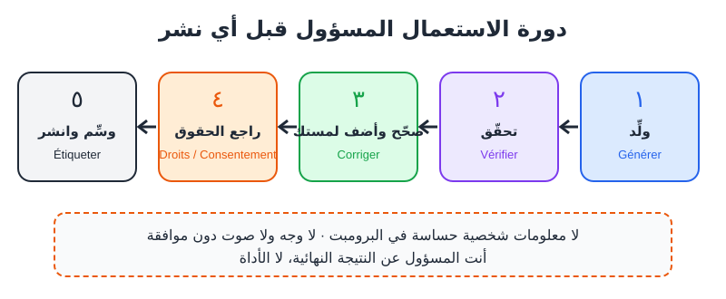
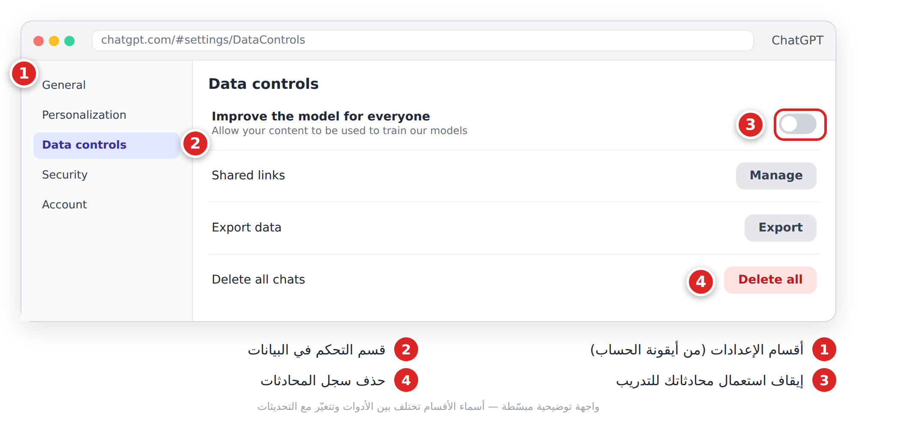
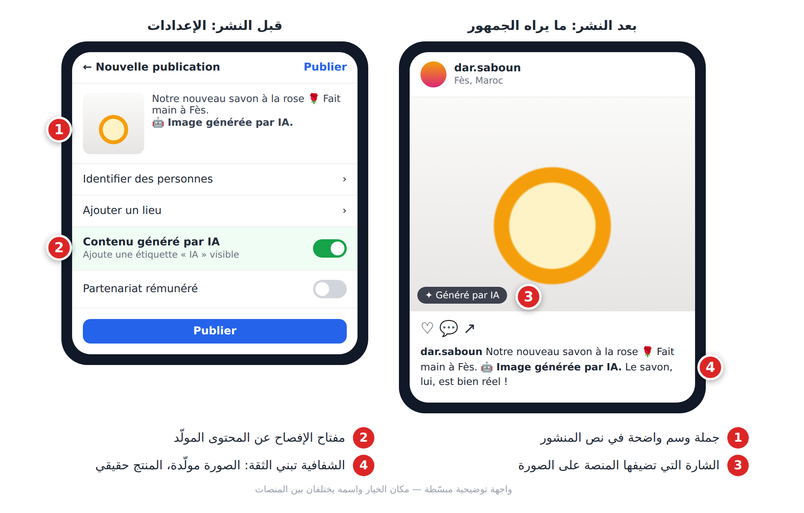

# الفصل 3: الأخلاقيات وحدود الذكاء الاصطناعي

## 3-1 لماذا يهمّك هذا؟

معلومة صحية خاطئة أو وجه شخص دون إذنه قد يكلّفك **سمعتك** و**حسابك** على المنصات، وربما **مشاكل قانونية**. هذا الفصل دليل عملي، ولا يغني عن استشارة مختص.

قبل نشر أي محتوى مولَّد، مرّره بهذه الدورة:



*الشكل 3-1: دورة الاستعمال المسؤول قبل النشر.*

## 3-2 الهلوسة في الحياة اليومية

- بائع أعشاب ينشر أن زيت الأرغان «يعالج السكري» لأن النموذج قال ذلك: ادعاء مضلّل وخطير.
- طالبة ماستر تضع في بحثها مراجع لا وجود لها.

**🚩 الأعلام الحمراء:** تحقّق مضاعفاً من الأرقام، الأسماء والتواريخ، المراجع والروابط، المعلومات الطبية والقانونية والمالية، والأحداث الحديثة.

بعد أي جواب مهم، اطلب منه تحديد ما يجب أن تتحقق منه:

```
Relis ta réponse précédente de manière critique.
1. Liste chaque affirmation factuelle (chiffres, noms, dates, sources).
2. Pour chacune, indique ton niveau de confiance (élevé / moyen / faible).
3. Indique lesquelles je dois vérifier dans une source officielle.
```

## 3-3 حقوق المؤلف (Droits d'auteur)

القوانين تختلف من بلد لآخر وما زالت تتطور، لكن القواعد الآمنة واضحة:

1. **ما تُدخله:** لا ترفع أعمالاً لا تملكها لتعيد صنعها وتبيعها.
2. **ما يخرج:** اقرأ شروط استعمال الأداة (**Conditions d'utilisation**)؛ الاستعمال التجاري مسموح أحياناً في خطط معيّنة فقط.
3. **الأسلوب والعلامات:** لا تقلّد فناناً حياً بالاسم، ولا تولّد شعارات ماركات (Nike، Disney...) أو أصوات مغنّين مشهورين.

> ❌ «صورة لمنتجي بأسلوب [فنان معاصر] مع شعار Chanel.»
> ✅ «صابون طبيعي على طاولة خشبية، إضاءة ناعمة، تصوير منتجات احترافي.»

لتصف أسلوباً دون نسخ أحد:

```
Décris le style visuel que je souhaite pour mes images produits en termes techniques (lumière, couleurs, composition, ambiance), sans citer de nom d'artiste ou de marque.
Style recherché : [chaleureux, artisanal, marocain moderne...].
```

## 3-4 الخصوصية (Vie privée)

ما تكتبه يُرسَل إلى خوادم الشركة، وقد يُحفظ أو يُستعمل لتحسين النماذج حسب إعداداتك.

**⛔ لا تكتب أبداً:** كلمات السر، أرقام البطاقات البنكية، أرقام الهوية، ملفات زبائنك (أسماء + هواتف + عناوين)، معلومات طبية عن الآخرين، أسرار شركتك.

**أخفِ الهوية (Anonymisation) قبل اللصق:**

> ❌ «الزبونة فاطمة بنعلي، هاتف 06xxxxxxxx، حي الرياض بالرباط، تشتكي...»
> ✅ «زبونة (سأسميها "س") تشتكي من تأخر طلبيتها 10 أيام...»

ثم خصّص خمس دقائق لإعدادات البيانات في أداتك:



*الشكل 3-2: إيقاف استعمال محادثاتك للتدريب وحذف السجل.*

## 3-5 التزييف العميق (Deepfake) والموافقة

التزييف العميق صورة أو فيديو أو صوت يُظهر شخصاً حقيقياً **يقول أو يفعل ما لم يفعله**. الأدوات اليوم تستنسخ صوتاً (**Clonage vocal**) من مقطع قصير.

| ✅ مشروع | 🔴 خط أحمر |
|---|---|
| استنساخ **صوتك أنت** لتعليق فيديوهاتك | وجه أو صوت أي شخص دون موافقته الصريحة |
| أفاتار (**Avatar**) رقمي لنفسك | إيهام بأن شخصية عامة تروّج لمنتجك |
| دبلجة فيديو لك إلى لغة أخرى | أي محتوى جنسي أو مهين لأشخاص حقيقيين |
| مشروع بموافقة مكتوبة من المعنيين | تزييف أخبار وأحداث |

> ⚠️ **تحذير:** احتيال الصوت المستنسخ في تزايد: «ابنك» يتصل طالباً مالاً عاجلاً. اتفقوا على **كلمة سر عائلية**، واتصل دائماً بالرقم المعروف.

لكشف التزييف اسأل أولاً: **ما مصدر هذا المحتوى؟**

## 3-6 التحيّزات (Biais)

النموذج يعيد الصور النمطية الموجودة في بياناته: «طبيب» = رجل غالباً، و«مطبخ تقليدي» = خلط بين المطابخ العربية.

**الحل:** صِف بدقة بدل ترك «الافتراضي».

> ❌ «امرأة عربية»
> ✅ «امرأة مغربية في الخمسينيات، بجلابة عصرية، تدير ورشة خياطة، تبتسم وهي تعمل.»

## 3-7 وسم المحتوى (Étiquetage)

الوسم يعني إخبار الجمهور بأن المحتوى مولَّد أو معدَّل بالذكاء الاصطناعي. لماذا؟ **الثقة**، و**قواعد المنصات** (YouTube وTikTok وInstagram تطلب أو تشجّع الإفصاح عن المحتوى الواقعي المولّد)، و**القوانين** مثل **AI Act** الأوروبي.

| الحالة | الوسم |
|---|---|
| فيديو واقعي لشخص أو حدث مولّد | ✅ ضروري |
| صوت مستنسخ (بموافقة) | ✅ ضروري |
| صورة منتج مولّدة | ✅ ضروري |
| رسم فني واضح أنه غير واقعي | 🔸 مستحسن |
| تصحيح لغوي | ➖ غير ضروري |



*الشكل 3-3: منشور موسوم بوضوح، قبل النشر وبعده.*

صيغ جاهزة:

```
🤖 Image générée par IA.
🎙️ Voix générée par IA avec l'accord de la personne.
✨ Contenu réalisé avec l'aide de l'intelligence artificielle.
```

> ⚠️ **تحذير:** صورة منتج مولّدة **أجمل من الحقيقة** إعلان مضلّل، ونتيجتها إرجاعات وتقييمات سيئة. حسّن الخلفية والإضاءة، لا المنتج.

## 📝 الخلاصة

- تحقّق دائماً من الأرقام والأسماء والمراجع والمعلومات الحساسة.
- لا تنسخ أعمال الآخرين وأساليبهم وعلاماتهم، واقرأ شروط الأدوات.
- لا بيانات حساسة في البرومبت؛ أخفِ الهوية وراجع إعدادات البيانات.
- لا وجه ولا صوت لأحد دون موافقته الصريحة.
- صِف بدقة لتتجنّب التحيّز، ووسّم المحتوى الواقعي المولّد.

## 🛠️ تمرين

**«تدقيق أخلاقي لمنشور»:** خذ منشوراً لك (أو تخيّل واحداً لمتجر)، وأرسله بهذا البرومبت، ثم قرّر بنفسك أي تعديلات تقبل:

```
Tu es un consultant en éthique du numérique.
Voici une publication pour ma boutique : """[colle ta publication]"""
Analyse : 1) affirmations à vérifier, 2) risques de droits d'auteur ou de marques, 3) données personnelles exposées, 4) stéréotypes, 5) faut-il indiquer un contenu généré par IA ?
Termine par une version corrigée.
```
