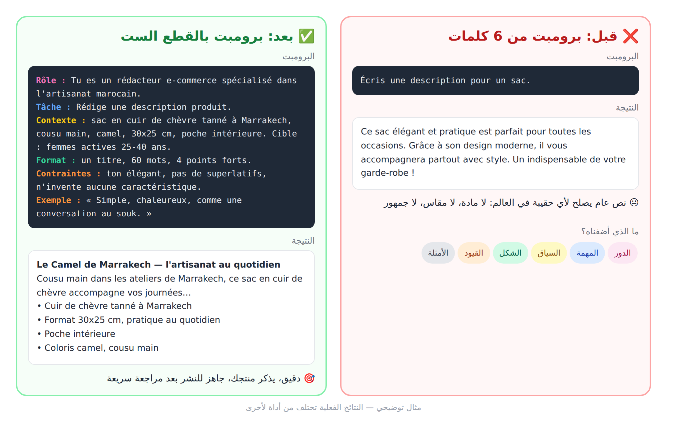
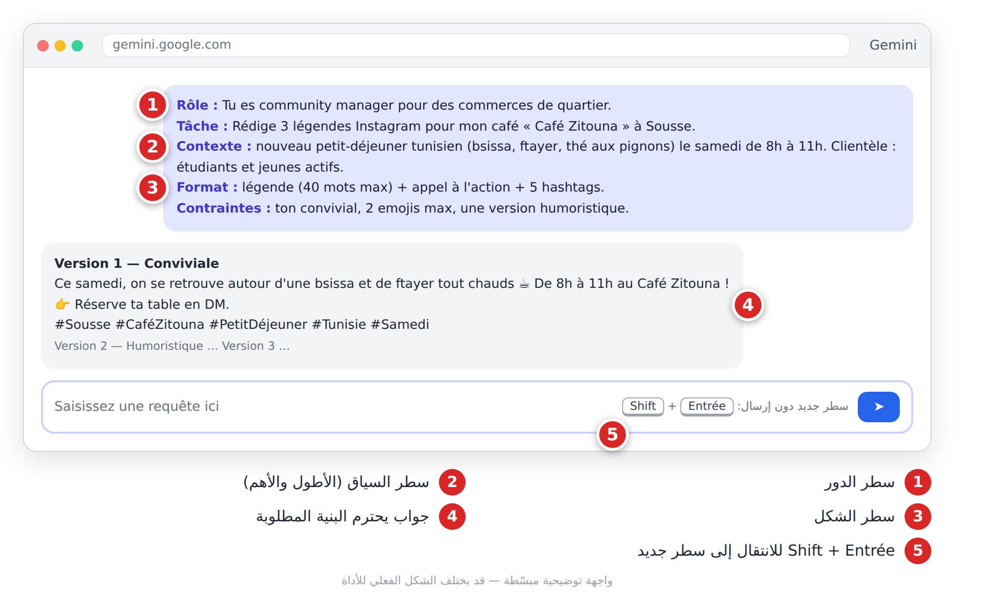

# الجزء الثاني: فن كتابة البرومبت (**Ingénierie de prompt**)

# الفصل 4: تشريح البرومبت الجيد (**Anatomie d'un prompt**)

## 🎯 ماذا ستتعلم في هذا الفصل

- القطع الست لبرومبت جيد.
- أمثلة قبل/بعد.
- قالب رئيسي تعيد استعماله.
- كيف تشخّص برومبتاً ضعيفاً.

## 4-1 أنت المدير، والذكاء الاصطناعي موظف جديد

البرومبت (**Prompt / Requête**) هو **التعليمات التي تكتبها للذكاء الاصطناعي**.

تخيّل مساعداً جديداً في متجرك: ذكي جداً، قرأ آلاف الكتب، لكنه لا يعرف متجرك ولا زبائنك ولا ذوقك، ولن يسألك غالباً، بل سيخمّن. قل له «اكتب منشوراً» فيكتب شيئاً عاماً. اشرح له من أنت ولمن وما الهدف، فيكتب ما تريد تقريباً.

> **قاعدة الفصل: الذكاء الاصطناعي لا يقرأ أفكارك. كل معلومة لا تكتبها، سيخمّنها.**

هندسة البرومبت (**Ingénierie de prompt**) هي فن كتابة تعليمات تقلّل هذا التخمين.

## 4-2 القطع الست


*الشكل 4-1: تشريح البرومبت الجيد. ليست كل القطع إجبارية، لكن كل قطعة تقلّل التخمين.*

| القطعة | السؤال | مثال | إجبارية؟ |
|---|---|---|---|
| الدور (**Rôle**) | من يتكلم؟ | `Tu es un rédacteur e-commerce.` | مستحسنة |
| المهمة (**Tâche**) | ماذا أريد؟ | `Rédige 3 descriptions courtes.` | ✅ دائماً |
| السياق (**Contexte**) | لمن؟ لماذا؟ | `Mes clientes ont 25-45 ans...` | ✅ تقريباً دائماً |
| الشكل (**Format**) | كيف يبدو الجواب؟ | `Tableau : Titre / Description` | مستحسنة |
| القيود (**Contraintes**) | ما الحدود؟ | `100 mots max, ton chaleureux` | مستحسنة |
| الأمثلة (**Exemples**) | ما النموذج المطلوب؟ | `Voici un post que j'aime : ...` | اختيارية، قوية جداً |

**ملاحظات سريعة على كل قطعة:**

1. **الدور** يضبط النبرة ومستوى الخبرة. وصف واقعي أنفع من «أنت أفضل خبير في العالم».
2. **المهمة** تبدأ بفعل واضح: اكتب، لخّص، قارن، صنّف، صحّح.
3. **السياق** أهم قطعة وأكثرها إهمالاً: من أنت؟ من الجمهور؟ ما الهدف؟ ما المعلومات الخاصة (منتج، سعر، مناسبة)؟

```
Ma boutique s'appelle « Dar Saboun ». Je vends du savon artisanal à l'huile d'argan, fabriqué à Fès.
Mes clientes ont entre 25 et 45 ans, vivent en ville et aiment les produits naturels.
Objectif : lancer un nouveau savon à la rose pour la fête des mères.
```

4. **الشكل:** قائمة؟ جدول؟ كم خياراً؟ بأي لغة؟
5. **القيود:** الطول، النبرة، الممنوعات (`pas de promesses médicales`). اكتبها بصيغة إيجابية: «3 جمل كحد أقصى» أفضل من «لا تكتب كثيراً».
6. **الأمثلة:** مثال واحد يساوي ألف وصف (التفصيل في الفصل 5).

## 4-3 قبل وبعد

البرومبت الأطول يبدو متعباً، لكنه **يوفّر وقتك**: نتيجة صالحة من أول مرة بدل خمس محاولات.



*الشكل 4-2: نفس الطلب، قبل القطع الست وبعدها.*

**مثال الدراسة:**

> ❌ `Explique la photosynthèse.`

```
Tu es un professeur de SVT bienveillant.
Explique la photosynthèse à un élève de 3e année collège qui a un contrôle demain.
Utilise une analogie avec une recette de cuisine.
Structure : 1) l'idée en une phrase, 2) 5 étapes numérotées, 3) un schéma en texte avec des flèches, 4) 3 questions pour vérifier que j'ai compris.
Maximum 250 mots.
```

**مثال البريد المهني:**

> ❌ `Écris un email pour demander un stage.`

```
Tu es un conseiller en insertion professionnelle.
Rédige un email de candidature spontanée pour un stage de 2 mois en marketing digital.
Contexte : étudiante en 3e année de licence en gestion à Oran. J'ai géré la page Instagram d'une boutique familiale (de 300 à 4 000 abonnés en un an). Cible : une agence de communication locale.
Format : objet + 4 courts paragraphes.
Contraintes : ton professionnel mais pas rigide, 180 mots maximum, termine par une proposition de rendez-vous.
```

## 4-4 قالبك الشامل (احفظه!)

انسخه في ملاحظات هاتفك واملأ ما بين المعقوفين:

```
Rôle : Tu es [métier / expertise].
Tâche : [verbe d'action + ce que tu veux exactement].
Contexte : [qui je suis, pour qui c'est, pourquoi, informations clés].
Format : [liste / tableau / paragraphes / nombre d'éléments / langue].
Contraintes : [longueur, ton, ce qu'il faut éviter].
Exemple (facultatif) : [un exemple du style attendu].
```

اكتب كل قطعة في سطر مستقل. للانتقال إلى سطر جديد دون إرسال، استعمل غالباً **Shift + Entrée**:



*الشكل 4-3: برومبت منظّم سطراً بسطر، وجواب يحترم البنية.*

## 4-5 خمس عادات ذهبية

1. **كن محدداً:** «3 أفكار» لا «بعض الأفكار»؛ «80 كلمة» لا «قصير».
2. **افصل النص الملصق** عن التعليمات بعلامات واضحة:

```
Résume le texte entre les triples guillemets en 5 points.
"""
[colle ton texte ici]
"""
```

3. **ضع الأهم في البداية أو النهاية**، لا في وسط نص طويل.
4. **حدّد لغة الجواب:** `Réponds en arabe standard simple.`
5. **دعه يسألك** حين لا تعرف كل التفاصيل:

```
Avant de répondre, pose-moi les questions nécessaires pour bien comprendre mon besoin (5 questions maximum). Attends mes réponses.
```

> ⚠️ **تحذير:** أكثر خطأ شائع هو **التعليمات المتناقضة** («مفصّل جداً» و«50 كلمة كحد أقصى» معاً). وحتى البرومبت المثالي لا يُلغي المراجعة (الفصل 3).

## 4-6 لماذا كانت النتيجة سيئة؟

| المشكلة | القطعة الناقصة غالباً |
|---|---|
| عامة، تصلح لأي أحد | السياق |
| طويلة أو قصيرة جداً | القيود |
| غير منظّمة | الشكل |
| أسلوب غير مناسب | الدور + الأمثلة |
| لم يفعل ما أردت | المهمة |
| معلومات خاطئة | السياق + السماح بـ«لا أعرف» |

ويمكنك أن تطلب من الذكاء الاصطناعي تحسين برومبتك:

```
Tu es un expert en ingénierie de prompt.
Voici mon prompt : """[colle ton prompt]"""
1. Identifie ce qui manque parmi : rôle, tâche, contexte, format, contraintes, exemples.
2. Pose-moi les questions nécessaires pour compléter.
3. Propose ensuite une version améliorée.
```

## 📝 الخلاصة

- كل ما لا تكتبه في البرومبت سيخمّنه النموذج.
- القطع الست: **الدور، المهمة، السياق، الشكل، القيود، الأمثلة**.
- **المهمة** و**السياق** الأهم؛ **الأمثلة** الأقوى.
- برومبت أطول وأوضح = محاولات أقل.
- شخّص النتيجة السيئة بالبحث عن القطعة الناقصة.

## 🛠️ تمرين

**«من ضعيف إلى قوي»:** اختر برومبتاً ضعيفاً (`Fais une pub pour mon restaurant.` أو `Écris une bio pour mon compte TikTok.`)، أرسله كما هو واحفظ النتيجة. ثم أعد كتابته بالقالب الشامل بمعلومات حقيقية، وأرسله في محادثة جديدة. قيّم النتيجتين من 1 إلى 5: الدقة، الملاءمة للجمهور، الجاهزية للنشر.
