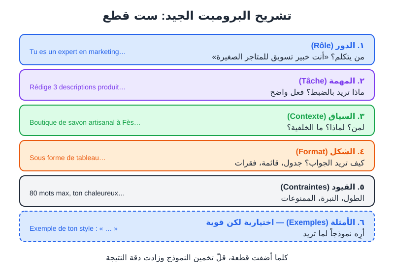

# الجزء الثاني: فن كتابة البرومبت (Prompt Engineering)

# الفصل 4: تشريح البرومبت الجيد

## 🎯 ماذا ستتعلم في هذا الفصل

- ما هو البرومبت (**Prompt / Requête**) وما هي هندسة البرومبت (**Ingénierie de prompt**).
- القطع الست للبرومبت الجيد: الدور (**Rôle**)، المهمة (**Tâche**)، السياق (**Contexte**)، الشكل (**Format**)، القيود (**Contraintes**)، الأمثلة (**Exemples**).
- كيف تحوّل برومبتاً ضعيفاً إلى برومبت قوي، عبر أمثلة «قبل/بعد».
- قالب جاهز تستعمله في كل مرة.

---

## 4-1 البرومبت: أنت المدير والذكاء الاصطناعي هو الموظف الجديد

البرومبت (**Prompt**) هو ببساطة **التعليمات التي تكتبها للذكاء الاصطناعي**: سؤال، طلب، أمر، أو وصف.

تخيّل أنك وظّفت مساعداً جديداً في متجرك. هو ذكي جداً، يتكلم عدة لغات، قرأ آلاف الكتب... لكنه:
- لا يعرف متجرك.
- لا يعرف زبائنك.
- لا يعرف ذوقك.
- ولن يسألك غالباً أسئلة توضيحية، بل سيخمّن.

إذا قلت له: «اكتب منشوراً»، سيكتب شيئاً عاماً. أما إذا شرحت له من أنت، ولمن المنشور، وما الهدف، وما الطول، وما الأسلوب... فسيكتب شيئاً قريباً جداً مما تريد.

> **قاعدة الفصل: الذكاء الاصطناعي لا يقرأ أفكارك. كل معلومة لا تكتبها، سيخمّنها.**

هندسة البرومبت (**Ingénierie de prompt / Prompt engineering**) هي فن كتابة تعليمات واضحة تقلّل هذا التخمين.

---

## 4-2 القطع الست للبرومبت الجيد



*الشكل 4-1: تشريح البرومبت الجيد. ليست كل القطع إجبارية في كل مرة، لكن كل قطعة تضيفها تقلّل التخمين.*

### 1. الدور (Rôle): من يتكلم؟
تعطي النموذج «قبعة» مهنية. هذا يوجّه المفردات ومستوى الخبرة والأسلوب.

```
Tu es un rédacteur publicitaire spécialisé dans les boutiques en ligne au Maghreb.
```

```
Tu es un professeur de mathématiques patient qui explique à des lycéens.
```

> 💡 **نصيحة:** الدور وحده لا يصنع المعجزات، لكنه يضبط النبرة. لا تبالغ مثل «أنت أفضل خبير في العالم بذكاء 300»؛ الوصف الواقعي والدقيق أنفع.

### 2. المهمة (Tâche): ماذا تريد بالضبط؟
ابدأ بفعل واضح: اكتب، لخّص، ترجم، قارن، اقترح، صحّح، حلّل، صنّف.

> ❌ **مثال خاطئ:** `Parle-moi de mon produit.` (ماذا يعني «تكلّم»؟)

> ✅ **مثال صحيح:** `Rédige 3 descriptions courtes pour ma page produit.`

### 3. السياق (Contexte): لمن؟ لماذا؟ ما الخلفية؟
هذه أهم قطعة وأكثرها إهمالاً. أجب عن:
- **من أنت؟** (متجر صغير، طالب، صانع محتوى...)
- **من الجمهور؟** (العمر، البلد، الاهتمامات)
- **ما الهدف؟** (بيع، إقناع، تعليم، ترفيه)
- **ما المعلومات الخاصة؟** (مواصفات المنتج، السعر، المناسبة)

```
Ma boutique s'appelle « Dar Saboun ». Je vends du savon artisanal à l'huile d'argan, fabriqué à Fès.
Mes clientes ont entre 25 et 45 ans, vivent en ville et aiment les produits naturels.
Objectif : lancer un nouveau savon à la rose pour la fête des mères.
```

### 4. الشكل (Format): كيف تريد الجواب؟
- قائمة نقطية؟ جدول؟ فقرات؟
- عناوين؟ عدد الخيارات؟
- لغة الجواب؟

```
Présente le résultat sous forme de tableau avec 3 colonnes : Titre | Description | Hashtags.
```

### 5. القيود (Contraintes): الحدود والممنوعات
- **الطول:** `100 mots maximum`
- **النبرة:** `ton chaleureux et familial`
- **الممنوعات:** `pas de promesses médicales`, `pas d'emojis`
- **مستوى اللغة:** `vocabulaire simple, niveau collège`

> 💡 **نصيحة:** اكتب القيود بصيغة إيجابية قدر الإمكان: بدل «لا تكتب نصاً طويلاً» قل «اكتب 3 جمل كحد أقصى». النموذج يتبع التعليمات الإيجابية الواضحة بشكل أفضل.

### 6. الأمثلة (Exemples): أرِه ما تريد
مثال واحد يساوي ألف وصف. إذا كان لديك منشور سابق أعجبك أسلوبه، الصقه:

```
Voici un exemple de publication que j'aime (respecte ce style, pas le contenu) :
« Le savon au nila, c'est le secret de nos grands-mères 🌿 Fait main à Fès, avec amour. »
```

سنتعمق في تقنية الأمثلة (**Few-shot**) في الفصل 5.

### جدول ملخص

| القطعة | السؤال الذي تجيب عنه | إجبارية؟ |
|---|---|---|
| الدور (Rôle) | من يتكلم؟ | مستحسنة |
| المهمة (Tâche) | ماذا أريد؟ | ✅ دائماً |
| السياق (Contexte) | لمن، لماذا، ما الخلفية؟ | ✅ تقريباً دائماً |
| الشكل (Format) | كيف يبدو الجواب؟ | مستحسنة |
| القيود (Contraintes) | ما الحدود؟ | مستحسنة |
| الأمثلة (Exemples) | ما النموذج الذي أريد مثله؟ | اختيارية، قوية جداً |

---

## 4-3 أمثلة قبل/بعد

### المثال 1: وصف منتج لمتجر إلكتروني

> ❌ **مثال خاطئ (قبل):**
> ```
> Écris une description pour un sac.
> ```

**النتيجة المتوقعة:** نص عام جداً عن «حقيبة أنيقة وعملية تناسب كل المناسبات»، يصلح لأي حقيبة في العالم.

> ✅ **مثال صحيح (بعد):**

```
Rôle : Tu es un rédacteur e-commerce spécialisé dans l'artisanat marocain.
Tâche : Rédige une description produit pour ma page boutique.
Contexte : Produit : sac en cuir de chèvre tanné à Marrakech, cousu main, couleur camel, 30x25 cm, fermeture éclair, poche intérieure. Prix : 450 MAD. Cible : femmes actives de 25-40 ans qui veulent un sac artisanal mais moderne.
Format : un titre accrocheur, un paragraphe de 60 mots, puis 4 points forts en liste.
Contraintes : ton élégant et chaleureux, pas de superlatifs exagérés (« le meilleur du monde »), en français simple.
```

**النتيجة المتوقعة:** عنوان جذاب، فقرة قصيرة تذكر الجلد والصناعة اليدوية ومراكش، وقائمة مزايا دقيقة (المقاس، الجيب الداخلي...). نص جاهز للنشر بعد مراجعة سريعة.

### المثال 2: مساعدة في الدراسة

> ❌ **مثال خاطئ (قبل):**
> ```
> Explique la photosynthèse.
> ```

> ✅ **مثال صحيح (بعد):**

```
Tu es un professeur de SVT bienveillant.
Explique la photosynthèse à un élève de 3e année collège qui a un contrôle demain.
Utilise une analogie avec la cuisine (une recette).
Structure : 1) l'idée en une phrase, 2) l'explication en 5 étapes numérotées, 3) un schéma en texte (avec des flèches), 4) 3 questions pour vérifier que j'ai compris (sans les réponses).
Maximum 250 mots.
```

**النتيجة المتوقعة:** شرح مبسّط ومنظّم مع تشبيه بالوصفة، ومخطط نصي، وأسئلة مراجعة.

### المثال 3: منشور سوشيال ميديا

> ❌ **مثال خاطئ (قبل):**
> ```
> Fais un post Instagram pour mon café.
> ```

> ✅ **مثال صحيح (بعد):**

```
Tu es community manager pour des commerces de quartier.
Rédige 3 versions d'une légende Instagram pour mon café « Café Zitouna » à Sousse.
Contexte : nous lançons un nouveau petit-déjeuner tunisien (bsissa, ftayer, thé aux pignons) le samedi matin, de 8h à 11h. Clientèle : étudiants et jeunes actifs.
Format : pour chaque version, la légende (40 mots max) + un appel à l'action + 5 hashtags.
Contraintes : ton convivial, 2 emojis maximum par version, une version doit être humoristique.
```

### المثال 4: بريد إلكتروني مهني

> ❌ **مثال خاطئ (قبل):**
> ```
> Écris un email pour demander un stage.
> ```

> ✅ **مثال صحيح (بعد):**

```
Tu es un conseiller en insertion professionnelle.
Rédige un email de candidature spontanée pour un stage de 2 mois en marketing digital.
Contexte : je suis étudiante en 3e année de licence en gestion à l'université d'Oran. J'ai géré la page Instagram d'une boutique familiale (de 300 à 4 000 abonnés en un an). L'entreprise visée : une agence de communication locale.
Format : objet de l'email + corps en 4 courts paragraphes.
Contraintes : ton professionnel mais pas rigide, 180 mots maximum, termine par une proposition de rendez-vous.
```

> 💡 **نصيحة:** لاحظ أن البرومبتات «بعد» أطول، لكنها **توفّر وقتك**: بدل 5 محاولات وتصحيحات، تحصل على نتيجة قريبة من المطلوب من أول مرة.

---

## 4-4 قالبك الشامل (احفظه!)

انسخ هذا القالب في ملاحظات هاتفك واملأ ما بين المعقوفين:

```
Rôle : Tu es [métier / expertise].
Tâche : [verbe d'action + ce que tu veux exactement].
Contexte : [qui je suis, pour qui c'est, pourquoi, informations clés].
Format : [liste / tableau / paragraphes / nombre d'éléments / langue].
Contraintes : [longueur, ton, ce qu'il faut éviter].
Exemple (facultatif) : [un exemple du style ou du résultat attendu].
```

> 🖼️ **الشكل 4-2 — برومبت منظّم بالقطع الست في واجهة مساعد محادثة** (*Capture d'écran*)
> **ماذا تُظهر:** خانة الكتابة في مساعد محادثة وفيها البرومبت المنظّم (مثال حقيبة الجلد) على عدة أسطر، كل سطر يبدأ بـ Rôle، Tâche، Contexte...، ثم الجواب أسفله.
> **العناصر المؤشَّر عليها:** ① سطر الدور ② سطر السياق (الأطول) ③ سطر الشكل ④ الجواب وقد احترم البنية المطلوبة (عنوان + فقرة + قائمة).
> **أين تلتقطها:** أي مساعد محادثة. للانتقال إلى سطر جديد دون إرسال، استعمل غالباً Shift + Entrée.

---

## 4-5 نصائح ذهبية لكتابة البرومبت

1. **كن محدداً:** «3 أفكار» أفضل من «بعض الأفكار». «80 كلمة» أفضل من «قصير».
2. **افصل التعليمات عن النص:** عندما تلصق نصاً للمعالجة، ضعه بين علامات واضحة:

```
Résume le texte entre les triples guillemets en 5 points.
"""
[colle ton texte ici]
"""
```

3. **ضع الأهم في البداية أو في النهاية:** التعليمات الحاسمة في وسط نص طويل قد تُهمَل.
4. **اطلب ما تريد، لا فقط ما لا تريد.**
5. **حدّد لغة الجواب** إذا كانت مختلفة عن لغة البرومبت: `Réponds en arabe standard simple.`
6. **اطلب أسئلة توضيحية** عندما لا تعرف كل التفاصيل:

```
Avant de répondre, pose-moi les questions nécessaires pour bien comprendre mon besoin (5 questions maximum). Attends mes réponses.
```

7. **راجع وحسّن:** البرومبت الأول نادراً ما يكون الأخير. سنرى التكرار (**Itération**) في الفصل 5.

> ⚠️ **تحذير:** حتى مع برومبت مثالي، النتيجة قد تحتوي أخطاء أو معلومات مختلقة. البرومبت الجيد يحسّن الجودة، لكنه لا يُلغي ضرورة المراجعة (تذكّر الفصل 3).

---

## 4-6 تشخيص البرومبت: لماذا كانت النتيجة سيئة؟

| المشكلة في النتيجة | القطعة الناقصة غالباً | الحل |
|---|---|---|
| عامة جداً، تصلح لأي أحد | السياق | أضف تفاصيل عنك وعن جمهورك ومنتجك |
| طويلة جداً أو قصيرة جداً | القيود | حدّد عدد الكلمات أو الجمل |
| غير منظّمة | الشكل | اطلب جدولاً أو قائمة أو عناوين |
| أسلوب غير مناسب | الدور + الأمثلة | حدّد الدور وأعطِ مثالاً لأسلوبك |
| لم يفعل ما أردت | المهمة | استعمل فعلاً واضحاً ومحدداً |
| معلومات خاطئة | السياق + قيود الصدق | أعطه المعلومات وسمح له بقول «لا أعرف» |

### برومبت لتحسين برومبتك
يمكنك أن تطلب من الذكاء الاصطناعي نفسه أن يحسّن برومبتك:

```
Tu es un expert en ingénierie de prompt.
Voici mon prompt : """[colle ton prompt]"""
1. Identifie ce qui manque parmi : rôle, tâche, contexte, format, contraintes, exemples.
2. Pose-moi les questions nécessaires pour compléter les informations manquantes.
3. Ensuite, propose une version améliorée de mon prompt.
```

---

## 📝 ملخص الفصل

- البرومبت هو تعليماتك للذكاء الاصطناعي؛ كل ما لا تكتبه سيخمّنه.
- القطع الست: **الدور، المهمة، السياق، الشكل، القيود، الأمثلة**.
- **المهمة** و**السياق** هما الأهم؛ الأمثلة هي الأقوى.
- البرومبت الأطول والأوضح يوفّر الوقت لأنه يقلّل المحاولات.
- افصل النصوص الملصقة بعلامات واضحة، وحدّد لغة الجواب.
- شخّص النتيجة السيئة بالبحث عن القطعة الناقصة.

## 🚫 أخطاء شائعة

1. **برومبت من 3 كلمات** ثم الاستغراب من النتيجة العامة.
2. **نسيان الجمهور:** نص لطلاب الثانوية يختلف عن نص لرجال الأعمال.
3. **تعليمات متناقضة:** «مفصّل جداً» و«50 كلمة كحد أقصى» معاً.
4. **الاكتفاء بالممنوعات** دون قول ما تريد فعلاً.
5. **قبول أول نتيجة** دون طلب تعديل أو تحسين.
6. **إدخال كل شيء في جملة واحدة طويلة** بدل تنظيم البرومبت في أسطر.

## 🛠️ تمرين تطبيقي

**المهمة: «من ضعيف إلى قوي»**

1. اختر واحداً من هذه البرومبتات الضعيفة:
   - `Fais une pub pour mon restaurant.`
   - `Aide-moi à réviser l'histoire.`
   - `Écris une bio pour mon compte TikTok.`
2. أرسله كما هو لمساعد محادثة واحفظ النتيجة.
3. أعد كتابته بالقالب الشامل (القطع الست) مستعملاً معلومات حقيقية عنك.
4. أرسل النسخة الجديدة في محادثة جديدة.
5. قارن النتيجتين في جدول: الدقة، الملاءمة للجمهور، الجاهزية للاستعمال (من 1 إلى 5).

## ❓ اختبر نفسك

1. ما القطع الست للبرومبت الجيد؟
2. أي قطعة تحدد «لمن» و«لماذا»؟
3. لماذا يُفضَّل وضع النص الملصق بين علامات مثل `"""`؟
4. حصلت على نص عام لا يذكر منتجك بالتحديد. ما القطعة الناقصة على الأرجح؟
5. حوّل هذا القيد السلبي إلى إيجابي: «لا تكتب كثيراً».

<details><summary>الإجابات</summary>

1. الدور (Rôle)، المهمة (Tâche)، السياق (Contexte)، الشكل (Format)، القيود (Contraintes)، الأمثلة (Exemples).
2. السياق (Contexte).
3. لفصل التعليمات عن المحتوى المراد معالجته، حتى لا يخلط النموذج بينهما ولا ينفّذ تعليمات قد تكون موجودة داخل النص الملصق.
4. السياق: لم تعطه تفاصيل المنتج والجمهور.
5. مثلاً: «اكتب 3 جمل كحد أقصى» أو `Maximum 60 mots.`

</details>
