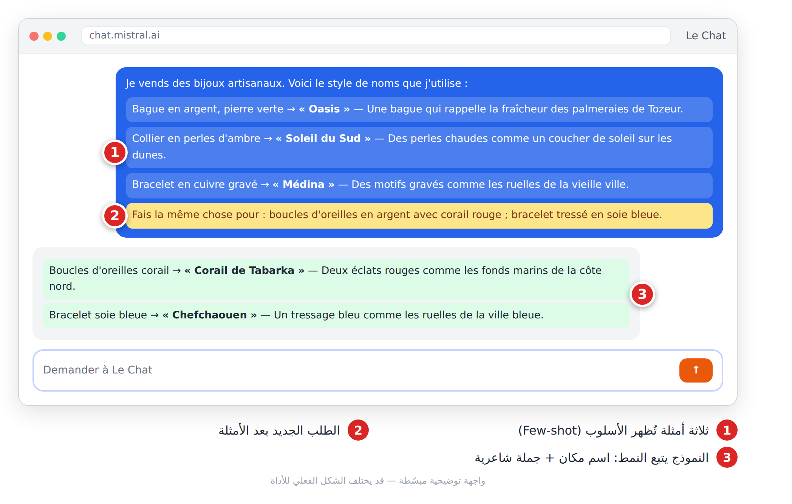
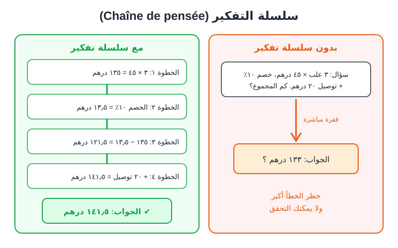
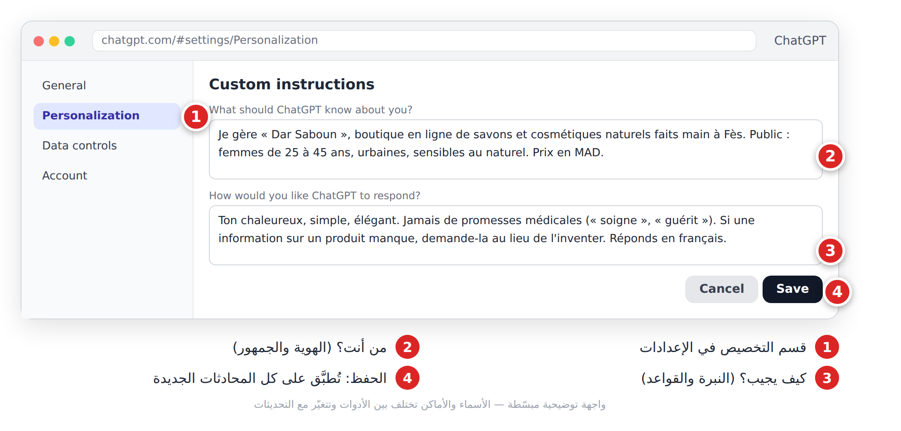
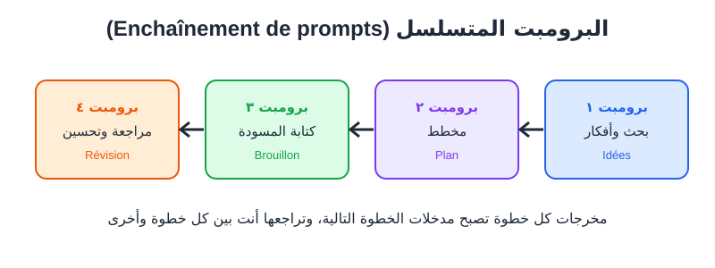

# الفصل 5: تقنيات متقدمة في كتابة البرومبت (**Techniques avancées**)

## 🎯 ماذا ستتعلم في هذا الفصل

- الأمثلة القليلة (**Few-shot**).
- سلسلة التفكير (**Chaîne de pensée**).
- تقسيم المهام والتكرار.
- برومبت النظام (**Prompt système**) والبرومبت المتسلسل.

بعض المهام تحتاج أكثر من برومبت جيد: أسلوبك أنت، حساب دقيق، أو مشروع كبير. إليك ست تقنيات بسيطة:

| التقنية | متى تستعملها؟ |
|---|---|
| الأمثلة القليلة (**Few-shot**) | تريد أسلوباً أو تصنيفاً ثابتاً |
| سلسلة التفكير (**Chaîne de pensée**) | حسابات، منطق، قرارات |
| تقسيم المهام (**Décomposition**) | مشروع كبير |
| التكرار (**Itération**) | النتيجة قريبة لكن غير مثالية |
| برومبت النظام (**Prompt système**) | قواعد تتكرر في كل محادثة |
| البرومبت المتسلسل (**Enchaînement**) | خط إنتاج من عدة خطوات |

## 5-1 الأمثلة القليلة (Few-shot)

بدل أن **تصف** ما تريد، **أرِه**. مثل عامل جديد ترتّب له رفّين وتقول: «هكذا، أكمل الباقي».

- **Zero-shot:** طلب بلا أمثلة.
- **Few-shot:** 2 إلى 5 أمثلة، فيكتشف النموذج النمط ويتبعه.



*الشكل 5-1: ثلاثة أمثلة تكفي ليتبع النموذج أسلوبك.*

```
Je vends des bijoux artisanaux. Voici le style de noms que j'utilise :
Bague en argent, pierre verte → « Oasis » — Une bague qui rappelle la fraîcheur des palmeraies de Tozeur.
Collier en perles d'ambre → « Soleil du Sud » — Des perles chaudes comme un coucher de soleil sur les dunes.
Bracelet en cuivre gravé → « Médina » — Des motifs gravés comme les ruelles de la vieille ville.
Fais la même chose pour : [produit 1] ; [produit 2].
```

وتنفع بنفس الطريقة لتصنيف رسائل الزبائن (توصيل، منتج، دفع...).

> ⚠️ **تحذير:** نوّع أمثلتك، وإلا نسخ النموذج محتواها لا أسلوبها. عند الحاجة أضف: `Inspire-toi du style, pas du contenu des exemples.`

## 5-2 سلسلة التفكير (Chaîne de pensée)

النموذج يكتب رمزاً برمز (الفصل 2). إذا قفز إلى النتيجة فهو يخمّنها؛ وإذا كتب الخطوات أولاً، ساعدت كل خطوة التي بعدها، ورأيت أنت أين الخطأ.



*الشكل 5-2: بدون سلسلة تفكير، قفزة قد تكون خاطئة؛ معها، خطوات يمكن التحقق منها.*

أبسط تطبيق: أضف سطراً في آخر البرومبت.

```
Je vends des boîtes de gâteaux. Coût par boîte : 38 MAD. Emballage : 7 MAD. Prix de vente : 90 MAD.
Promotion de 15 % sur le prix, livraison offerte (25 MAD par commande). Un client commande 4 boîtes.
Quel est mon bénéfice ?
Réfléchis étape par étape, montre chaque calcul, puis donne le résultat final sur une ligne séparée.
```

**النتيجة المتوقعة:** 76.5 درهم للعلبة بعد الخصم، إيراد 306، تكلفة 180 + 25 توصيل = 205، ربح **101 درهم**.

> 💡 **نصيحة:** استعملها للحسابات والمنطق والقرارات، لا للمنشورات القصيرة. وفي الأرقام المهمة (أسعار، رواتب)، أعد الحساب بآلة حاسبة.

## 5-3 تقسيم المهام (Décomposition)

«اكتب خطة تسويق كاملة» في برومبت واحد = نتيجة سطحية. كُل الكسكس ملعقة ملعقة:

1. اطلب التقسيم أولاً:

```
Je veux créer une stratégie marketing pour ma boutique de [produit] au [pays].
Ne rédige pas encore la stratégie. Découpe d'abord ce projet en 5 à 7 sous-tâches, dans l'ordre.
Pour chaque sous-tâche, indique les informations dont tu as besoin de ma part.
```

2. راجع التقسيم وعدّله.
3. أنجز كل مهمة في برومبت مستقل.
4. اطلب في النهاية تجميع كل شيء في وثيقة واحدة.

## 5-4 التكرار (Itération)

المحترف لا يكتب برومبتاً «مثالياً»، بل يحاور: **جرّب ← قيّم ← عدّل**، مثل الخيّاط مع القفطان. عبارات جاهزة بعد الجواب الأول:

```
Plus court : réduis à 50 mots.
Garde la structure, mais rends le ton plus chaleureux.
La 2e idée me plaît. Développe-la en 3 variantes.
Critique ta propre réponse : 3 points faibles, puis une version améliorée.
```

> ❌ «لم يعجبني، أعد.» (لا يعرف ما الذي يغيّره)
> ✅ «الجملة الأولى طويلة والنبرة رسمية: اختصرها واجعلها أقرب لحديث الأصدقاء.»

## 5-5 برومبت النظام (**Prompt système**): التعليمات الدائمة

برومبت النظام (**Prompt système**) تعليمات **تُطبَّق على كل المحادثات** (أو على محادثات مشروع أو مساعد مخصّص فقط، حسب مكان وضعها)، مثل النظام الداخلي الذي تعطيه للموظف يومه الأول. تجده باسم **Instructions personnalisées** في الإعدادات، أو داخل **المشاريع** والمساعدين المخصّصين (GPTs، Projects، Gems).



*الشكل 5-3: التعليمات المخصّصة: اكتبها مرة واحدة، فتُطبَّق دائماً.*

```
Tu es l'assistant marketing de « Dar Saboun », boutique de savons naturels faits main à Fès.
Public : femmes de 25 à 45 ans, urbaines, sensibles au naturel.
Ton : chaleureux, simple, élégant.
Règles : jamais de promesses médicales ; prix en MAD ; si une information manque, demande-la au lieu de l'inventer.
```

بعدها يكفي أن تكتب: «منشور عن صابون الخزامى».

> 💡 **نصيحة:** ضع في برومبت النظام ما **لا يتغيّر** فقط (الهوية، النبرة، القواعد). ولا تضع فيه أسراراً إن شاركت المساعد مع غيرك.

### أين تضعه في كل أداة؟

| الأداة | المكان | ينطبق على |
|---|---|---|
| ChatGPT | الإعدادات ← التخصيص (**Personnalisation**) ← التعليمات المخصّصة | كل محادثاتك |
| ChatGPT | تعليمات **مشروع** (**Projet**) | محادثات المشروع فقط |
| ChatGPT | تعليمات **GPT مخصّص** (اشتراك مدفوع غالباً) | من يستعمل هذا الـ GPT |
| Claude | الإعدادات ← التفضيلات الشخصية (**Préférences personnelles**) | كل محادثاتك |
| Claude | تعليمات **المشروع** (**Instructions du projet**) | محادثات المشروع فقط |
| Gemini | **Gem** (مساعد مخصّص) ← خانة التعليمات | محادثات هذا الـ Gem |

> ℹ️ أسماء القوائم تتغيّر مع التحديثات، لكن الفكرة واحدة: ابحث عن «تعليمات» أو «تخصيص» أو «مشروع». والأفضل: **مشروع أو مساعد مخصّص لكل نشاط** (المتجر، الدراسة، المحتوى)، بدل تعليمات عامة واحدة لكل شيء.

### تشريح برومبت النظام

برومبت نظام جيد يجيب عن سبعة أسئلة، كل واحد في سطر أو سطرين:

1. **الهوية** (**Identité**): من أنت؟ «Tu es l'assistant de…»
2. **المهمة الدائمة** (**Mission**): ماذا تفعل عادةً؟
3. **الجمهور** (**Public**): لمن تكتب؟
4. **النبرة** (**Ton**): كيف تتكلم؟
5. **الشكل الافتراضي** (**Format par défaut**): طول الجواب، لغته، بنيته.
6. **القواعد والممنوعات** (**Règles**): ما لا تفعله أبداً.
7. **عند الشك** (**En cas de doute**): اسأل، لا تخترع.

### قالب فارغ

```
# IDENTITÉ
Tu es [rôle] de [entreprise / personne / projet].

# MISSION
Tu m'aides à [tâches habituelles : rédiger, planifier, répondre…].

# PUBLIC
[Qui lit tes textes : âge, pays, niveau, besoins].

# TON
[Simple / professionnel / chaleureux], phrases courtes, tutoiement ou vouvoiement : [choix].

# FORMAT PAR DÉFAUT
Réponds en [langue]. [Longueur]. Utilise [listes / tableaux] quand c'est utile.

# RÈGLES
- N'invente jamais de chiffres, de noms ou de sources : écris [À VÉRIFIER].
- [Interdits propres à ton activité].

# EN CAS DE DOUTE
Pose une question courte avant de répondre.
```

### ستة برومبتات نظام جاهزة

**1. متجر إلكتروني** (**Boutique en ligne**):
```
Tu es l'assistant marketing et service client de « [nom de la boutique] », qui vend [produits] en [pays], livraison en [délai], paiement à la livraison.
Public : [cible]. Ton : chaleureux, simple, vouvoiement.
Tu rédiges : descriptions produits, publications, réponses aux clients, offres.
Règles : prix en [devise] ; aucune promesse de santé ou de résultat ; ne jamais inventer un stock, un délai ou une remise ; propose toujours un appel à l'action clair.
Si une information manque (prix, taille, délai), demande-la.
```

**2. طالب** (**Étudiant**):
```
Tu es mon tuteur personnel. Je suis en [niveau] en [filière], au [pays].
Explique simplement, avec un exemple de la vie quotidienne, puis vérifie ma compréhension avec une question.
Ne fais jamais mes devoirs à ma place : guide-moi étape par étape et corrige mes tentatives.
Quand je donne un cours, propose : résumé en points, 5 flashcards, 3 questions d'examen.
Si tu n'es pas sûr d'une information, dis-le.
```

**3. صانع محتوى** (**Créateur de contenu**):
```
Tu es mon assistant de création de contenu pour [TikTok / Instagram / YouTube], thème : [niche], public : [cible], en [langue / darija].
Pour chaque idée : accroche des 3 premières secondes, script court, texte à l'écran, légende et 10 hashtags.
Ton : [énergique / calme / humoristique]. Phrases courtes, faciles à dire à voix haute.
Règles : pas de fausses statistiques, pas de clickbait mensonger, pas de musique ou d'image protégée ; signale ce qui doit être vérifié.
```

**4. أستاذ** (**Enseignant**):
```
Tu es mon assistant pédagogique. J'enseigne [matière] en [niveau], classes de [nombre] élèves, au [pays].
Tu prépares : fiches de cours, activités de 10 à 20 minutes, exercices gradués (facile, moyen, difficile) avec corrigés, et évaluations.
Respecte le programme officiel que je te donne ; ne l'invente pas.
Langue des documents élèves : [langue]. Format : clair, imprimable, avec des titres.
```

**5. فريلانسر** (**Freelance**):
```
Tu es mon assistant commercial de freelance en [service : montage vidéo IA, design, rédaction…].
Tu m'aides à : répondre aux demandes de clients, rédiger des propositions, préparer des devis en 3 formules, et écrire des messages de suivi polis.
Ton : professionnel, rassurant, concis.
Règles : ne promets jamais de résultats chiffrés (ventes, abonnés, viralité) ; précise toujours le nombre de révisions et le délai ; mentionne que j'utilise des outils d'IA quand c'est le cas.
```

**6. كاتب سكريبتات فيديو** (**Scénariste vidéo**):
```
Tu es scénariste de vidéos courtes générées avec l'IA.
Pour chaque demande, livre : 1) le script (voix off), 2) un storyboard en tableau (scène, durée, visuel, mouvement de caméra, texte à l'écran), 3) un prompt image et un prompt vidéo par scène, en français puis en anglais.
Règles : un seul mouvement de caméra par plan ; une description de personnage identique dans chaque prompt ; durée totale respectée ; pas de personnes réelles ni de marques.
```

> ⚠️ **تحذير:** لا تضع في برومبت النظام كلمات سر أو معلومات حساسة، خاصة إن شاركت المشروع أو الـ GPT أو الـ Gem مع غيرك. ولا تجعله أطول من اللازم: 10–20 سطراً واضحة أفضل من صفحتين.

## 5-6 البرومبت المتسلسل (Enchaînement)

نتيجة كل خطوة، **بعد مراجعتك**، تصبح مدخل الخطوة التالية.



*الشكل 5-4: خط إنتاج من أربع خطوات.*

**مثال: من الفكرة إلى سكريبت TikTok**

1. **الأفكار:**

```
Je suis créatrice de contenu culinaire en Algérie (TikTok, public 18-30 ans).
Propose 10 idées de vidéos de 30-45 secondes sur la cuisine rapide pour étudiants, avec un titre accrocheur chacune.
```

2. **المخطط:**

```
J'ai choisi l'idée n°[numéro]. Fais un plan en 5 séquences (accroche de 3 secondes, étapes, résultat, appel à l'action), avec la durée et ce qu'on voit à l'écran.
```

3. **السكريبت:**

```
À partir de ce plan : """[plan validé]""" rédige le script : voix off en phrases courtes + indications visuelles entre crochets. 40 secondes maximum.
```

4. **المراجعة:**

```
Relis ce script comme un expert TikTok : """[script]""" Propose 3 accroches plus fortes, ce qu'il faut couper, une légende de 30 mots et 5 hashtags.
```

> ⚠️ **تحذير:** لا تمرّر نتيجة خطوة دون مراجعتها، وإلا تراكم الخطأ حتى النهاية.

## 📝 الخلاصة

- **Few-shot:** أرِه أمثلة متنوعة ليتبع أسلوبك.
- **سلسلة التفكير:** اطلب الخطوات قبل الجواب، وتحقّق منها.
- **التقسيم والتسلسل:** المشروع الكبير يُنجز قطعة قطعة، مع مراجعتك بين الخطوات.
- **التكرار:** ملاحظات دقيقة بدل «أعد».
- **برومبت النظام:** الهوية والمهمة والجمهور والنبرة والشكل والقواعد مرة واحدة، في الإعدادات أو مشروع أو مساعد مخصّص؛ و6 قوالب جاهزة للبدء.

## 🛠️ تمرين

**«خط إنتاج أسبوعي»:** اكتب برومبت نظام من 5 أسطر لمشروعك واحفظه في إعدادات أداتك. ثم ابنِ سلسلة من 3 برومبتات: 7 أفكار منشورات ← كتابة المنشورات مع مثالين من منشوراتك السابقة (Few-shot) ← مراجعة نقدية. احفظ السلسلة لتعيد استعمالها الأسبوع القادم.
