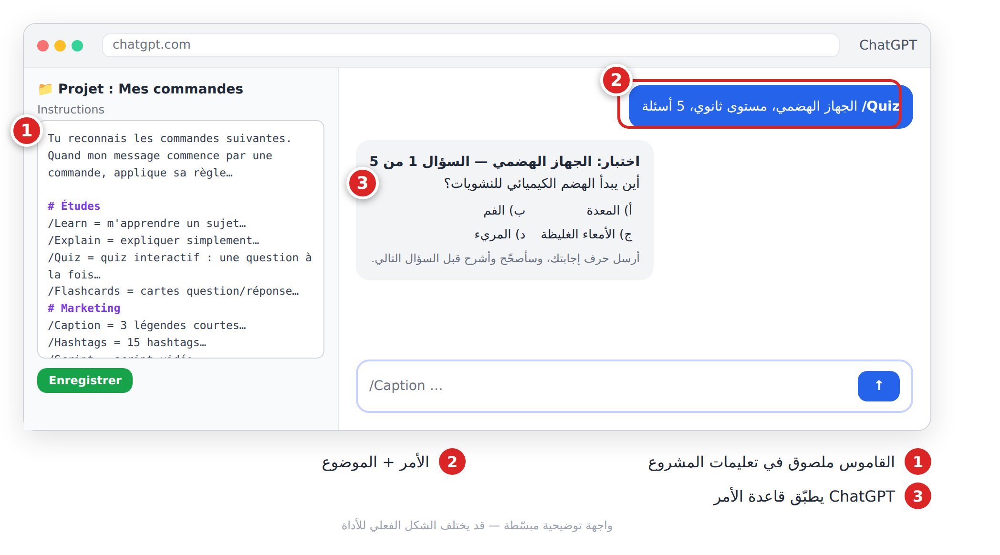

# الفصل 6: مكتبة 20 قالب برومبت والأوامر المختصرة

## 6-1 كيف تستعمل هذه المكتبة؟

اخترنا لك **أنفع 20 قالباً** (**Modèles de prompts**)، كلها مبنية على القطع الست (الفصل 4). لكل قالب: عنوان، سطر «متى؟»، وكتلة بالفرنسية جاهزة للنسخ. ما بين المعقوفين `[ ]` متغيرات (**Variables**) تستبدلها بمعلوماتك.


*الشكل 6-1: كل قالب = متى تستعمله + برومبت + متغيرات تملؤها.*

**الخطوات:**

1. اختر القالب وانسخه في تطبيق ملاحظات.
2. استبدل كل `[ ... ]` بمعلومات حقيقية، واحذف المعقوفين.
3. الصقه في مساعد المحادثة وأرسله.
4. حسّن النتيجة بعبارات التكرار (الفصل 5).


*الشكل 6-2: لا ترسل القالب قبل ملء كل متغيراته.*

> 💡 **نصيحة:** للجواب بالعربية أضف في آخر أي قالب: `Réponds en arabe standard simple.`

> ⚠️ **تحذير:** متغير فارغ أو غامض = نتيجة عامة. ولا تضع أبداً بيانات زبائن حقيقية (أسماء، هواتف) في القوالب.

## 6-2 ✍️ الكتابة

### 1. إعادة صياغة نص
**متى؟** نصّك صحيح لكن نبرته لا تناسب الجمهور.
```
Réécris le texte ci-dessous avec un ton [professionnel / amical / inspirant] pour [public cible].
Garde toutes les informations, n'ajoute aucun fait nouveau. Environ [nombre] mots.
Texte : """[colle ton texte]"""
```

### 2. تصحيح لغوي مع شرح
**متى؟** قبل إرسال نص بالفرنسية، لتتعلّم من أخطائك.
```
Corrige l'orthographe, la grammaire et la ponctuation du texte suivant.
Donne le texte corrigé, puis un tableau : Erreur | Correction | Règle expliquée simplement.
Ne change ni le style ni le sens.
Texte : """[ton texte]"""
```

### 3. تلخيص نص طويل
**متى؟** مقال أو تقرير وتريد الأفكار الأساسية بسرعة.
```
Résume le texte ci-dessous en [nombre] points clés, du plus important au moins important, puis une phrase de conclusion.
Base-toi uniquement sur le texte.
Texte : """[colle le texte]"""
```

### 4. عناوين جذابة
**متى؟** مقال أو فيديو يوتيوب يحتاج عنواناً قوياً.
```
Propose 10 titres pour [article / vidéo YouTube] sur « [sujet] », public : [public].
Varie : question, chiffre, promesse, curiosité, « comment… ». Maximum [nombre] caractères. Pas de titre mensonger.
Indique tes 3 préférés et pourquoi.
```

## 6-3 🛒 التسويق والمتجر

### 5. وصف منتج مقنع
**متى؟** لكل منتج جديد في متجرك.
```
Tu es un rédacteur e-commerce spécialisé dans [secteur].
Rédige la fiche produit de : [nom du produit].
Caractéristiques : [matière, taille, couleur, origine]. Prix : [prix]. Cible : [client idéal].
Format : titre (60 caractères max), 50 mots, 5 avantages en liste, une phrase de réassurance (livraison, retour).
Aucune affirmation non vérifiable.
```

### 6. الزبون المثالي (Persona)
**متى؟** قبل إطلاق منتج، لتعرف لمن تبيع.
```
Je vends [produit] à [ville / pays] via [Instagram / site / marché].
Crée 3 personas de clients : âge, métier, habitudes en ligne, problèmes, freins à l'achat, message qui le convaincrait.
Présente-les dans un tableau. Évite les stéréotypes.
```

### 7. الرد على تقييم سلبي
**متى؟** تقييم سيئ علني وتريد رداً يحمي سمعتك.
```
Un client a laissé cet avis négatif (données personnelles retirées) : """[avis]"""
Contexte de mon côté : [ce qui s'est passé].
Rédige une réponse publique empathique, qui reconnaît le problème, propose une solution concrète ([solution]) et invite à continuer en message privé.
80 mots maximum, pas de ton défensif.
```

### 8. نص إعلان ممول
**متى؟** إعلان على فيسبوك أو إنستغرام.
```
Rédige 3 textes publicitaires pour [plateforme] afin de promouvoir [produit / offre].
Cible : [âge, ville, intérêts]. Objectif : [ventes / messages].
Pour chacun : accroche, texte de 40 mots max, appel à l'action.
Version 1 : problème. Version 2 : émotion. Version 3 : preuve sociale. Pas de promesses exagérées.
```

## 6-4 🎓 الدراسة

### 9. شرح درس صعب
**متى؟** لم تفهم الدرس في القسم.
```
Tu es un professeur patient de [matière].
Explique-moi [notion] comme si j'étais en [niveau].
1. L'idée en une phrase. 2. Une analogie de la vie quotidienne. 3. Un exemple résolu étape par étape. 4. Les 3 erreurs fréquentes.
300 mots maximum.
```

### 10. بطاقات مراجعة
**متى؟** لتحويل درسك إلى بطاقات حفظ سريعة.
```
À partir de mon cours ci-dessous, crée [nombre] fiches de révision Question / Réponse (2 phrases max par réponse).
Base-toi uniquement sur le cours.
Cours : """[colle ton cours]"""
```

### 11. اختبار تفاعلي
**متى؟** قبل الامتحان لتختبر نفسك.
```
Crée un quiz de [nombre] questions sur [chapitre], niveau [niveau] (QCM, vrai/faux, questions courtes).
Pose-moi les questions une par une, attends ma réponse, corrige-moi en expliquant.
À la fin, donne mon score et les notions à revoir.
```

### 12. خطة مراجعة
**متى؟** امتحانات قريبة ووقت محدود.
```
J'ai des examens dans [nombre] jours. Matières et coefficients : [liste]. Points faibles : [matières].
Temps disponible : [heures] par jour.
Crée un planning jour par jour dans un tableau, avec pauses et révision active.
Réfléchis étape par étape pour répartir le temps.
```

## 6-5 💼 الأعمال

### 13. تحديد السعر
**متى؟** لا تعرف بكم تبيع منتجك أو خدمتك.
```
Aide-moi à fixer le prix de [produit / service].
Coûts : matières [montant], main-d'œuvre [montant], emballage [montant], livraison [montant].
Prix des concurrents : [fourchette].
Réfléchis étape par étape (coût de revient, marge, positionnement), puis propose 3 prix (économique, standard, premium) avec ta recommandation.
```
> ⚠️ **تحذير:** أعد الحساب بنفسك في جدول بيانات قبل اعتماد أي سعر.

### 14. محضر اجتماع
**متى؟** ملاحظات اجتماع فوضوية تريدها وثيقة واضحة.
```
Transforme ces notes en compte rendu : participants, points discutés, décisions, tableau Action | Responsable | Échéance.
N'ajoute aucune décision absente des notes.
Notes : """[tes notes]"""
```

### 15. سيرة ذاتية مكيّفة لعرض عمل
**متى؟** للتقدّم لوظيفة محددة.
```
Voici mon CV (sans coordonnées personnelles) : """[CV]"""
Et l'offre d'emploi : """[offre]"""
Réécris mon profil (4 lignes) et mes expériences pour les adapter à l'offre, avec des verbes d'action.
N'invente aucune expérience ni compétence.
```

## 6-6 📱 السوشيال ميديا

### 16. تقويم محتوى شهري
**متى؟** بداية كل شهر لتنظيم منشوراتك.
```
Crée un calendrier de [nombre] publications pour [mois] sur [plateforme], thème : [thématique].
Tableau : date | format (réel, carrousel, story) | sujet | accroche | appel à l'action.
Varie : éducatif, divertissant, coulisses, promotion (20 % maximum).
```
> 💡 **نصيحة:** تحقّق بنفسك من تواريخ المناسبات الدينية والوطنية.

### 17. سكريبت فيديو قصير
**متى؟** Reel أو TikTok من 15 إلى 60 ثانية.
```
Écris le script d'une vidéo de [durée] secondes sur « [sujet] » pour [public].
Structure : accroche (3 premières secondes), étapes rapides, appel à l'action.
Tableau : Temps | À l'écran | Voix off | Texte affiché. Phrases très courtes.
```

### 18. نص منشور مع هاشتاغات
**متى؟** لكل صورة أو فيديو تنشره.
```
Rédige 3 légendes pour une publication [plateforme] montrant : [description].
Chaque légende : première ligne accrocheuse, 2-3 phrases, une question, un appel à l'action.
Ajoute 8 hashtags : 3 populaires, 3 de niche, 2 locaux ([ville]).
```

## 6-7 💻 البرمجة البسيطة

### 19. معادلة جدول بيانات
**متى؟** حساب تلقائي في جدول المبيعات أو المصاريف.
```
J'utilise [Excel / Google Sheets]. Mes colonnes : [A = date, B = produit, C = quantité...].
Je veux calculer : [ce que tu veux].
Donne la formule exacte, explique chaque partie simplement et indique la cellule où la mettre.
```

### 20. فهم رسالة خطأ
**متى؟** برنامج أو معادلة تعطيك خطأ.
```
J'obtiens cette erreur : """[message d'erreur exact]"""
J'essaie de [objectif] avec [outil / langage].
Code ou formule : """[code]"""
Explique la cause en langage simple, propose une correction, et dis comment éviter cette erreur.
```
> ⚠️ **تحذير:** لا تلصق كوداً فيه كلمات سر أو مفاتيح API.

## 6-8 ابنِ مكتبتك الشخصية

هذه القوالب نقطة انطلاق. أنشئ ملفاً «مكتبة البرومبتات»، واحفظ فيه كل برومبت نجح مع الأداة والتاريخ وما عدّلته. وحوّل أي محادثة ناجحة إلى قالب:

```
Analyse notre conversation. Transforme ma demande et mes corrections en un seul modèle de prompt réutilisable, avec des variables entre crochets [ ].
Ajoute : quand l'utiliser, et la liste des variables.
```


*الشكل 6-3: مكتبتك الشخصية: كل برومبت ناجح مع ما تعلّمته منه.*

## 6-9 الأوامر المختصرة لـ ChatGPT (**Commandes raccourcies**)

الأوامر مثل `/Quiz` أو `/Caption` **ليست أوامر رسمية في ChatGPT**. هي اختصارات تعرّفها أنت مرة واحدة، فيفهم ChatGPT بعدها أن `/Quiz` تعني «اصنع لي اختباراً». بدون هذا التعريف قد يخمّن المعنى، وقد يخطئ.

> ⚠️ **تحذير:** إذا ظهرت لك قائمة عند كتابة `/` في التطبيق، فهي أدوات ChatGPT نفسه (حسب النسخة)، وليست هذه الأوامر.

### طريقة التفعيل

1. انسخ «قاموس الأوامر» أسفله.
2. **للاستعمال الدائم:** الصقه في تعليمات مشروع (**Projet**) أو في تعليمات **GPT مخصّص** (**GPT personnalisé**)، حسب ما يتيحه اشتراكك. كل محادثة داخلهما ستفهم الأوامر.
3. **للاستعمال السريع:** الصقه كأول رسالة في محادثة جديدة. يعمل داخل تلك المحادثة فقط.
4. اكتب الأمر ثم موضوعك: `/Quiz` الجهاز الهضمي، 10 أسئلة.
5. اكتب `/Aide` لترى قائمة الأوامر.

> 💡 **نصيحة:** «التعليمات المخصّصة» (**Instructions personnalisées**) في الإعدادات لها حدّ صغير للأحرف، والقاموس كامل لن يدخل فيها. ضع فيها الأوامر العشرة التي تستعملها أكثر فقط.



*الشكل 6-4: القاموس في تعليمات المشروع ①، ثم الأمر في المحادثة ②، والنتيجة ③.*

### قاموس الأوامر (انسخه كما هو)

```
Tu reconnais les commandes suivantes. Quand mon message commence par une commande, applique sa règle au texte qui suit. Réponds dans la langue de ma demande. Si une information manque, pose au maximum 2 questions avant de commencer. /Aide = affiche cette liste.

# Études
/Learn = m'apprendre un sujet de zéro, par étapes courtes, avec un mini-exercice à chaque étape
/Explain = expliquer simplement avec une analogie et un exemple concret
/StudyPlan = plan de révision jour par jour selon ma date d'examen et mon temps disponible
/LessonPlan = plan de cours pour un enseignant : objectifs, déroulé minuté, activités, évaluation
/Quiz = quiz interactif : une question à la fois, correction et explication après chaque réponse
/Flashcards = cartes question/réponse courtes, sous forme de tableau
/Summarize = résumé en points clés + une phrase de conclusion
/ExamPrep = questions probables, erreurs fréquentes et méthode de réponse

# Recherche et analyse
/Research = synthèse structurée d'un sujet avec sources si la recherche web est disponible
/DeepResearch = recherche approfondie, plusieurs angles, sources citées, limites indiquées
/Analyze = analyse : points forts, points faibles, risques, recommandations
/Compare = tableau comparatif selon des critères clairs, puis recommandation
/FactCheck = vérifier chaque affirmation : vrai / faux / non vérifiable, avec justification
/FindSources = sources fiables à consulter, avec ce que chacune apporte (ne jamais inventer)
/ProsCons = avantages et inconvénients en tableau, puis avis final

# Business
/BusinessPlan = business plan simple : offre, clients, concurrence, coûts, revenus, étapes
/MarketResearch = étude de marché : taille, tendances, clients cibles, opportunités
/ProductResearch = idées de produits à vendre, avec demande, marge et difficulté
/CompetitorAnalysis = analyse des concurrents : offre, prix, forces, faiblesses, comment se distinguer
/SupplierSearch = où et comment trouver des fournisseurs, questions à leur poser, pièges à éviter
/Pricing = proposer un prix avec la logique : coûts + temps + valeur, et 3 formules
/ProfitCalculator = calcul détaillé de la marge et du bénéfice à partir de mes chiffres
/MarketingPlan = plan marketing sur 30 jours : objectifs, canaux, actions, budget, indicateurs

# Marketing et contenu
/ContentPlan = calendrier de contenu (date, format, idée, objectif)
/Instagram = publication Instagram : visuel proposé, légende, hashtags
/TikTok = idée de vidéo TikTok : accroche des 3 premières secondes, déroulé, texte à l'écran
/Reels = script de Reel de 30 secondes, scène par scène
/Caption = 3 légendes courtes avec appel à l'action
/Copywriting = texte de vente (méthode AIDA)
/AdCopy = 3 variantes de publicité : titre, texte, appel à l'action
/Hashtags = 15 hashtags : larges, de niche et locaux
/ContentIdeas = 20 idées de contenu classées par type
/Script = script vidéo avec voix off, texte à l'écran et durée par scène

# Réflexion
/Brainstorm = 20 idées variées, des plus simples aux plus audacieuses
/Think = réfléchir étape par étape avant de répondre, puis donner une réponse claire
/StepByStep = guide pratique numéroté, étape par étape
/Solve = résoudre un problème : causes possibles, solutions, solution recommandée
/Strategy = stratégie : objectif, situation actuelle, options, plan d'action
/DecisionMatrix = matrice de décision : options × critères pondérés, avec scores
/Checklist = liste de contrôle à cocher

# Images et design
/Visualize = décrire une image idéale pour illustrer l'idée, puis écrire son prompt
/Image = générer une image (ou écrire un prompt d'image détaillé si la génération n'est pas disponible)
/Logo = 3 concepts de logo : symbole, couleurs, typographie, puis prompt d'image
/Poster = affiche : titre, texte, mise en page, puis prompt d'image
/Infographic = contenu d'une infographie : titre, sections, chiffres, icônes
/Diagram = schéma en texte ou en code Mermaid
/Presentation = plan de présentation : diapositive par diapositive, titre et points clés
/Design = conseils de design : couleurs, polices, mise en page

# Écriture
/Write = rédiger le texte demandé
/Rewrite = réécrire dans un autre style ou ton
/Improve = améliorer la clarté et l'impact, puis lister les changements
/Translate = traduire naturellement (pas mot à mot)
/Proofread = corriger orthographe et grammaire, puis lister les corrections
/Email = e-mail clair : objet, message, formule de politesse
/Story = histoire courte avec début, problème et fin
/Professional = reformuler en style professionnel et poli

# Données
/DataAnalysis = analyser mes données : tendances, anomalies, conclusions
/Chart = proposer le meilleur graphique et le créer si possible
/Table = organiser l'information en tableau
/Calculate = calcul détaillé, étape par étape, avec vérification
/Statistics = statistiques clés : moyenne, médiane, écart, interprétation simple
/Report = rapport structuré : résumé, résultats, recommandations
```

### ماذا يفعل كل أمر؟

| الأمر | ماذا يفعل | مثال |
|---|---|---|
| **🎓 الدراسة** | | |
| `/Learn` | يعلّمك موضوعاً من الصفر خطوة بخطوة | `/Learn` Excel |
| `/Explain` | يشرح ببساطة مع تشبيه | `/Explain` التضخّم |
| `/StudyPlan` | خطة مراجعة يومية حتى الامتحان | `/StudyPlan` باك، 30 يوماً |
| `/LessonPlan` | تحضير درس للأستاذ | `/LessonPlan` الكسور، 45 د |
| `/Quiz` | اختبار تفاعلي سؤالاً بسؤال | `/Quiz` الخلية |
| `/Flashcards` | بطاقات سؤال/جواب | `/Flashcards` أفعال فرنسية |
| `/Summarize` | ملخّص في نقاط | `/Summarize` + النص |
| `/ExamPrep` | أسئلة متوقّعة وأخطاء شائعة | `/ExamPrep` فلسفة |
| **🔎 البحث والتحليل** | | |
| `/Research` | بحث منظّم مع مصادر | `/Research` التجارة الإلكترونية في الجزائر |
| `/DeepResearch` | بحث معمّق من عدة زوايا | `/DeepResearch` الطاقة الشمسية |
| `/Analyze` | نقاط القوة والضعف والمخاطر | `/Analyze` + فكرتك |
| `/Compare` | جدول مقارنة وتوصية | `/Compare` Canva و Photoshop |
| `/FactCheck` | يتحقق من صحة كل معلومة | `/FactCheck` + المنشور |
| `/FindSources` | مصادر موثوقة للقراءة | `/FindSources` التسويق الرقمي |
| `/ProsCons` | الإيجابيات والسلبيات | `/ProsCons` العمل الحر |
| **💼 التجارة والعمل** | | |
| `/BusinessPlan` | خطة مشروع مبسّطة | `/BusinessPlan` محل حلويات |
| `/MarketResearch` | دراسة سوق | `/MarketResearch` مستحضرات طبيعية |
| `/ProductResearch` | منتجات مربحة للبيع | `/ProductResearch` إكسسوارات هاتف |
| `/CompetitorAnalysis` | تحليل المنافسين | `/CompetitorAnalysis` + أسماؤهم |
| `/SupplierSearch` | كيف تجد مورّدين | `/SupplierSearch` ملابس أطفال |
| `/Pricing` | اقتراح سعر و3 باقات | `/Pricing` فيديو إعلاني |
| `/ProfitCalculator` | حساب الربح والهامش | `/ProfitCalculator` + أرقامك |
| `/MarketingPlan` | خطة تسويق 30 يوماً | `/MarketingPlan` متجري |
| **📱 التسويق وصناعة المحتوى** | | |
| `/ContentPlan` | تقويم محتوى | `/ContentPlan` شهر رمضان |
| `/Instagram` | منشور إنستغرام كامل | `/Instagram` عطر جديد |
| `/TikTok` | فكرة فيديو تيك توك مع الخطّاف | `/TikTok` نصائح دراسة |
| `/Reels` | سكريبت ريلز 30 ثانية | `/Reels` مطعم |
| `/Caption` | 3 تعليقات قصيرة | `/Caption` صورة منتج |
| `/Copywriting` | نص بيع (AIDA) | `/Copywriting` دورة تدريبية |
| `/AdCopy` | 3 نسخ إعلان | `/AdCopy` تخفيضات |
| `/Hashtags` | 15 هاشتاغ | `/Hashtags` حلويات تقليدية |
| `/ContentIdeas` | 20 فكرة محتوى | `/ContentIdeas` صفحة طبخ |
| `/Script` | سكريبت فيديو بالمشاهد | `/Script` إعلان 20 ثانية |
| **🧠 التفكير وحل المشاكل** | | |
| `/Brainstorm` | 20 فكرة متنوعة | `/Brainstorm` اسم لمتجر |
| `/Think` | يفكّر خطوة بخطوة ثم يجيب | `/Think` + سؤالك |
| `/StepByStep` | دليل عملي مرقّم | `/StepByStep` فتح متجر إنستغرام |
| `/Solve` | أسباب وحلول وتوصية | `/Solve` المبيعات ضعيفة |
| `/Strategy` | خطة عمل للوصول لهدف | `/Strategy` 1000 متابع |
| `/DecisionMatrix` | مصفوفة قرار بالنقاط | `/DecisionMatrix` 3 عروض عمل |
| `/Checklist` | قائمة تحقق | `/Checklist` قبل نشر فيديو |
| **🎨 الصور والتصميم** | | |
| `/Visualize` | يصف الصورة المثالية ويكتب برومبتها | `/Visualize` فكرة الادخار |
| `/Image` | يولّد صورة أو يكتب برومبتها | `/Image` قهوة على طاولة خشب |
| `/Logo` | 3 أفكار شعار | `/Logo` متجر عسل |
| `/Poster` | ملصق: نص وتنسيق وبرومبت | `/Poster` تخفيضات الصيف |
| `/Infographic` | محتوى إنفوغرافيك | `/Infographic` فوائد الماء |
| `/Diagram` | مخطط (Mermaid) | `/Diagram` مراحل الطلبية |
| `/Presentation` | عرض شريحة بشريحة | `/Presentation` مشروع تخرّج |
| `/Design` | نصائح ألوان وخطوط | `/Design` بطاقة زيارة |
| **✍️ الكتابة** | | |
| `/Write` | يكتب النص المطلوب | `/Write` وصف منتج |
| `/Rewrite` | يعيد الصياغة بأسلوب آخر | `/Rewrite` بأسلوب مرح |
| `/Improve` | يحسّن النص ويذكر التعديلات | `/Improve` + نصك |
| `/Translate` | ترجمة طبيعية | `/Translate` إلى الفرنسية |
| `/Proofread` | تصحيح الأخطاء | `/Proofread` + نصك |
| `/Email` | بريد إلكتروني كامل | `/Email` طلب تربّص |
| `/Story` | قصة قصيرة | `/Story` للأطفال عن الصدق |
| `/Professional` | صياغة رسمية مهذّبة | `/Professional` + رسالتك |
| **📊 البيانات** | | |
| `/DataAnalysis` | تحليل بيانات ونتائج | `/DataAnalysis` + ملف المبيعات |
| `/Chart` | أنسب رسم بياني | `/Chart` مبيعات 6 أشهر |
| `/Table` | ترتيب المعلومات في جدول | `/Table` + ملاحظاتك |
| `/Calculate` | حساب مفصّل مع تحقق | `/Calculate` قرض 12 شهراً |
| `/Statistics` | إحصائيات مفسّرة | `/Statistics` + أرقامك |
| `/Report` | تقرير منظّم | `/Report` نتائج الشهر |

> 💡 **نصيحة:** يمكنك دمج أمرين: `/Research` ثم `/Table` على نفس الموضوع، أو إضافة تفاصيل بعد الأمر: `/Caption` بلهجة جزائرية، مع إيموجي.

## 📝 الخلاصة

- 20 قالباً في 6 مجالات: الكتابة، التسويق، الدراسة، الأعمال، السوشيال ميديا، البرمجة.
- جودة النتيجة = جودة ما تضعه مكان `[ ]`.
- عبارات «لا تخترع» و«اعتمد على النص فقط» تقلّل الهلوسة.
- مكتبتك الشخصية أهم من أي مكتبة جاهزة.
- الأوامر المختصرة (`/Quiz`، `/Caption`...) تعمل فقط بعد لصق «قاموس الأوامر» في مشروع أو GPT مخصّص أو في بداية المحادثة.

## 🛠️ تمرين

**«أسبوع القوالب»:** اختر 5 قوالب من 3 مجالات مختلفة، املأها بمعلومات حقيقية وأرسلها. دوّن لكل قالب: هل النتيجة صالحة مباشرة؟ ما الذي عدّلته؟ ثم احفظ أفضلها في مكتبتك.
