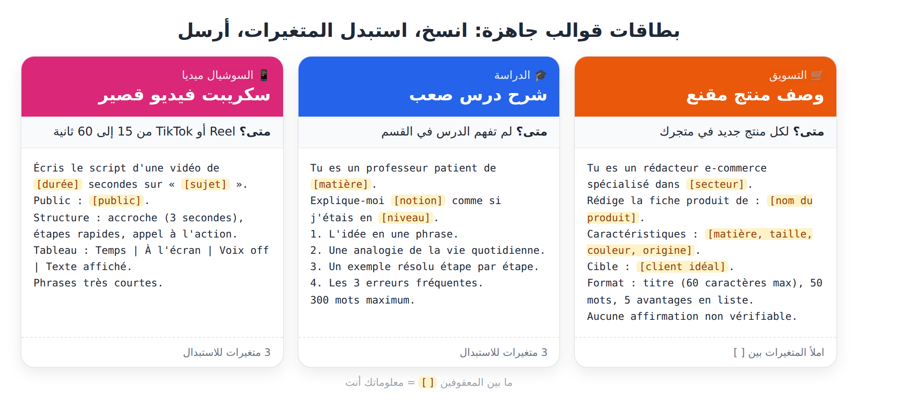
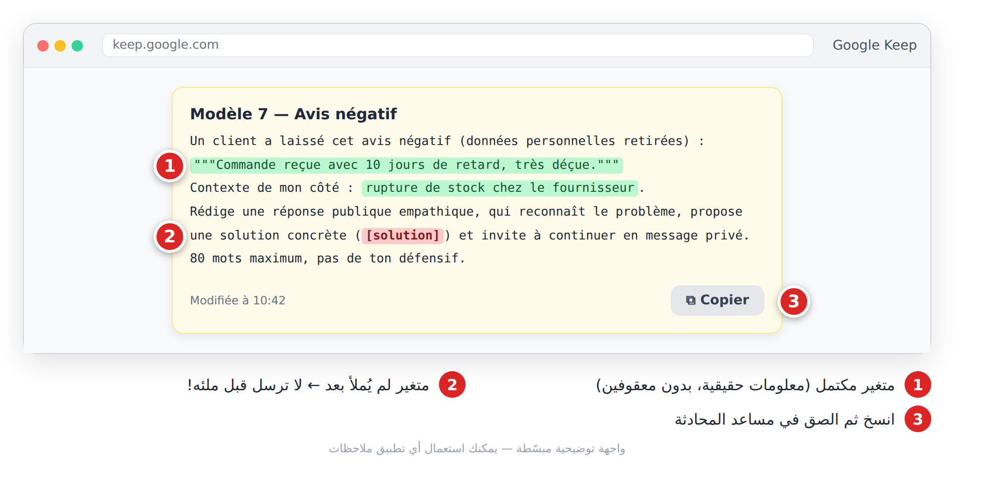
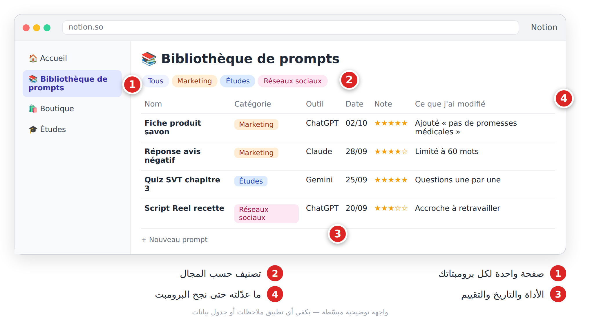

# الفصل 6: مكتبة 20 قالب برومبت جاهز

## 6-1 كيف تستعمل هذه المكتبة؟

اخترنا لك **أنفع 20 قالباً** (**Modèles de prompts**)، كلها مبنية على القطع الست (الفصل 4). لكل قالب: عنوان، سطر «متى؟»، وكتلة بالفرنسية جاهزة للنسخ. ما بين المعقوفين `[ ]` متغيرات (**Variables**) تستبدلها بمعلوماتك.



*الشكل 6-1: كل قالب = متى تستعمله + برومبت + متغيرات تملؤها.*

**الخطوات:**

1. اختر القالب وانسخه في تطبيق ملاحظات.
2. استبدل كل `[ ... ]` بمعلومات حقيقية، واحذف المعقوفين.
3. الصقه في مساعد المحادثة وأرسله.
4. حسّن النتيجة بعبارات التكرار (الفصل 5).



*الشكل 6-2: لا ترسل القالب قبل ملء كل متغيراته.*

> 💡 **نصيحة:** للجواب بالعربية أضف في آخر أي قالب: `Réponds en arabe standard simple.`

> ⚠️ **تحذير:** متغير فارغ أو غامض = نتيجة عامة. ولا تضع أبداً بيانات زبائن حقيقية (أسماء، هواتف) في القوالب.

## 6-2 ✍️ الكتابة

### 1. إعادة صياغة نص
**متى؟** نصّك صحيح لكن نبرته لا تناسب الجمهور.
```
Réécris le texte ci-dessous avec un ton [professionnel / amical / inspirant] pour [public cible].
Garde toutes les informations, n'ajoute aucun fait nouveau. Environ [nombre] mots.
Texte : """[colle ton texte]"""
```

### 2. تصحيح لغوي مع شرح
**متى؟** قبل إرسال نص بالفرنسية، لتتعلّم من أخطائك.
```
Corrige l'orthographe, la grammaire et la ponctuation du texte suivant.
Donne le texte corrigé, puis un tableau : Erreur | Correction | Règle expliquée simplement.
Ne change ni le style ni le sens.
Texte : """[ton texte]"""
```

### 3. تلخيص نص طويل
**متى؟** مقال أو تقرير وتريد الأفكار الأساسية بسرعة.
```
Résume le texte ci-dessous en [nombre] points clés, du plus important au moins important, puis une phrase de conclusion.
Base-toi uniquement sur le texte.
Texte : """[colle le texte]"""
```

### 4. عناوين جذابة
**متى؟** مقال أو فيديو يوتيوب يحتاج عنواناً قوياً.
```
Propose 10 titres pour [article / vidéo YouTube] sur « [sujet] », public : [public].
Varie : question, chiffre, promesse, curiosité, « comment… ». Maximum [nombre] caractères. Pas de titre mensonger.
Indique tes 3 préférés et pourquoi.
```

## 6-3 🛒 التسويق والمتجر

### 5. وصف منتج مقنع
**متى؟** لكل منتج جديد في متجرك.
```
Tu es un rédacteur e-commerce spécialisé dans [secteur].
Rédige la fiche produit de : [nom du produit].
Caractéristiques : [matière, taille, couleur, origine]. Prix : [prix]. Cible : [client idéal].
Format : titre (60 caractères max), 50 mots, 5 avantages en liste, une phrase de réassurance (livraison, retour).
Aucune affirmation non vérifiable.
```

### 6. الزبون المثالي (Persona)
**متى؟** قبل إطلاق منتج، لتعرف لمن تبيع.
```
Je vends [produit] à [ville / pays] via [Instagram / site / marché].
Crée 3 personas de clients : âge, métier, habitudes en ligne, problèmes, freins à l'achat, message qui le convaincrait.
Présente-les dans un tableau. Évite les stéréotypes.
```

### 7. الرد على تقييم سلبي
**متى؟** تقييم سيئ علني وتريد رداً يحمي سمعتك.
```
Un client a laissé cet avis négatif (données personnelles retirées) : """[avis]"""
Contexte de mon côté : [ce qui s'est passé].
Rédige une réponse publique empathique, qui reconnaît le problème, propose une solution concrète ([solution]) et invite à continuer en message privé.
80 mots maximum, pas de ton défensif.
```

### 8. نص إعلان ممول
**متى؟** إعلان على فيسبوك أو إنستغرام.
```
Rédige 3 textes publicitaires pour [plateforme] afin de promouvoir [produit / offre].
Cible : [âge, ville, intérêts]. Objectif : [ventes / messages].
Pour chacun : accroche, texte de 40 mots max, appel à l'action.
Version 1 : problème. Version 2 : émotion. Version 3 : preuve sociale. Pas de promesses exagérées.
```

## 6-4 🎓 الدراسة

### 9. شرح درس صعب
**متى؟** لم تفهم الدرس في القسم.
```
Tu es un professeur patient de [matière].
Explique-moi [notion] comme si j'étais en [niveau].
1. L'idée en une phrase. 2. Une analogie de la vie quotidienne. 3. Un exemple résolu étape par étape. 4. Les 3 erreurs fréquentes.
300 mots maximum.
```

### 10. بطاقات مراجعة
**متى؟** لتحويل درسك إلى بطاقات حفظ سريعة.
```
À partir de mon cours ci-dessous, crée [nombre] fiches de révision Question / Réponse (2 phrases max par réponse).
Base-toi uniquement sur le cours.
Cours : """[colle ton cours]"""
```

### 11. اختبار تفاعلي
**متى؟** قبل الامتحان لتختبر نفسك.
```
Crée un quiz de [nombre] questions sur [chapitre], niveau [niveau] (QCM, vrai/faux, questions courtes).
Pose-moi les questions une par une, attends ma réponse, corrige-moi en expliquant.
À la fin, donne mon score et les notions à revoir.
```

### 12. خطة مراجعة
**متى؟** امتحانات قريبة ووقت محدود.
```
J'ai des examens dans [nombre] jours. Matières et coefficients : [liste]. Points faibles : [matières].
Temps disponible : [heures] par jour.
Crée un planning jour par jour dans un tableau, avec pauses et révision active.
Réfléchis étape par étape pour répartir le temps.
```

## 6-5 💼 الأعمال

### 13. تحديد السعر
**متى؟** لا تعرف بكم تبيع منتجك أو خدمتك.
```
Aide-moi à fixer le prix de [produit / service].
Coûts : matières [montant], main-d'œuvre [montant], emballage [montant], livraison [montant].
Prix des concurrents : [fourchette].
Réfléchis étape par étape (coût de revient, marge, positionnement), puis propose 3 prix (économique, standard, premium) avec ta recommandation.
```
> ⚠️ **تحذير:** أعد الحساب بنفسك في جدول بيانات قبل اعتماد أي سعر.

### 14. محضر اجتماع
**متى؟** ملاحظات اجتماع فوضوية تريدها وثيقة واضحة.
```
Transforme ces notes en compte rendu : participants, points discutés, décisions, tableau Action | Responsable | Échéance.
N'ajoute aucune décision absente des notes.
Notes : """[tes notes]"""
```

### 15. سيرة ذاتية مكيّفة لعرض عمل
**متى؟** للتقدّم لوظيفة محددة.
```
Voici mon CV (sans coordonnées personnelles) : """[CV]"""
Et l'offre d'emploi : """[offre]"""
Réécris mon profil (4 lignes) et mes expériences pour les adapter à l'offre, avec des verbes d'action.
N'invente aucune expérience ni compétence.
```

## 6-6 📱 السوشيال ميديا

### 16. تقويم محتوى شهري
**متى؟** بداية كل شهر لتنظيم منشوراتك.
```
Crée un calendrier de [nombre] publications pour [mois] sur [plateforme], thème : [thématique].
Tableau : date | format (réel, carrousel, story) | sujet | accroche | appel à l'action.
Varie : éducatif, divertissant, coulisses, promotion (20 % maximum).
```
> 💡 **نصيحة:** تحقّق بنفسك من تواريخ المناسبات الدينية والوطنية.

### 17. سكريبت فيديو قصير
**متى؟** Reel أو TikTok من 15 إلى 60 ثانية.
```
Écris le script d'une vidéo de [durée] secondes sur « [sujet] » pour [public].
Structure : accroche (3 premières secondes), étapes rapides, appel à l'action.
Tableau : Temps | À l'écran | Voix off | Texte affiché. Phrases très courtes.
```

### 18. نص منشور مع هاشتاغات
**متى؟** لكل صورة أو فيديو تنشره.
```
Rédige 3 légendes pour une publication [plateforme] montrant : [description].
Chaque légende : première ligne accrocheuse, 2-3 phrases, une question, un appel à l'action.
Ajoute 8 hashtags : 3 populaires, 3 de niche, 2 locaux ([ville]).
```

## 6-7 💻 البرمجة البسيطة

### 19. معادلة جدول بيانات
**متى؟** حساب تلقائي في جدول المبيعات أو المصاريف.
```
J'utilise [Excel / Google Sheets]. Mes colonnes : [A = date, B = produit, C = quantité...].
Je veux calculer : [ce que tu veux].
Donne la formule exacte, explique chaque partie simplement et indique la cellule où la mettre.
```

### 20. فهم رسالة خطأ
**متى؟** برنامج أو معادلة تعطيك خطأ.
```
J'obtiens cette erreur : """[message d'erreur exact]"""
J'essaie de [objectif] avec [outil / langage].
Code ou formule : """[code]"""
Explique la cause en langage simple, propose une correction, et dis comment éviter cette erreur.
```
> ⚠️ **تحذير:** لا تلصق كوداً فيه كلمات سر أو مفاتيح API.

## 6-8 ابنِ مكتبتك الشخصية

هذه القوالب نقطة انطلاق. أنشئ ملفاً «مكتبة البرومبتات»، واحفظ فيه كل برومبت نجح مع الأداة والتاريخ وما عدّلته. وحوّل أي محادثة ناجحة إلى قالب:

```
Analyse notre conversation. Transforme ma demande et mes corrections en un seul modèle de prompt réutilisable, avec des variables entre crochets [ ].
Ajoute : quand l'utiliser, et la liste des variables.
```



*الشكل 6-3: مكتبتك الشخصية: كل برومبت ناجح مع ما تعلّمته منه.*

## 📝 الخلاصة

- 20 قالباً في 6 مجالات: الكتابة، التسويق، الدراسة، الأعمال، السوشيال ميديا، البرمجة.
- جودة النتيجة = جودة ما تضعه مكان `[ ]`.
- عبارات «لا تخترع» و«اعتمد على النص فقط» تقلّل الهلوسة.
- مكتبتك الشخصية أهم من أي مكتبة جاهزة.

## 🛠️ تمرين

**«أسبوع القوالب»:** اختر 5 قوالب من 3 مجالات مختلفة، املأها بمعلومات حقيقية وأرسلها. دوّن لكل قالب: هل النتيجة صالحة مباشرة؟ ما الذي عدّلته؟ ثم احفظ أفضلها في مكتبتك.
