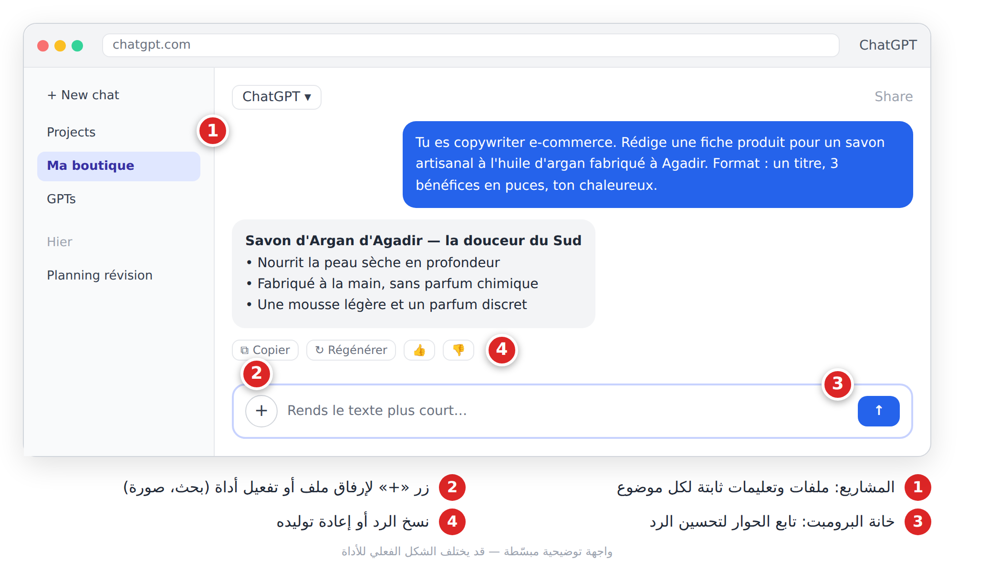
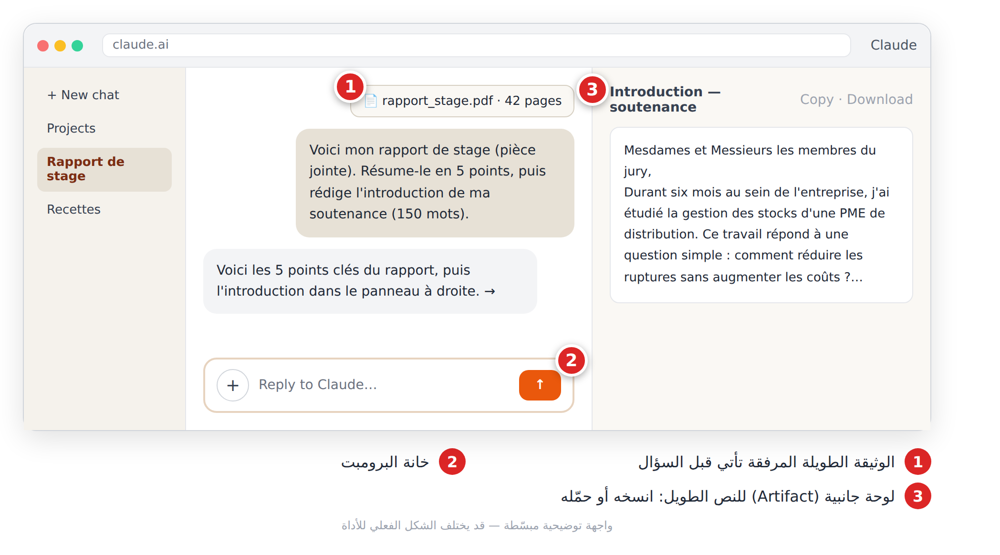
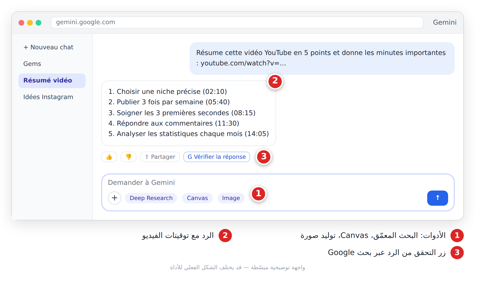
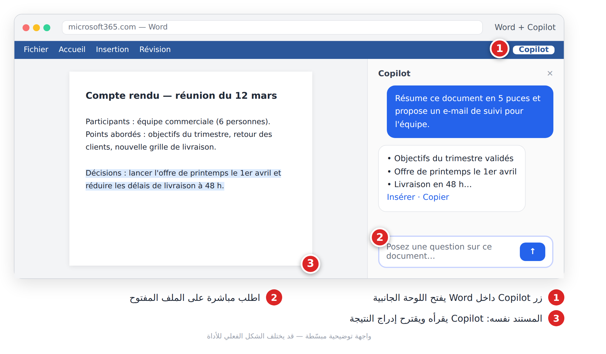
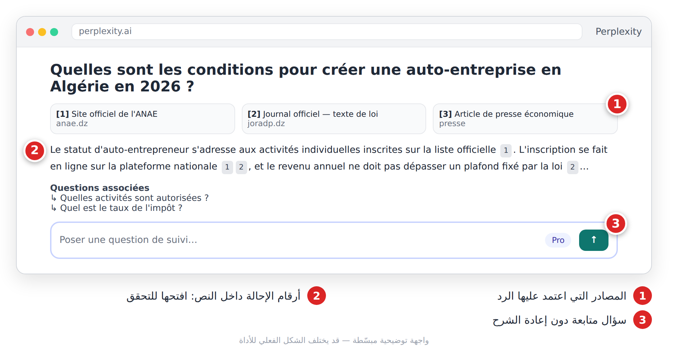
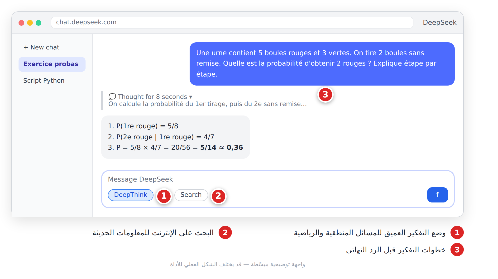
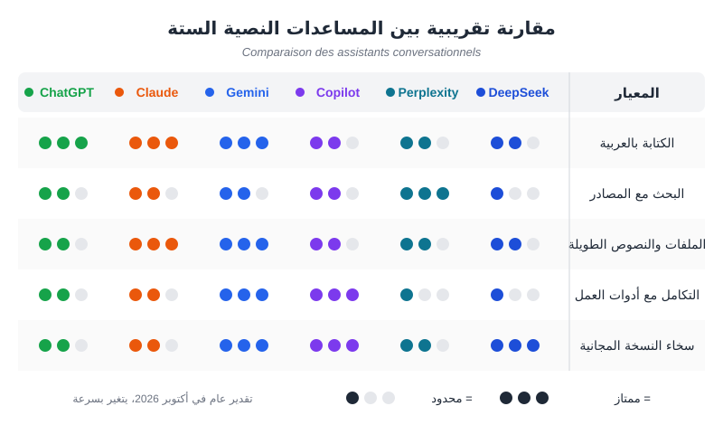

# الجزء الثالث: أدوات الذكاء الاصطناعي وبرومبتاتها الخاصة

تعلّمنا في الجزأين السابقين كيف يفكّر الذكاء الاصطناعي وكيف نكتب برومبتاً جيداً. في هذا الجزء نفتح الأدوات واحدة واحدة ونتعلّم «لغة» كل منها، لأن البرومبت الذي ينجح في ChatGPT قد لا ينجح بالطريقة نفسها في Midjourney أو Canva.

> ⚠️ **تحذير:** واجهات الأدوات وأسماء نماذجها تتغيّر كل بضعة أشهر. إن وجدت زرّاً في مكان آخر، فابحث عن الوظيفة نفسها؛ المنطق يبقى ثابتاً.

---

# الفصل 7: المساعدات النصية (**Assistants conversationnels**)

## 🎯 ماذا ستتعلم في هذا الفصل

- الفرق بين المساعد النصي ومحرك البحث.
- البدء مع ستة مساعدات: ChatGPT، Claude، Gemini، Copilot، Perplexity، DeepSeek.
- برومبتات جاهزة بالفرنسية لكل أداة، وكيف تختار الأداة المناسبة.

المساعد النصي برنامج يعتمد على نموذج لغوي كبير (**Grand modèle de langage — LLM**): تكتب له بلغتك العادية فيردّ كخبير. محرك البحث (**Moteur de recherche**) يعطيك روابط تقرؤها بنفسك، أما المساعد فيقرأ ويلخّص ويكتب ويحاور. لكنه قد يخطئ بثقة، وهذا ما نسمّيه الهلوسة (**Hallucination**)، فتحقّق دائماً من المعلومات المهمة.

---

## 7-1 ChatGPT

**ما هو:** مساعد شركة OpenAI، الأشهر والأكثر تنوّعاً. يكتب ويلخّص الملفات ويحلّل الجداول ويولّد الصور. فيه نسخة مجانية بحدود، واشتراكات تفتح نماذج أقوى وحدوداً أعلى.

**الخطوات:**
1. ادخل إلى chatgpt.com أو حمّل التطبيق، وسجّل بحساب Google أو بريدك.
2. اكتب طلبك في الخانة، وأرفق ملفاً بزر «+» عند الحاجة.
3. اقرأ الرد، ثم حسّنه بالحوار: «اجعلها أقصر»، «أضف مثالاً».
4. لموضوع طويل (متجرك، مذكرتك)، أنشئ **مشروعاً** (**Projet**) وضع فيه ملفاتك وتعليماتك.



*الشكل 7-1: واجهة ChatGPT — محادثة لكتابة وصف منتج.*

**برومبتات جاهزة:**

```
Tu es copywriter e-commerce. Rédige une fiche produit pour un savon artisanal à l'huile d'argan fabriqué à Agadir. Public : femmes de 25 à 45 ans. Format : un titre accrocheur, 3 bénéfices en puces, un paragraphe de 60 mots, ton chaleureux.
```

```
Tu es un coach scolaire. J'ai 3 examens dans 15 jours : microéconomie, statistiques et droit. Crée un planning de révision jour par jour sous forme de tableau, avec des pauses.
```

```
Joue le rôle d'un recruteur pour un poste de commercial. Pose-moi une question à la fois, attends ma réponse, puis donne-moi un retour noté sur 10.
```

> 💡 **نصيحة:** إذا جاء الرد عاماً، اكتب: «Pose-moi d'abord 5 questions avant de répondre». الأسئلة تجعل الرد على مقاسك.

---

## 7-2 Claude

**ما هو:** مساعد شركة Anthropic، معروف بكتابة طبيعية سلسة (بالعربية أيضاً)، وبقراءة وثائق طويلة جداً بدقة، وبإتقان البرمجة. مناسب للطلبة الباحثين والكتّاب ومن يعمل على تقارير وعقود.

**الخطوات:**
1. ادخل إلى claude.ai وسجّل دخولك.
2. ارفع الوثيقة (PDF، Word) أولاً، ثم اكتب سؤالك **بعدها**.
3. النصوص الطويلة والجداول والكود (**Code**) تظهر في **لوحة جانبية** (**Artifact**) يمكنك نسخها أو تحميلها.
4. استعمل **المشاريع** لتجميع ملفات موضوع واحد وتعليماته الثابتة.



*الشكل 7-2: واجهة Claude — تلخيص تقرير تدريب وكتابة مقدمة المناقشة.*

**برومبتات جاهزة:**

```
<document>[colle ici le texte]</document>
Résume ce document en 7 points clés. Ensuite, liste les passages qui manquent de sources ou d'arguments.
```

```
Voici le premier chapitre de mon mémoire. Corrige le style et la grammaire sans changer mes idées, puis explique en 5 puces les principales corrections.
```

```
Compare ces deux contrats de location (pièces jointes) dans un tableau : durée, loyer, charges, conditions de résiliation. Signale les clauses inhabituelles.
```

> 💡 **نصيحة:** افصل الوثيقة عن التعليمات بوسوم مثل `<document>` و`</document>`، وضع السؤال في الأخير؛ الدقة تتحسّن بوضوح.

---

## 7-3 Gemini

**ما هو:** مساعد Google، مندمج مع Gmail وDrive وYouTube. يلخّص فيديوهات YouTube من رابطها، ويقدّم بحثاً معمّقاً (**Recherche approfondie — Deep Research**) يكتب تقريراً بمصادر. نسخته المجانية سخية.

**الخطوات:**
1. ادخل إلى gemini.google.com بحساب Google.
2. اكتب طلبك أو الصق رابط فيديو أو ملف من Drive.
3. اختر أداة عند الحاجة: Deep Research للتقارير، Canvas لتحرير نص طويل، أو توليد صورة.
4. استعمل خيار التحقق من الرد (في الواجهة الفرنسية يظهر حالياً باسم قريب من **Vérifier la réponse**، وقد يتغيّر اسمه أو مكانه) ليقارن Gemini ما كتبه بنتائج بحث Google.



*الشكل 7-3: واجهة Gemini — تلخيص فيديو YouTube مع التوقيتات.*

**برومبتات جاهزة:**

```
Résume cette vidéo YouTube en 5 points avec les minutes importantes, puis propose 3 idées de publications Instagram inspirées de son contenu : [lien]
```

```
Cherche dans mes e-mails Gmail de ce mois les factures de mes fournisseurs et fais-moi un tableau : fournisseur, montant, date.
```

> 💡 **نصيحة:** أنشئ **Gem** (مساعد مخصّص) بتعليمات ثابتة، مثلاً «مصحّح رسائل رسمية»، فلا تعيد كتابة التعليمات كل مرة.

---

## 7-4 Microsoft Copilot

**ما هو:** مساعد Microsoft، متاح مجاناً على copilot.microsoft.com وفي Windows، ومندمج في Word وExcel وPowerPoint وOutlook ضمن اشتراكات Microsoft 365. قوّته أنه يعمل **على الملف المفتوح أمامك**.

**الخطوات:**
1. افتح Word (أو Excel أو PowerPoint) بحسابك.
2. اضغط زر **Copilot** في الشريط لتظهر لوحته الجانبية.
3. اطلب على الملف مباشرة: لخّص، أعد الصياغة، حوّل إلى عرض.
4. اضغط زر الإدراج (مثل «Insérer»، وقد يختلف اسمه حسب الإصدار) لإدراج النتيجة في المستند، ثم راجعها.



*الشكل 7-4: Copilot في Word — تلخيص محضر اجتماع واقتراح بريد متابعة.*

**برومبتات جاهزة:**

```
Résume ce document en 5 puces et propose un e-mail de suivi de 100 mots pour l'équipe.
```

```
(Excel) Analyse ce tableau des ventes : quel produit progresse le plus ? Ajoute un graphique par mois.
```

```
(PowerPoint) Crée une présentation de 8 diapositives à partir du document Word « rapport_annuel.docx ».
```

> 💡 **نصيحة:** سمِّ الملف الذي تقصده بدقة في البرومبت، واطلب «إجراءً» واضحاً (Résume, Crée, Analyse) لا سؤالاً عاماً.

---

## 7-5 Perplexity

**ما هو:** محرك إجابات (**Moteur de réponses**): يبحث في الإنترنت ثم يكتب رداً مع **مصادر مرقّمة** تفتحها للتحقق. الأفضل للأخبار الحديثة والأرقام والبحث الأكاديمي.

**الخطوات:**
1. ادخل إلى perplexity.ai (التسجيل اختياري للبداية).
2. اكتب سؤالاً دقيقاً ومحدّداً بالزمان والمكان.
3. افتح المصادر المرقّمة وتأكّد أنها تقول فعلاً ما نُسب إليها.
4. تابع بأسئلة لاحقة دون إعادة الشرح.



*الشكل 7-5: Perplexity — سؤال عن إنشاء مقاولة ذاتية مع مصادر رسمية.*

**برومبتات جاهزة:**

```
Quelles sont les conditions pour créer une auto-entreprise en Algérie en 2026 ? Cite uniquement des sources officielles.
```

```
Vérifie cette information qui circule sur Facebook : « [texte] ». Est-elle vraie ? Donne les sources et la date de chaque source.
```

```
Trouve 5 articles scientifiques récents (après 2022) sur l'irrigation goutte-à-goutte en zone aride. Pour chacun : titre, auteurs, année, idée principale en une phrase.
```

> ⚠️ **تحذير:** وجود مصدر لا يعني أن المعلومة صحيحة. افتح المصدر، وفضّل المواقع الرسمية على المدوّنات.

---

## 7-6 DeepSeek

**ما هو:** مساعد صيني نسخته على الويب مجانية في معظمها، قوي في الرياضيات والمنطق والبرمجة. وضع **DeepThink** يجعله «يفكّر» خطوة بخطوة قبل الرد، وزر **Search** يضيف البحث في الإنترنت.

**الخطوات:**
1. ادخل إلى chat.deepseek.com أو حمّل التطبيق.
2. فعّل **DeepThink** للمسائل الصعبة، و**Search** للمعلومات الحديثة.
3. أعطِ كل المعطيات في البرومبت (أرقام، شروط، المطلوب).
4. راجع خطوات التفكير لتفهم الحل، لا النتيجة فقط.



*الشكل 7-6: DeepSeek — حل تمرين احتمالات خطوة بخطوة.*

**برومبتات جاهزة:**

```
Une urne contient 5 boules rouges et 3 vertes. On tire 2 boules sans remise. Quelle est la probabilité d'obtenir 2 rouges ? Explique étape par étape comme à un élève de terminale.
```

```
Écris un script Python qui lit un fichier CSV de ventes et affiche le total par mois. Commente chaque ligne en français.
```

> ⚠️ **تحذير:** حسب سياسة الخصوصية، قد تُخزَّن محادثاتك وبياناتك على خوادم خارج بلدك (اقرأ السياسة الحالية لتعرف أين بالضبط). لا ترفع وثائق حساسة أو بيانات شخصية أو سرية، وهذا ينطبق على كل الخدمات المجانية.

---

## 7-7 مقارنة سريعة: أي مساعد تختار؟



*الشكل 7-7: مقارنة تقريبية بين المساعدات الستة (تقدير عام في أكتوبر 2026).*

| الأداة | الأفضل لـ | المجاني | البحث على الإنترنت |
|---|---|---|---|
| ChatGPT | الاستعمال العام، الملفات، الصور | جيد مع حدود | نعم، مع مصادر |
| Claude | الوثائق الطويلة، الكتابة، البرمجة | محدود نسبياً | نعم |
| Gemini | منظومة Google وYouTube | سخي | نعم + خيار التحقق |
| Copilot | Word وExcel وPowerPoint | سخي (الويب) | نعم |
| Perplexity | البحث بمصادر والتحقق | جيد | هو أساسه |
| DeepSeek | الرياضيات والمنطق | شبه مجاني | نعم (Search) |

**القاعدة:** حدّد المهمة أولاً، ثم اختر الأداة. لمعلومة حديثة: Perplexity. لوثيقة طويلة: Claude. لملف Office: Copilot. لاستعمال يومي متنوّع: ChatGPT أو Gemini. وفي القرارات المهمة، اطرح السؤال على مساعدَين وقارن.

> ✅ **مثال صحيح:** طالبة في قسنطينة تبحث عن المراجع في Perplexity، وتراجع فصول مذكّرتها في Claude، وتصنع عرض المناقشة بـ Copilot في PowerPoint.

> ❌ **مثال خاطئ:** نسخ أرقام من رد مساعد دون تحقق ووضعها في تقرير رسمي.

---

## 📝 الخلاصة

- المساعد النصي يحاور ويكتب ويحلّل، لكنه قد يهلوس؛ التحقق مسؤوليتك.
- لكل أداة قوّتها: ChatGPT للتنوّع، Claude للنصوص الطويلة، Gemini لـ Google، Copilot لـ Office، Perplexity للمصادر، DeepSeek للمنطق.
- لكل أداة «لغة»: دور وسياق في ChatGPT، الوثيقة أولاً في Claude، الرابط في Gemini، الملف والإجراء في Copilot، السؤال الدقيق في Perplexity، المعطيات الكاملة في DeepSeek.
- اختر حسب المهمة، لا حسب الشهرة، ولا ترفع بيانات حساسة.

## 🛠️ تمرين

اختر مهمة حقيقية من أسبوعك (رسالة، ملخص درس، أفكار منشورات). اكتب لها برومبتاً واحداً بالفرنسية، وجرّبه في ثلاث أدوات من هذا الفصل. سجّل في جدول: الأداة | جودة الرد من 10 | ملاحظة. احتفظ به كدليلك الشخصي.
