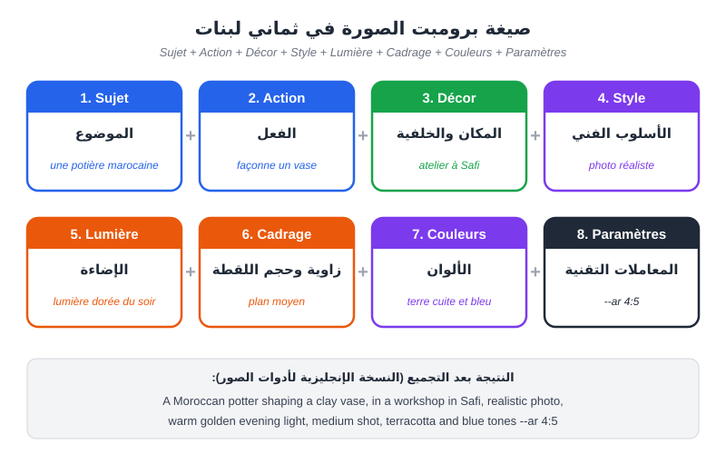
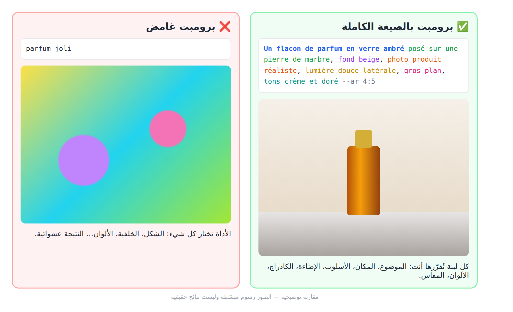
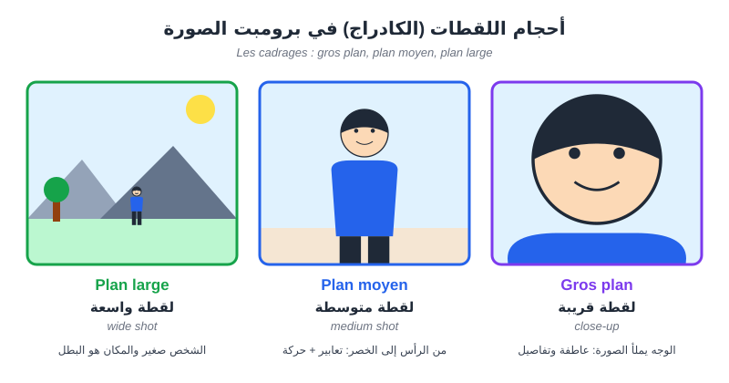
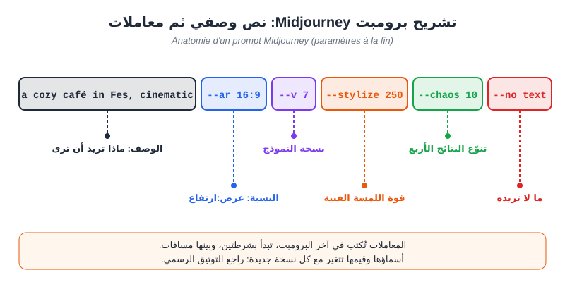
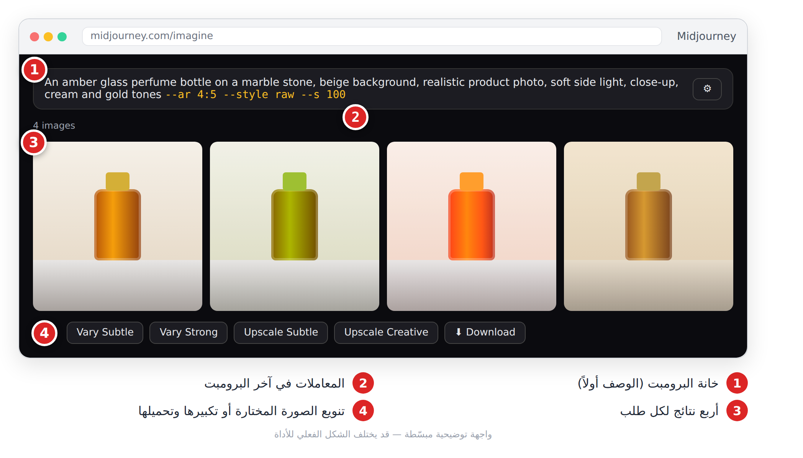
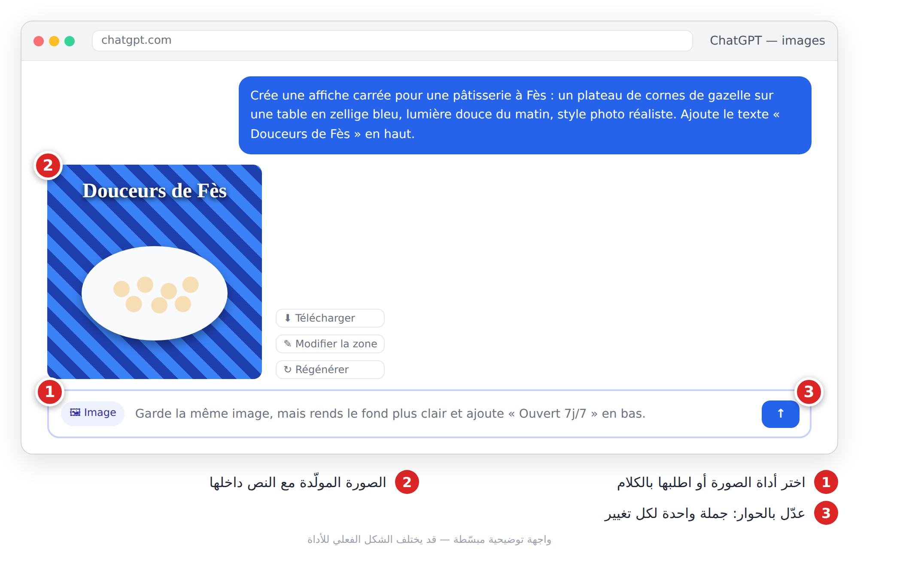
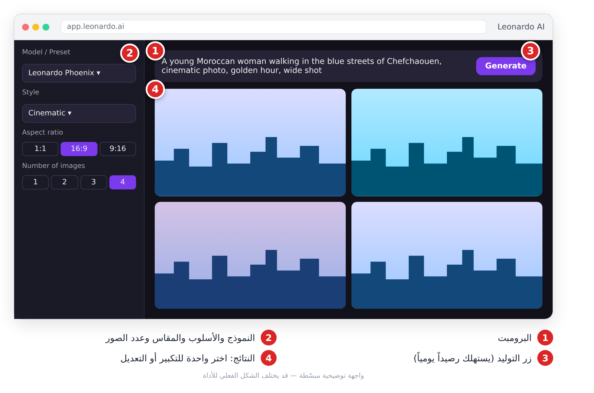
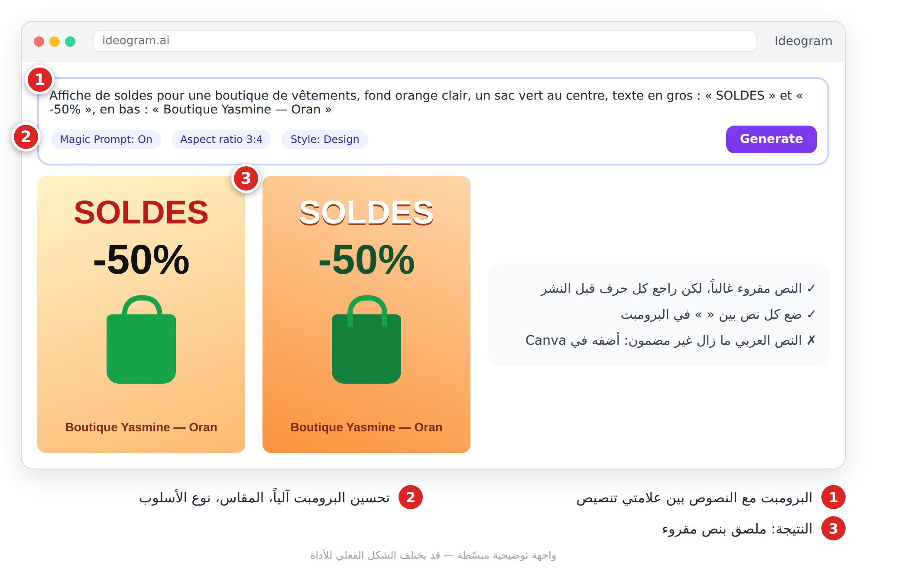
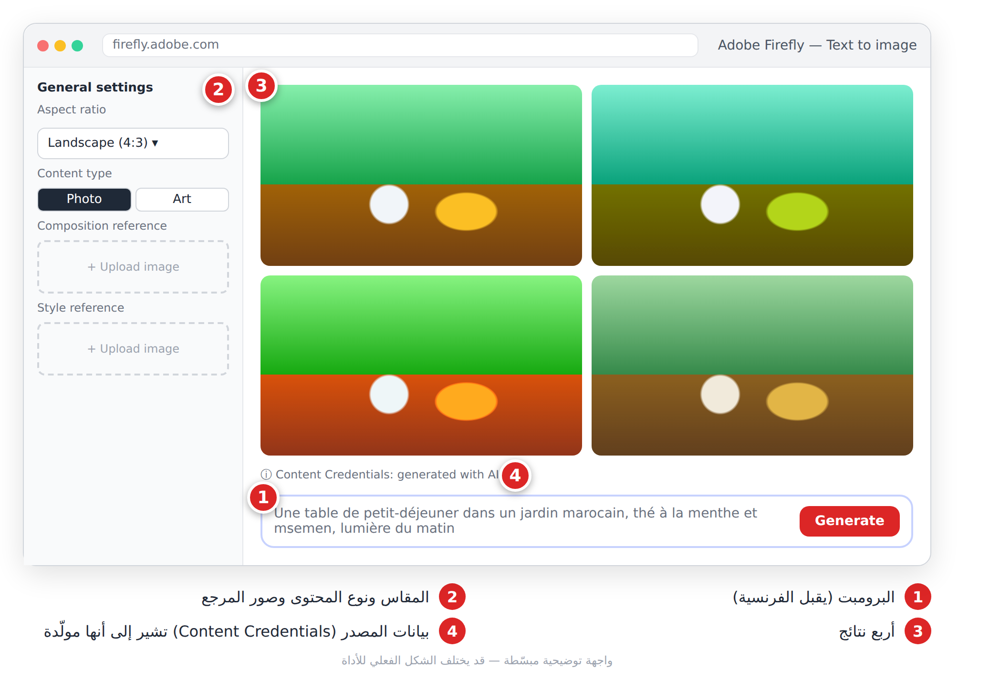
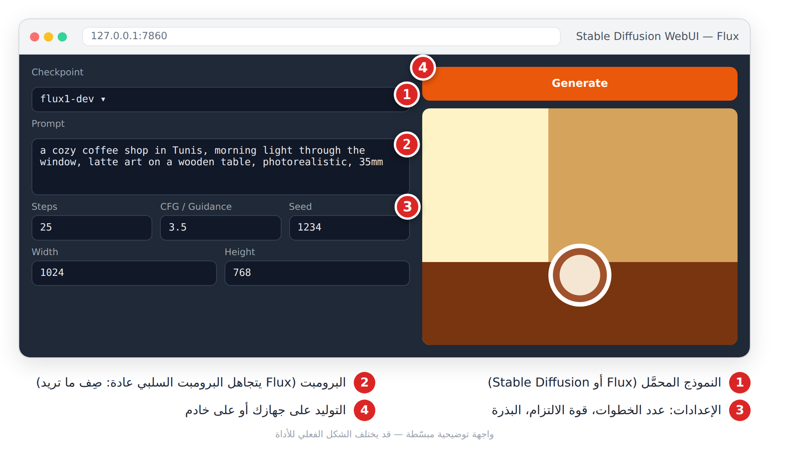

# الفصل 8: توليد الصور (**Génération d'images**)

## 🎯 ماذا ستتعلم في هذا الفصل

- صيغة برومبت الصورة بثماني لبنات، ومفرداتها الأساسية.
- Midjourney ومعاملاته الأساسية.
- صور ChatGPT، وLeonardo، وIdeogram (للنص داخل الصورة)، وFirefly، وFlux.

أدوات الصور تعتمد غالباً على نماذج الانتشار (**Modèles de diffusion**): تبدأ من «ضجيج» عشوائي وتزيله تدريجياً حتى تظهر صورة تطابق وصفك. كلما كان الوصف أدق، اقتربت الصورة مما في ذهنك.

---

## 8-1 صيغة برومبت الصورة

البرومبت الجيد يتكوّن من ثماني لبنات. كل لبنة تغيبها تتركها للآلة لتقرّر بدلاً منك.



*الشكل 8-1: الموضوع (**Sujet**) + الفعل (**Action**) + المكان (**Décor**) + الأسلوب (**Style**) + الإضاءة (**Lumière**) + الكادراج (**Cadrage**) + الألوان (**Couleurs**) + المعاملات (**Paramètres**).*

ابدأ دائماً بالموضوع، فالنماذج تعطي وزناً أكبر للكلمات الأولى، ثم أضف التفاصيل من الأهم إلى الأقل أهمية.



*الشكل 8-2: الفرق بين برومبت من كلمتين وبرومبت بالصيغة الكاملة.*

**لماذا الإنجليزية؟** أغلب نماذج الصور تدرّبت على أوصاف إنجليزية، فتفهمها أدق. لذلك نعطيك كل برومبت بالفرنسية ثم نسخة إنجليزية قصيرة.

### مفردات أساسية

| الفرنسية | العربية | الإنجليزية |
|---|---|---|
| photo réaliste | صورة واقعية | photorealistic photo |
| photo produit | صورة منتج | product photography |
| aquarelle | ألوان مائية | watercolor |
| illustration à plat | رسم مسطّح | flat illustration |
| rendu 3D | تصيير ثلاثي الأبعاد | 3D render |
| cinématographique | سينمائي | cinematic |
| heure dorée | الساعة الذهبية | golden hour |
| lumière douce | إضاءة ناعمة | soft light |
| contre-jour | إضاءة خلفية | backlight |
| gros plan | لقطة قريبة | close-up |
| plan large | لقطة واسعة | wide shot |
| vue de dessus | من الأعلى | top-down view / flat lay |



*الشكل 8-3: أحجام اللقطات الأساسية: الواسعة (**Plan large**)، المتوسطة (**Plan moyen**)، القريبة (**Gros plan**).*

---

## 8-2 Midjourney

**ما هو:** مرجع الصور الفنية والإعلانية عالية الجمال. يعمل على موقع midjourney.com (وعلى Discord)، باشتراك مدفوع غالباً (تحقّق من وجود تجربة مجانية حالياً). كل طلب يعطيك أربع صور.

**الخطوات:**
1. ادخل إلى midjourney.com وسجّل بحساب Discord أو Google، ثم اختر اشتراكاً.
2. اكتب الوصف في خانة **Imagine**، والمعاملات **في آخر البرومبت**.
3. اختر الصورة الأفضل من الأربع.
4. نوّعها (**Vary**) أو كبّرها (**Upscale**)، ثم حمّلها.



*الشكل 8-4: الوصف أولاً، ثم المعاملات تبدأ بشرطتين `--`.*

| المعامل | الوظيفة | مثال |
|---|---|---|
| `--ar` | نسبة العرض للارتفاع | `--ar 9:16` للقصص، `--ar 4:5` لإنستغرام |
| `--style raw` | التزام حرفي أكثر بالوصف (للصور الواقعية) | `--style raw` |
| `--s` (stylize) | قوة اللمسة الفنية (0–1000) | `--s 100` للمنتجات |
| `--chaos` | تنوّع الصور الأربع (0–100) | `--chaos 50` لاستكشاف أفكار |
| `--no` | ما لا تريده | `--no text, people` |
| `--sref` | نقل أسلوب صورة مرجعية | `--sref [lien]` |



*الشكل 8-5: واجهة Midjourney — صورة منتج عطر بأربع نسخ.*

**برومبتات جاهزة:**

```
Un pot de miel artisanal avec une cuillère en bois, sur une table en bois d'olivier, photo produit réaliste, lumière douce du matin, gros plan, tons dorés --ar 4:5 --style raw --s 100
```
🇬🇧 بالإنجليزية:
```
Artisanal honey jar with a wooden spoon on an olive wood table, realistic product photo, soft morning light, close-up, golden tones --ar 4:5 --style raw --s 100
```

```
Une ruelle de la médina de Fès au crépuscule, lanternes allumées, style cinématographique, plan large --ar 16:9 --s 300
```
🇬🇧 بالإنجليزية:
```
Narrow alley in the Fes medina at dusk, glowing lanterns, cinematic, wide shot --ar 16:9 --s 300
```

> ⚠️ **تحذير:** لا تكتب «sans voitures» داخل الوصف؛ ذِكر الكلمة قد يستدعيها. استعمل `--no cars`. والمعاملات تتغيّر بين النسخ، فراجع docs.midjourney.com.

> ⚠️ **استعمال تجاري في Midjourney:** شروطه تختلف حسب الخطة (مثلاً حدّ لدخل الشركة يفرض خطة أعلى)، وصورك قد تظهر علنياً في معرض الموقع ما لم تكن خطتك تسمح بالوضع الخاص (**Stealth**). اقرأ الشروط الحالية قبل أي عمل لزبون.

---

## 8-3 صور ChatGPT (مولّد الصور المدمج، خليفة DALL·E)

**ما هو:** توليد الصور مباشرة داخل محادثة ChatGPT. ميزته الكبرى: تعدّل الصورة **بالحوار**، ويكتب النصوص القصيرة داخل الصورة بشكل جيد. متاح بحدود في النسخة المجانية.

**الخطوات:**
1. في chatgpt.com اختر أداة الصورة من زر «+» أو اطلبها بالكلام («Crée une image…»).
2. صف الصورة بالصيغة الكاملة، واذكر المقاس (carrée، verticale).
3. عدّل بجمل قصيرة: تغيير واحد في كل رسالة.
4. لتعديل جزء فقط، استعمل أداة تحديد المنطقة ثم صف التغيير.



*الشكل 8-6: ChatGPT — ملصق حلويات ثم تعديله بجملة واحدة.*

```
Crée une affiche carrée pour une pâtisserie à Fès : un plateau de cornes de gazelle sur une table en zellige bleu, lumière douce du matin, style photo réaliste. Ajoute le texte « Douceurs de Fès » en haut.
```
🇬🇧 بالإنجليزية:
```
Square poster for a pastry shop in Fes: a tray of gazelle horn pastries on a blue zellige table, soft morning light, realistic photo. Add the text "Douceurs de Fès" at the top.
```

> 💡 **نصيحة:** قل «Garde la même image, change seulement…» حتى لا يعيد رسم كل شيء.

---

## 8-4 Leonardo AI

**ما هو:** منصة توليد بنماذج وأساليب جاهزة كثيرة (**Presets**)، مع رصيد مجاني يومي. مناسبة لمن يريد تحكّماً بالأزرار بدل المعاملات المكتوبة.

**الخطوات:**
1. ادخل إلى app.leonardo.ai وسجّل دخولك.
2. اختر النموذج والأسلوب (Cinematic، Illustration…) والمقاس وعدد الصور.
3. اكتب البرومبت واضغط **Generate**.
4. اختر صورة لتكبيرها أو تعديلها في المحرّر.



*الشكل 8-7: Leonardo AI — مشهد سينمائي في شفشاون.*

```
Une jeune femme marocaine marchant dans les ruelles bleues de Chefchaouen, photo cinématographique, heure dorée, plan large
```
🇬🇧 بالإنجليزية:
```
A young Moroccan woman walking in the blue streets of Chefchaouen, cinematic photo, golden hour, wide shot
```

> 💡 **نصيحة:** جرّب البرومبت نفسه مع أسلوبين مختلفين قبل أن تغيّر الكلمات؛ الأسلوب يغيّر النتيجة أكثر مما تظن.

---

## 8-5 Ideogram

**ما هو:** من الأفضل في **كتابة النص داخل الصورة** (لكن راجع كل حرف قبل النشر): ملصقات، عروض، أغلفة، شعارات بسيطة. فيه نسخة مجانية بعدد توليدات محدود، وصورها قد تكون علنية. والشعار المولّد قد لا يمكن تسجيله أو حمايته كعلامة تجارية.

**الخطوات:**
1. ادخل إلى ideogram.ai.
2. اكتب الوصف، وضع كل نص تريده بين « ».
3. اختر المقاس ونوع الأسلوب (Design للملصقات)، واترك **Magic Prompt** مفعّلاً أو أوقفه للتحكّم الكامل.
4. اضغط **Generate** واختر الأفضل.



*الشكل 8-8: Ideogram — ملصق تخفيضات بنص مقروء.*

```
Affiche de soldes pour une boutique de vêtements, fond orange clair, un sac vert au centre, texte en gros : « SOLDES » et « -50% », en bas : « Boutique Yasmine — Oran »
```
🇬🇧 بالإنجليزية:
```
Sale poster for a clothing shop, light orange background, green bag in the center, big text "SOLDES" and "-50%", at the bottom "Boutique Yasmine — Oran"
```

> ⚠️ **تحذير:** النص العربي داخل الصور ما زال غير مضمون في أغلب الأدوات. ولّد الصورة بلا نص عربي، ثم أضفه في Canva (الفصل 9).

---

## 8-6 Adobe Firefly

**ما هو:** مولّد صور Adobe. نماذج **Firefly الخاصة بـ Adobe** دُرِّبت على محتوى مرخّص وتقدّمها Adobe على أنها مناسبة للاستعمال التجاري؛ أما نماذج الشركاء المتاحة داخل التطبيق فلها شروط أخرى، فتحقّق من اسم النموذج قبل أي استعمال تجاري. يقبل الفرنسية، ويضيف بيانات مصدر (**Content Credentials**) تُشير إلى أن الصورة مولّدة.

**الخطوات:**
1. ادخل إلى firefly.adobe.com بحساب Adobe (أرصدة مجانية شهرية محدودة).
2. اختر **Text to image**، ثم المقاس ونوع المحتوى (Photo أو Art).
3. أضف عند الحاجة صورة مرجعية للتكوين أو للأسلوب.
4. اكتب البرومبت واضغط **Generate**.



*الشكل 8-9: Adobe Firefly — طاولة فطور في حديقة مغربية.*

```
Une table de petit-déjeuner dans un jardin marocain, thé à la menthe et msemen, lumière du matin, photo réaliste
```
🇬🇧 بالإنجليزية:
```
Breakfast table in a Moroccan garden, mint tea and msemen, morning light, realistic photo
```

> 💡 **نصيحة:** Firefly مدمج أيضاً في Photoshop وAdobe Express؛ ما تتعلّمه هنا تستعمله في التعديل (الفصل 9).

---

## 8-7 Flux / Stable Diffusion

**ما هو:** نماذج **مفتوحة الأوزان** (**Poids ouverts**) يمكن تشغيلها على جهازك (بطاقة رسوميات قوية) أو عبر مواقع تستضيفها. تعطي أكبر تحكّم: عدد الخطوات، البذرة (**Seed**)، والبرومبت السلبي في Stable Diffusion (أغلب نماذج Flux تتجاهله).

**الخطوات:**
1. استعمل موقعاً يستضيف Flux، أو ثبّت واجهة محلية مثل Forge أو ComfyUI.
2. حمّل النموذج (Checkpoint) واختره.
3. اكتب البرومبت (ومع Stable Diffusion يمكنك إضافة برومبت سلبي لما لا تريده).
4. اضبط المقاس والخطوات، ثبّت البذرة لتكرار نتيجة أعجبتك، ثم **Generate**.



*الشكل 8-10: واجهة محلية لـ Flux — مقهى في تونس.*

```
Un café chaleureux à Tunis, lumière du matin par la fenêtre, latte art sur une table en bois, photo réaliste, objectif 35 mm
```
🇬🇧 بالإنجليزية:
```
a cozy coffee shop in Tunis, morning light through the window, latte art on a wooden table, photorealistic, 35mm
```

> 💡 **نصيحة:** فرّق بين ثلاثة أشياء: رخصة **النموذج** (بعض نسخ Flux رخصتها غير تجارية للنموذج نفسه)، ورخصة **الصور الناتجة**، وشروط **الموقع** الذي يستضيفه. راجعها كلها قبل الاستعمال التجاري.

---

## 8-8 الأخلاقيات باختصار

- لا تولّد صوراً لأشخاص حقيقيين دون موافقتهم، ولا وجوه مشاهير في إعلانات.
- لا تقلّد أسلوب فنان حيّ باسمه لأغراض تجارية.
- صرّح بأن الصورة مولّدة عندما يكون ذلك مهماً للجمهور (أخبار، شهادات، منتجات).
- الصور المولّدة قد لا تحميها حقوق المؤلف في بلدان كثيرة: قد لا تملك حصرية عليها، وقد يستعمل غيرك صورة مشابهة.

---

## 📝 الخلاصة

- برومبت الصورة = موضوع + فعل + مكان + أسلوب + إضاءة + كادراج + ألوان + معاملات.
- Midjourney للجمال الفني بمعاملات مكتوبة؛ ChatGPT للتعديل بالحوار؛ Leonardo للأساليب الجاهزة.
- Ideogram للنص داخل الصورة؛ نماذج Firefly الخاصة بـ Adobe للاستعمال التجاري؛ Flux للتحكّم الكامل.
- الإنجليزية تعطي نتائج أدق، والنص العربي يُضاف لاحقاً في أداة تصميم.

## 🛠️ تمرين

اختر منتجاً حقيقياً (لك أو لعائلتك). اكتب برومبتاً بالصيغة الكاملة بالفرنسية، ثم ترجمه إلى الإنجليزية، وولّد الصورة في أداتين مختلفتين. قارن: أي أداة احترمت الوصف أكثر؟ عدّل لبنة واحدة (الإضاءة مثلاً) وأعد التوليد، ولاحظ الفرق.
