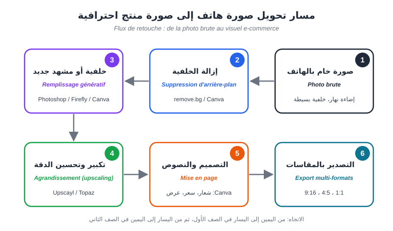
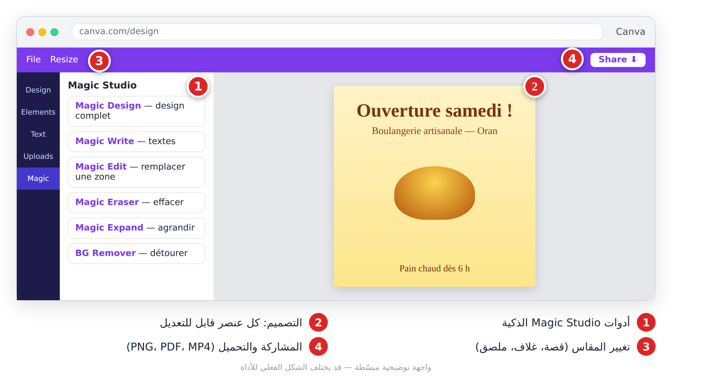
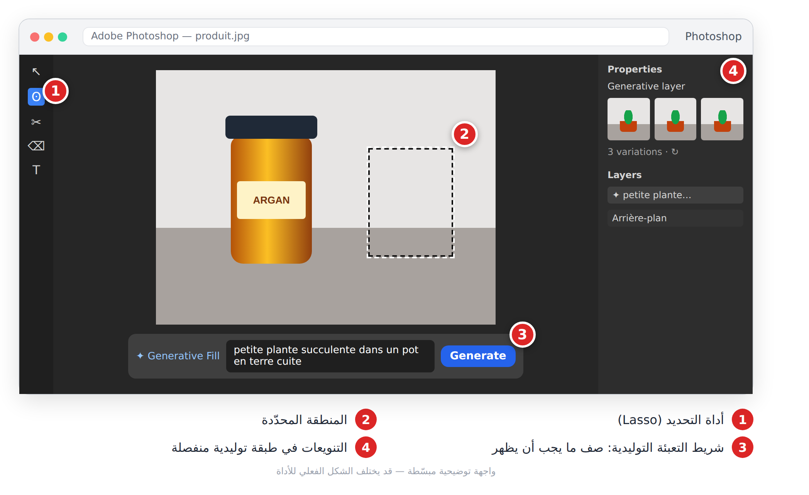
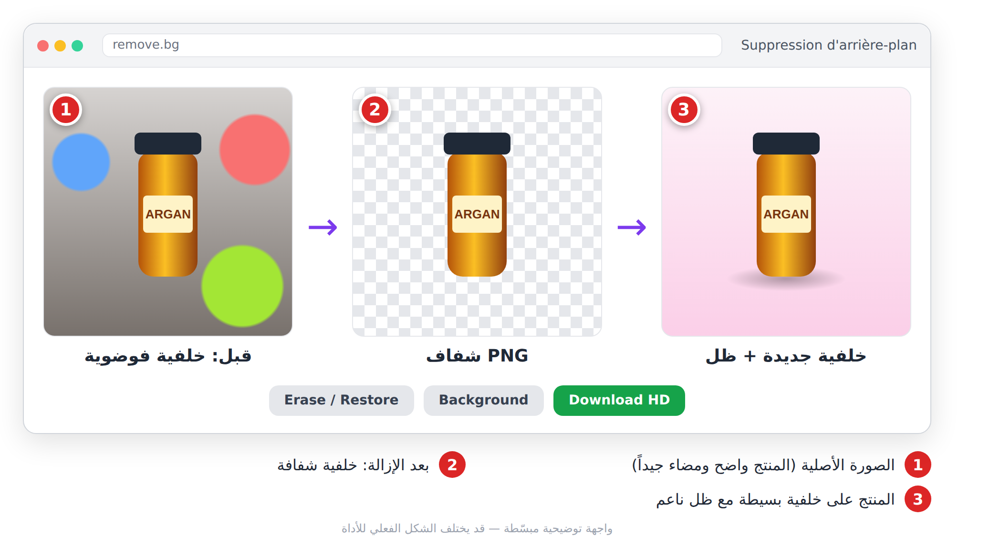
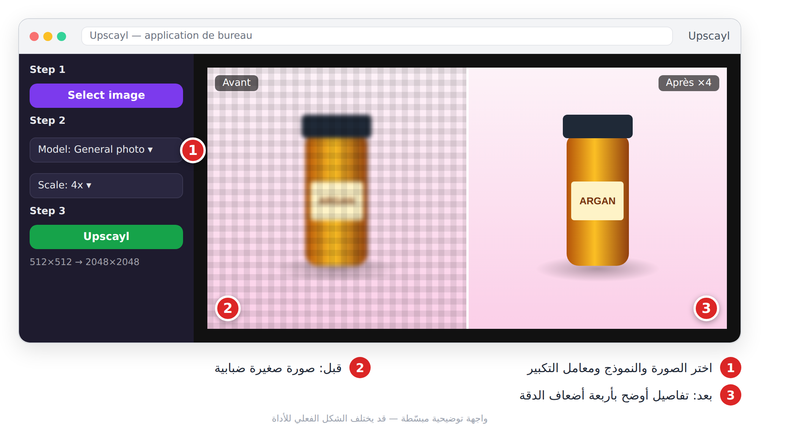

# الفصل 9: تعديل الصور والتصميم (**Retouche et design**)

## 🎯 ماذا ستتعلم في هذا الفصل

- أدوات Canva الذكية (**Magic Studio**) لتصميم منشور في دقائق.
- التعبئة التوليدية في Photoshop (**Remplissage génératif — Generative Fill**).
- إزالة الخلفية (**Suppression d'arrière-plan**) وتكبير الصور (**Upscaling**).
- مشروع: تحويل صورة هاتف إلى صورة منتج احترافية.

أغلب أصحاب المتاجر وصنّاع المحتوى عندهم صور حقيقية يريدون **تحسينها** لا استبدالها: حذف شخص مرّ في الخلفية، تغيير خلفية فوضوية، تكبير صورة صغيرة.



*الشكل 9-1: مسار التعديل: صورة خام ← إزالة الخلفية ← خلفية جديدة ← تكبير ← تصميم ← تصدير.*

---

## 9-1 Canva (Magic Studio)

**ما هي:** منصة تصميم على الإنترنت بآلاف القوالب، أضافت أدوات ذكية تحت اسم Magic Studio. تصلح لكل من لا يتقن Photoshop. النسخة المجانية واسعة، وبعض الأدوات (مثل إزالة الخلفية وتغيير المقاس) في Canva Pro.

**الخطوات:**
1. ادخل إلى canva.com وأنشئ تصميماً (منشور Instagram مثلاً) أو اطلبه من **Magic Design** بوصف.
2. ارفع صورتك، اضغط عليها ثم **Edit** لترى الأدوات الذكية.
3. استعمل **Magic Edit** (تحدّد منطقة وتصف ما تريد مكانها) أو **Magic Eraser** (تمسح عنصراً).
4. حوّل التصميم إلى مقاسات أخرى بـ **Resize** (من ميزات Canva Pro غالباً).
5. اضغط **Share** ثم **Download** واختر PNG أو PDF أو MP4.



*الشكل 9-2: Canva — منشور افتتاح مخبزة مع أدوات Magic Studio.*

**برومبتات جاهزة:**

لأداة التصميم السحري (**Magic Design**):

```
Publication Instagram pour annoncer l'ouverture d'une boulangerie artisanale à Oran,
style chaleureux et rustique, couleurs crème et marron, titre : « Ouverture samedi ! »
```
🇬🇧 بالإنجليزية:
```
Instagram post announcing the opening of an artisan bakery in Oran,
warm rustic style, cream and brown colors, title: "Opening Saturday!"
```

لأداة **Magic Edit** (بعد تحديد المنطقة):

```
Un bouquet de fleurs blanches dans un vase en céramique, même lumière que la photo
```
🇬🇧 بالإنجليزية:
```
A bouquet of white flowers in a ceramic vase, same lighting as the photo
```

> 💡 **نصيحة:** أنشئ **Brand Kit** بألوانك وخطوطك وشعارك، واكتب النص العربي بخط عربي واضح وتأكّد من اتجاهه من اليمين إلى اليسار.

---

## 9-2 Photoshop: التعبئة التوليدية

**ما هي:** تحدّد منطقة في الصورة، وتكتب ما تريد فيها (أو تتركها فارغة للحذف)، فيولّد Photoshop محتوى منسجماً مع الإضاءة والمنظور، بنماذج Firefly (وقد تتيح بعض الإصدارات نماذج شركاء أيضاً؛ نماذج Firefly الخاصة بـ Adobe هي التي تقدّمها Adobe للاستعمال التجاري). Photoshop مدفوع، والميزات التوليدية تستهلك أرصدة شهرية.

**الخطوات:**
1. افتح الصورة من قائمة **File** ثم **Open**.
2. حدّد المنطقة بأداة **Lasso**.
3. اضغط **Generative Fill** في الشريط العائم، واكتب وصفاً قصيراً، ثم **Generate**.
4. اختر من التنويعات الثلاث؛ النتيجة في **طبقة توليدية** (**Calque génératif**) منفصلة.
5. لتوسيع الصورة: أداة القص (Crop)، وسّع اللوحة، ثم **Generative Expand**.



*الشكل 9-3: Photoshop — إضافة نبتة بجانب منتج بالتعبئة التوليدية.*

صف **ما يجب أن يظهر فقط**، لا الصورة كلها، ولا تكتب «ajoute»:

```
petite plante succulente dans un pot en terre cuite
```
🇬🇧 بالإنجليزية:
```
small succulent plant in a terracotta pot
```

```
plage de sable fin au coucher du soleil, arrière-plan flou
```
🇬🇧 بالإنجليزية:
```
fine sand beach at sunset, blurred background
```

> ⚠️ **تحذير:** لا تغيّر شكل المنتج نفسه في صور البيع؛ الزبون يجب أن يستلم ما رآه.

---

## 9-3 إزالة الخلفية

**ما هي:** فصل المنتج أو الشخص عن الخلفية للحصول على صورة **شفافة** (**Fond transparent**) بصيغة PNG. أدوات: remove.bg، Photoroom (للمنتجات)، Canva، Adobe Express، والهاتف نفسه (لمسة مطوّلة على الموضوع).

**الخطوات:**
1. صوّر المنتج على خلفية بسيطة ومتباينة، بإضاءة ناعمة.
2. ارفع الصورة إلى remove.bg (أو الصقها).
3. صحّح الحواف بـ **Erase / Restore** إن لزم.
4. أضف خلفية (لوناً أو صورة)، ثم حمّل. في remove.bg التحميل المجاني بدقة منخفضة، والدقة الكاملة (HD) بأرصدة.



*الشكل 9-4: إزالة الخلفية في ثلاث مراحل.*

لأدوات الخلفيات المولّدة (Photoroom، Canva، Firefly):

```
Fond de studio dégradé beige avec une ombre douce au sol, style photo produit minimaliste
```
🇬🇧 بالإنجليزية:
```
Beige gradient studio background with a soft floor shadow, minimalist product photography
```

> 💡 **نصيحة:** احفظ بصيغة **PNG** للحفاظ على الشفافية، وأضف ظلاً خفيفاً حتى لا يبدو المنتج «طائراً».

---

## 9-4 تكبير الصور

**ما هو:** زيادة دقة الصورة (×2 أو ×4) مع «اختراع» التفاصيل المفقودة بذكاء بدل التمطيط الضبابي. **Upscayl** برنامج مجاني مفتوح المصدر يعمل على جهازك دون إنترنت؛ و**Topaz** برامج مدفوعة احترافية.

**الخطوات (Upscayl):**
1. حمّل Upscayl من موقعه الرسمي وثبّته.
2. **Select image**، ثم اختر النموذج (صور فوتوغرافية أو رسوم).
3. اختر المعامل: ×2 للويب، ×4 للطباعة.
4. اضغط **Upscayl** وقارن قبل/بعد.



*الشكل 9-5: تكبير صورة منتج ×4. انتبه: الحروف الواضحة «بعد» أعاد المكبّر بناءها، فتحقّق منها قبل النشر.*

> ⚠️ **تحذير:** المكبّر قد يخترع حروفاً أو ملامح غير موجودة. قارن دائماً بتكبير 100%، ولا تقدّم صورة قديمة «محسّنة» كوثيقة دقيقة.

---

## 9-5 🛍️ مشروع: صورة منتج من الهاتف إلى المتجر

1. صوّر المنتج بالهاتف قرب نافذة، على ورقة بيضاء.
2. أزل الخلفية في remove.bg، واحفظ PNG.
3. ولّد خلفية بسيطة بلون علامتك (Canva أو Firefly) وضع المنتج عليها مع ظل.
4. كبّر الصورة ×2 بـ Upscayl.
5. في Canva أضف السعر والشعار، ثم **Resize** (Pro) إلى منشور وقصة، أو أنشئ التصميمين يدوياً بالمجاني.

---

## 📝 الخلاصة

- Canva للتصميم السريع بقوالب وأدوات Magic Studio.
- Photoshop للتعديل الدقيق: حدّد، صف ما يظهر، اختر التنويع.
- إزالة الخلفية تبدأ بصورة جيدة، وتنتهي بـ PNG وظل خفيف.
- التكبير آخر خطوة قبل التصميم، مع مراجعة التفاصيل المخترعة.

## 🛠️ تمرين

خذ صورة منتج من بيتك (كوب، عطر، حذاء) وطبّق مسار المشروع كاملاً. ضع الصورة الأصلية والنهائية جنباً إلى جنب، واكتب ثلاث ملاحظات: ما الذي تحسّن؟ وما الذي تحتاج لتصحيحه يدوياً؟
