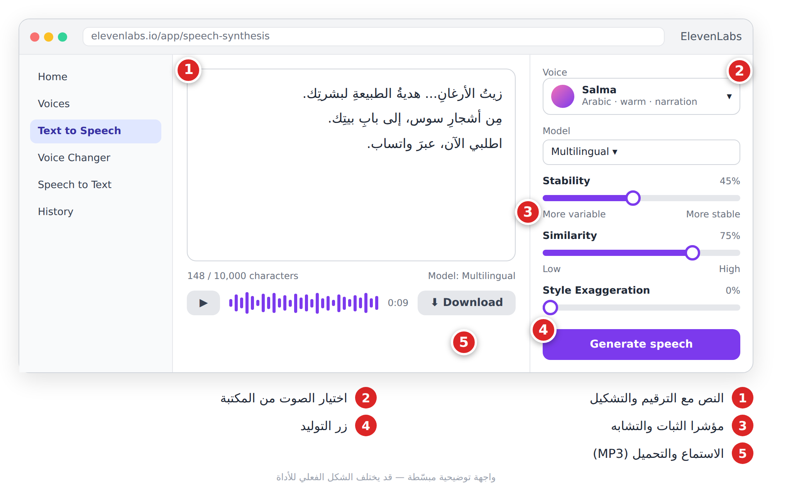
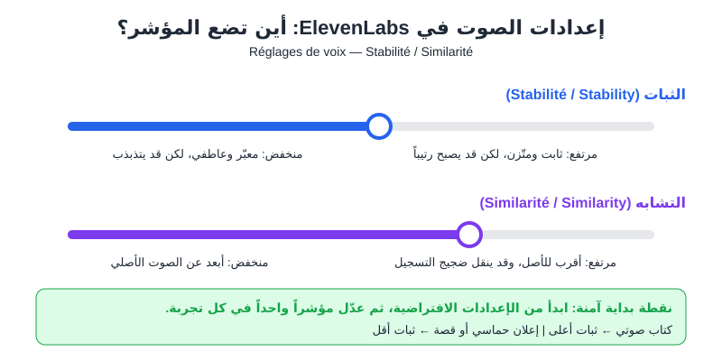
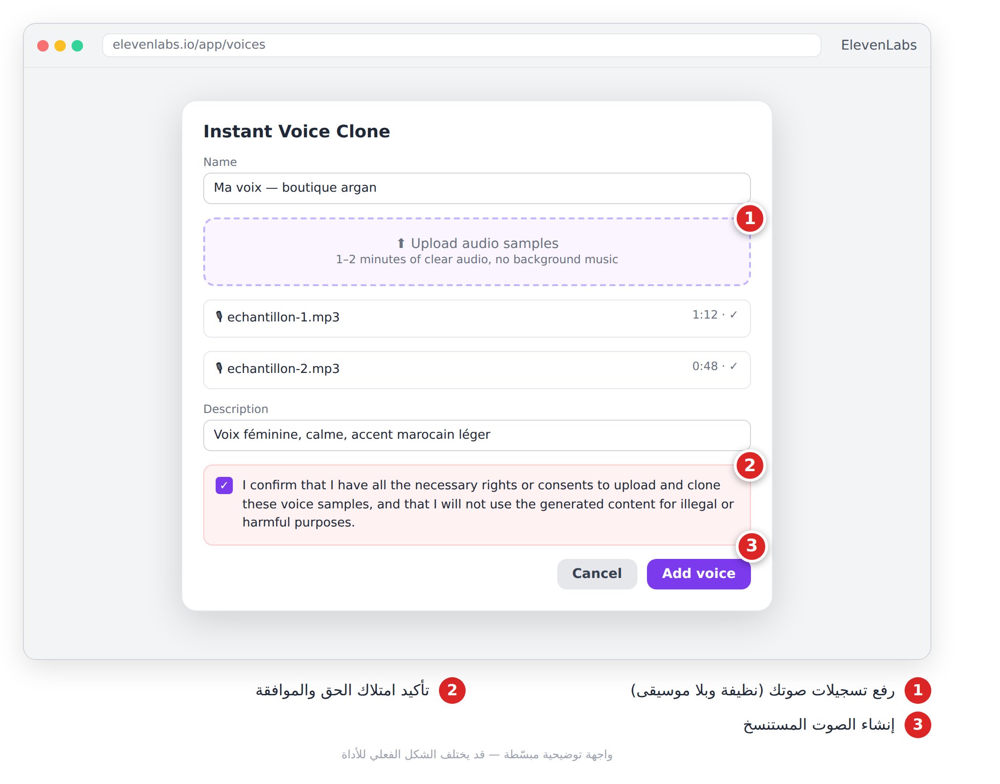
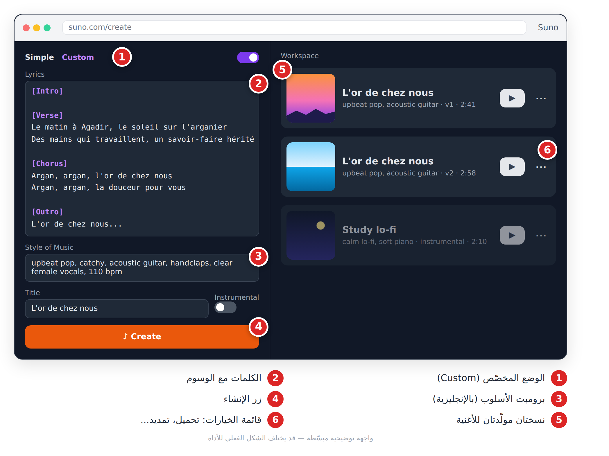
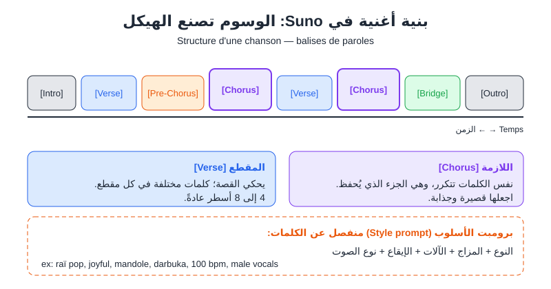
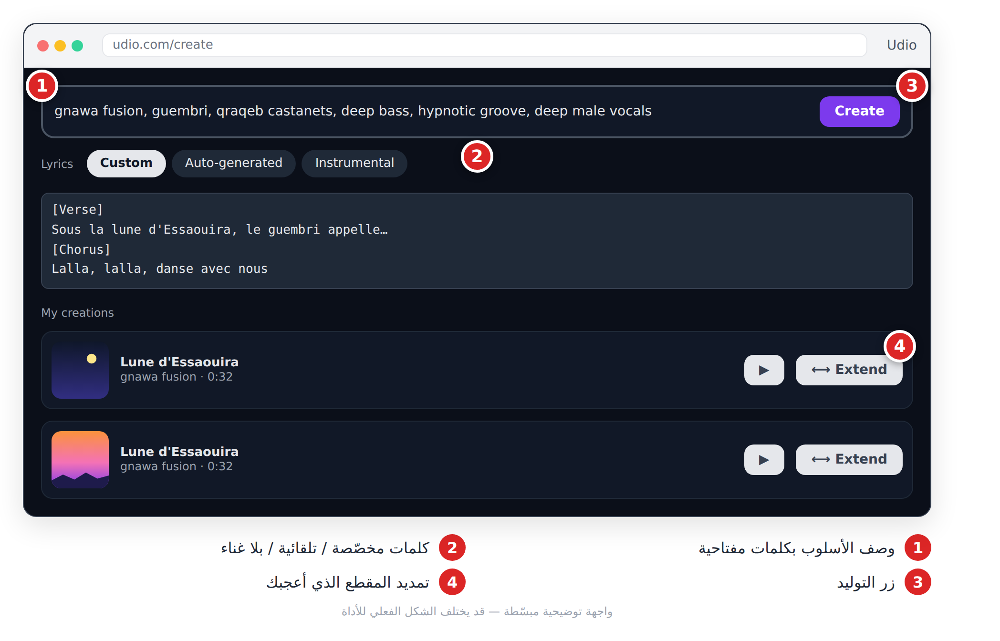
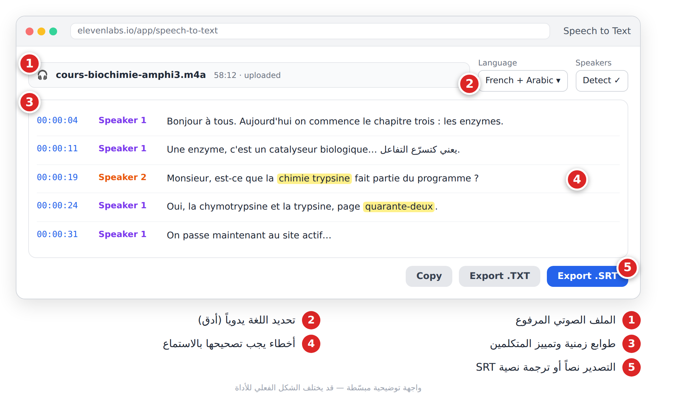

# الفصل 10: الصوت والموسيقى (**Audio et musique**)

## 🎯 ماذا ستتعلم في هذا الفصل

- تحويل النص إلى كلام (**Synthèse vocale**) مع ElevenLabs.
- استنساخ الصوت بموافقة صاحبه.
- تأليف أغنية مع Suno (وUdio).
- تحويل تسجيل إلى نص مكتوب.

| العائلة | ماذا تفعل | أمثلة |
|---|---|---|
| تحويل النص إلى كلام (**Synthèse vocale**) | تقرأ نصك بصوت بشري | ElevenLabs |
| توليد الموسيقى (**Génération musicale**) | تؤلف أغنية من وصف وكلمات | Suno، Udio |
| تحويل الكلام إلى نص (**Transcription**) | تكتب ما قيل في تسجيل | Whisper وأدوات مبنية عليه |

> 💡 **نصيحة:** المشاهد يتسامح مع صورة متوسطة، لكنه يغادر بسرعة إذا كان الصوت مزعجاً.

---

## 10-1 ElevenLabs: التعليق الصوتي

**ما هي:** منصة تحوّل النص إلى كلام بأصوات طبيعية جداً، بلغات كثيرة منها العربية والفرنسية. تصلح للتعليق الصوتي (**Voix off**) في الفيديوهات والإعلانات والكتب الصوتية. فيها خطة مجانية برصيد حروف محدود؛ راجع شروط الاستعمال التجاري قبل أي إعلان.

**الخطوات:**

1. أنشئ حساباً وافتح **Text to Speech**.
2. اختر صوتاً من المكتبة (صفِّ حسب اللغة واستمع للعيّنة).
3. الصق النص، واختر نموذجاً متعدد اللغات (**Multilingue**) للعربية.
4. اضبط الثبات والتشابه، ثم اضغط **Generate**.
5. استمع، ثم حمّل ملف MP3 وأدخله في برنامج المونتاج.



*الشكل 10-1: النص، اختيار الصوت، مؤشرا الثبات والتشابه، ثم التوليد والتحميل.*

### الثبات والتشابه



*الشكل 10-2: مؤشرا الثبات (Stabilité) والتشابه (Similarité) وتأثير كل اتجاه.*

- **الثبات (Stabilité) مرتفع:** نبرة متّزنة، مناسبة للدروس، لكنها قد تصبح رتيبة. **منخفض:** صوت معبّر، لكنه قد يتذبذب.
- **التشابه (Similarité) مرتفع:** قريب جداً من الصوت الأصلي، وقد ينقل ضجيج التسجيل أيضاً.

| المحتوى | الثبات | التشابه |
|---|---|---|
| درس أو كتاب صوتي | مرتفع | متوسط إلى مرتفع |
| إعلان حماسي | منخفض إلى متوسط | متوسط |
| قصة أطفال | منخفض | متوسط |

### برومبتات جاهزة (لتحضير النص في ChatGPT أو Claude)

```
Écris un script de voix off de 30 secondes pour une publicité TikTok d'une boutique d'huile d'argan bio à Agadir. Ton chaleureux, phrases courtes, ponctuation claire pour les pauses. Termine par : « Commandez sur WhatsApp ».
```

```
Réécris ce texte pour qu'il soit lu par une voix de synthèse : phrases courtes, pas d'abréviations, chiffres écrits en lettres, virgules pour les respirations. Texte : [colle ton texte]
```

```
Ajoute les voyelles (tashkil) uniquement sur les mots arabes ambigus de ce texte, pour améliorer la prononciation d'une voix de synthèse. Texte : [colle ton texte]
```

> 💡 **نصيحة:** الترقيم يصنع الوقفات، والتشكيل يصحّح النطق. «زيتُ الأرغانِ... هديةُ الطبيعةِ لبشرتِك.» أفضل بكثير من نص طويل بلا فواصل. وولّد النص الطويل فقرة فقرة لتعيد ما أخطأ فيه فقط.

### استنساخ الصوت مع الموافقة

استنساخ الصوت (**Clonage de voix**) يعني رفع تسجيل لصوت شخص لتصنع نسخة رقمية منه تقرأ أي نص. الاستنساخ السريع يكفيه دقيقة أو دقيقتان من التسجيل لكنه يتطلب غالباً اشتراكاً مدفوعاً، والاحترافي يحتاج تسجيلاً أطول وخطة أعلى. راجع الخطط الحالية.

1. سجّل صوتك في غرفة هادئة (الخزانة تمتص الصدى)، بنفس الميكروفون ونفس المسافة.
2. اقرأ نصوصاً متنوعة بنبرتك الطبيعية، بلا موسيقى.
3. ارفع العيّنات، و**أكّد أنك تملك الحق والموافقة**.
4. جرّب الصوت على نص قصير ثم عدّل الإعدادات.



*الشكل 10-3: رفع العيّنات، ثم تأكيد امتلاك الحق والموافقة قبل إنشاء الصوت.*

> ⚠️ **تحذير:** لا تستنسخ صوت أي شخص (مشهور، قريب، زميل) دون موافقته **الصريحة والمكتوبة** التي تحدد الاستعمال والمدة. المحتالون يستعملون أصواتاً مستنسخة لطلب المال من العائلات. اتفق مع عائلتك على «كلمة سر» للتحقق عند أي اتصال مريب.

---

## 10-2 Suno: أغنية كاملة من وصف

**ما هي:** أداة تصنع أغنية كاملة (لحن، آلات، غناء) من كلماتك ووصف للأسلوب، وتعطيك عادةً نسختين. تصلح لجينغل (**Jingle**) متجر، أغنية تعليمية، أو هدية عيد ميلاد. 

> ⚠️ **الحقوق والتحميل:** شروط Suno تغيّرت مؤخراً. الخطة المجانية غالباً للاستعمال الشخصي فقط، وقد يُقيَّد التحميل فيها؛ والاستعمال التجاري (جينغل لمتجر، إعلان، فيديو مُموَّل) يحتاج خطة مدفوعة **وقت التوليد**. راجع الشروط الحالية قبل أي مشروع لزبون.

**الخطوات:**

1. افتح **Create** وفعّل الوضع المخصّص (**Custom**).
2. اكتب الكلمات مع الوسوم في خانة **Lyrics**.
3. اكتب برومبت الأسلوب في خانة **Style** (بالإنجليزية، كلمات مفتاحية).
4. اضغط **Create**، استمع للنسختين، وحمّل الأفضل من قائمة الخيارات (⋯).



*الشكل 10-4: الكلمات بالوسوم، برومبت الأسلوب، ثم النسختان المولّدتان.*



*الشكل 10-5: بنية الأغنية بالوسوم، وبرومبت الأسلوب المنفصل.*

**الوسوم (Balises):** `[Intro]` مقدمة، `[Verse]` مقطع يحكي القصة، `[Chorus]` لازمة (**Refrain**) تتكرر بنفس الكلمات، `[Bridge]` جسر، `[Outro]` خاتمة.

**صيغة برومبت الأسلوب:** النوع + المزاج + الآلات + الإيقاع + نوع الصوت.

### برومبتات جاهزة

جينغل متجر:

🇬🇧 بالإنجليزية:
```
upbeat pop, catchy, acoustic guitar, handclaps, clear female vocals, 110 bpm, advertising jingle
```

أغنية بطابع مغاربي:

🇬🇧 بالإنجليزية:
```
modern raï pop, joyful, mandole, darbuka, synth, warm male vocals, 100 bpm
```

موسيقى خلفية بلا غناء (فعّل Instrumental):

🇬🇧 بالإنجليزية:
```
calm lo-fi, soft piano, light drums, chill study vibe, instrumental
```

كلمات الأغنية (في ChatGPT أو Claude):

```
Écris les paroles d'une chanson d'anniversaire en darija marocaine pour ma sœur Amal. Structure : [Verse], [Chorus], [Verse], [Chorus], [Bridge], [Chorus]. Refrain court, 4 lignes maximum par section.
```

> ⚠️ **تحذير:** لا تخلط الأسلوب بالكلمات (وإلا غنّى النموذج «pop, 110 bpm»)، ولا تكتب اسم فنان حقيقي؛ صِف الأسلوب بدلاً منه.

> 💡 **نصيحة:** لازمة قصيرة (2–4 أسطر) وأسطر متقاربة الطول. وولّد عدة نسخ، فالأولى نادراً ما تكون الأفضل.

---

## 10-3 Udio: البديل

**ما هي:** أداة أخرى لتوليد الأغاني بنفس المنطق: وصف للأسلوب + كلمات (مخصّصة أو تلقائية أو بلا غناء)، مع توليد مقطع قصير ثم **تمديده** (Extend).

> ⚠️ **تنبيه:** تغيّرت شروط Udio مؤخراً بعد اتفاق مع شركات تسجيلات، وقد لا يسمح الآن بتحميل الأغاني أو باستعمالها خارج المنصة. تحقّق من صفحته الرسمية قبل الاعتماد عليه، واعتبره أداة للتجربة.

1. اكتب وصف الأسلوب.
2. اختر نوع الكلمات والصقها بالوسوم نفسها.
3. ولّد، ثم مدّد المقطع الذي أعجبك.



*الشكل 10-6: وصف الأسلوب، خيارات الكلمات، ثم تمديد المقطع.*

🇬🇧 بالإنجليزية:
```
gnawa fusion, guembri, qraqeb castanets, deep bass, hypnotic groove, deep male vocals
```

> 💡 **نصيحة:** جرّب نفس الكلمات ونفس الأسلوب في أكثر من أداة وقارن؛ الأفضل يتغير كل بضعة أشهر، وكذلك الشروط.

---

## 10-4 تحويل الكلام إلى نص

**Whisper** نموذج للتعرف على الكلام (**Reconnaissance vocale**) نشرته OpenAI كنموذج مفتوح، ويفهم العربية والفرنسية. كثير من الأدوات مبنية عليه أو على نماذج مشابهة: الإدخال الصوتي في ChatGPT، الترجمة التلقائية (**Sous-titres automatiques**) في CapCut، أو Speech to Text في ElevenLabs. ويمكن للمتقدمين تشغيله على حواسيبهم، فلا يغادر الملف الجهاز.

**تفريغ محاضرة:**

1. سجّل والهاتف قريب من المتكلم.
2. ارفع الملف في أداة تفريغ.
3. حدّد اللغة يدوياً إن أمكن (أدق في المحاضرات المختلطة).
4. صدّر النص (TXT) أو ملف الترجمة النصية (**Sous-titres**، صيغة SRT)، ثم نظّمه بأداة محادثة.



*الشكل 10-7: نص مفرّغ بطوابع زمنية، مع أخطاء يجب تصحيحها بالاستماع.*

```
Voici la transcription brute d'un cours (mélange arabe et français). Corrige les erreurs évidentes, organise en titres et sous-titres, et ajoute un résumé de 10 points clés. N'ajoute aucune information absente du texte.
```

> ⚠️ **تحذير:** التفريغ الآلي يخطئ في الأسماء والأرقام والمصطلحات واللهجات. راجعها بالاستماع، واطلب إذن المتكلمين قبل تسجيلهم.

---

## 📝 الخلاصة

- ElevenLabs يحوّل النص إلى كلام طبيعي؛ الترقيم والتشكيل يحسّنان النتيجة.
- الثبات المرتفع = صوت متّزن، والمنخفض = صوت معبّر. التشابه = القرب من الصوت المرجعي.
- استنسخ صوتك أنت، أو صوت شخص وافق صراحة وكتابةً، فقط.
- في Suno (وUdio): الكلمات بالوسوم في خانة، والأسلوب بكلمات مفتاحية إنجليزية في خانة أخرى.
- Whisper والأدوات المبنية عليه تفرّغ الصوت، لكن المراجعة البشرية ضرورية.

## 🛠️ تمرين

اصنع إعلاناً صوتياً **تجريبياً** لمتجرك (للتدريب فقط؛ قبل نشره كإعلان حقيقي تحتاج خطة تسمح بالاستعمال التجاري في ElevenLabs وSuno): اكتب نص 30 ثانية بالبرومبت الأول، ولّده في ElevenLabs بثبات مرتفع ثم منخفض وقارن، ثم ولّد في Suno جينغل من 4 أسطر بالوسوم `[Intro]` `[Chorus]` `[Outro]`، واجمعهما في فيديو قصير مع إشارة أن الصوت والموسيقى مولّدان بالذكاء الاصطناعي.
