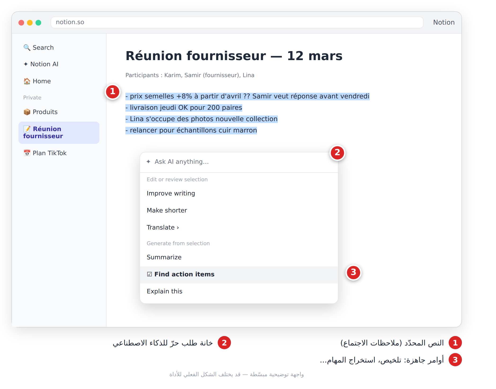
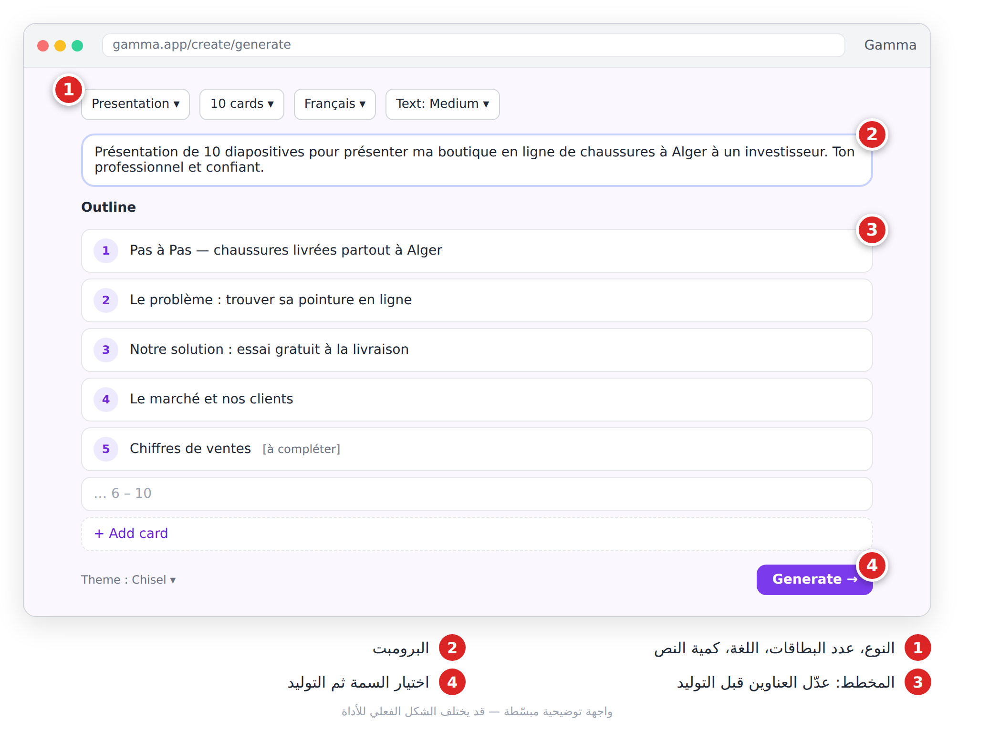
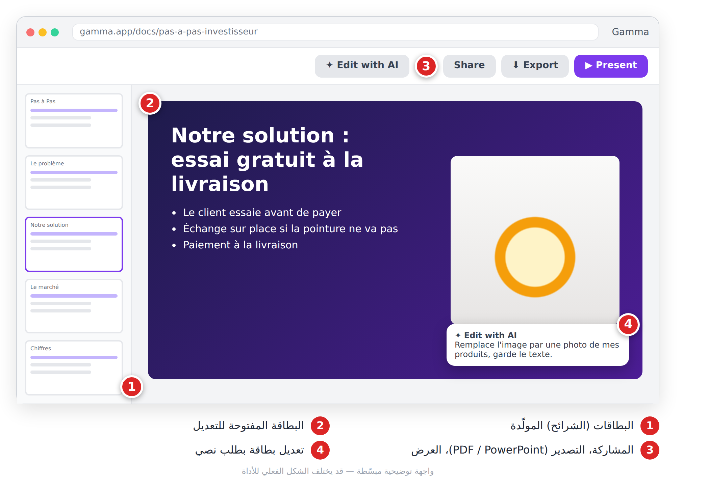
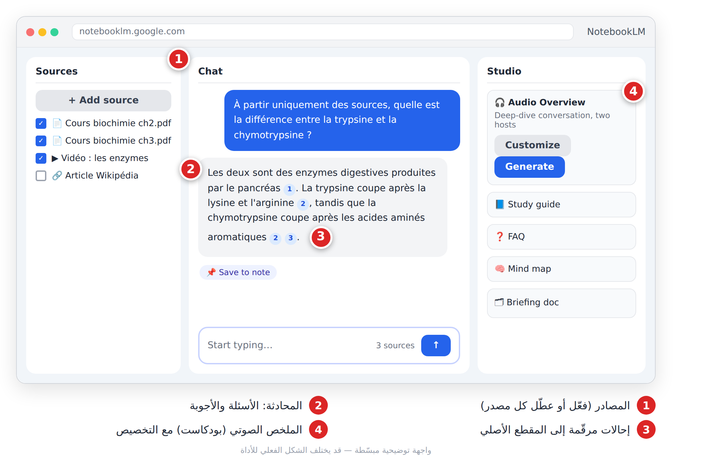
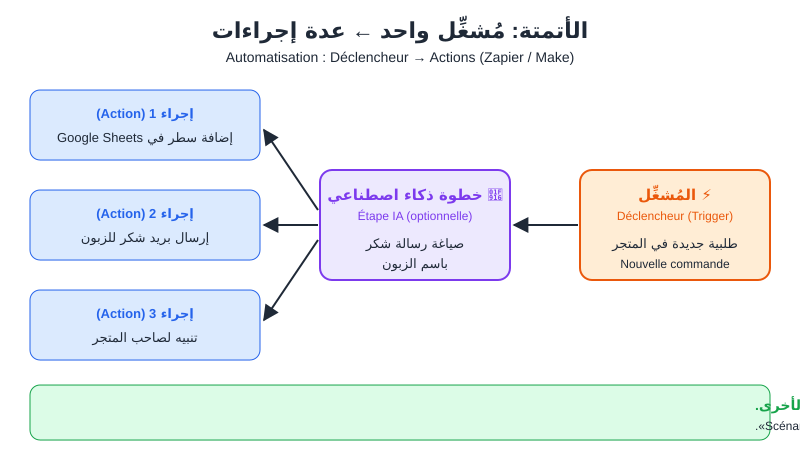
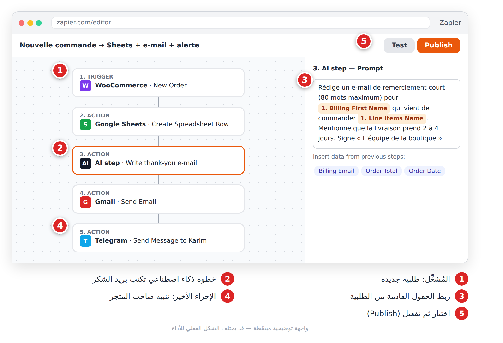

# الفصل 11: الإنتاجية والعمل

🎯 **في هذا الفصل:** كتابة وتنظيم الملاحظات مع Notion AI، عرض تقديمي في دقائق مع Gamma، مراجعة ملفاتك مع NotebookLM، وأتمتة مهام متجر صغير مع Zapier أو Make.

| النوع | الوظيفة | الأدوات |
|---|---|---|
| مساعد داخل أداة الكتابة | يكتب ويلخّص داخل مستنداتك | Notion AI، Copilot، Gemini |
| أداة توليد متخصصة | تصنع منتجاً كاملاً (عرض، بودكاست) | Gamma، NotebookLM |
| أداة أتمتة (**Automatisation**) | تربط التطبيقات وتعمل وحدها | Zapier، Make |

> 💡 **نصيحة:** ابدأ بمهمة واحدة تكرهها وتتكرر كل أسبوع. سرّعها أو أتمتها قبل أن تغيّر طريقة عملك كلها.

---

## Notion AI: مساحة العمل الذكية

**ما هي:** Notion تطبيق لتنظيم الملاحظات والمشاريع وقواعد البيانات (**Base de données**). Notion AI مساعده المدمج: يكتب، يلخّص، يترجم، ويستخرج المهام من صفحاتك. ميزاته محدودة في المجاني وأوسع في الخطط المدفوعة.

**الخطوات:**

1. أنشئ مساحة عمل (**Espace de travail**) وصفحة جديدة.
2. الصق ملاحظاتك (اجتماع، درس، أفكار).
3. حدّد النص، فتظهر قائمة الذكاء الاصطناعي.
4. اختر أمراً جاهزاً (تلخيص، استخراج المهام...) أو اكتب طلبك.
5. اقبل النتيجة أو أعد المحاولة.



*الشكل 11-1: تحديد الملاحظات ثم اختيار أمر جاهز أو كتابة طلب حرّ.*

**برومبتات جاهزة:**

```
À partir de ces notes de réunion, rédige un compte-rendu avec : participants, décisions prises, tâches (responsable + date limite) et points en suspens.
```

```
Pour chaque produit de ce tableau, rédige une description de 50 mots pour une boutique en ligne, en mettant en avant le bénéfice principal. Ton chaleureux, sans exagération.
```

> 💡 **نصيحة:** اصنع قاعدة بيانات لمنتجاتك (اسم، سعر، مخزون، صورة)، ثم اطلب من الذكاء الاصطناعي ملء خانة الوصف. ولا تضع كلمات سر أو أرقام بطاقات في أي أداة سحابية.

---

## Gamma: عرض تقديمي في دقائق

**ما هي:** أداة تصنع عروضاً تقديمية (**Présentations**) ومستندات وصفحات ويب بسيطة من فكرة أو نص. تقترح مخططاً (**Plan**) أولاً، ثم تولّد البطاقات (الشرائح) بتصميم وصور. في المجاني رصيد محدود وقد تظهر علامة Gamma.

**الخطوات:**

1. اختر الإنشاء بالذكاء الاصطناعي، ثم النوع وعدد البطاقات واللغة.
2. اكتب البرومبت.
3. **راجع المخطط:** عدّل العناوين واحذف وأضف. هذه أهم خطوة.
4. اختر السمة (**Thème**) ثم ولّد.
5. عدّل أي بطاقة بطلب نصي، ثم شارك برابط أو صدّر PDF أو PowerPoint.



*الشكل 11-2: الإعدادات، البرومبت، ثم المخطط القابل للتعديل قبل التوليد.*



*الشكل 11-3: البطاقات المولّدة، تعديل بطاقة بطلب نصي، ثم المشاركة أو التصدير.*

**صيغة البرومبت:** الموضوع + الجمهور + الهدف + عدد البطاقات + النبرة + عناصر إلزامية.

```
Présentation de 10 diapositives pour présenter ma boutique en ligne de chaussures à Alger à un investisseur. Inclure : problème, solution, marché, produits, chiffres de ventes (à compléter), concurrence, plan marketing, besoins de financement, équipe. Ton professionnel et confiant.
```

```
Transforme ce rapport en présentation de 7 diapositives. Une idée par diapositive, maximum 4 puces, un titre qui résume le message. Texte : [colle ton texte]
```

> ⚠️ **تحذير:** Gamma قد يضع أرقاماً تقديرية أو غير دقيقة. راجع كل رقم، واستبدل الصور المولّدة بصور منتجاتك الحقيقية.

---

## NotebookLM: دفتر يفهم ملفاتك

**ما هي:** أداة من Google تعمل على **مصادرك أنت** (**Sources**): ملفات PDF، مستندات، روابط، فيديوهات يوتيوب. تجيب انطلاقاً منها فقط، مع إحالات (**Citations**) إلى المقاطع الأصلية، فتقلّ «الهلوسة» (**Hallucination**). أشهر ميزاتها **الملخص الصوتي (Résumé audio)**: حوار بأسلوب بودكاست بين صوتين يناقشان مصادرك.

**الخطوات:**

1. ادخل بحساب Google وأنشئ دفتراً (**Notebook**).
2. أضف المصادر (ارفع أو الصق روابط).
3. اسأل في المحادثة، واضغط على أرقام الإحالات لترى المقطع الأصلي.
4. في لوحة **Studio**، اختر الملخص الصوتي، خصّصه، ثم ولّده.
5. استمع أو حمّله لتسمعه في الطريق.



*الشكل 11-4: المصادر، إجابة بإحالات مرقّمة، وزر الملخص الصوتي.*

```
À partir uniquement des sources, crée un guide de révision : définitions clés, 10 idées principales, et 15 questions de type examen avec leurs réponses.
```

```
Dans ce contrat, quelles sont les conditions de résiliation et les pénalités ? Cite les passages exacts. Si l'information n'existe pas, dis-le clairement.
```

تخصيص الملخص الصوتي:

```
Fais un podcast destiné à des étudiants de première année. Concentre-toi sur les chapitres 2 et 3, avec des exemples de la vie quotidienne.
```

> 💡 **نصيحة:** استمع للملخص الصوتي بعد قراءة الدرس لا قبله، فهو يبسّط وقد يُغفل تفاصيل. ولا تنشر ملخصاً لكتاب محمي.

**لمحة:** Microsoft 365 Copilot وGemini في Google Workspace يعملان بنفس الفكرة داخل Word وExcel وGmail وDocs، حسب الاشتراك.

---

## الأتمتة مع Zapier وMake

كل أتمتة = **مُشغِّل (Déclencheur / Trigger)** + **إجراءات (Actions)**: «عندما يحدث X ← افعل Y». والبيانات (الاسم، المبلغ، البريد) تنتقل بين الخطوات عبر **ربط الحقول (Mappage des champs)**.



*الشكل 11-5: طلبية جديدة تُطلق خطوة ذكاء اصطناعي ثم ثلاثة إجراءات.*

| | Zapier | Make |
|---|---|---|
| اسم المسار | Zap | سيناريو (Scénario) |
| الواجهة | خطوات عمودية بسيطة | لوحة بصرية بدوائر |
| الأنسب لـ | المبتدئ | المسارات المعقدة (فروع، شروط) |

### سيناريو: «طلبية جديدة» لمتجر كريم

الهدف: تسجيل كل طلبية في Google Sheets، بريد شكر شخصي للزبون، وتنبيه فوري لكريم.

1. **المُشغِّل:** متجرك (WooCommerce أو Shopify) ← «New Order». اختبره لتظهر الحقول.
2. **Google Sheets:** «Create Spreadsheet Row»، واربط كل عمود بحقل.
3. **خطوة ذكاء اصطناعي** تكتب بريد الشكر بالبرومبت أدناه.
4. **Gmail:** «Send Email» إلى بريد الزبون، والنص = ناتج الخطوة 3.
5. **Telegram:** رسالة لكريم: «طلبية جديدة من {{nom}} بقيمة {{montant}}».
6. اختبر كل خطوة، ثم فعّل (**Publish**).



*الشكل 11-6: المُشغِّل، خطوة الذكاء الاصطناعي مع ربط الحقول، ثم التفعيل.*

```
Rédige un e-mail de remerciement court (80 mots maximum) pour {{prénom}} qui vient de commander {{produit}}. Ton chaleureux, vouvoiement. Mentionne que la livraison prend 2 à 4 jours. Signe « L'équipe de la boutique ». Ne promets aucune réduction.
```

لتصميم سيناريو بمساعدة ChatGPT أو Claude:

```
Je gère une boutique WooCommerce. Propose un scénario Make pour : enregistrer chaque commande dans Google Sheets, envoyer un e-mail de remerciement, et m'alerter sur Telegram si la commande dépasse 10 000 DA. Donne les modules dans l'ordre et les champs à mapper.
```

> ⚠️ **تحذير:** جرّب بطلبية وهمية وبريدك أنت قبل التفعيل؛ أتمتة خاطئة قد ترسل 200 بريد غريب لزبائنك في ليلة. وربط واتساب آلياً يحتاج غالباً واجهة WhatsApp Business الرسمية، فابدأ بالبريد أو Telegram.

---

## 📝 الخلاصة

- Notion AI يعمل على صفحتك: حدّد النص واختر أمراً أو اكتب طلبك.
- في Gamma، وقتك الأهم في المخطط قبل التوليد، ثم مراجعة الأرقام.
- NotebookLM يجيب من مصادرك فقط مع إحالات، ويصنع ملخصاً صوتياً.
- الأتمتة = مُشغِّل + إجراءات + ربط الحقول؛ اختبر دائماً قبل التفعيل.

## 🛠️ تمرين

ابنِ أتمتة «طلبية جديدة» في Zapier أو Make بنموذج Google Forms كمُشغِّل: سطر في Google Sheets، ثم بريد شكر مكتوب بخطوة ذكاء اصطناعي إلى بريدك أنت. أرسل 3 طلبيات تجريبية وتحقق من الجدول والرسائل.
