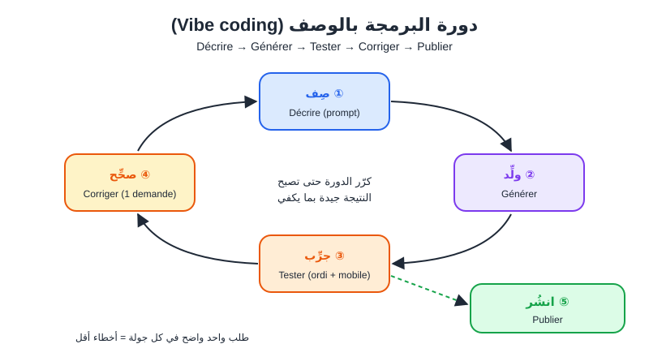
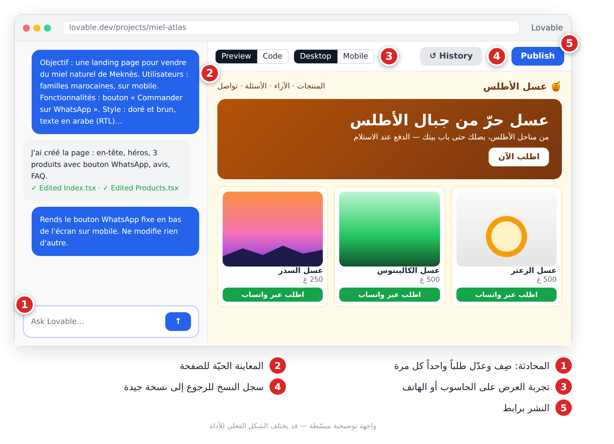
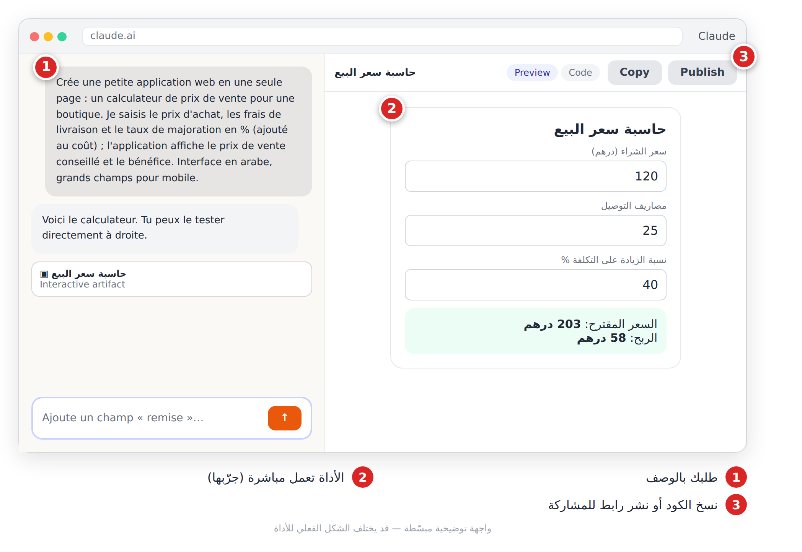
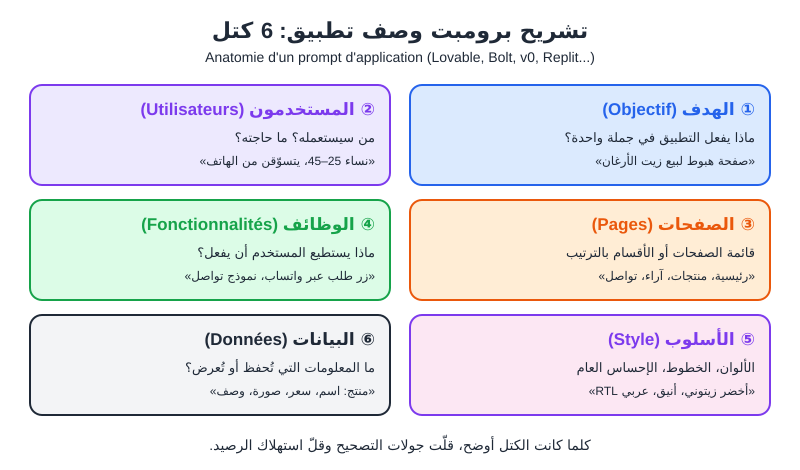
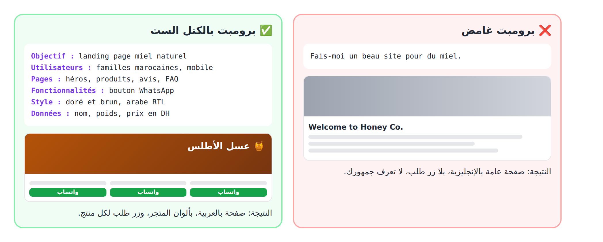

# الفصل 12: إنشاء المواقع والتطبيقات بدون برمجة (**No-code**)

## 🎯 ماذا ستتعلم في هذا الفصل

- معنى «بدون برمجة» و«البرمجة بالوصف».
- أهم الأدوات.
- قالب برومبت لوصف تطبيق.
- مشروع صفحة هبوط لمتجر.

---

## 12-1 المفهومان

- **بدون برمجة (No-code):** تبني موقعاً بسحب العناصر وإفلاتها (**Glisser-déposer**) داخل منصة، دون كود.
- **البرمجة بالوصف (Vibe coding):** تصف ما تريد بلغتك، فيكتب الذكاء الاصطناعي **كوداً حقيقياً**، وأنت تجرّب وتطلب التعديلات.



*الشكل 12-1: صِف، ولِّد، جرِّب، صحِّح، ثم انشر.*

---

## 12-2 خريطة الأدوات

| الأداة | ما هي باختصار | الأنسب لـ |
|---|---|---|
| **Lovable** | تطبيق ويب كامل من محادثة، مع قاعدة بيانات ونشر | المبتدئ الذي يريد تطبيقاً كاملاً |
| **Bolt** | بيئة تطوير في المتصفح تولّد المشروع وتعرضه | النماذج الأولية (**Prototype**) السريعة |
| **Replit Agent** | وكيل يخطط ويكتب ويجرّب وينشر داخل Replit | تطبيق بمنطق خلفي ونشر في مكان واحد |
| **v0** (Vercel) | واجهات ومواقع حديثة من وصف أو صورة | صفحات الهبوط الجميلة |
| **Claude Artifacts / ChatGPT Canvas** | المحادثة نفسها تكتب أداة صغيرة وتعرضها بجانبها | الحاسبات والاختبارات الصغيرة |
| **Framer** | منشئ مواقع بصري يولّد صفحة أولى ثم تعدّلها بيدك | المواقع التعريفية والتصميم الدقيق |

كلها فيها رصيد مجاني محدود وخطط مدفوعة، وتتغير بسرعة؛ راجع الموقع الرسمي.

### Lovable وBolt وReplit وv0: نفس الطريقة

1. اكتب البرومبت الأول (القالب أدناه) في المحادثة.
2. انتظر النسخة الأولى في المعاينة (**Aperçu**).
3. جرّبها على الحاسوب ثم على الهاتف.
4. اطلب تعديلاً واحداً في كل رسالة.
5. ارجع إلى سجل النسخ (**Historique des versions**) إذا فسد شيء.
6. انشر برابط.



*الشكل 12-2: المحادثة، المعاينة الحيّة، تبديل الحاسوب/الهاتف، سجل النسخ، والنشر.*

### Claude Artifacts وChatGPT Canvas

اطلب أداة صغيرة في المحادثة، فتظهر في مساحة جانبية تجرّبها مباشرة، ثم تنسخ الكود أو تنشر رابطاً. مناسبة للأدوات بلا قاعدة بيانات معقدة.



*الشكل 12-3: الطلب بالوصف، الحاسبة تعمل مباشرة، ثم النسخ أو النشر.*

```
Crée une petite application web en une seule page : un calculateur de prix de vente pour une boutique. Je saisis le prix d'achat, les frais de livraison et le taux de majoration en % (ajouté au coût) ; l'application affiche le prix de vente conseillé et le bénéfice. Interface en arabe, grands champs pour mobile.
```

> 💡 **نصيحة:** في Framer، ولّد الصفحة الأولى بوصف قصير، ثم عدّل التصميم بالسحب والإفلات بدل الطلبات الكثيرة.

---

## 12-3 قالب البرومبت: ست كتل + القيود

البرومبت الأول يحدد معظم النتيجة. الكتل الست أساسية، وسطر القيود (**Contraintes**) اختياري لكنه مفيد.



*الشكل 12-4: الهدف، المستخدمون، الصفحات، الوظائف، الأسلوب، البيانات.*

```
Objectif : [ce que fait l'application en une phrase]
Utilisateurs : [qui, sur quel appareil]
Pages : [sections, dans l'ordre]
Fonctionnalités : [ce que l'utilisateur peut faire]
Style : [couleurs, ambiance, langue et sens d'écriture]
Données : [informations affichées, avec leurs champs]
Contraintes : [responsive mobile, pas de compte, etc.]
```



*الشكل 12-5: الفرق بين برومبت غامض وبرومبت منظّم.*

**قواعد التعديل:**

- طلب واحد في كل رسالة، مع تحديد المكان: «في قسم الآراء، تحت العنوان...».
- صِف الخطأ كما تراه: «على الهاتف، زر الطلب لا يفتح شيئاً».
- أضف «لا تغيّر شيئاً آخر».
- إذا دارت الأداة في حلقة، ارجع لآخر نسخة جيدة وأعد الصياغة.

```
Dans la section « Nos produits », affiche les cartes en une colonne sur mobile et en trois colonnes sur ordinateur. Ne modifie rien d'autre.
```

```
Sur téléphone, quand je clique sur « Commander sur WhatsApp », rien ne se passe. Sur ordinateur, ça fonctionne. Analyse la cause probable et corrige uniquement ce problème.
```

---

## 12-4 مشروع: صفحة هبوط «عسل الأطلس»

متجر فاطمة الزهراء للعسل الحر في مكناس. استعمل Lovable أو Bolt أو v0.

**1. التحضير:** اسم المتجر وشعاره، 3–5 منتجات بأسعارها، رقم واتساب، 3 آراء حقيقية (بإذن أصحابها)، 4 أسئلة شائعة، وصور منتجاتك.

**2. البرومبت الأول:**

```
Objectif : une landing page pour vendre du miel naturel de Meknès.
Utilisateurs : familles marocaines, 25-55 ans, surtout sur téléphone.
Pages : une seule page : en-tête, héros avec slogan et bouton, nos produits, pourquoi nous choisir, avis clients, FAQ, contact.
Fonctionnalités : chaque produit a un bouton « Commander sur WhatsApp » avec un message prérempli contenant le nom du produit.
Style : doré et brun, chaleureux, texte en arabe aligné à droite (RTL).
Données : 3 produits avec nom, poids, prix en DH, photo et courte description.
Contraintes : mobile en priorité, chargement rapide, pas de compte utilisateur.
```

**3. التحسين جولة بجولة:** استبدل الصور التجريبية بصورك، اجعل زر الطلب ثابتاً أسفل الشاشة في الهاتف، أضف شارة «الدفع عند الاستلام»، ثم:

```
Avant publication, vérifie la page : textes arabes alignés à droite, boutons fonctionnels, images avec texte alternatif, contraste suffisant, affichage sur petit écran. Liste les problèmes avant de corriger.
```

**4. اختبار واتساب** من هاتفك الحقيقي.

> ⚠️ **تحذير:** اكتب الرقم بالصيغة الدولية (212 للمغرب، 213 للجزائر، 216 لتونس، دون الصفر الأول). خطأ رقم واحد يعني ضياع كل الطلبيات. ولا تكتب ادعاءات صحية غير مثبتة عن العسل.

**5. النشر والقياس:** انشر برابط مجاني، ضعه في حساباتك، واطلب من 5 أشخاص تجربته من هواتفهم.

> 💡 **نصيحة:** للدفع الإلكتروني وإدارة المخزون الحقيقية، منصة متجر جاهزة أكثر أماناً. ولا تضع أبداً مفاتيح سرية أو بيانات زبائن في كود لا تفهمه.

---

## 📝 الخلاصة

- البرمجة بالوصف: تصف، والذكاء الاصطناعي يكتب الكود، وأنت تجرّب وتصحّح.
- Lovable وBolt وReplit وv0 للمواقع الكاملة، وArtifacts/Canvas للأدوات الصغيرة، وFramer للتصميم البصري.
- البرومبت الأول بست كتل: الهدف، المستخدمون، الصفحات، الوظائف، الأسلوب، البيانات، مع سطر قيود اختياري.
- طلب واحد في كل رسالة، وسجل النسخ هو شبكة الأمان.

## 🛠️ تمرين

ابنِ صفحة هبوط لمتجرك (أو متجر خيالي) بالقالب، حسّنها في 3 جولات على الأكثر، جرّب زر واتساب من هاتفك، ثم انشرها وشارك الرابط مع 5 أشخاص.
