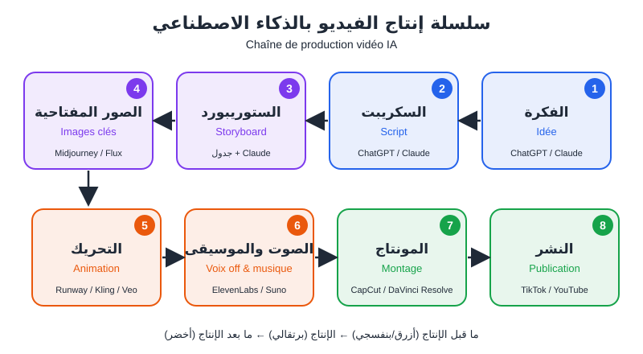
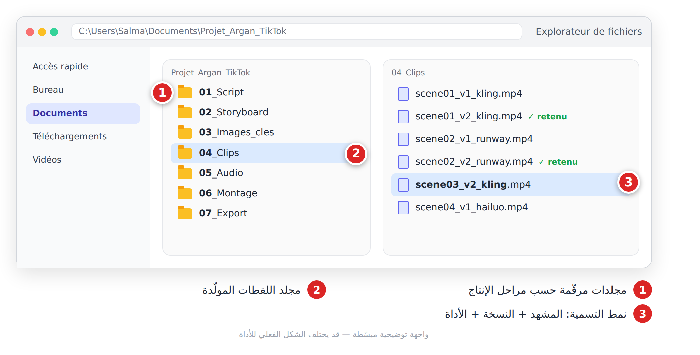
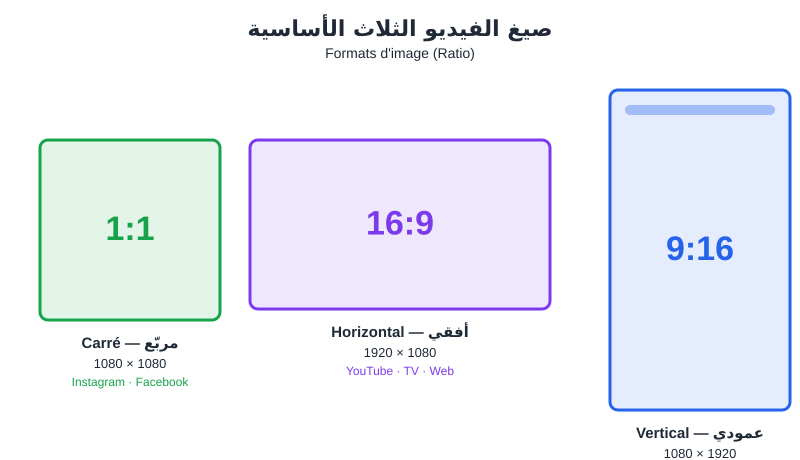
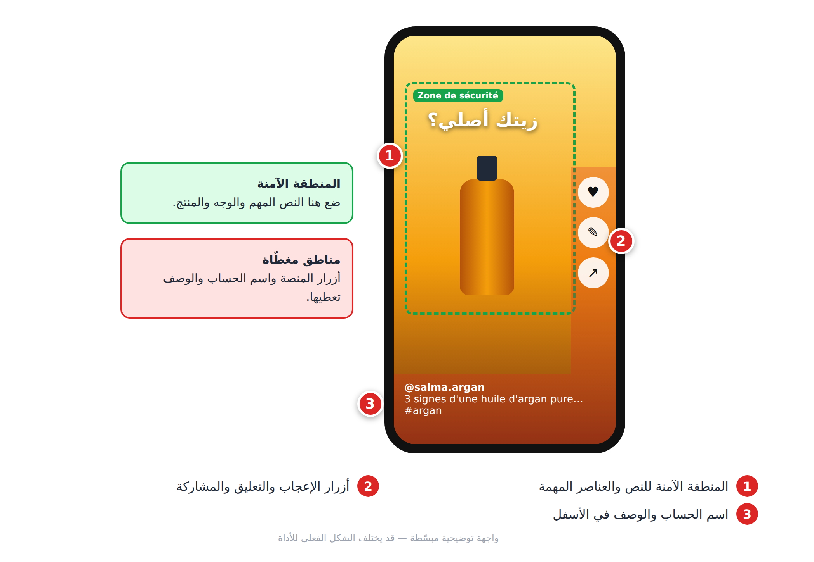
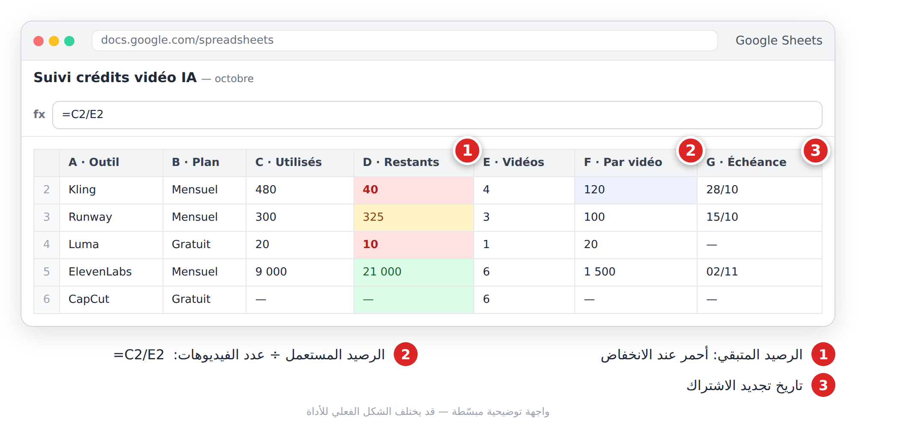

# الجزء الرابع: صناعة الفيديو بالذكاء الاصطناعي

> في الفصول من 13 إلى 19 تنتقل من فكرة في رأسك إلى فيديو جاهز للنشر: الخريطة أولاً، ثم السكريبت، ثم توليد اللقطات، ثم المتحدث الرقمي، ثم الصوت والمونتاج، وأخيراً مشاريع كاملة.

---

# الفصل 13: خريطة إنتاج الفيديو (**Carte de production vidéo**)

## 🎯 ماذا ستتعلم في هذا الفصل

- المراحل الثماني لسلسلة الإنتاج (**Chaîne de production**) وأدواتها.
- الصيغ، الدقة (**Résolution**)، وعدد الصور في الثانية (**fps**).
- تقدير الوقت والميزانية (**Budget**).

---

## 13-1 لماذا نحتاج خريطة؟

سلمى تبيع زيت الأركان في أكادير. فتحت أداة فيديو وكتبت: «فيديو إعلاني لزيت الأركان». النتيجة: خمس ثوانٍ لزجاجة تدور، بلا رسالة، وبصيغة أفقية لا تصلح لـ TikTok.

المشكلة ليست في الأداة. سلمى قفزت مباشرة إلى التحريك. الذكاء الاصطناعي لا يلغي مراحل الإنتاج، بل **يسرّع كل مرحلة**. أنت المخرج (**Réalisateur**)، والأدوات فريقك.

---

## 13-2 المراحل الثماني



*الشكل 13-1: سلسلة الإنتاج — ما قبل الإنتاج (**Pré-production**)، الإنتاج (**Production**)، ما بعد الإنتاج (**Post-production**).*

| # | المرحلة | أدوات مقترحة | المخرَج |
|---|---|---|---|
| 1 | الفكرة (**Idée**) | ChatGPT، Claude، Gemini | فكرة + جمهور + منصة |
| 2 | السكريبت (**Script**) | ChatGPT، Claude | نص منطوق + نص على الشاشة |
| 3 | الستوريبورد (**Storyboard**) | Claude، ChatGPT | جدول مشاهد بالبرومبتات |
| 4 | الصور المفتاحية (**Images clés**) | Midjourney، Flux، Ideogram | صورة لكل مشهد |
| 5 | التحريك (**Animation**) | Veo، Sora، Runway، Kling، Hailuo | لقطات من 4 إلى 10 ثوانٍ |
| 6 | الصوت (**Voix off & musique**) | ElevenLabs، Suno | ملفات صوتية |
| 7 | المونتاج (**Montage**) | CapCut، DaVinci Resolve | فيديو نهائي |
| 8 | النشر (**Publication**) | TikTok، YouTube، Instagram | فيديو منشور |

> ⚠️ **تنبيه:** شروط أدوات الموسيقى والصوت (التحميل، الاستعمال التجاري) تغيّرت مؤخراً؛ تحقّق من صفحتها الرسمية قبل الاعتماد عليها (انظر الفصل 10).

> 💡 **نصيحة:** المرحلة 4 هي سرّ التناسق. تولّد صورة لكل مشهد ثم تحرّكها: هذه طريقة «صورة إلى فيديو» (**Image-vers-vidéo**). تعديل صورة يكلّف ثواني، وإعادة توليد فيديو تكلّف دقائق ورصيداً (**Crédits**).

برومبت لتوليد الأفكار (المرحلة 1):

```text
Tu es un stratège de contenu vidéo. Je vends de l'huile d'argan bio en ligne depuis Agadir.
Public : femmes de 25 à 40 ans, intéressées par les soins naturels.
Propose 10 idées de vidéos TikTok de moins de 45 secondes.
Pour chaque idée : titre, angle (éducatif / émotionnel / humoristique) et accroche des 3 premières secondes. Présente en tableau.
```

### نظّم ملفاتك من اليوم الأول

أنشئ مجلداً مرقّماً لكل مرحلة، وسمِّ كل لقطة: رقم المشهد + رقم النسخة + الأداة.



*الشكل 13-2: هيكل مجلدات مرقّم ونمط تسمية `scene03_v2_kling.mp4`.*

---

## 13-3 الصيغ: 9:16 و16:9 و1:1

اختر الصيغة (**Ratio**) **قبل** توليد أي صورة. تغييرها لاحقاً يعني قصّ الصورة أو إعادة التوليد.



*الشكل 13-3: الصيغ الثلاث الأساسية ومنصاتها.*

| الصيغة | الدقة الشائعة | المنصات |
|---|---|---|
| **9:16** عمودي | 1080×1920 | TikTok، Reels، Shorts، Stories |
| **16:9** أفقي | 1920×1080 | YouTube، المواقع، العروض |
| **1:1** مربّع | 1080×1080 | منشورات وإعلانات Instagram وFacebook |

**كيف تحددها؟** في Midjourney بالمعامل `--ar 9:16`. في أدوات الفيديو من قائمة **Aspect ratio** قرب خانة البرومبت. وفي **Image-vers-vidéo** تأخذ الأداة غالباً نسبة الصورة المرفوعة، فولّد الصورة بالنسبة الصحيحة من البداية.



*الشكل 13-4: المنطقة الآمنة (**Zone de sécurité**) في فيديو 9:16.*

> ⚠️ **تحذير:** في الفيديو العمودي، أزرار المنصة (الإعجاب، التعليق، الوصف) تغطي الأسفل والجانب الأيمن. لا تضع فيهما نصاً مهماً.

---

## 13-4 المدة والدقة وfps

| الإعداد | القيمة الموصى بها | ملاحظة |
|---|---|---|
| المدة | 15–45 ثانية للفيديو القصير | لقطات من 4–10 ثوانٍ: 30 ثانية ≈ 5–8 لقطات |
| الدقة | **1080p** للنشر | 720p للمسودات لتوفير الرصيد |
| fps | **24** سينمائي، **30** للشبكات | اختر قيمة واحدة للمشروع كله |
| التصدير | **MP4 / H.264 / AAC** | استعمل الإعدادات المسبقة لكل منصة |

---

## 13-5 الوقت والميزانية

**تقدير الوقت لفيديو 30 ثانية (6 مشاهد):**

| المرحلة | مبتدئ | بعد تمرّن |
|---|---|---|
| الفكرة + السكريبت + الستوريبورد | ساعة وربع | 25 دقيقة |
| الصور المفتاحية (3–4 محاولات/مشهد) | ساعة ونصف | 30 دقيقة |
| التحريك (3–4 محاولات/مشهد) | ساعتان | 45 دقيقة |
| الصوت + المونتاج + النشر | ساعتان وربع | 55 دقيقة |
| **المجموع** | **≈ 7 ساعات** | **≈ ساعتان ونصف** |

«بضغطة زر» كذبة تسويقية: الذكاء الاصطناعي يوفّر التصوير، لا التفكير.

**نسبة الهدر (**Taux de rebut**):** في البداية تحتفظ بلقطة واحدة من كل 3–4 توليدات. إذن: 6 مشاهد × 4 = 24 توليداً.

**الميزانية** (الأسعار تتغير، راجع الموقع الرسمي):
- **صفر تكلفة:** خطط مجانية + CapCut + DaVinci Resolve. قيود وعلامة مائية (**Filigrane**) أحياناً.
- **ميزانية صغيرة:** اشتراك شهري واحد في أداة فيديو + أداة صور.
- **احترافي:** عدة اشتراكات + صوت مدفوع + أداة أفاتار.



*الشكل 13-5: جدول بسيط لتتبع الرصيد والتكلفة لكل فيديو.*

---

## 13-6 مثال كامل: إعلان سلمى

1. **الفكرة:** TikTok 30 ثانية، 9:16، نساء 25–40، هدف البيع.
2. **السكريبت:** خطّاف «هل زيت الأركان في حمّامك أصلي؟» ← 3 علامات ← دعوة للشراء.
3. **الستوريبورد:** 6 مشاهد.
4. **الصور المفتاحية:** 6 صور بـ`--ar 9:16`، نفس الزجاجة والألوان الدافئة.
5. **التحريك:** لقطة 5 ثوانٍ لكل صورة بحركة كاميرا بسيطة.
6. **الصوت:** صوت سلمى نفسها + موسيقى مرخّصة.
7. **المونتاج:** CapCut، ترجمة نصية، 30 fps، 1080×1920.
8. **النشر:** مع وسم المحتوى المولّد بالذكاء الاصطناعي كلما بدا واقعياً (منصات كثيرة تفرضه؛ راجع سياستها الحالية).

> ⚠️ **استعمال تجاري:** إعلان لمتجر أو لزبون يحتاج خطة تسمح بالاستعمال التجاري في كل أداة تستعملها (الصور، الفيديو، الصوت، الموسيقى). راجع شروط الاستعمال التجاري في خطتك.

```text
Agis comme un producteur vidéo spécialisé en IA générative.
Projet : publicité TikTok de 30 secondes pour une huile d'argan bio (marque "Salma Argan", Agadir).
Format 9:16, 1080x1920, 30 fps. Public : femmes 25-40 ans.
Donne un plan de production en 8 étapes (Idée, Script, Storyboard, Images clés, Animation, Voix off & musique, Montage, Publication).
Pour chaque étape : outil IA recommandé, livrable, temps estimé, point de vigilance. Termine par une checklist avant publication.
```

---

## 📝 الخلاصة

- ثماني مراحل: **Idée → Script → Storyboard → Images clés → Animation → Voix off & musique → Montage → Publication**.
- **Image-vers-vidéo** (صورة مفتاحية ثم تحريك) تعطي تناسقاً وتحكماً أكبر.
- اختر الصيغة قبل أي توليد واحترم المنطقة الآمنة في 9:16.
- كل لقطة نهائية تكلّف 3–4 توليدات؛ احسب رصيدك مسبقاً.

## 🛠️ تمرين

اختر مشروعاً حقيقياً (متجر قريبك أو صفحتك). دون توليد أي فيديو: اكتب الجمهور والهدف والمنصة في 3 أسطر، حدّد الصيغة والمدة وfps، شغّل برومبت «المنتج» ببياناتك، وأنشئ المجلدات المرقّمة، ثم احسب عدد التوليدات (المشاهد × 4).
