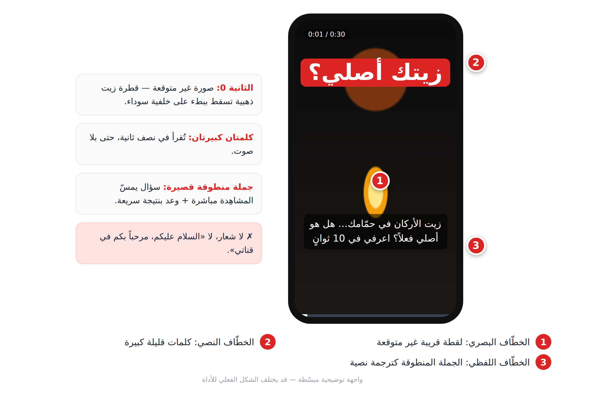
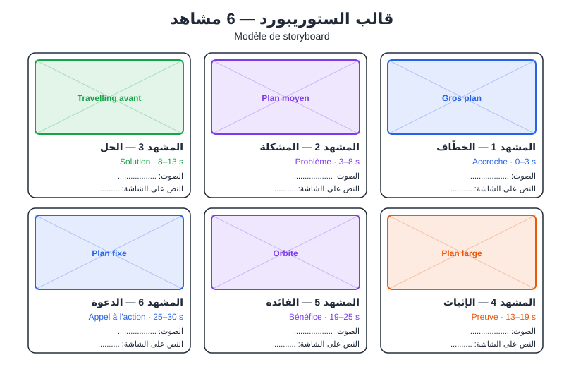
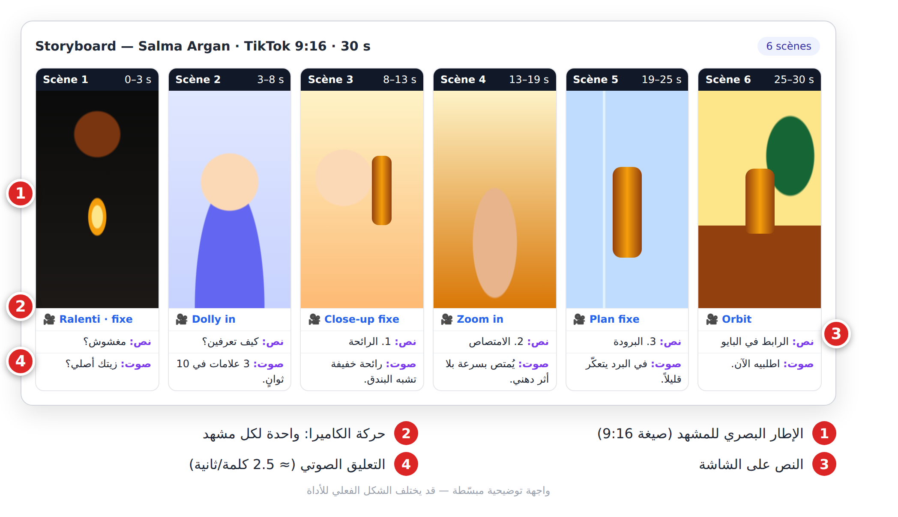
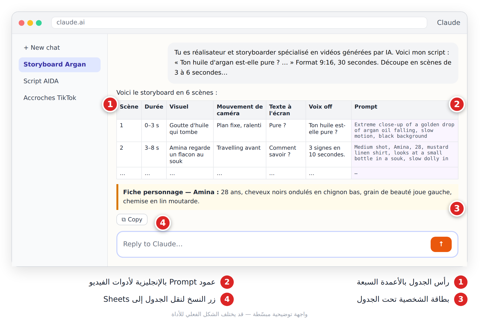

# الفصل 14: كتابة السكريبت والستوريبورد بالذكاء الاصطناعي (**Script et storyboard**)

## 🎯 ماذا ستتعلم في هذا الفصل

- كيف تكتب خطّافاً (**Accroche / Hook**) يوقف التمرير، مع 8 صيغ جاهزة.
- ثلاث بنى للسكريبت: **AIDA**، **Problème-Agitation-Solution**، **Storytelling**.
- قالب الستوريبورد (**Storyboard**) وكيف يملؤه لك Claude أو ChatGPT.

---

## 14-1 السكريبت أولاً

أدوات الفيديو تولّد **لقطات**، لا **قصصاً**. القصة تأتي منك، من السكريبت (**Script**). لقطات متوسطة مع سكريبت ممتاز غالباً ما تتفوق على لقطات مبهرة بلا رسالة.

لكل مشهد ثلاث طبقات:

| الطبقة | بالفرنسية | مثال |
|---|---|---|
| ما يُقال | **Voix off** | «ثلاث علامات تكشف الزيت المغشوش» |
| ما يُكتب على الشاشة | **Texte à l'écran** | «العلامة 1: الرائحة» |
| ما يُرى | **Visuel** | يد تقرّب زجاجة من الأنف |

**قاعدة الكلمات:** حوالي 2.5 كلمة منطوقة في الثانية. فيديو 30 ثانية ≈ 75 كلمة.

---

## 14-2 الخطّاف: الثواني الثلاث الأولى

على TikTok وReels وShorts، يقرر المشاهد خلال ثانيتين أو ثلاث: يكمل أم يمرّر (**Scroll**). الخطّاف القوي يجمع ثلاث طبقات معاً:

1. **جملة** قصيرة تثير الفضول.
2. **كلمات كبيرة على الشاشة**، لأن كثيرين يشاهدون بلا صوت.
3. **صورة غير متوقعة** من الإطار الأول: لا شعار ولا مقدمة.

> ❌ «السلام عليكم، مرحباً بكم في قناتي، اليوم سنتحدث عن...» — المشاهد غادر قبل «اليوم».
>
> ✅ (قطرة زيت ذهبية تسقط) «زيت الأركان في حمّامك... هل هو أصلي فعلاً؟ اعرفي في 10 ثوانٍ.»



*الشكل 14-1: الطبقات الثلاث للخطّاف على شاشة 9:16.*

### 8 صيغ للخطّاف

| # | الصيغة | بالفرنسية | مثال |
|---|---|---|---|
| 1 | السؤال الصادم | **Question choc** | «هل تعرف أن الشاحن المتروك في المقبس يستهلك كهرباء؟» |
| 2 | الخطأ الشائع | **Erreur fréquente** | «توقف عن غسل وجهك بالماء الساخن!» |
| 3 | الوعد بنتيجة | **Promesse de résultat** | «في 30 ثانية ستكتب سيرة ذاتية تُقرأ.» |
| 4 | القائمة المرقّمة | **Liste numérotée** | «3 أدوات توفّر عليك 10 ساعات أسبوعياً.» |
| 5 | قبل/بعد | **Avant / Après** | «غرفتي قبل... وبعد 50 درهماً فقط.» |
| 6 | الرأي المعاكس | **Contre-courant** | «الدراسة 8 ساعات يومياً فكرة سيئة.» |
| 7 | المخاطبة المباشرة | **Interpellation** | «إذا كنت طالباً وتشتغل ليلاً، هذا لك.» |
| 8 | القصة الشخصية | **Confession** | «طُردت من عملي الأول بسبب إيميل واحد.» |

```text
Tu es un expert en vidéos courtes performantes (TikTok, Reels, Shorts).
Sujet : [ton sujet]. Public : [ton public].
Écris 8 accroches pour les 3 premières secondes, une par formule : question choc, erreur fréquente,
promesse de résultat, liste numérotée, avant/après, contre-courant, interpellation, confession.
Pour chacune : phrase parlée (max 12 mots), texte à l'écran (max 5 mots), visuel d'ouverture.
Présente en tableau, puis indique les 3 plus fortes et pourquoi.
```

> 💡 **نصيحة:** لجمهور عربي أضف: `Rédige les phrases parlées en arabe dialectal marocain` (أو تونسي، جزائري...). راجع النتيجة، فاللهجات ما تزال نقطة ضعف.

---

## 14-3 ثلاث بنى للسكريبت

| البنية | الهيكل | الأنسب لـ |
|---|---|---|
| **AIDA** | انتباه (**Attention**) ← اهتمام (**Intérêt**) ← رغبة (**Désir**) ← فعل (**Action**) | بيع منتج |
| **Problème-Agitation-Solution** | مشكلة ← تأجيج (**Agitation**) ← حل ← دعوة | الخدمات والتعليم |
| **Storytelling** | وضع أولي ← حدث محفّز ← عقبات ← ذروة ← درس | العلامة والمشاعر |

**توقيت AIDA في 30 ثانية:** انتباه 0–3 ث، اهتمام 3–10 ث، رغبة 10–24 ث، دعوة للفعل (**CTA**) 24–30 ث.

**مثال Problème-Agitation-Solution** (مركز دعم في صفاقس): «ابنك يراجع ساعات ولا تتحسن نقاطه؟» ← «المشكلة في طريقة المراجعة، والفجوات تتراكم» ← «نبدأ بتشخيص مجاني» ← «احجز من الرابط».

```text
Écris un script vidéo de 30 secondes pour [produit/service] avec la structure [AIDA / Problème-Agitation-Solution / Storytelling].
Format TikTok 9:16. Ton chaleureux et direct.
Pour chaque partie : minutage, voix off (2,5 mots par seconde), texte à l'écran (max 5 mots) et description du visuel.
Voix off totale : 75 mots maximum. Un seul personnage, décrit précisément, et un seul appel à l'action.
```

> ⚠️ **تحذير:** دعوة واحدة فقط. «تابعني، علّق، شارك، اشترِ» = المشاهد لا يفعل أياً منها.

---

## 14-4 من السكريبت إلى الستوريبورد

قواعد التقطيع إلى مشاهد (**Découpage en scènes**):
1. مشهد = فكرة بصرية واحدة، من 3 إلى 6 ثوانٍ.
2. حركة كاميرا واحدة لكل مشهد.
3. غيّر نوع اللقطة (قريبة، متوسطة، واسعة) للحفاظ على الإيقاع.
4. 5 ثوانٍ ≈ 12 كلمة منطوقة كحد أقصى.



*الشكل 14-2: قالب ستوريبورد من 6 مشاهد.*

**القالب الجدولي** (سبعة أعمدة؛ هنا ستة، والبرومبتات تحت الجدول):

| المشهد | المدة | المرئي | الكاميرا | النص على الشاشة | التعليق |
|---|---|---|---|---|---|
| 1 | 0–3 ث | قطرة زيت تسقط | ثابتة، حركة بطيئة (**Ralenti**) | «مغشوش؟» | «زيتك أصلي؟» |
| 2 | 3–8 ث | أمينة تنظر بشك إلى زجاجة | تقدّم (**Dolly in**) | «كيف تعرفين؟» | «3 علامات في 10 ثوانٍ.» |
| 6 | 25–30 ث | الزجاجة على طاولة خشبية | دوران (**Orbit**) | «الرابط في البايو» | «اطلبيه الآن.» |

عمود البرومبت (بالإنجليزية) لكل مشهد:

```text
Scène 1 : Extreme close-up of a golden drop of argan oil falling,
slow motion, black background
Scène 2 : Medium shot, Amina, 28, wavy black hair in a low bun,
mustard linen shirt, looks at a small bottle in a souk, slow dolly in
Scène 6 : Product shot of an amber bottle on a wooden table,
slow orbit, golden hour
```



*الشكل 14-3: ستوريبورد إعلان «Salma Argan» مملوءاً.*

برومبت الستوريبورد الكامل:

```text
Tu es réalisateur et storyboarder spécialisé en vidéos générées par IA.
Voici mon script : [colle ton script]. Format 9:16, durée [30] secondes.
Découpe-le en scènes de 3 à 6 secondes. Tableau Markdown avec les colonnes :
Scène | Durée | Visuel | Mouvement de caméra | Texte à l'écran | Voix off | Prompt
Règles : un seul mouvement de caméra par scène ; voix off max 2,5 mots/seconde ;
texte à l'écran max 5 mots ; colonne Prompt en anglais (plan + sujet + action + décor + lumière + caméra + style) ;
si un personnage revient, répète exactement la même description physique.
Ajoute ensuite une "fiche personnage" et une palette de couleurs commune.
```



*الشكل 14-4: Claude يحوّل السكريبت إلى جدول ستوريبورد جاهز.*

> 💡 **نصيحة:** لا تقبل النسخة الأولى. اسأل: «À quelle seconde un spectateur pressé abandonnerait-il cette vidéo ? Propose une correction.» ثم انقل الجدول إلى Google Sheets وأضف عمود «Statut» (À générer / Validé).

---

## 📝 الخلاصة

- السكريبت يصنع القصة؛ أدوات الفيديو تصنع اللقطات فقط.
- الخطّاف = جملة + نص على الشاشة + صورة غير متوقعة، في 3 ثوانٍ.
- **AIDA** للبيع، **Problème-Agitation-Solution** للخدمات، **Storytelling** للمشاعر.
- مشهد = فكرة واحدة، 3–6 ثوانٍ، حركة كاميرا واحدة، ووصف شخصية ثابت.

## 🛠️ تمرين

اختر موضوعاً من حياتك (وصفة، نصيحة دراسية، منتج محلي). ولّد 8 خطّافات واختر الأقوى، اكتب السكريبت بالبنية المناسبة، ثم مرّره في برومبت الستوريبورد واحفظ الجدول: ستستعمله في الفصل 15.
