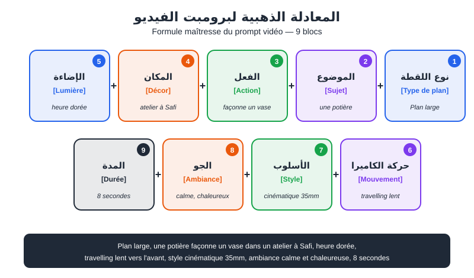
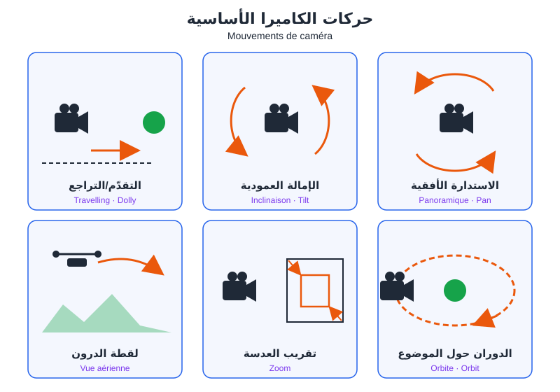
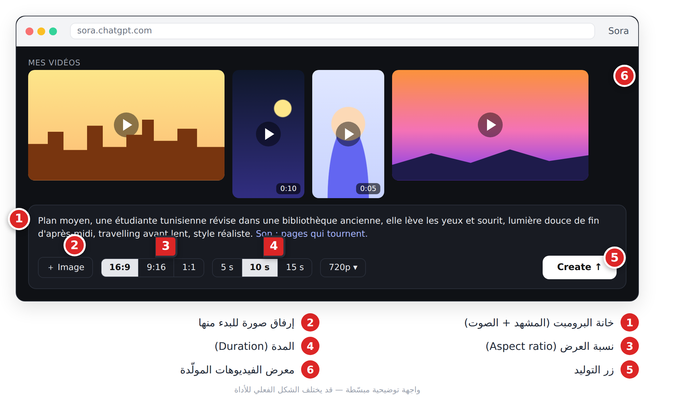
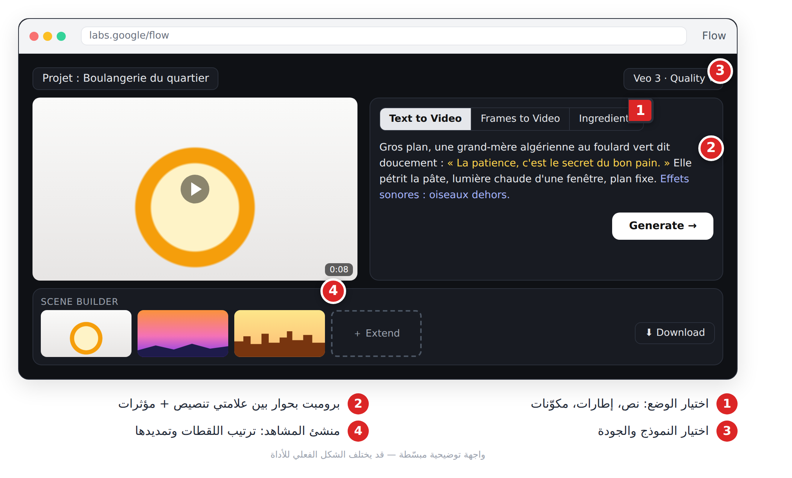
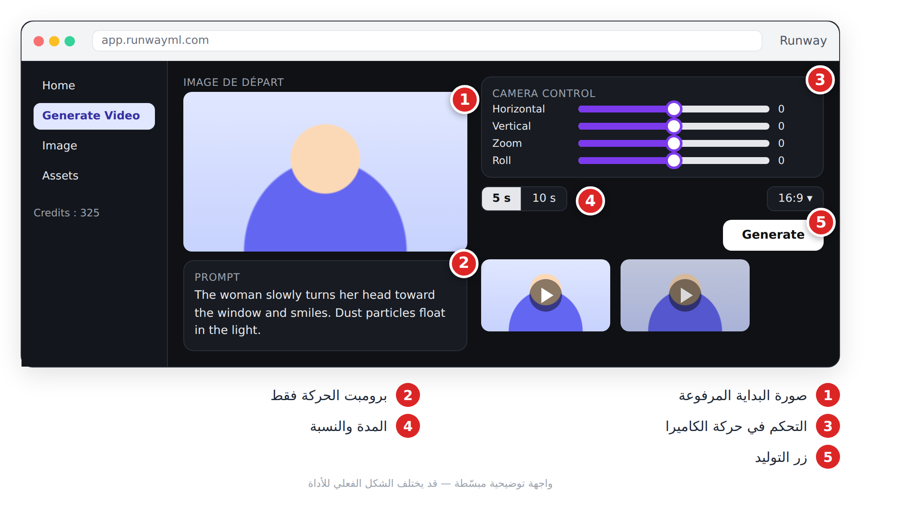
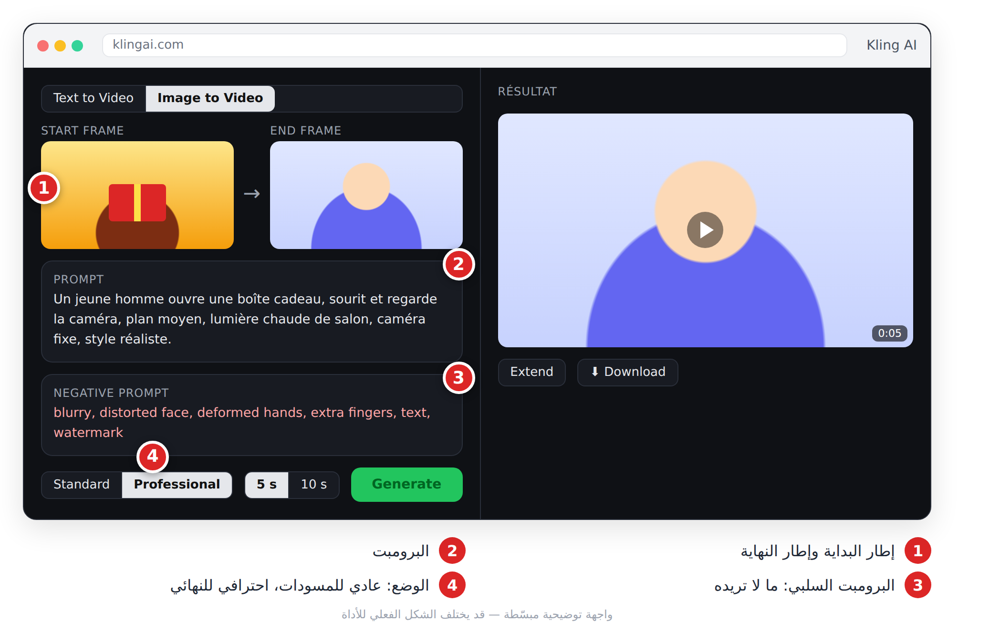
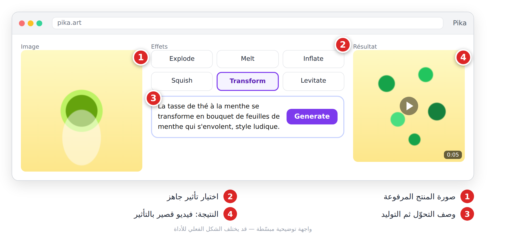
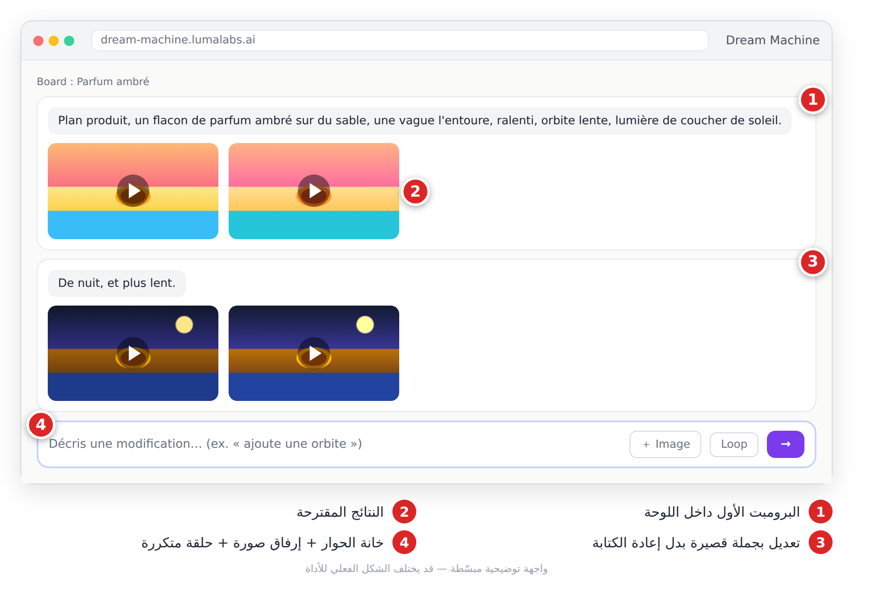
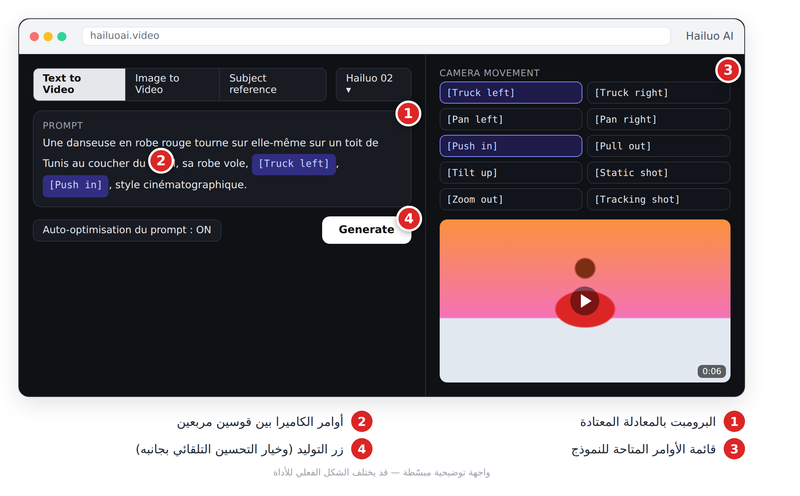
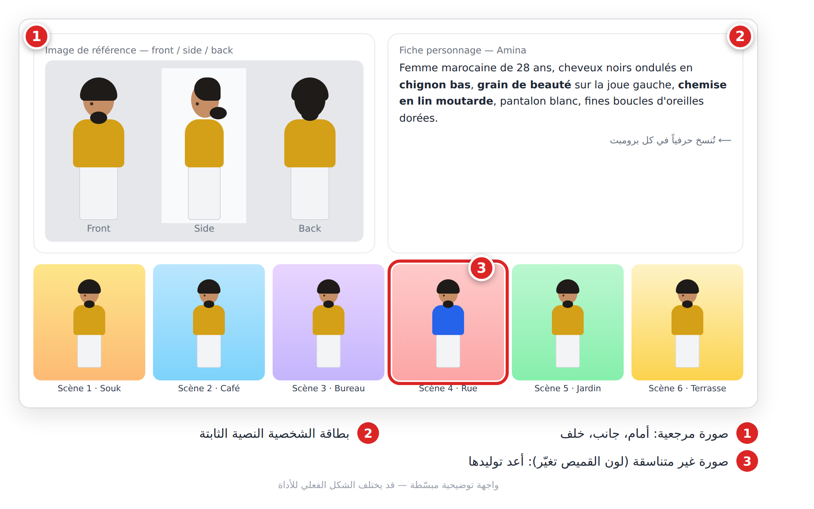

# الفصل 15: أدوات توليد الفيديو (Texte-vers-vidéo / Image-vers-vidéo)

## 🎯 ماذا ستتعلم في هذا الفصل

- معادلة برومبت الفيديو وقاموس حركات الكاميرا (**Mouvements de caméra**).
- سبع أدوات: Sora، Veo، Runway، Kling، Pika، Luma، Hailuo.
- تناسق الشخصية (**Cohérence du personnage**) وإصلاح العيوب الشائعة (**Artefacts**).

> ⚠️ **تحذير:** هذه الأدوات تتغير كل بضعة أشهر (النماذج، الأزرار، الخطط). نشرح المنطق الثابت وحالتها عند الكتابة (أكتوبر 2026). الأسعار تتغير، راجع الموقع الرسمي.

---

## 15.1 نص إلى فيديو أم صورة إلى فيديو؟

| | **Texte-vers-vidéo** | **Image-vers-vidéo** |
|---|---|---|
| المُدخل | برومبت فقط | صورة + برومبت حركة |
| التحكم والتناسق | ضعيف نسبياً | عالٍ |
| الاستعمال | استكشاف الأفكار، لقطات عامة | الإعلانات، القصص بشخصية ثابتة |
| ماذا تصف؟ | كل شيء | **الحركة فقط** تقريباً |

ميزات أخرى شائعة: **إطار البداية والنهاية** (**Keyframes**)، **الصور المرجعية** (**Images de référence**)، و**التمديد** (**Extension**) لإطالة لقطة.

---

## 15.2 معادلة برومبت الفيديو



*الشكل 15-1: تسع كتل تُركّب بالترتيب.*

**[Type de plan] + [Sujet] + [Action] + [Décor] + [Lumière] + [Mouvement de caméra] + [Style] + [Ambiance] + [Durée]**

```text
Plan large, un pêcheur de 60 ans à la barbe grise remonte un filet depuis une barque bleue dans le port d'Essaouira, lumière dorée du coucher de soleil, travelling latéral lent, style cinéma 35 mm, ambiance paisible, 8 secondes.
```
🇬🇧 بالإنجليزية:
```text
Wide shot, a 60-year-old fisherman with a grey beard pulls a net from a small blue boat in the port of Essaouira, golden sunset light, slow tracking shot, cinematic 35mm film, peaceful mood, 8 seconds.
```

**أربع قواعد:**
1. **فعل واحد** لكل لقطة: في 5 ثوانٍ يحدث فعل واحد، لا ثلاثة.
2. **حركة كاميرا واحدة** لكل لقطة.
3. **أفعال ملموسة** («يبتسم ويرفع الكوب») بدل الصفات («سعيد»).
4. **لا نصوص داخل الفيديو**؛ أضفها في المونتاج.

---

## 15.3 قاموس حركات الكاميرا



*الشكل 15-2: حركات الكاميرا الست الأكثر استعمالاً.*

| بالعربية | Français | مصطلح البرومبت (EN) |
|---|---|---|
| استدارة أفقية | **Panoramique** | `pan left / pan right` |
| إمالة عمودية | **Inclinaison** | `tilt up / tilt down` |
| تقريب العدسة | **Zoom avant / arrière** | `zoom in / zoom out` |
| تقدّم / تراجع | **Travelling avant / arrière** | `dolly in / dolly out` |
| تتبّع جانبي | **Travelling latéral** | `tracking shot` |
| متابعة الشخصية | **Plan de suivi** | `follow shot` |
| دوران حول الموضوع | **Orbite** | `orbit shot` |
| لقطة درون | **Vue aérienne** | `drone shot, aerial view` |
| رافعة | **Plan grue** | `crane up / crane down` |
| كاميرا محمولة | **Caméra à l'épaule** | `handheld camera` |
| كاميرا ثابتة | **Plan fixe** | `static shot` |
| زوم الدوار | **Effet vertigo** | `dolly zoom` |
| لقطة ذاتية | **Caméra subjective** | `POV shot` |
| حركة بطيئة | **Ralenti** | `slow motion` |

**أنواع اللقطات (**Valeurs de plan**):** `wide shot` (واسعة)، `medium shot` (متوسطة)، `close-up` (قريبة)، `extreme close-up` (تفصيل). **الزوايا:** `low angle` (من الأسفل، قوة)، `top-down shot` (من الأعلى، للطعام).

> 💡 **نصيحة:** المبتدئ يكتب «فيديو جميل لـ...»، والمحترف يكتب `low angle, slow dolly in, close-up`. ثلاث كلمات تغيّر النتيجة.

---

## 15.4 الأدوات السبع

| الأداة | الشركة | أبرز نقاط القوة |
|---|---|---|
| **Sora** | OpenAI | واقعية + صوت متزامن |
| **Veo** | Google | جودة سينمائية + حوار وصوت، أداة Flow |
| **Runway** | Runway | منظومة كاملة، صور مرجعية |
| **Kling** | Kuaishou | حركة بشرية واقعية، إطار بداية/نهاية |
| **Pika** | Pika Labs | مؤثرات وتحويلات سريعة |
| **Luma** | Luma AI | واجهة بسيطة، تعديل بالحوار |
| **Hailuo** | MiniMax | فيزياء جيدة، أوامر كاميرا في البرومبت |

في أغلب الأدوات، الخطط المجانية (إن وُجدت) محدودة وقد تضيف علامة مائية أو تمنع الاستعمال التجاري.

### Sora (OpenAI)

نموذج OpenAI للفيديو. النسخة الحديثة (Sora 2) تولّد الصوت مع الصورة: حوار ومؤثرات وأجواء. تحمل الفيديوهات علامة مائية وبيانات أصل (**Métadonnées de provenance**).

1. ادخل إلى Sora (الموقع أو التطبيق) بحساب OpenAI.
2. اكتب البرومبت أو أرفق صورة.
3. اختر النسبة والمدة، ثم ولّد.
4. أعد التوليد أو عدّل (**Remix**)، ثم حمّل.



*الشكل 15-3: توليد فيديو من نص: برومبت، نسبة، مدة، ثم النتائج.*

```text
Plan moyen, une étudiante tunisienne révise dans une bibliothèque ancienne, elle lève les yeux et sourit, lumière douce de fin d'après-midi, travelling avant lent, style réaliste. Son : pages qui tournent.
```
🇬🇧 بالإنجليزية:
```text
Medium shot, a Tunisian student studies in an old library, she looks up and smiles, soft late-afternoon light, slow dolly in, realistic style. Audio: pages turning.
```

> 💡 **نصيحة:** افصل الصوت بسطر `Audio:` واجعل الحوار جملة واحدة بين علامتي تنصيص.

### Google Veo (Flow)

نموذج Google للفيديو. منذ Veo 3 يولّد الحوار بمزامنة الشفاه والمؤثرات. متاح عبر تطبيق Gemini وأداة **Flow** المخصصة للأفلام القصيرة، ويحمل علامة **SynthID** غير المرئية.

1. افتح Flow أو Gemini بحساب Google.
2. اختر الوضع: من نص، من إطارات، أو من مكوّنات (صور مرجعية).
3. اكتب البرومبت مع الحوار والمؤثرات، ثم ولّد.
4. رتّب اللقطات أو مدّدها في منشئ المشاهد (**Scene builder**) إن توفر.



*الشكل 15-4: Flow: اختيار الوضع، برومبت بحوار، ثم ترتيب اللقطات.*

```text
Gros plan, une grand-mère algérienne au foulard vert dit doucement : « La patience, c'est le secret du bon pain. » Elle pétrit la pâte, lumière chaude d'une fenêtre, plan fixe. Effets sonores : oiseaux dehors.
```
🇬🇧 بالإنجليزية:
```text
Close-up, an Algerian grandmother in a green headscarf softly says: "Patience is the secret of good bread." She kneads dough, warm window light, static shot. SFX: birds outside.
```

> 💡 **نصيحة:** إن ظهرت ترجمة مكتوبة دون طلب، أضف `no subtitles, no on-screen text`.

### Runway

منصة متكاملة للمبدعين: نماذج فيديو (سلسلة Gen)، صور بمراجع (**References**)، وتعديل فيديو موجود. أفضل استعمال لها: **صورة البداية + برومبت حركة قصير**.

1. افتح أداة الفيديو على runwayml.com واختر النموذج.
2. ارفع صورة البداية بالنسبة المطلوبة.
3. اكتب الحركة فقط: `[الكاميرا]: [ما يحدث]`.
4. اختر المدة، ولّد، ثم حمّل أو مدّد.



*الشكل 15-5: صورة إلى فيديو: صورة البداية + برومبت الحركة + الكاميرا.*

```text
Travelling avant lent : la femme tourne la tête vers la fenêtre et sourit. Particules de poussière dans la lumière.
```
🇬🇧 بالإنجليزية:
```text
Slow dolly in: the woman turns her head toward the window and smiles. Dust particles float in the light.
```

> 💡 **نصيحة:** إن كانت الحركة مبالغاً فيها، أضف `subtle, gentle, slow`.

### Kling

نموذج من Kuaishou، مشهور بواقعية حركة الجسم البشري. يتيح إطار البداية والنهاية، عناصر مرجعية، تمديد اللقطة، وبرومبتاً سلبياً (**Prompt négatif**). يوفّر عادة وضعاً عادياً (**Standard**) واحترافياً (**Professional**).

1. اختر Image to Video وارفع إطار البداية (والنهاية إن أردت).
2. اكتب البرومبت وأضف البرومبت السلبي.
3. اختر الوضع والمدة، ثم ولّد.



*الشكل 15-6: إطار البداية والنهاية مع برومبت سلبي.*

```text
Un jeune homme ouvre une boîte cadeau, sourit et regarde la caméra, plan moyen, lumière chaude de salon, caméra fixe, style réaliste.
```
🇬🇧 بالإنجليزية:
```text
A young man opens a gift box, smiles and looks at the camera, medium shot, warm living-room light, static camera, realistic style.
```
برومبت سلبي: `blurry, distorted face, deformed hands, extra fingers, text, watermark`

> 💡 **نصيحة:** الوضع العادي للمسودات، والاحترافي للنسخة النهائية فقط.

### Pika

أداة المؤثرات الإبداعية السريعة: تحويل الأشياء (انفجار، ذوبان، انتفاخ)، إضافة عنصر إلى فيديو، أو استبداله. مثالية للخطّافات والميمز. أسماء ميزاتها تتغير كثيراً بين الإصدارات.

1. ارفع صورة أو فيديو.
2. اختر تأثيراً جاهزاً أو صِف التحوّل.
3. ولّد وقارن عدة نسخ.



*الشكل 15-7: تأثير تحويل على صورة منتج.*

```text
La tasse de thé à la menthe se transforme en bouquet de feuilles de menthe qui s'envolent, style ludique.
```
🇬🇧 بالإنجليزية:
```text
The mint tea glass transforms into a bouquet of mint leaves flying away, playful style.
```

> 💡 **نصيحة:** صور المنتجات بخلفية بسيطة تعطي أنظف التأثيرات.

### Luma Dream Machine

واجهة على شكل لوحة (**Board**) تحادث فيها الأداة، بنماذج Ray. تتيح النص والصورة، إطارات البداية والنهاية، الحلقة المتكررة (**Loop**)، والتعديل بالحوار. ممتازة للمبتدئين وللقطات المنتجات.

1. أنشئ لوحة جديدة واكتب البرومبت أو أرفق صورة.
2. اختر النتيجة الأفضل.
3. عدّل بجمل قصيرة: «plus lent»، «de nuit»، «ajoute une orbite».



*الشكل 15-8: التعديل خطوة بخطوة داخل اللوحة.*

```text
Plan produit, un flacon de parfum ambré sur du sable, une vague l'entoure, ralenti, orbite lente, lumière de coucher de soleil.
```
🇬🇧 بالإنجليزية:
```text
Product shot, an amber perfume bottle on sand, a wave surrounds it, slow motion, slow orbit, sunset light.
```

> 💡 **نصيحة:** الحلقة المتكررة ممتازة لخلفيات البث والموسيقى.

### Hailuo (MiniMax)

منصة الفيديو لشركة MiniMax، قوية في الفيزياء والحركات المعقدة (رياضة، رقص، سقوط أشياء). بعض نماذجها تقبل **أوامر الكاميرا بين قوسين مربعين** داخل البرومبت، ومرجع الشخصية (**Subject reference**).

1. اختر النموذج والوضع (نص أو صورة).
2. اكتب البرومبت وأدرج أوامر الكاميرا من القائمة.
3. ولّد وقارن.



*الشكل 15-9: أوامر الكاميرا داخل البرومبت.*

```text
Une danseuse en robe rouge tourne sur elle-même sur un toit de Tunis au coucher du soleil, sa robe vole, [Truck left], [Push in], style cinématographique.
```
🇬🇧 بالإنجليزية:
```text
A dancer in a red dress spins on a Tunis rooftop at sunset, her dress flowing, [Truck left], [Push in], cinematic style.
```

> 💡 **نصيحة:** إن أفسد «التحسين التلقائي للبرومبت» نتيجتك، عطّله إن وُجد الخيار.

---

## 15.5 تناسق الشخصية

كل توليد مستقل، والأداة «لا تتذكر». الحل:

1. **بطاقة شخصية** (**Fiche personnage**) تنسخها **حرفياً** في كل برومبت.
2. **صورة مرجعية** للشخصية: أمام، جانب، خلف.
3. **صور مفتاحية** لكل مشهد بهذا المرجع، ثم **تحقق بصري** وأعد توليد المختلفة.
4. **تحريك** كل صورة ببرومبت حركة قصير.

```text
Fiche personnage — Amina : femme marocaine de 28 ans, cheveux noirs ondulés en chignon bas, grain de beauté sur la joue gauche, chemise en lin moutarde, pantalon blanc, fines boucles d'oreilles dorées.
```
🇬🇧 بالإنجليزية:
```text
Character sheet of a 28-year-old Moroccan woman, wavy black hair in a low bun, beauty mark on left cheek, mustard linen shirt, white trousers, front view, side view, back view, neutral grey background.
```



*الشكل 15-10: من بطاقة الشخصية إلى صور مفتاحية متناسقة.*

> 💡 **نصيحة:** التفاصيل المميزة (شامة، لون ملابس غير شائع) والملابس الثابتة يتعرف عليها المشاهد أسرع من الوجه.

---

## 15.6 أهم 5 عيوب وحلولها

| العيب | بالفرنسية | الحل |
|---|---|---|
| أيدٍ مشوهة | **Mains déformées** | برومبت سلبي، أيدٍ أقل ظهوراً، قصّ اللحظة في المونتاج |
| وجه يتغير أثناء اللقطة | **Dérive du visage** | لقطة أقصر، حركة أبطأ، صورة مرجعية |
| وميض وارتعاش | **Scintillement** | خلفية أبسط + `stable, consistent lighting` |
| صورة متجمدة | **Image figée** | فعل واضح + حركة كاميرا |
| حركة مبالغ فيها | **Mouvement excessif** | `subtle, slow, gentle` |

> ⚠️ **تحذير:** لا تزل العلامات المائية أو علامات الأصل الإلزامية، ولا تولّد وجوه أشخاص حقيقيين دون موافقتهم الصريحة.

---

## 📝 الخلاصة

- **Image-vers-vidéo** للتحكم والتناسق، **Texte-vers-vidéo** للاستكشاف.
- المعادلة: نوع اللقطة + الموضوع + فعل واحد + المكان + الضوء + حركة كاميرا واحدة + الأسلوب + الجو.
- لكل أداة قوة: Veo وSora للصوت، Kling للحركة البشرية، Pika للمؤثرات، Luma للبساطة، Hailuo للفيزياء.
- التناسق = بطاقة شخصية ثابتة + صورة مرجعية + صور مفتاحية.

## 🛠️ تمرين

خذ الستوريبورد من الفصل 14. ولّد صورة مفتاحية لكل مشهد، ثم حرّك المشهد الأول في أداتين مختلفتين بنفس البرومبت، وقارن: الحركة، التناسق، والعيوب. احتفظ بالأفضل وسجّل السبب.
