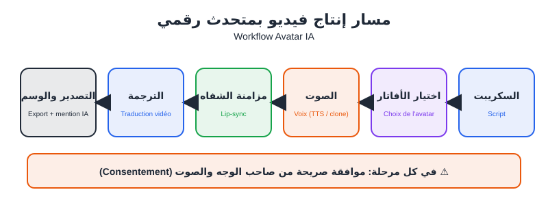
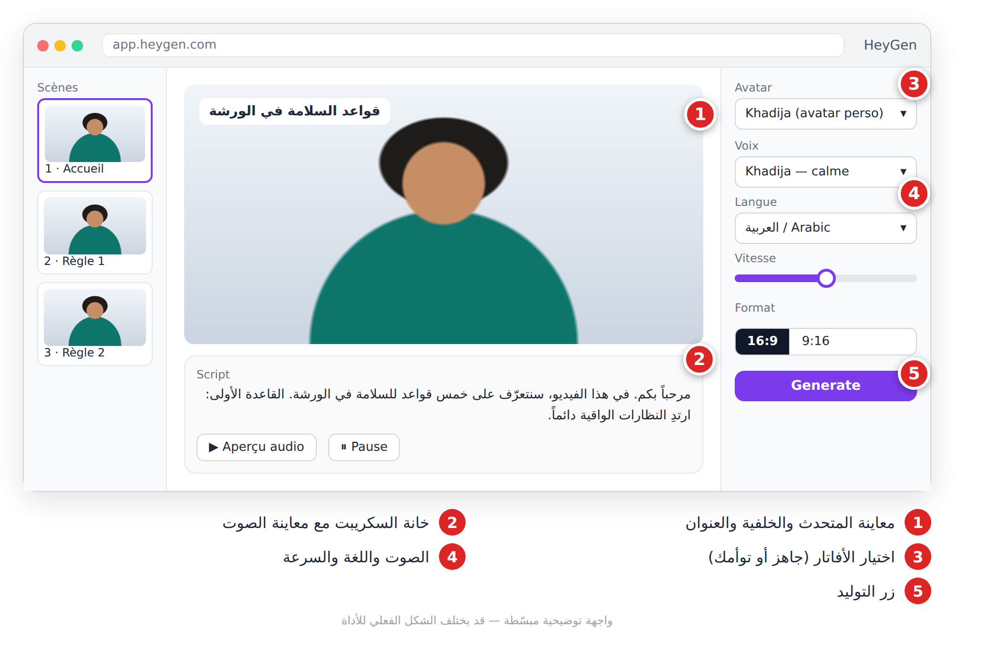
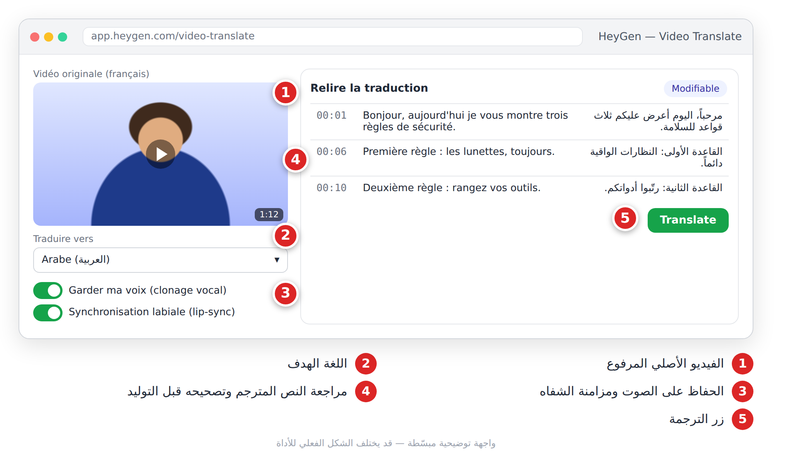
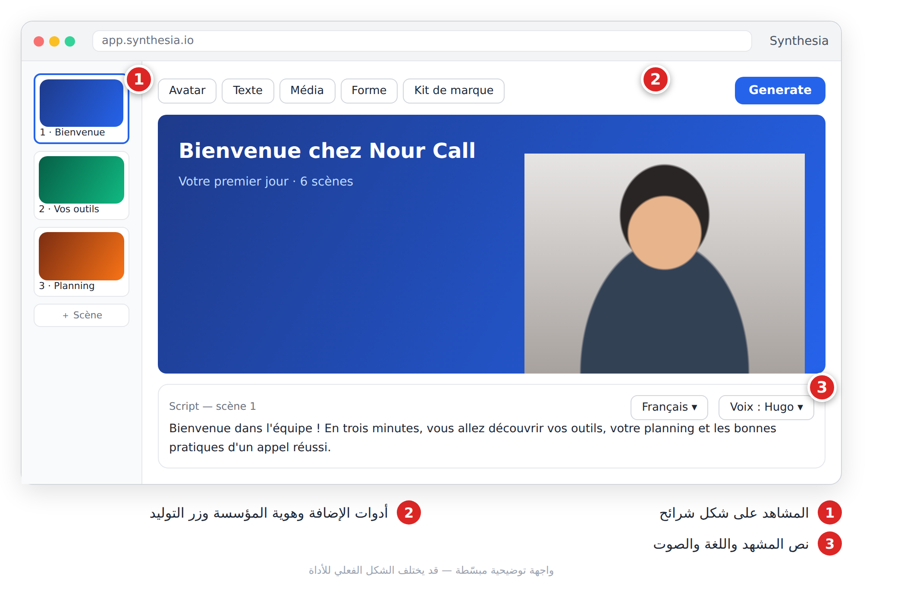
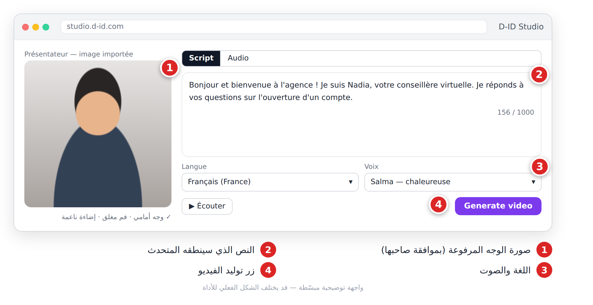

# الفصل 16: الأفاتار والمتحدث الرقمي (**Avatars IA**)

## 🎯 ماذا ستتعلم في هذا الفصل

- متى يكون المتحدث الرقمي (**Avatar IA**) خياراً ذكياً.
- ثلاث أدوات: HeyGen، Synthesia، D-ID.
- الموافقة (**Consentement**) والإفصاح: قواعد لا تفاوض فيها.

---

## 16-1 لماذا الأفاتار؟

خديجة مدرّبة في وهران، عليها إنتاج 20 فيديو سلامة بالعربية والفرنسية. مع متحدث رقمي: تكتب النص، تختار أفاتاراً وصوتاً، وتحصل على الفيديو في دقائق. وإذا تغيّرت قاعدة، تعدّل سطراً وتعيد التصدير.

| مناسب ✅ | غير مناسب ❌ |
|---|---|
| التكوين (**Formation**) والشروحات الداخلية | قصتك الشخصية وشهادات العملاء |
| محتوى يُحدَّث كثيراً، ومتعدد اللغات | الترفيه العفوي على تيك توك |
| حين لا تريد الظهور بوجهك | أي موقف يظن فيه المشاهد أن الشخص حقيقي دون إفصاح |



*الشكل 16-1: السكريبت ← الأفاتار ← الصوت ← مزامنة الشفاه ← الترجمة ← التصدير، والموافقة شرط في كل مرحلة.*

**مفاهيم أساسية:** أفاتار جاهز (**Avatar de stock**)، توأم رقمي (**Jumeau numérique**) من تسجيل فيديو لك، صورة متكلمة (**Photo parlante**)، استنساخ الصوت (**Clonage vocal**)، مزامنة الشفاه (**Lip-sync**)، وترجمة الفيديو (**Traduction vidéo**).

**سكريبت الأفاتار:** جمل قصيرة (10–15 كلمة)، ترقيم واضح يصنع الوقفات، أرقام مكتوبة كما تُنطق، ومشاهد من 15–40 ثانية.

```text
Tu es scénariste pour des vidéos de formation présentées par un avatar IA.
Sujet : [ex. les 5 règles de sécurité dans un atelier]. Public : [stagiaires débutants]. Durée : 2 minutes.
Contraintes : phrases de 15 mots maximum, chiffres écrits comme ils se prononcent,
5 scènes de 20 à 30 secondes, avec pour chacune le texte de l'avatar et un visuel d'appui.
```

---

## 16-2 HeyGen

منصة متحدثين رقميين: أفاتارات جاهزة، توأمك الرقمي، صور متكلمة، وترجمة الفيديو مع استنساخ الصوت ومزامنة الشفاه. تناسب صانعي المحتوى والمسوّقين.

1. أنشئ فيديو جديداً واختر الصيغة (عمودية أو أفقية).
2. اختر أفاتاراً جاهزاً أو توأمك.
3. الصق السكريبت، واختر الصوت واللغة.
4. أضف خلفية ونصوصاً لكل مشهد، ثم ولّد وحمّل.



*الشكل 16-2: استوديو الأفاتار: المتحدث، السكريبت، الصوت، اللغة.*

**ترجمة فيديو موجود:** ارفع الفيديو، اختر اللغة الهدف، راجع النص المترجم، ثم ولّد.



*الشكل 16-3: ترجمة فيديو مع الحفاظ على الصوت ومزامنة الشفاه.*

```text
Réécris ce script pour qu'il soit naturel à l'oral, sans phrases de plus de 12 mots, et indique entre crochets les mots à prononcer différemment : [script].
```

> 💡 **نصيحة:** لتوأمك الرقمي: مكان هادئ، إضاءة أمامية ناعمة، نظرة إلى العدسة، دون قطع. وللترجمة: صوت نظيف ومتكلم واحد.

---

## 16-3 Synthesia

منصة موجهة للمؤسسات والتدريب (**Onboarding**، تواصل داخلي). محررها يشبه برامج العروض: كل مشهد شريحة بأفاتار ونص وعناصر، مع هوية المؤسسة (**Kit de marque**).

1. اختر قالباً أو ابدأ من الصفر.
2. لكل مشهد: الأفاتار، النص (30–60 كلمة)، اللغة.
3. أضف عناوين وصوراً، ثم ولّد وشارك.



*الشكل 16-4: محرر المشاهد على شكل شرائح.*

```text
Crée le plan d'une vidéo de formation de 3 minutes pour l'accueil des nouveaux employés d'un centre d'appels : 6 scènes, pour chacune un titre, le texte de l'avatar (50 mots max) et un élément visuel.
```

> 💡 **نصيحة:** مشهد قصير + عنصر بصري في كل مشهد = انتباه أطول.

---

## 16-4 D-ID

رائدة «الصورة المتكلمة»: ترفع صورة وجه وتعطيها نصاً أو صوتاً، فتحصل على فيديو للوجه وهو يتكلم. توفر أيضاً وكلاء تفاعليين وواجهة برمجية (**API**).

1. اختر متحدثاً جاهزاً أو ارفع صورة.
2. اكتب النص واختر الصوت، أو ارفع ملفاً صوتياً.
3. ولّد وحمّل.



*الشكل 16-5: صورة + نص = متحدث.*

```text
Portrait photo réaliste d'une conseillère bancaire de 35 ans, visage de face, regard vers l'objectif, bouche fermée, lumière douce de studio, cadrage poitrine.
```
🇬🇧 بالإنجليزية:
```text
Realistic portrait of a 35-year-old bank advisor, facing the camera, mouth closed, soft studio light, chest-up framing.
```

> 💡 **نصيحة:** وجه أمامي، فم مغلق، لا شعر يغطي الوجه. والصورة المتكلمة تحرّك الوجه أساساً، لا الجسد.

---

## 16-5 الموافقة والأخلاقيات

الأفاتار يستعمل **وجه وصوت إنسان**، وهما بيانات حساسة.

1. **موافقة صريحة ومكتوبة:** لأي استعمال؟ لأي مدة؟ هل يمكن سحبها؟ الأدوات الجادة تطلب فيديو موافقة.
2. **الإفصاح:** «هذا الفيديو منجز بمتحدث رقمي». منصات وقوانين كثيرة تطلبه.
3. **لا تزييف عميق** (**Deepfake**): لا تجعل شخصاً حقيقياً يقول ما لم يقله.
4. **حماية البيانات:** أين تُخزَّن صورتك وصوتك؟ وكيف تحذفهما؟
5. **الأطفال:** تجنّبهم كلياً.

> ⚠️ **تحذير:** فيديو لأستاذك «يلغي الامتحان» كمزحة هو تزييف قد يسبب ضرراً حقيقياً ويعرّضك لعقوبات.

```text
Rédige un formulaire de consentement simple (français et arabe) pour une personne qui accepte que son visage et sa voix servent à créer un avatar IA : usages autorisés, durée, droit de retrait, suppression des données, signature. Ajoute une note recommandant une relecture par un juriste.
```

---

## 📝 الخلاصة

- الأفاتار ممتاز للتكوين والمحتوى المتكرر ومتعدد اللغات، وضعيف في المحتوى الشخصي.
- HeyGen للتوأم والترجمة، Synthesia للمؤسسات، D-ID للصورة المتكلمة.
- سكريبت الأفاتار: جمل قصيرة وترقيم واضح.
- الموافقة والإفصاح شرطان دائمان.

## 🛠️ تمرين

اكتب سكريبت تعريف بنفسك (30 ثانية) بالبرومبت أعلاه، أنتجه بأفاتار جاهز، ثم ترجمه إلى الفرنسية، وأضف جملة الإفصاح في الوصف.
