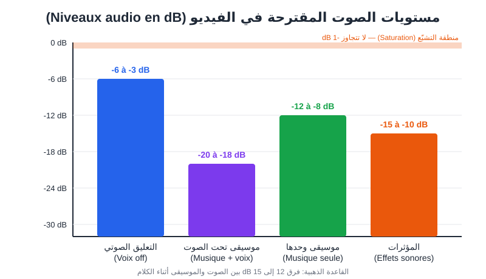
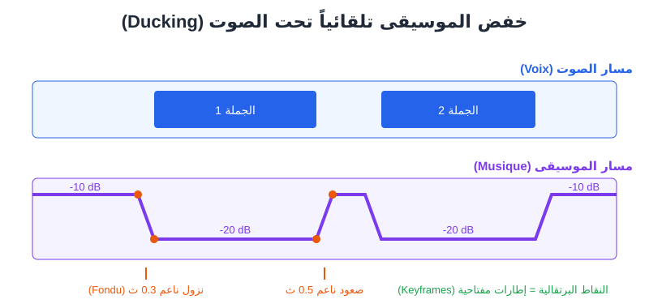

# الفصل 17: الصوت للفيديو — التعليق الصوتي، الموسيقى، والمؤثرات

> «الناس يسامحون صورة متوسطة، لكنهم لا يسامحون صوتاً سيئاً.» — قاعدة يعرفها كل مونتير.

🎯 **ماذا ستتعلم في هذا الفصل**

- لماذا يمثّل الصوت نصف الفيديو، وكيف يؤثر على مدة المشاهدة.
- كتابة نص مخصّص للأذن لا للعين: الترقيم (**Ponctuation**) والوقفات (**Pauses**).
- تسجيل تعليق صوتي (**Voix off**) كامل بـ ElevenLabs خطوة بخطوة، وتصديره لمشروع فيديو.
- اختيار وتوليد موسيقى خلفية (**Musique de fond**) مناسبة بـ Suno.
- إضافة المؤثرات الصوتية (**Effets sonores — SFX**) وأين تجدها أو تولّدها.
- ضبط المستويات (**Niveaux audio**) بالديسيبل (**dB**)، وتقنية الخفض التلقائي (**Ducking**).
- مزامنة (**Synchronisation**) الصوت مع الصورة والقطعات.

---

## 1. لماذا الصوت نصف الفيديو؟

تخيّل فيديو تيك توك لمتجر حلويات في تونس: صور جميلة جداً، لكن الصوت فيه صدى، والموسيقى تغطي الكلام. ماذا يفعل المشاهد؟ يمرّر خلال ثانيتين. الآن تخيّل العكس: صور عادية، لكن صوت واضح ودافئ، وموسيقى خفيفة تحت الكلام، و«طق» صغير عند ظهور كل منتج. هذا الفيديو يُشاهَد حتى النهاية.

الصوت في الفيديو يتكوّن من ثلاث طبقات:

| الطبقة | بالفرنسية | دورها | مثال |
|---|---|---|---|
| التعليق الصوتي | **Voix off** | يحمل المعلومة والقصة | «هذه ثلاث نصائح لتوفير المال…» |
| الموسيقى | **Musique de fond** | تصنع الإحساس والإيقاع | عود هادئ، بيت حماسي |
| المؤثرات | **Effets sonores (SFX)** | تضيف الواقعية وتشدّ الانتباه | صوت «ووش» عند الانتقال، نقرة، موج البحر |

في الفصل 10 تعرّفت على ElevenLabs وSuno كأدوات. هنا سنستعملها **لخدمة فيديو محدد**، بترتيب العمل الحقيقي: النص ← الصوت ← الموسيقى ← المؤثرات ← الخلط (**Mixage**) ← المزامنة.

> 💡 **نصيحة:** سجّل التعليق الصوتي **قبل** توليد مقاطع الفيديو إن أمكن. مدة كل جملة تحدد مدة كل لقطة، فتولّد مقاطع بالطول الصحيح بدل أن تقصّ وتمطّ لاحقاً.

---

## 2. كتابة النص للأذن (Écrire pour la voix)

النص الذي يُقرأ بالعين يختلف عن النص الذي يُسمع. أدوات الصوت بالذكاء الاصطناعي تقرأ ما تعطيها **حرفياً**، وتعتمد على الترقيم لتقرّر أين تتنفس وأين ترفع النبرة.

### 2.1 قواعد ذهبية

1. **جمل قصيرة:** من 8 إلى 15 كلمة. الجملة الطويلة تجعل الصوت المولّد يفقد النَّفَس ويصبح رتيباً.
2. **فكرة واحدة لكل جملة.**
3. **اكتب الأرقام كما تُنطق:** «ثلاثون بالمئة» بدل «30%»، و«ألفان وستة وعشرون» بدل «2026» إذا لاحظت أن الأداة تخطئ.
4. **شكّل الكلمات الملتبسة:** «عِلم» أو «عَلَم»؟ التشكيل الجزئي يساعد كثيراً في العربية.
5. **تجنّب الاختصارات:** اكتب «دولار أمريكي» لا «USD»، إلا إذا أردت نطقها حرفاً حرفاً.
6. **اكتب الكلمات الأجنبية كما تريد نطقها:** «تيك توك» بالعربية تُنطق أفضل من TikTok داخل جملة عربية.

### 2.2 الترقيم كأداة إخراج

| العلامة | أثرها على الصوت المولّد |
|---|---|
| الفاصلة «،» | وقفة قصيرة جداً (نَفَس) |
| النقطة «.» | وقفة متوسطة، ونزول في النبرة |
| علامة الاستفهام «؟» | صعود في النبرة آخر الجملة |
| علامة التعجب «!» | طاقة أعلى (لا تكثر منها) |
| النقاط الثلاث «…» | تردّد، تشويق، وقفة درامية |
| الشرطة «—» | انقطاع أو اعتراض في الكلام |
| سطر جديد / فقرة جديدة | وقفة أطول بين فكرتين |

### 2.3 الوقفات الدقيقة (Pauses)

بعض الإصدارات في ElevenLabs تقبل وسماً للوقفة مثل `<break time="1.0s" />` داخل النص، حسب النموذج المختار. تتغير هذه التفاصيل بين النماذج، لذا جرّب على جملة قصيرة أولاً. إن لم يعمل الوسم، استعمل البديل المضمون: **النقاط الثلاث أو فقرة جديدة**.

> ❌ **مثال خاطئ:**
> «اكتشف اليوم مع متجرنا الجديد في الدار البيضاء والذي افتتح منذ شهر تشكيلة من 150 منتجاً بخصم 30% لفترة محدودة فلا تفوّت الفرصة».

> ✅ **مثال صحيح:**
> «متجر جديد… في قلب الدار البيضاء.
> مئة وخمسون منتجاً، تنتظرك.
> وخصم ثلاثين بالمئة؟ لفترة محدودة فقط!
> لا تفوّت الفرصة.»

### 2.4 برومبت لإعادة كتابة نصك للصوت

استعمل ChatGPT أو Claude لتحويل نص مكتوب إلى نص صوتي:

```
Réécris ce texte pour une voix off de vidéo verticale de 30 secondes, en arabe standard simple.
Règles : phrases de 8 à 15 mots maximum, une idée par phrase, chiffres écrits en toutes lettres,
ajoute des points de suspension (…) là où une pause dramatique est utile,
termine par un appel à l'action clair. Donne aussi la durée estimée de lecture (environ 2,5 mots par seconde).
Texte : [colle ton texte ici]
```

**النتيجة المتوقعة:** نص مقسّم إلى أسطر قصيرة جاهز للصق في ElevenLabs، مع تقدير للمدة.

> 💡 **نصيحة:** القاعدة التقريبية: **2 إلى 2.5 كلمة في الثانية** بالعربية بإيقاع مريح. فيديو 30 ثانية = 60 إلى 75 كلمة. فيديو 5 دقائق ≈ 650 كلمة.

---

## 3. التعليق الصوتي بـ ElevenLabs خطوة بخطوة

لنفترض أنك تصنع ريلز لمتجر «زيت أركان» صغير في أكادير. النص جاهز (70 كلمة).

### الخطوة 1: افتح أداة تحويل النص إلى كلام (Text to Speech)

سجّل الدخول إلى ElevenLabs، ثم افتح قسم تحويل النص إلى كلام (**Synthèse vocale / Text to Speech**) من القائمة الجانبية.

> 🖼️ **الشكل 17-1 — واجهة Text to Speech في ElevenLabs** (*Capture d'écran*)
> **ماذا تُظهر:** محرر النص في الوسط، وقائمة الإعدادات على الجانب، وزر التوليد في الأسفل.
> **العناصر المؤشَّر عليها:** ① مربع النص ② قائمة اختيار الصوت (Voice) ③ اختيار النموذج (Model) ④ زر "Generate".
> **أين تلتقطها:** الصفحة الرئيسية بعد تسجيل الدخول ← قسم Text to Speech.

### الخطوة 2: اختر الصوت المناسب لجمهورك

افتح مكتبة الأصوات (**Voice Library**) وابحث بالفلاتر: اللغة (Arabic)، الجنس، العمر، الاستعمال (narration, advertisement, social media).

| نوع الفيديو | الصوت المقترح |
|---|---|
| إعلان منتج تجميل | صوت أنثوي دافئ، هادئ، متوسط السرعة |
| نصائح سريعة على تيك توك | صوت شاب، طاقة عالية |
| وثائقي تاريخي | صوت ذكوري عميق، بطيء، رزين |
| قصة للأطفال | صوت معبّر، تلويني (**Expressif**) |
| فيديو تعليمي | صوت واضح محايد، نبرة صديق |

> ⚠️ **تحذير:** لا تستنسخ (**Clonage vocal**) صوت شخص حقيقي — مذيع مشهور أو صديق — دون **موافقته الصريحة المكتوبة**. ElevenLabs نفسها تطلب التحقق في الاستنساخ الاحترافي. استنساخ صوتك أنت مسموح ومفيد جداً للحفاظ على هوية قناتك.

### الخطوة 3: اختر النموذج

ElevenLabs تقدّم عدة نماذج: نماذج **متعددة اللغات** (Multilingual) بجودة عالية تدعم العربية، ونماذج **سريعة** (Flash/Turbo) أرخص وأسرع لكنها أقل تعبيراً أحياناً، ونماذج أحدث تدعم التحكم بالمشاعر عبر وسوم نصية. أسماء النماذج تتغير باستمرار؛ القاعدة: **للنشر النهائي اختر النموذج الأعلى جودة الداعم للعربية**، وللتجارب استعمل السريع.

### الخطوة 4: اضبط الإعدادات (Réglages de la voix)

| الإعداد | ماذا يفعل | قيمة مقترحة للإعلان | للوثائقي |
|---|---|---|---|
| الثبات (**Stability**) | منخفض = تعبير أكثر وتقلّب؛ مرتفع = رتابة وثبات | 40–50% | 55–65% |
| التشابه (**Similarity / Clarity**) | قرب الناتج من الصوت الأصلي | 75% | 75–80% |
| المبالغة في الأسلوب (**Style exaggeration**) | يضخّم الأداء | 10–20% | 0–10% |
| السرعة (**Speed**) | سرعة القراءة | 1.0–1.1 | 0.9–0.95 |
| تعزيز المتحدث (**Speaker boost**) | وضوح أكبر | مفعّل | مفعّل |

> 💡 **نصيحة:** إذا سمعت «تلعثماً» أو أصواتاً غريبة، ارفع الثبات قليلاً. إذا كان الصوت كالروبوت، اخفضه.

### الخطوة 5: ولّد جملة جملة، لا النص كاملاً

بدلاً من توليد 70 كلمة دفعة واحدة، ولّد **كل فقرة على حدة**. لماذا؟

- إذا أخطأ في كلمة واحدة، تعيد توليد فقرة قصيرة فقط (توفّر الرصيد).
- تحصل على ملفات منفصلة يسهل وضعها على الخط الزمني تحت كل لقطة.
- يمكنك اختيار أفضل نسخة من كل فقرة (ولّد 2–3 نسخ واختر).

> 🖼️ **الشكل 17-2 — سجلّ التوليدات (History)** (*Capture d'écran*)
> **ماذا تُظهر:** قائمة بالمقاطع المولّدة مع زر استماع وتحميل لكل مقطع.
> **العناصر المؤشَّر عليها:** ① زر التشغيل ② زر التحميل ③ النص المختصر لكل توليد.
> **أين تلتقطها:** قسم History أسفل محرر Text to Speech أو في القائمة الجانبية.

### الخطوة 6: صدّر بالصيغة الصحيحة

- **MP3 بجودة عالية** يكفي لتيك توك وريلز.
- **WAV** إذا كنت ستعالج الصوت كثيراً أو تعمل على يوتيوب طويل (جودة دون ضغط). بعض الصيغ عالية الجودة متاحة فقط في الخطط المدفوعة.
- سمِّ الملفات بترتيب: `01_intro.mp3`, `02_conseil1.mp3`... هذا يوفّر عليك الكثير في المونتاج.

### الخطوة 7: نظّف الصوت

الصوت المولّد نظيف عادةً، لكن تحقّق من:
- **الصمت في البداية والنهاية**: قصّه في المونتاج.
- **التنفّس المبالغ فيه**: احذفه أو اخفضه.
- إن سجّلت صوتك بالميكروفون بدل التوليد: استعمل أداة عزل الصوت (**Voice Isolator**) في ElevenLabs، أو ميزة تحسين الصوت في CapCut أو Descript لإزالة الضجيج (**Réduction de bruit**).

### بديل: الدبلجة (Doublage)

إذا كان لديك فيديو جاهز بالفرنسية وتريد نسخة عربية، أداة الدبلجة (**Dubbing**) في ElevenLabs تترجم وتعيد النطق بصوت قريب من الأصلي. راجع الترجمة دائماً، خاصة اللهجات والمصطلحات.

---

## 4. الموسيقى بـ Suno

### 4.1 اختر الموسيقى حسب المشاعر لا حسب ذوقك

اسأل نفسك: **ماذا يجب أن يشعر المشاهد؟** ثم اختر.

| الإحساس المطلوب | النوع (Genre) | السرعة (BPM) |
|---|---|---|
| حماس، طاقة (نصائح سريعة) | Pop électro, Trap léger | 110–130 |
| فخامة، أناقة (عطر، ساعة) | Piano + cordes, Lo-fi chic | 70–90 |
| دفء، أصالة (منتج تقليدي) | Oud, percussions douces, Gnawa moderne | 80–100 |
| تشويق (وثائقي) | Cinématique, ambient, cordes | 60–80 |
| براءة ومرح (أطفال) | Ukulélé, xylophone, sifflements | 100–120 |

### 4.2 الموسيقى الآلية فقط (Instrumental)

موسيقى الخلفية **يجب أن تكون بلا كلمات** حتى لا تتصادم مع التعليق الصوتي. في Suno فعّل خيار **Instrumental**، واكتب وصف الأسلوب (Style).

```
Musique instrumentale de fond pour publicité de parfum, piano doux et cordes légères, oud discret,
ambiance luxueuse et chaleureuse, tempo lent 80 BPM, sans voix, montée progressive, fin propre
```
🇬🇧 النسخة الإنجليزية (نتائج أدق):
```
instrumental background music for a perfume ad, soft piano and light strings, subtle oud,
luxurious warm mood, slow tempo 80 BPM, no vocals, gradual build, clean ending
```
**النتيجة المتوقعة:** مقطع هادئ وفخم يصلح تحت صوت أنثوي.

```
Beat instrumental énergique pour vidéo TikTok de conseils, pop électro moderne, basse ronde,
claquements de mains, 120 BPM, sans voix, boucle facile à couper
```
🇬🇧 النسخة الإنجليزية (نتائج أدق):
```
energetic instrumental beat for a TikTok tips video, modern electro pop, round bass,
hand claps, 120 BPM, no vocals, easy to loop and cut
```
**النتيجة المتوقعة:** إيقاع حيوي ثابت يمكن قصّه عند أي «بار».

```
Musique cinématique pour documentaire historique sur une ville arabe ancienne, oud, ney, cordes amples,
percussions lointaines, ambiance mystérieuse et noble, 70 BPM, instrumental, sans voix
```
🇬🇧 النسخة الإنجليزية (نتائج أدق):
```
cinematic documentary score about an ancient Arab city, oud, ney flute, wide strings,
distant percussion, mysterious and noble mood, 70 BPM, instrumental, no vocals
```
**النتيجة المتوقعة:** موسيقى ملحمية هادئة لفيديو يوتيوب طويل.

> 🖼️ **الشكل 17-3 — إنشاء مقطع آلي في Suno** (*Capture d'écran*)
> **ماذا تُظهر:** شاشة الإنشاء في الوضع المخصّص.
> **العناصر المؤشَّر عليها:** ① خانة وصف الأسلوب (Style) ② مفتاح Instrumental مفعّل ③ زر "Create" ④ المقطعان الناتجان.
> **أين تلتقطها:** صفحة Create في Suno بالوضع Custom.

### 4.3 طابق طول الموسيقى مع الفيديو

- Suno يولّد غالباً مقاطع أطول من 30 ثانية. **لا تقصّ في منتصف جملة موسيقية**؛ قصّ عند نهاية «بار» (كل 4 ضربات)، أو أضف تلاشياً (**Fondu sortant / Fade out**) لمدة 1–2 ثانية.
- لفيديو 5 دقائق: ولّد مقطعين أو ثلاثة بنفس الأسلوب، أو استعمل خاصية التمديد (**Extend**) إن كانت متاحة في خطتك.

> ⚠️ **تحذير:** حقوق الاستعمال التجاري لموسيقى Suno مرتبطة بنوع الاشتراك عند لحظة التوليد. للإعلانات والمحتوى الذي يجلب المال، تأكد من شروط الخطة على الموقع الرسمي. ولا تستعمل أبداً أغنية مشهورة محمية في إعلان؛ المنصات ستكتم الصوت أو تحذف الفيديو.

> 💡 **نصيحة:** البديل الآمن السريع: مكتبات الموسيقى المرخّصة داخل CapCut و YouTube Audio Library. لكن انتبه: موسيقى CapCut التجارية مختلفة عن موسيقى «الترند» غير المرخّصة للإعلانات.

---

## 5. المؤثرات الصوتية (Effets sonores)

المؤثرات هي «التوابل». قليل منها يجعل الفيديو احترافياً، والكثير يفسده.

### 5.1 أين تُستعمل؟

| اللحظة | المؤثر | الأثر |
|---|---|---|
| انتقال بين لقطتين | **Whoosh** (حفيف سريع) | يوحي بالحركة |
| ظهور نص أو رقم | **Pop / Clic** | يشدّ العين |
| كشف المنتج | **Shimmer / Scintillement** | إحساس بالفخامة |
| بداية القصة | أجواء (**Ambiance**): سوق، بحر، رياح | ينقل المشاهد للمكان |
| خطأ أو معلومة خاطئة | **Buzzer** | فكاهة وتوضيح |

### 5.2 توليد المؤثرات بالذكاء الاصطناعي

ElevenLabs يوفّر أداة **Sound Effects** تولّد صوتاً من وصف نصي. الوصف بالإنجليزية يعطي نتائج أفضل:

```
Bruit d'un spray de parfum, une seule pulvérisation courte et nette, en studio, sans écho
```
🇬🇧 النسخة الإنجليزية (نتائج أدق):
```
perfume spray, one short crisp spritz, studio recording, no reverb
```

```
Ambiance d'un souk marocain le matin, voix lointaines indistinctes, pas sur le sol, cuivre qui tinte, 10 secondes
```
🇬🇧 النسخة الإنجليزية (نتائج أدق):
```
Moroccan souk morning ambience, distant indistinct voices, footsteps, clinking brass, 10 seconds
```

```
Whoosh de transition rapide et moderne, 0,5 seconde
```
🇬🇧 النسخة الإنجليزية (نتائج أدق):
```
fast modern transition whoosh, 0.5 seconds
```

مصادر أخرى: مكتبة المؤثرات داخل CapCut، ومواقع المؤثرات المجانية ذات الترخيص المفتوح (تحقق من الرخصة دائماً).

> 💡 **نصيحة:** بعض أدوات الفيديو (مثل Veo وغيرها) تولّد صوتاً مدمجاً مع المقطع. إن كان جيداً احتفظ به كطبقة «أجواء»، وإن كان مشوّشاً اكتمه وضع مؤثراتك الخاصة.

---

## 6. الخلط وضبط المستويات (Mixage)

هنا يفرّق المحترف عن المبتدئ. الهدف: **الصوت مفهوم دائماً، والموسيقى محسوسة لا مزعجة.**

### 6.1 الديسيبل في دقيقة

الديسيبل (**dB**) في برامج المونتاج يُقاس من الأعلى: **0 dB هو الحد الأقصى**، وكل ما تحته سالب. إذا تجاوزت 0 يحدث التشبّع (**Saturation / Clipping**): صوت مكسّر لا يمكن إصلاحه. القاعدة العملية: خفض **10 dB** تقريباً تُحسّه الأذن كأن الصوت صار **نصف ما كان**.


*الشكل 17-4: مستويات الذروة المقترحة لكل طبقة صوتية، والفرق الضروري بين الصوت والموسيقى.*

### 6.2 جدول المستويات المرجعي

| الطبقة | مستوى الذروة (**Crête / Peak**) المقترح |
|---|---|
| التعليق الصوتي | بين -6 و -3 dB |
| الموسيقى تحت الكلام | بين -20 و -18 dB |
| الموسيقى وحدها (مقدمة، نهاية) | بين -12 و -8 dB |
| المؤثرات | بين -15 و -10 dB |
| المجموع النهائي | لا يتجاوز -1 dB |

> 💡 **نصيحة:** المنصات تقيس «الجهارة المتكاملة» (**Loudness**) بوحدة **LUFS**. كهدف مبسّط: حوالي **-14 LUFS** للمنصات الاجتماعية ويوتيوب. لا تقلق إن لم يعرض برنامجك ذلك؛ اتباع الجدول أعلاه واستماعك بالسماعة والهاتف كافيان في البداية.

### 6.3 الخفض التلقائي (Ducking)

بدلاً من أن تبقى الموسيقى منخفضة طوال الفيديو، الأجمل أن **تنخفض عند الكلام وترتفع في الفراغات**. هذا هو الـ Ducking.


*الشكل 17-5: الموسيقى تنخفض إلى -22 dB أثناء الجمل وتعود إلى -10 dB بينها، بانتقالات ناعمة.*

**الطريقة اليدوية (تعمل في أي برنامج):**
1. ضع الموسيقى في مسار مستقل تحت مسار الصوت.
2. ضع إطارات مفتاحية (**Images clés / Keyframes**) على مستوى صوت الموسيقى قبل بداية كل جملة بـ 0.3 ثانية وعندها.
3. اخفض المستوى بين الإطارين، ثم ارفعه بعد نهاية الجملة بنفس الطريقة.

**الطريقة التلقائية:** بعض البرامج توفر خيار خفض تلقائي للموسيقى عند وجود صوت (يُسمّى أحياناً **Ducking** أو «خفض الصوت» حسب البرنامج والإصدار). في CapCut ابحث عن الخيار في إعدادات الصوت للمقطع الموسيقي، فإن لم تجده في نسختك استعمل الإطارات المفتاحية.

> 🖼️ **الشكل 17-6 — إطارات مفتاحية لمستوى الموسيقى في CapCut** (*Capture d'écran*)
> **ماذا تُظهر:** مسار الموسيقى محدّد، ولوحة الصوت مفتوحة مع شريط مستوى الصوت.
> **العناصر المؤشَّر عليها:** ① زر إضافة إطار مفتاحي (أيقونة المعيّن) ② شريط مستوى الصوت (Volume) ③ الإطارات على المسار.
> **أين تلتقطها:** CapCut سطح المكتب ← حدّد المقطع الموسيقي ← لوحة Audio على اليمين.

### 6.4 تحسينات صغيرة بفرق كبير

- **التلاشي (Fondu)**: أضف 1 ثانية Fade in للموسيقى في البداية و2 ثانية Fade out في النهاية.
- **المُعادِل (Égaliseur — EQ)**: إن كانت الموسيقى «تزاحم» الصوت، اخفض قليلاً الترددات المتوسطة فيها (حوالي 1–3 kHz) حيث يعيش صوت الإنسان.
- **استمع على الهاتف**: 80% من جمهورك يسمع من مكبّر الهاتف. ما يبدو جيداً بالسماعة قد يكون مكتوماً على الهاتف.

---

## 7. المزامنة (Synchronisation)

### 7.1 الصوت أولاً، ثم الصورة

1. ضع ملفات التعليق الصوتي على الخط الزمني بالترتيب، واترك 0.2–0.4 ثانية بين الجمل.
2. ضع كل لقطة فيديو **فوق الجملة التي تتحدث عنها**.
3. اقطع الصورة **قبل** بداية الجملة الجديدة بقليل (2–4 إطارات) أو على نهايتها؛ العين تتقبّل ذلك بشكل طبيعي.

### 7.2 القطع على الإيقاع (Montage au rythme)

- في مقاطع الطاقة العالية، اجعل القطعات على **ضربات الموسيقى** (**Beats**). CapCut يقدّم ميزة تحديد الإيقاع تلقائياً (**Beat / Rythme**) تضع علامات على الضربات.
- في الوثائقي، اقطع على نهاية الجمل الموسيقية، لا على كل ضربة.

### 7.3 مزامنة الشفاه (Lip sync)

إذا كان في الفيديو شخصية تتكلم (مقطع مولّد بـ Kling أو Runway مثلاً) تحتاج مزامنة الشفاه مع صوتك. بعض أدوات الفيديو تقدّم ميزة **Lip Sync** ترفع لها ملف الصوت. للأفاتار الكامل، راجع الفصل 16 (HeyGen وSynthesia).

> ⚠️ **تحذير:** المزامنة الشفهية لوجه شخص حقيقي دون إذنه هي «تزييف عميق» (**Deepfake**). لا تفعلها، وضع دائماً إشارة «محتوى مولّد بالذكاء الاصطناعي» عند النشر، فالمنصات الكبرى توفر خانة لذلك.

---

## 📝 ملخص الفصل

- الصوت ثلاث طبقات: تعليق صوتي، موسيقى، مؤثرات، ولكل منها دور ومستوى.
- اكتب للأذن: جمل قصيرة، أرقام بالحروف، والترقيم يتحكم في الوقفات والنبرة.
- في ElevenLabs: اختر الصوت حسب الجمهور، ولّد فقرة فقرة، وصدّر بأسماء مرتّبة.
- في Suno: موسيقى آلية فقط (Instrumental)، اختر حسب الإحساس، وقصّ عند نهاية جملة موسيقية.
- المستويات المرجعية: الصوت بين -6 و-3 dB، الموسيقى تحت الكلام حوالي -20 dB، والمجموع تحت -1 dB.
- الـ Ducking يجعل الموسيقى تتنفس مع الكلام.
- سجّل الصوت قبل توليد الفيديو حتى تتطابق المدد.

## 🚫 أخطاء شائعة

1. **موسيقى بكلمات تحت تعليق صوتي** ← تشويش وفقدان للمعنى.
2. **الموسيقى بنفس مستوى الصوت** ← المشاهد لا يفهم شيئاً على الهاتف.
3. **نص طويل بلا ترقيم** ← صوت رتيب بلا تنفس.
4. **توليد النص كاملاً دفعة واحدة** ← إعادة كل شيء بسبب كلمة.
5. **تجاوز 0 dB** ← صوت مكسّر لا يُصلَح.
6. **استعمال أغنية مشهورة** ← كتم الصوت أو حذف الفيديو.
7. **الإكثار من المؤثرات** ← فيديو «صاخب» ومتعب.

## 🛠️ تمرين تطبيقي

اصنع «حزمة صوت» كاملة لفيديو 30 ثانية لمقهى في حيّك:
1. اكتب نصاً من 65 كلمة، ثم حسّنه للصوت بالبرومبت في القسم 2.4.
2. ولّد التعليق الصوتي في ElevenLabs على 4 مقاطع منفصلة.
3. ولّد موسيقى آلية في Suno بإحساس «دافئ وصباحي».
4. ولّد مؤثرين: صوت صبّ القهوة، وأجواء مقهى.
5. ضعها كلها في CapCut، طبّق جدول المستويات والـ Ducking، واستمع على الهاتف.

## ❓ اختبر نفسك

1. كم كلمة تقريباً تحتاج لتعليق صوتي مدته 40 ثانية؟
2. ما أثر النقاط الثلاث «…» على الصوت المولّد؟
3. لماذا يُفضَّل توليد التعليق الصوتي فقرة فقرة؟
4. ما المستوى المقترح للموسيقى أثناء الكلام، وما المستوى الأقصى للمجموع؟
5. ما هو الـ Ducking وكيف تنفّذه يدوياً؟

<details><summary>الإجابات</summary>

1. بين 80 و100 كلمة تقريباً (2 إلى 2.5 كلمة في الثانية).
2. تُحدث وقفة وتردّداً أو تشويقاً، وتكسر الرتابة.
3. لتوفير الرصيد عند الأخطاء، ولاختيار أفضل نسخة لكل فقرة، ولسهولة وضع كل ملف تحت لقطته.
4. حوالي -20 إلى -18 dB للموسيقى تحت الكلام، والمجموع لا يتجاوز -1 dB.
5. خفض الموسيقى تلقائياً أثناء الكلام ورفعها في الفراغات؛ يدوياً بوضع إطارات مفتاحية على مستوى صوت الموسيقى قبل وبعد كل جملة.

</details>
