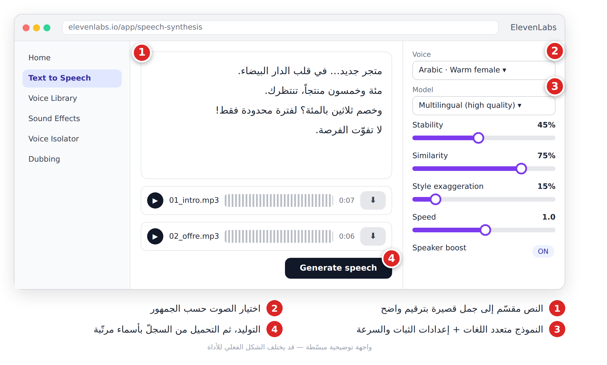
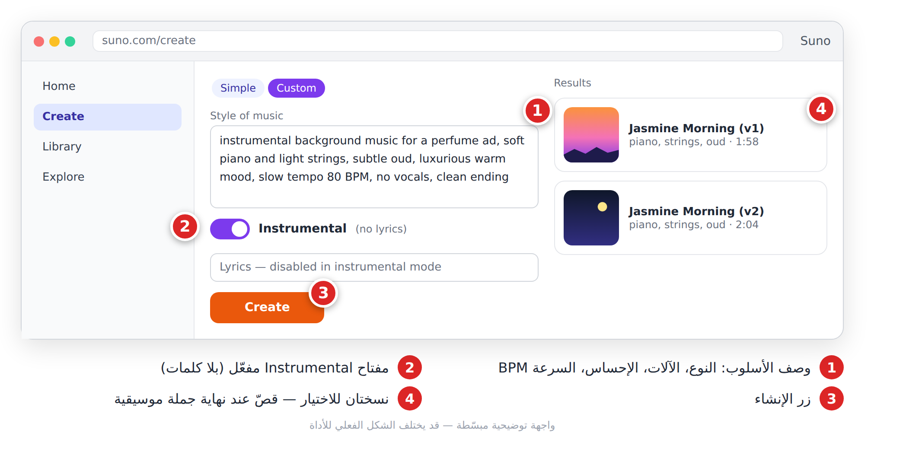
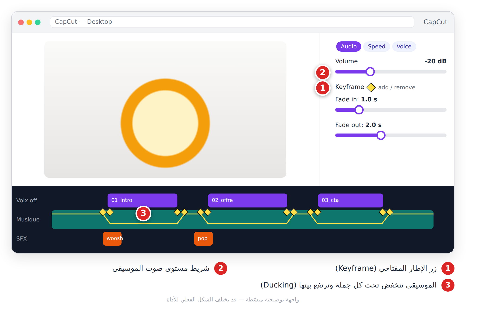

# الفصل 17: الصوت للفيديو: التعليق والموسيقى والمؤثرات (**Voix off, musique et effets**)

> «الناس يسامحون صورة متوسطة، لكنهم لا يسامحون صوتاً سيئاً.»

## 🎯 ماذا ستتعلم في هذا الفصل

- كتابة نص للأذن، ثم تحويله إلى تعليق صوتي (**Voix off**) بـ ElevenLabs.
- توليد موسيقى خلفية (**Musique de fond**) بـ Suno، ومؤثرات صوتية (**Effets sonores — SFX**).
- ضبط المستويات (**Niveaux audio**) والخفض التلقائي (**Ducking**).

---

## 17-1 ثلاث طبقات صوتية

| الطبقة | دورها | مثال |
|---|---|---|
| التعليق الصوتي | يحمل المعلومة | «ثلاث نصائح لتوفير المال…» |
| الموسيقى | تصنع الإحساس والإيقاع | عود هادئ، بيت حماسي |
| المؤثرات | تشدّ الانتباه | «ووش» عند الانتقال، نقرة |

ترتيب العمل: النص ← الصوت ← الموسيقى ← المؤثرات ← الخلط (**Mixage**).

> 💡 **نصيحة:** سجّل التعليق **قبل** توليد مقاطع الفيديو. مدة كل جملة تحدد مدة كل لقطة.

---

## 17-2 اكتب للأذن (Écrire pour la voix)

أدوات الصوت تقرأ ما تعطيها حرفياً، وتعتمد على الترقيم لتتنفّس.

1. جمل قصيرة (8–15 كلمة)، فكرة واحدة لكل جملة.
2. الأرقام بالحروف: «ثلاثون بالمئة» لا «30%».
3. شكّل الكلمات الملتبسة، واكتب الأجنبية كما تُنطق («تيك توك»).
4. الفاصلة = نَفَس، النقطة = وقفة، «؟» = صعود النبرة، «…» = تشويق.

**القاعدة:** 2 إلى 2.5 كلمة في الثانية. فيديو 30 ثانية = 60–75 كلمة.

```
Réécris ce texte pour une voix off de vidéo verticale de 30 secondes, en arabe standard simple.
Règles : phrases de 8 à 15 mots, une idée par phrase, chiffres en toutes lettres,
points de suspension (…) pour les pauses dramatiques, appel à l'action final.
Donne la durée estimée de lecture. Texte : [colle ton texte ici]
```

---

## 17-3 التعليق الصوتي بـ ElevenLabs

**ما هي:** منصة تحويل النص إلى كلام (**Synthèse vocale — Text to Speech**) بأصوات طبيعية تدعم العربية، مع مكتبة أصوات ومؤثرات وعزل للصوت.

1. افتح **Text to Speech** والصق نصك المقسّم.
2. اختر صوتاً من **Voice Library** حسب الجمهور: دافئ للإعلان، شاب للنصائح، عميق للوثائقي.
3. اختر نموذجاً **متعدد اللغات** عالي الجودة للنسخة النهائية.
4. اضبط: الثبات (**Stability**) 40–50% للإعلان و55–65% للوثائقي، السرعة 0.9–1.1.
5. ولّد **فقرة فقرة**، لا النص كاملاً: تعيد الجملة الخاطئة فقط.
6. حمّل بأسماء مرتّبة: `01_intro.mp3`, `02_offre.mp3`…



*الشكل 17-1: النص المقسّم، اختيار الصوت والنموذج، الإعدادات، وسجلّ الملفات المولّدة.*

> 💡 **نصيحة:** صوت «روبوتي»؟ اخفض الثبات. تلعثم وأصوات غريبة؟ ارفعه.

> ⚠️ **تحذير:** لا تستنسخ (**Clonage vocal**) صوت شخص حقيقي دون موافقته المكتوبة. استنساخ صوتك أنت مسموح.

---

## 17-4 الموسيقى بـ Suno

**ما هي:** أداة تولّد مقطعاً موسيقياً كاملاً من وصف نصي. للخلفية نستعمل الوضع **Instrumental** (بلا كلمات) حتى لا تتصادم مع الصوت.

| الإحساس | النوع | BPM |
|---|---|---|
| حماس (نصائح) | Pop électro | 110–130 |
| فخامة (عطر) | Piano + cordes | 70–90 |
| أصالة (منتج تقليدي) | Oud, percussions douces | 80–100 |
| تشويق (وثائقي) | Cinématique, ambient | 60–80 |

1. افتح **Create** بالوضع **Custom**.
2. اكتب الأسلوب: النوع + الآلات + الإحساس + BPM.
3. فعّل **Instrumental** ← **Create**، واختر الأفضل من النسختين.
4. قصّ عند نهاية جملة موسيقية، أو أضف تلاشياً (**Fade out**) 1–2 ثانية.



*الشكل 17-2: وصف الأسلوب، مفتاح Instrumental، ونسختان ناتجتان.*

```
Musique instrumentale de fond pour publicité de parfum, piano doux, cordes légères, oud discret,
ambiance luxueuse et chaleureuse, 80 BPM, sans voix, fin propre
```
🇬🇧 بالإنجليزية:
```
instrumental background music for a perfume ad, soft piano, light strings, subtle oud, luxurious warm mood, 80 BPM, no vocals, clean ending
```

```
Beat instrumental énergique pour vidéo TikTok de conseils, pop électro, claquements de mains, 120 BPM, sans voix
```
🇬🇧 بالإنجليزية:
```
energetic instrumental beat for a TikTok tips video, electro pop, hand claps, 120 BPM, no vocals
```

> ⚠️ **تحذير:** حقوق الاستعمال التجاري مرتبطة بنوع الاشتراك عند التوليد. ولا تضع أغنية مشهورة في إعلان: المنصة ستكتم الصوت.

---

## 17-5 المؤثرات الصوتية

قليل منها يجعل الفيديو احترافياً: **Whoosh** عند الانتقال، **Pop** عند ظهور رقم، **بريق** عند كشف المنتج، **أجواء** (سوق، بحر) في البداية. أداة **Sound Effects** في ElevenLabs تولّدها من وصف:

```
Bruit d'un spray de parfum, une seule pulvérisation courte et nette, en studio, sans écho
```
🇬🇧 بالإنجليزية:
```
perfume spray, one short crisp spritz, studio recording, no reverb
```

---

## 17-6 الخلط وضبط المستويات

في برامج المونتاج **0 dB هو الحد الأقصى**؛ تجاوزه يكسّر الصوت (**Saturation**).


*الشكل 17-3: مستويات الذروة المقترحة لكل طبقة.*

| الطبقة | الذروة المقترحة |
|---|---|
| التعليق الصوتي | ‎-6 إلى ‎-3 dB |
| الموسيقى تحت الكلام | ‎-20 إلى ‎-18 dB |
| الموسيقى وحدها | ‎-12 إلى ‎-8 dB |
| المؤثرات | ‎-15 إلى ‎-10 dB |
| المجموع | لا يتجاوز ‎-1 dB |

### الخفض التلقائي (Ducking)

الموسيقى **تنخفض عند الكلام وترتفع في الفراغات**.


*الشكل 17-4: الموسيقى تنخفض أثناء الجمل وتعود بينها بانتقالات ناعمة.*

1. ضع الموسيقى في مسار تحت الصوت.
2. أضف إطارين مفتاحيين (**Keyframes**) قبل كل جملة بـ 0.3 ثانية، واخفض المستوى بينهما.
3. كرّر بعد نهاية الجملة لترفعه.



*الشكل 17-5: الإطارات المفتاحية ترسم منحنى الموسيقى تحت كل جملة.*

> 💡 **نصيحة:** استمع على **مكبّر الهاتف**؛ معظم جمهورك يسمع منه.

---

## 📝 الخلاصة

- ثلاث طبقات: صوت، موسيقى، مؤثرات — لكل منها مستوى.
- اكتب للأذن: جمل قصيرة، أرقام بالحروف، ترقيم يتحكم في النبرة.
- ElevenLabs: ولّد فقرة فقرة وسمِّ الملفات بالترتيب.
- Suno: Instrumental فقط، واختر حسب الإحساس.
- الموسيقى حوالي ‎-20 dB تحت الكلام، والمجموع تحت ‎-1 dB، مع Ducking.

## 🛠️ تمرين

اصنع «حزمة صوت» لفيديو 30 ثانية لمقهى في حيّك: نص 65 كلمة محسّن للأذن، 4 ملفات صوت من ElevenLabs، موسيقى «دافئة وصباحية» من Suno، مؤثر صبّ القهوة، ثم اخلطها في CapCut بالمستويات والـ Ducking.
