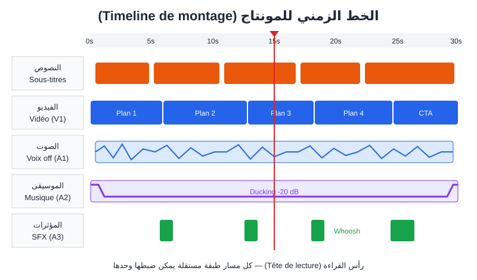
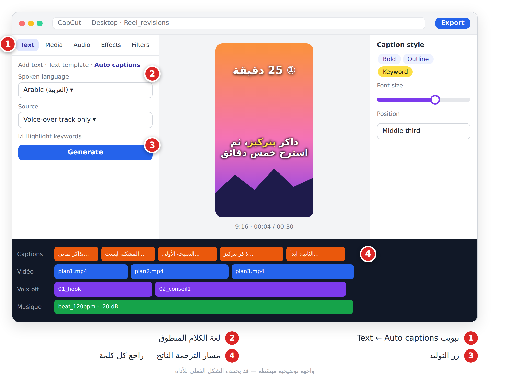
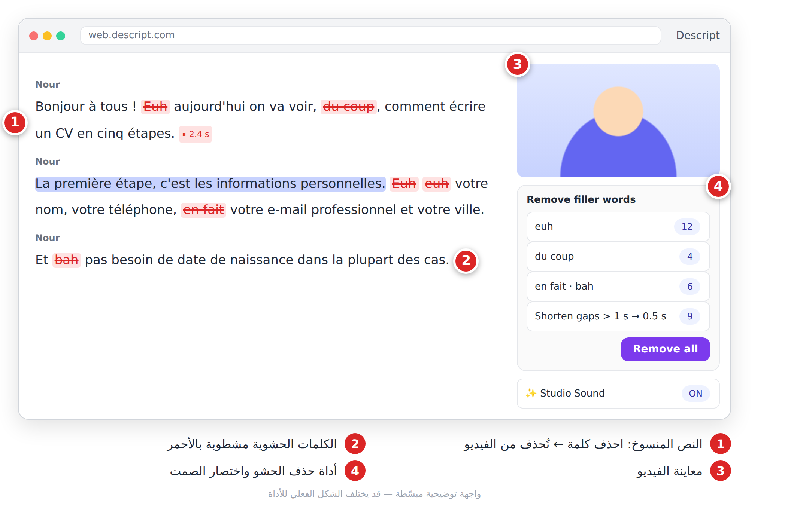
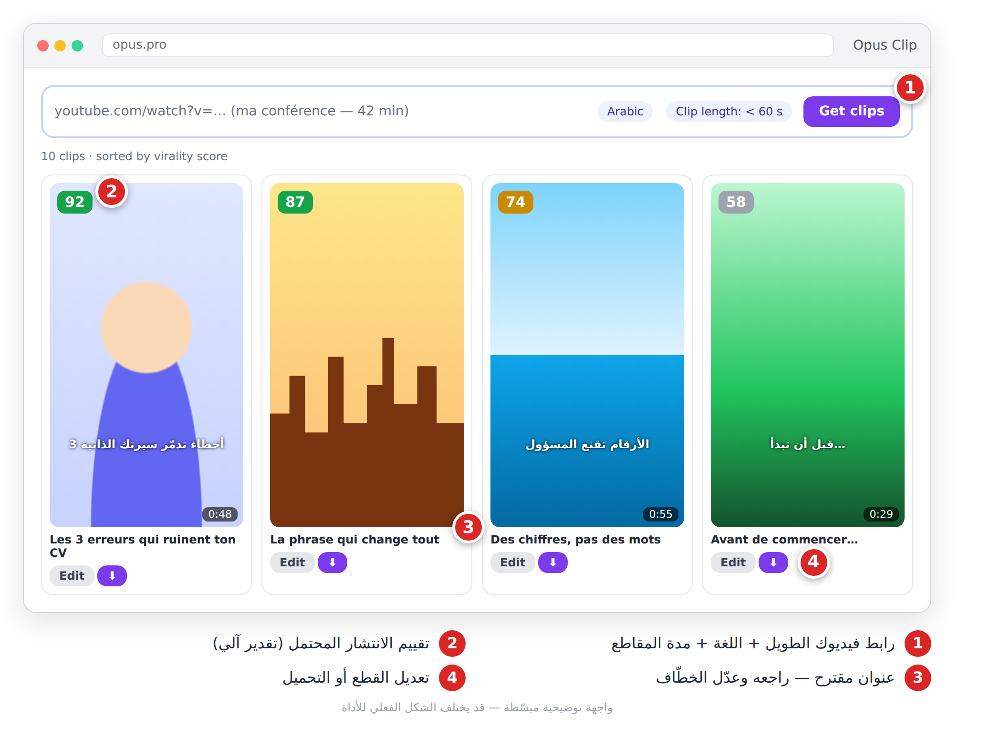
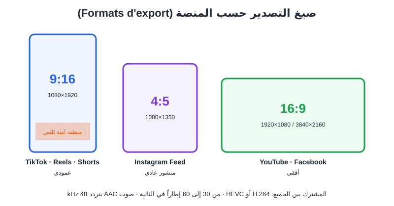
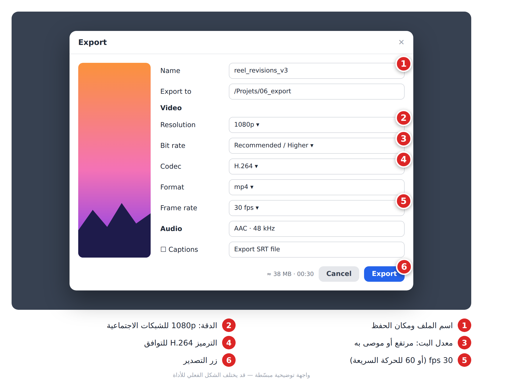
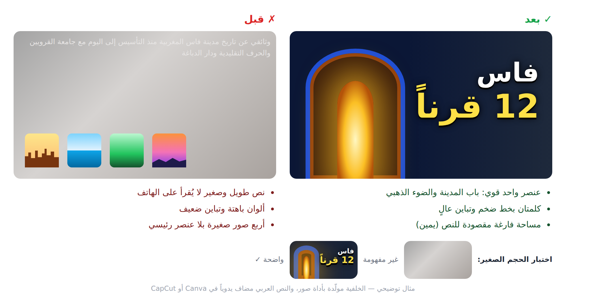

# الفصل 18: المونتاج بالذكاء الاصطناعي (**Montage**)

> المونتاج هو المكان الذي تتحوّل فيه المقاطع المتفرقة إلى قصة.

## 🎯 ماذا ستتعلم في هذا الفصل

- منطق الخط الزمني (**Timeline**) والمسارات (**Pistes**).
- CapCut: الترجمة النصية التلقائية (**Sous-titres automatiques**) والتصدير.
- Descript: المونتاج بالنص (**Montage par le texte**).
- Opus Clip: تقطيع فيديو طويل إلى مقاطع قصيرة.
- الترجمة إلى لغات أخرى، إعدادات كل منصة، والصورة المصغّرة (**Miniature**).

---

## 18-1 كيف يفكّر المونتير؟

كل البرامج تعمل بنفس المنطق: **خط زمني أفقي** و**مسارات** فوق بعضها. المسار الأعلى يظهر فوق الأسفل، والمسارات الصوتية تُسمع معاً.



*الشكل 18-1: خط زمني لفيديو 30 ثانية: نصوص، فيديو، صوت، موسيقى، مؤثرات.*

**ترتيب العمل:** فرز اللقطات (**Dérushage**) ← التعليق الصوتي أولاً ثم اللقطات فوقه ← حذف كل ثانية ميتة ← نصوص وترجمة ← صوت (الفصل 17) ← تلوين (**Étalonnage**) ← تصدير.

> 💡 **نصيحة:** مقاطع الذكاء الاصطناعي تأتي بألوان مختلفة. **مرشّح خفيف واحد على كل الفيديو** يوحّدها.

---

## 18-2 CapCut — المونتاج الشامل

**ما هو:** برنامج مونتاج على الهاتف والحاسوب والمتصفح، مصمم للفيديو العمودي، بميزات ذكاء اصطناعي كثيرة (جزء منها في خطة Pro).

1. **مشروع جديد**، ثم اسحب ملفاتك إلى **Media** فالخط الزمني.
2. اختر النسبة (**Ratio**): 9:16 للعمودي، 16:9 للأفقي.
3. ضع التعليق الصوتي، ثم افتح أداة الترجمة النصية التلقائية (**Auto captions**؛ تجدها في قائمة Text أو Captions حسب الإصدار).
4. اختر **لغة الكلام** (العربية…) ← **Generate**.
5. **راجع كل كلمة** (الأسماء واللهجات)، ثم طبّق نمطاً بخط عريض وإبراز للكلمة المفتاحية.



*الشكل 18-2: تبويب Text، لغة الكلام، زر التوليد، ومسار الترجمة الناتج.*

**قواعد الترجمة النصية:** سطر أو اثنان (3–6 كلمات)، في الثلث الأوسط **بعيداً عن أزرار المنصة**، خط بحدّ (**Contour**)، ولون للكلمة المفتاحية. كثيرون يشاهدون **دون صوت**.

**ميزات أخرى مفيدة:** إزالة الخلفية (**Remove background**) دون شاشة خضراء، القوالب (**Templates**)، تحويل النص إلى كلام للمسودات، تحسين الصوت، إعادة التأطير التلقائي (**Auto reframe**)، تحديد الإيقاع (**Beat**). أسماؤها تتغيّر؛ ابحث بشريط البحث.

> ⚠️ **تحذير:** القوالب الرائجة يستعملها الآلاف. استعملها للسرعة ثم أضف ألوانك وصوتك.

---

## 18-3 Descript — المونتاج بالنص

**ما هو:** يحوّل الفيديو إلى نص مكتوب (**Transcription**)؛ تحذف جملة من النص فتُحذف من الفيديو. مثالي للدروس والبودكاست والمقابلات.

1. أنشئ مشروعاً واستورد الفيديو، واختر لغة التسجيل.
2. انتظر النسخ؛ يظهر النص كمستند والمعاينة بجانبه.
3. احذف أو انقل الكلمات مباشرة في النص.
4. افتح **Remove filler words**: «euh»، «du coup»، «يعني»… ← **Remove all**.
5. اختصر الصمت الطويل (**Shorten word gaps**) إلى 0.5 ثانية، وفعّل **Studio Sound**.



*الشكل 18-3: النص المنسوخ، الحشو المشطوب بالأحمر، وأداة الحذف الجماعي.*

> ⚠️ **تحذير:** النسخ العربي أقل دقة من الفرنسي. جرّب على مقطع قصير أولاً.

> 💡 **نصيحة:** لا تحذف كل الوقفات؛ الكلام دون تنفّس يبدو آلياً.

---

## 18-4 Opus Clip — من فيديو طويل إلى عشرة مقاطع

**ما هو:** يستخرج **أفضل اللحظات** من فيديو طويل (محاضرة، بودكاست) كمقاطع عمودية مع ترجمة نصية وتقييم للانتشار (**Virality score**).

1. الصق رابط فيديوك **أنت** أو ارفع الملف.
2. اختر اللغة ومدة المقاطع (مثلاً أقل من 60 ث) ثم زر التوليد.
3. راجع المقاطع المرتّبة حسب التقييم.
4. عدّل البداية: **الخطّاف** (**Accroche**) في أول 3 ثوانٍ، وصحّح الترجمة.
5. حمّل أو انشر.



*الشكل 18-4: رابط الفيديو، المقاطع المستخرجة بتقييماتها، وأزرار التعديل والتحميل.*

> 💡 **نصيحة:** التقييم تقدير آلي. اختر المقاطع التي تحمل **فكرة كاملة**.

> ⚠️ **تحذير:** لا تقطع فيديوهات الآخرين وتنشرها كأنها لك.

---

## 18-5 الترجمة إلى لغات أخرى

| الحاجة | الطريقة |
|---|---|
| ترجمة نصية بلغة الكلام | CapCut Auto captions ثم مراجعة |
| ترجمة إلى لغة أخرى | تصدير **SRT** وترجمته بـ ChatGPT أو Claude |
| ترجمة نصية في YouTube | رفع ملف SRT في YouTube Studio |
| دبلجة الصوت | ElevenLabs Dubbing أو HeyGen، مع مراجعة متحدث أصلي |

```
Traduis ce fichier de sous-titres SRT de l'arabe vers le français.
Garde exactement la même numérotation et les mêmes horodatages, ne fusionne pas les blocs,
maximum 42 caractères par ligne, style naturel et oral, noms propres inchangés.
Fichier : [colle le contenu SRT ici]
```

---

## 18-6 التصدير حسب المنصة



*الشكل 18-5: عمودي 9:16، منشور 4:5، أفقي 16:9.*

| المنصة | النسبة | الدقة | المدة المناسبة | ملاحظة |
|---|---|---|---|---|
| TikTok | 9:16 | 1080×1920 | 15–60 ث | فراغ أسفل الشاشة ويمينها |
| Reels | 9:16 | 1080×1920 | 15–90 ث | الغلاف يُقصّ في شبكة الحساب: ضع العنوان في الوسط |
| Shorts | 9:16 | 1080×1920 | قصير (راجع الحد الأقصى الحالي) | حلقة ذكية (Boucle) |
| YouTube | 16:9 | 1920×1080 أو 4K | 5–20 د | مصغّرة + فصول في الوصف |

**مشترك:** MP4، H.264 (أو HEVC إن قبلته المنصة)، صوت AAC 48 kHz، و30 fps (60 للحركة السريعة).

> ℹ️ المدد القصوى ونِسَب الأغلفة تتغير من منصة لأخرى ومع التحديثات؛ راجع صفحة المساعدة في كل منصة قبل النشر.



*الشكل 18-6: الاسم، الدقة، معدل البت، الترميز، عدد الإطارات، وزر التصدير.*

> ⚠️ **تحذير:** حدود المدة والحجم تتغيّر؛ راجع صفحة المساعدة قبل حملة مهمة.

---

## 18-7 الصورة المصغّرة (Miniature)

على YouTube، **المصغّرة + العنوان** يقرّران النقر.

1. ولّد خلفية بعنصر واحد قوي ومساحة فارغة للنص.
2. أضف وجهك (خلفية مُزالة) أو عنصراً من الفيديو.
3. أضف **3–5 كلمات** عربية **يدوياً** في Canva أو CapCut (أدوات الصور تشوّه الحروف العربية).
4. صغّرها إلى حجم طابع بريدي: هل ما زالت مفهومة؟

```
Miniature YouTube 16:9, une ancienne porte de médina marocaine en bois sculpté entrouverte,
lumière dorée mystérieuse à l'intérieur, à droite espace vide sombre pour du texte,
contraste fort, or et bleu nuit, style photo cinématique, sans texte
```
🇬🇧 بالإنجليزية:
```
YouTube thumbnail, old carved wooden Moroccan medina door slightly open, golden light inside,
empty dark space on the right for text, strong contrast, gold and midnight blue, cinematic, no text --ar 16:9
```



*الشكل 18-7: نص طويل باهت مقابل عنصر واحد وكلمات قليلة بتباين عالٍ.*

> 💡 **نصيحة:** إن أتاح YouTube **اختبار عدة مصغّرات** (Test & Compare)، صمّم 2–3 نسخ ودع الأرقام تقرّر.

---

## 📝 الخلاصة

- الصوت أولاً على الخط الزمني، ثم اللقطات، ثم النصوص.
- CapCut: ترجمة تلقائية مراجَعة، بعيدة عن أزرار المنصة.
- Descript: عدّل الفيديو كمستند واحذف الحشو.
- Opus Clip: مقاطع قصيرة من محتواك الطويل، بخطّاف قوي.
- صدّر MP4 H.264 بالنسبة الصحيحة، ومصغّرة بكلمات قليلة وتباين عالٍ.

## 🛠️ تمرين

خذ فيديو تتكلم فيه 3 دقائق: نظّفه في Descript، استخرج منه مقطعين بـ Opus Clip، أضف ترجمة عربية في CapCut وملف SRT فرنسياً مترجماً بالبرومبت أعلاه، ثم صدّر نسخة 9:16 ومصغّرة 16:9.
