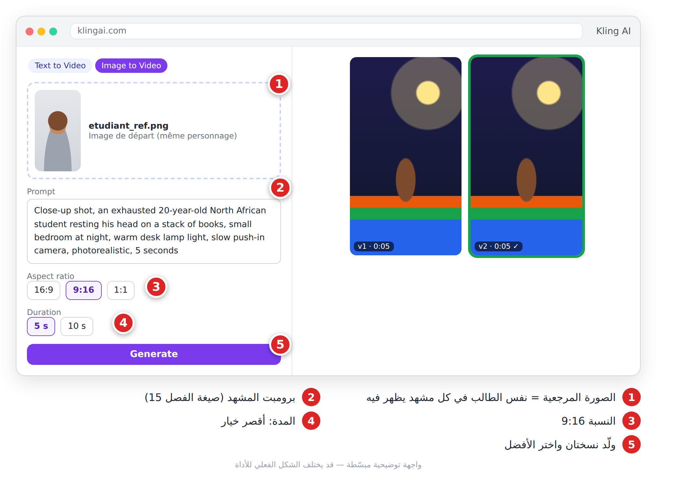
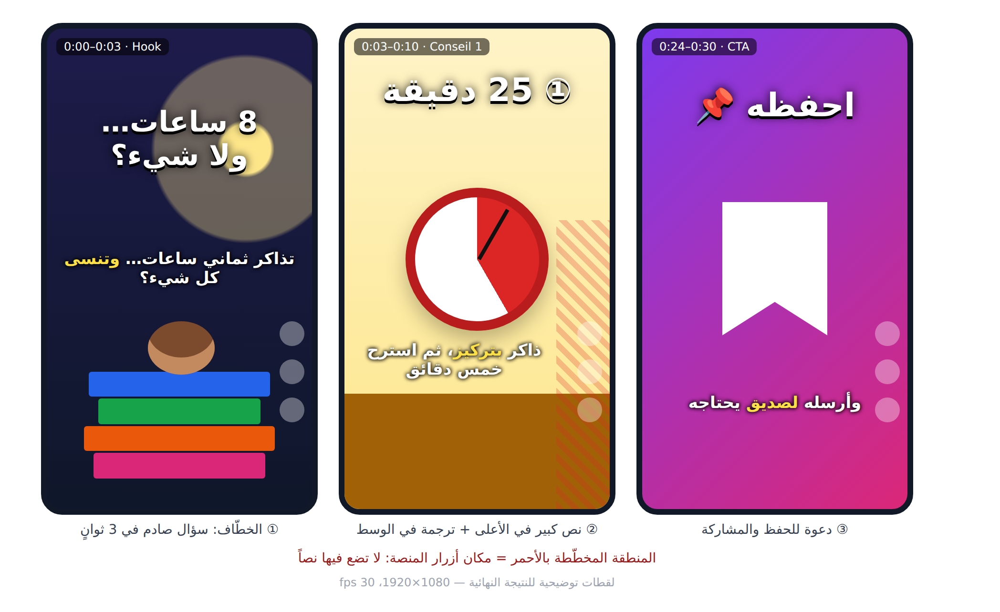
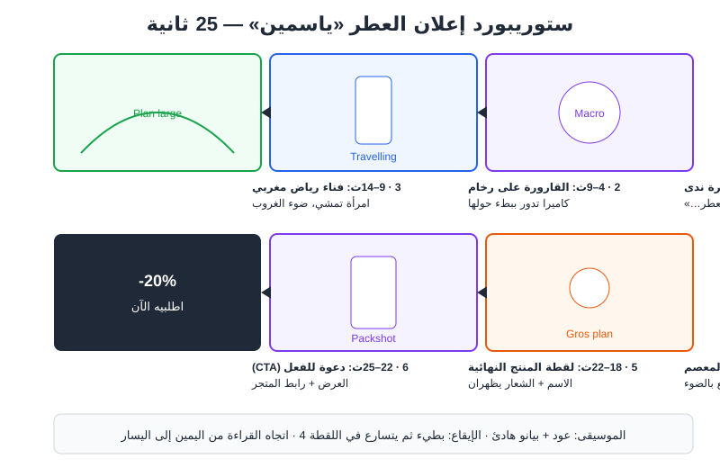
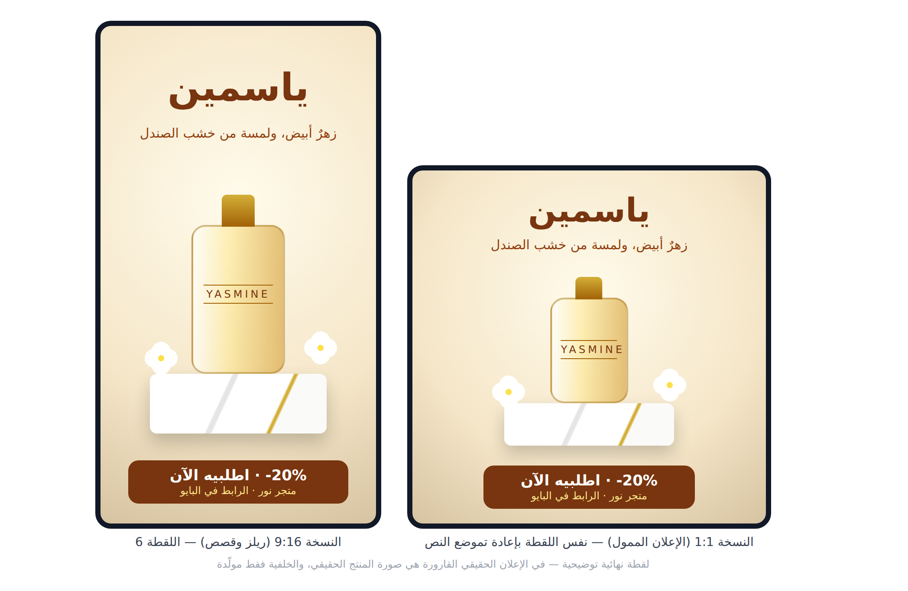
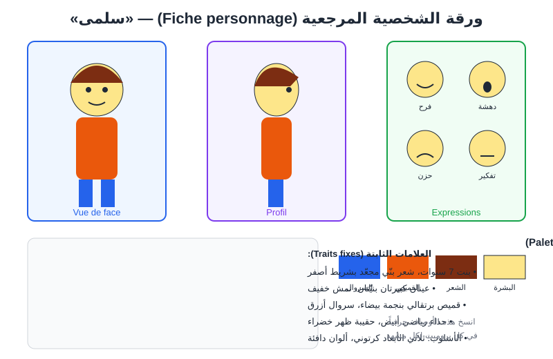
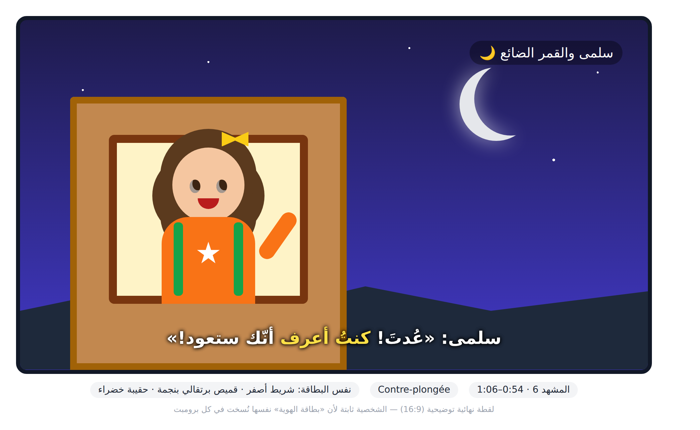
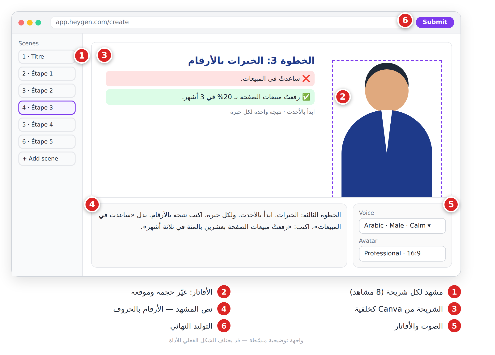
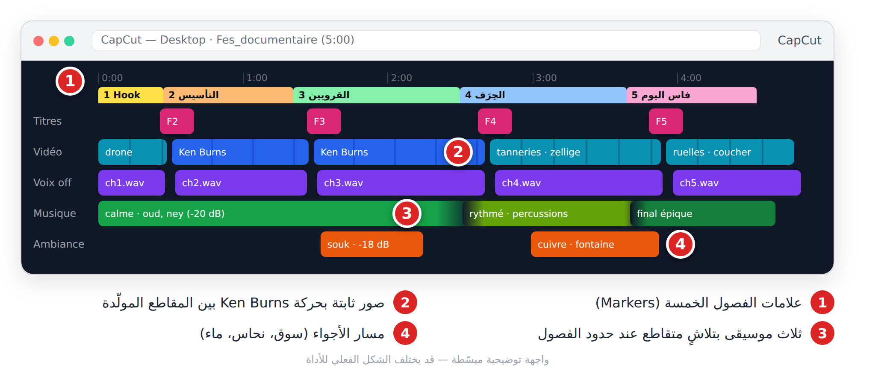
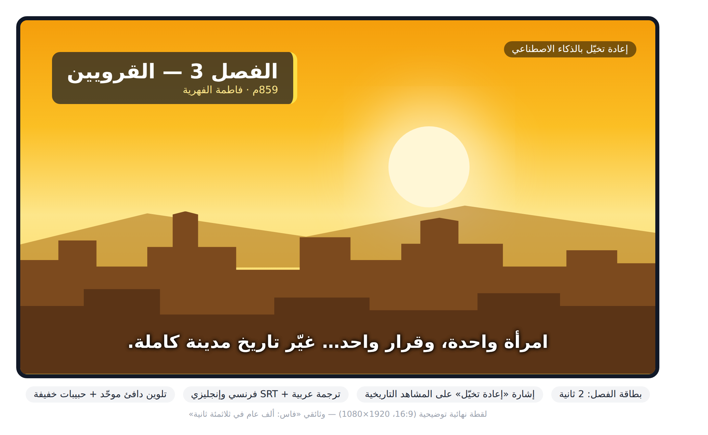

# الفصل 19: خمسة مشاريع فيديو كاملة من البداية إلى النهاية

> تعلّمت الأدوات واحدة واحدة. الآن نجمعها في مشاريع حقيقية، من الفكرة إلى زر «نشر».

## 🎯 ماذا ستتعلم في هذا الفصل

- تطبيق سلسلة الإنتاج (**Chaîne de production**) على خمسة أنواع من الفيديو.
- كتابة سكريبت (**Script**) وستوريبورد (**Storyboard**) جاهزين للتنفيذ.
- الحفاظ على ثبات الشخصية (**Cohérence du personnage**)، وتحضير النشر (**Publication**).

---

## كيف تستعمل هذا الفصل؟

كل مشروع «وصفة» تنفّذها كما هي ثم تغيّر الموضوع. صيغة برومبت الفيديو من الفصل 15:

**[Type de plan] + [Sujet] + [Action] + [Décor] + [Lumière] + [Mouvement de caméra] + [Style] + [Ambiance] + [Durée]**

| المشروع | المدة | الصيغة | الأدوات | الصعوبة |
|---|---|---|---|---|
| 1. ريلز نصائح | 30 ث | 9:16 | ChatGPT، Kling، ElevenLabs، CapCut | ⭐ |
| 2. إعلان عطر | 25 ث | 9:16 + 1:1 | Midjourney، Runway أو Kling، ElevenLabs، Suno، CapCut | ⭐⭐ |
| 3. قصة أطفال | 75 ث | 16:9 | Midjourney، Kling، ElevenLabs، Suno، CapCut | ⭐⭐⭐ |
| 4. درس بأفاتار | 2 د | 16:9 | ChatGPT، Canva، HeyGen، CapCut | ⭐⭐ |
| 5. وثائقي | 5 د | 16:9 | Claude، Midjourney، Veo أو Kling، ElevenLabs، Suno، CapCut | ⭐⭐⭐⭐ |

> 💡 **نصيحة:** لكل مشروع مجلد: `01_script` ، `02_images` ، `03_videos` ، `04_audio` ، `05_montage` ، `06_export`.

---

## المشروع 1: ريلز 30 ثانية — «3 نصائح لتنظيم وقت المذاكرة»

**الهدف:** فيديو عمودي لطلاب الجامعة والبكالوريا، هدفه **الحفظ والمشاركة**.
**الأدوات:** ChatGPT ← Kling (صورة إلى فيديو) ← ElevenLabs ← CapCut.

**السكريبت (≈ 70 كلمة):**
> **[0–3]** تذاكر ثماني ساعات… وتنسى كل شيء؟ المشكلة ليست فيك.
> **[3–10]** النصيحة الأولى: قاعدة خمسٍ وعشرين دقيقة. ذاكر بتركيز، ثم استرح خمس دقائق.
> **[10–17]** الثانية: ابدأ بالمادة الأصعب… في الصباح، حين يكون عقلك في قمّته.
> **[17–24]** الثالثة: الهاتف؟ في غرفة أخرى. نعم، في غرفة أخرى!
> **[24–30]** احفظ الفيديو لتجربها غداً… وأرسله لصديق يحتاجه.

| # | الوقت | الصورة | النص على الشاشة |
|---|---|---|---|
| 1 | 0–3 | طالب منهك فوق كتب ليلاً | «8 ساعات… ولا شيء؟» |
| 2 | 3–10 | مؤقّت ومكتب منظّم | «① 25 دقيقة» |
| 3 | 10–17 | طالبة تكتب عند الشروق | «② الأصعب أولاً» |
| 4 | 17–24 | هاتف يُوضع في درج | «③ الهاتف بعيداً» |
| 5 | 24–30 | خلفية ملوّنة + أيقونة حفظ | «احفظه 📌» |

**برومبت الصورة المرجعية** (ليبقى الطالب نفسه في كل اللقطات):
```
Portrait d'un étudiant maghrébin de 20 ans, cheveux courts bruns bouclés, barbe légère,
sweat à capuche gris, lumière douce, fond neutre, photo réaliste, format vertical
```
🇬🇧 بالإنجليزية:
```
portrait of a 20-year-old North African male student, short curly brown hair, light stubble, grey hoodie, soft light, neutral background, photorealistic --ar 9:16
```

**برومبت المشهد 1:**
```
Plan rapproché, un étudiant maghrébin de 20 ans épuisé, la tête posée sur une pile de livres, petite chambre la nuit,
lumière chaude d'une lampe de bureau, lente avancée de la caméra, style photo réaliste, ambiance fatiguée, 4 secondes, 9:16
```
🇬🇧 بالإنجليزية:
```
Close-up, an exhausted 20-year-old North African student resting his head on a stack of books, small bedroom at night, warm desk lamp light, slow push-in, photorealistic, tired mood, 4 seconds, vertical 9:16
```


*الشكل 19-1: الصورة المرجعية، البرومبت، النسبة 9:16، المدة، ونسختان للاختيار.*

**المونتاج والنشر:**
1. خمسة ملفات صوت (صوت شاب، ثبات 40%) على مسار واحد بفاصل 0.2 ث، والمقاطع فوقها.
2. Auto captions ← تصحيح ← خط عريض وإبراز أصفر.
3. موسيقى 120 BPM مرخّصة بمستوى ‎-20 dB، و«Pop» عند كل رقم.
4. صدّر 1080×1920، 30 fps.
5. **أول سطر:** «تذاكر كثيراً وتنسى؟ جرّب هذه النصائح الثلاث 📚» + `#مذاكرة #بكالوريا #studytips` + خانة «محتوى مولّد بالذكاء الاصطناعي».


*الشكل 19-2: الخطّاف، النصيحة الأولى، والدعوة للحفظ — مع منطقة أزرار المنصة.*

---

## المشروع 2: إعلان عطر «ياسمين» (25 ثانية)

**الهدف:** متجر عطور على إنستغرام يطلق عطراً جديداً. نسخة 9:16 للريلز ونسخة 1:1 للإعلان الممول.
**الأدوات:** صورة حقيقية للقارورة ← Midjourney (الخلفيات) ← Runway أو Kling ← ElevenLabs ← Suno ← CapCut.

> ⚠️ **تحذير:** **المنتج في الإعلان هو المنتج الحقيقي.** استعمل صورة القارورة الحقيقية كصورة أولى (**Image de départ**)، ولا تولّد قارورة متخيّلة.

**السكريبت (صوت أنثوي هادئ):**
> كلّ صباحٍ… يبدأ بعطر. «ياسمين». زهرٌ أبيض، ولمسة من خشب الصندل. رشّة واحدة… وتتذكّرك الأماكن. خصم عشرين بالمئة هذا الأسبوع. اطلبيه الآن.


*الشكل 19-3: ستوريبورد الإعلان في ست لقطات.*

| # | الوقت | اللقطة | الحركة |
|---|---|---|---|
| 1 | 0–4 | Macro: زهرة ياسمين بقطرة ندى | Push-in بطيء |
| 2 | 4–9 | القارورة الحقيقية على رخام | دوران بطيء |
| 3 | 9–14 | امرأة تمشي في فناء رياض | Travelling |
| 4 | 14–18 | رشّة على المعصم | Ralenti |
| 5 | 18–25 | Packshot + «‎-20% · اطلبيه الآن» | ثابتة + ضوء |

**خلفية اللقطة 2:**
```
Socle en marbre blanc veiné d'or sur fond beige doux, quelques fleurs de jasmin, lumière de studio latérale douce,
espace vide au centre pour un flacon de parfum, photo publicitaire de luxe
```
🇬🇧 بالإنجليزية:
```
white marble pedestal with gold veins, soft beige background, a few jasmine flowers, soft side studio light, empty center for a perfume bottle, luxury ad photo --ar 9:16
```

**تحريك اللقطة 2:**
```
Plan serré, le flacon reste parfaitement immobile et inchangé sur le socle, des reflets de lumière glissent sur le verre,
lente orbite de la caméra, style publicité de luxe, 5 secondes
```
🇬🇧 بالإنجليزية:
```
Tight shot, the bottle stays perfectly still and unchanged on the pedestal, light reflections glide across the glass, slow camera orbit, luxury commercial, 5 seconds
```

> 💡 **نصيحة:** إن تشوّه الملصق في كل المحاولات، اجعل القارورة صورة ثابتة مع Zoom بطيء في CapCut. المنتج يبقى صادقاً.

**المونتاج والنشر:**
1. الموسيقى أولاً (بيانو وعود، 80 BPM)، واللقطات على ضرباتها.
2. صوت ElevenLabs (ثبات 50%، سرعة 0.9) بوقفات «…»، ومؤثر رشّ في اللقطة 4.
3. نصوص قليلة: الاسم بخط رفيع، والعرض في الأخيرة فقط. تلوين دافئ موحّد.
4. صدّر 9:16، ثم غيّر النسبة إلى 1:1 وأعد تموضع النصوص.
5. **الوصف:** «زهر الياسمين بلمسة خشب الصندل. خصم 20% حتى الأحد 🚚» + `#عطور #parfum #jasmin`.


*الشكل 19-4: نفس اللقطة الختامية بنسختين، مع العرض والدعوة للفعل.*

---

## المشروع 3: قصة للأطفال — «سلمى والقمر الضائع»

**الهدف:** قصة 75 ثانية لقناة أطفال: سلمى تبحث عن القمر «المختفي» فيشرح لها جدّها أطوار القمر. **التحدي: ثبات الشخصية.**
**الأدوات:** ChatGPT ← Midjourney (مرجع الشخصية) ← Kling أو Runway ← ElevenLabs ← Suno ← CapCut.


*الشكل 19-5: ورقة الشخصية: الأوجه، التعابير، والألوان الثابتة.*

**القاعدة الذهبية:** «بطاقة هوية» تُنسخ **حرفياً** في كل برومبت:
> *Salma : petite fille de 7 ans, cheveux bruns bouclés avec un ruban jaune, grands yeux marron, t-shirt orange avec une étoile blanche, pantalon bleu, sac à dos vert, style animation 3D cartoon.*

**السكريبت المختصر:**
> **الراوي:** كل ليلة، تفتح سلمى نافذتها وتقول: **سلمى:** تصبح على خير يا قمر! **الراوي:** لكن في تلك الليلة… لم تجده! بحثت خلف الشجرة… وتحت الجسر… لا شيء. **الجد:** القمر لم يضِع يا صغيرتي. يختبئ ليلة، ثم يعود هلالاً… ويكبر حتى يصير بدراً. **سلمى:** عدتَ! كنتُ أعرف أنك ستعود! **الراوي:** وأنت؟ هل تعرف شكل القمر الليلة؟

| # | المشهد | التعبير | اللقطة |
|---|---|---|---|
| 1 | قرية جبلية ليلاً، بدر | — | Plan large |
| 2 | سلمى تلوّح للقمر من النافذة | فرح | Plan moyen |
| 3 | سماء بلا قمر | دهشة | Gros plan |
| 4 | سلمى بالمصباح في الحديقة | تفكير | Travelling |
| 5 | الجد بجانبها على مقعد | فضول | Plan moyen |
| 6 | هلال في السماء، سلمى تقفز | فرح | Contre-plongée |

**برومبت ورقة الشخصية:**
```
Fiche de personnage : petite fille de 7 ans, cheveux bruns bouclés avec un ruban jaune, grands yeux marron,
t-shirt orange avec une étoile blanche, pantalon bleu, sac à dos vert, vue de face, de profil, de dos,
quatre expressions (joie, surprise, tristesse, réflexion), style animation 3D cartoon, fond blanc
```
🇬🇧 بالإنجليزية:
```
character sheet, 7-year-old girl, curly brown hair with a yellow ribbon, big brown eyes, orange t-shirt with a white star, blue pants, green backpack, front, side and back views, four expressions, 3D cartoon, white background --ar 16:9
```

**تحريك المشهد 6:**
```
Contre-plongée, Salma saute de joie à la fenêtre en montrant un fin croissant de lune argenté dans le ciel étoilé,
lumière lunaire douce, caméra fixe, style animation 3D cartoon, ambiance joyeuse, 5 secondes
```
🇬🇧 بالإنجليزية:
```
Low-angle shot, Salma jumps with joy at the window pointing at a thin silver crescent moon in the starry sky, soft moonlight, static camera, 3D cartoon, joyful mood, 5 seconds
```

> 💡 **نصيحة:** دائماً **صورة إلى فيديو** بحركة منخفضة. إن تغيّر لون القميص، قصّ الجزء السليم بدل إعادة التوليد عشر مرات.

**المونتاج والنشر:**
1. ثلاثة أصوات: راوٍ دافئ، سلمى (صوت طفولي من المكتبة — لا تستنسخ صوت طفل حقيقي)، جدّ عميق.
2. انتقالات ذوبان (**Fondu enchaîné**) ناعمة، صراصير ليل، و«تينغ» سحري عند الهلال.
3. ترجمة بخط كبير مستدير مع تشكيل الكلمات الصعبة. صدّر 1920×1080.
4. في YouTube Studio اختر **«مُصمَّم للأطفال»** — التزام قانوني — واذكر استعمال الذكاء الاصطناعي.


*الشكل 19-6: نفس الشريط الأصفر والقميص البرتقالي والحقيبة الخضراء في كل مشهد.*

---

## المشروع 4: درس بأفاتار (HeyGen) — «كيف تكتب CV في 5 خطوات»

**الهدف:** درس دقيقتين لمركز تكوين: أفاتار يشرح، وشرائح (**Diapositives**) بجانبه.
**الأدوات:** ChatGPT ← Canva (الشرائح) ← HeyGen ← CapCut.

```
Écris un script de 2 minutes (environ 260 mots) en arabe standard simple pour une vidéo présentée par un avatar :
"Comment écrire un CV en 5 étapes". Public : jeunes diplômés au Maghreb. Ton : professeur bienveillant.
Un exemple concret par étape. Indique [DIAPO X] quand chaque diapositive apparaît.
```

**مقتطف السكريبت:**
> **[DIAPO 4]** الخطوة الثالثة: الخبرات. ابدأ بالأحدث. ولكل خبرة، اكتب نتيجة بالأرقام. بدل «ساعدت في المبيعات»، اكتب: «رفعتُ مبيعات الصفحة بعشرين بالمئة في ثلاثة أشهر».

| # | الوقت | التخطيط | الشريحة |
|---|---|---|---|
| 1 | 0–10 | الأفاتار في الوسط | العنوان |
| 2 | 10–85 | الأفاتار يمين، الشريحة يسار | الخطوات 1–4 + أمثلة ✅ ❌ |
| 3 | 85–100 | الشريحة كاملة، الأفاتار في دائرة | نموذج CV |
| 4 | 100–120 | الأفاتار + زر اشتراك | الملخص والدرس القادم |

**خطوات HeyGen:**
1. فيديو جديد 16:9، اختر أفاتاراً مهنياً (أو أفاتارك بعد تسجيل موافقتك) وصوتاً عربياً.
2. مشهد لكل شريحة، والصق نص فقرته.
3. ارفع الشريحة كخلفية، وحرّك الأفاتار حسب الستوريبورد.
4. اكتب «سي في» والأرقام بالحروف. إن كان النطق غير طبيعي، ارفع صوتاً من ElevenLabs.
5. عاين ثم **Submit**.


*الشكل 19-7: قائمة المشاهد، الأفاتار، الشريحة كخلفية، النص، الصوت، وزر التوليد.*

**المونتاج والنشر:**
1. في CapCut: موسيقى في البداية والنهاية فقط (أو ‎-26 dB كحد أقصى تحت الشرح).
2. ترجمة عربية + SRT فرنسي، وتكبير بطيء على الأفاتار عند الجمل المهمة.
3. **العنوان:** «كيف تكتب سيرة ذاتية (CV) في 5 خطوات»، مع **فصول** بالتوقيت في الوصف.
4. اكتب في الوصف: «المقدّم أفاتار مولّد بالذكاء الاصطناعي».

> ⚠️ **تحذير:** الإفصاح عن الأفاتار شرط. الثقة في المحتوى التعليمي رأس مالك.

---

## المشروع 5: وثائقي يوتيوب — «فاس: ألف عام في ثلاثمئة ثانية»

**الهدف:** وثائقي 5 دقائق عن تأسيس فاس، القرويين، الحِرَف، وفاس اليوم. هدفه **مدة مشاهدة عالية**.
**الأدوات:** Claude أو ChatGPT ← **مصادر موثوقة للتحقق** ← Midjourney ← Veo أو Kling ← ElevenLabs ← Suno ← CapCut.

> ⚠️ **تحذير:** الذكاء الاصطناعي يخطئ في التواريخ. **تحقّق من كل معلومة في مصدرين.** والصور المولّدة **إعادة تخيّل** وليست وثائق: اكتب ذلك على الشاشة وفي الوصف.

```
Tu es scénariste de documentaires YouTube. Écris un script de voix off de 5 minutes (environ 650 mots) en arabe standard
sur l'histoire de Fès : 1) accroche, 2) fondation, 3) Al Quaraouiyine et Fatima al-Fihriya, 4) artisans et tanneries,
5) Fès aujourd'hui. Phrases courtes, questions rhétoriques. Signale par [À VÉRIFIER] chaque date ou chiffre.
```

**مقتطف (الفصل 3):**
> عام ثمانمئة وتسعة وخمسين، امرأة من القيروان تُدعى فاطمة الفهرية ورثت مالاً. ماذا فعلت به؟ لم تبنِ قصراً. بنت مسجداً… صار مكاناً للعلم. امرأة واحدة، وقرار واحد، غيّر تاريخ مدينة كاملة.

| الفصل | الوقت | اللقطات الرئيسية | المادة |
|---|---|---|---|
| 1 الخطّاف | 0:00–0:30 | درون فوق الأسطح، زقاق ضيق | فيديو مولّد |
| 2 التأسيس | 0:30–1:30 | خريطة، بنّاؤون (إعادة تخيّل) | صور + Ken Burns |
| 3 القرويين | 1:30–2:45 | صحن المسجد، مخطوطات | صور + تحريك |
| 4 الحِرَف | 2:45–4:00 | دار الدبّاغة، قصّ الزليج | فيديو مولّد |
| 5 فاس اليوم | 4:00–5:00 | أزقّة، غروب على المدينة | فيديو مولّد |

**وحدة الأسلوب:** أضف نفس اللاحقة لكل برومبت: *style : photographie documentaire cinématique, tons chauds ocre et vert, grain léger*.

```
Plan large en plongée, les cuves rondes de la tannerie de Fès remplies de couleurs rouge, jaune et brun, des artisans au travail,
lumière du matin, lent travelling aérien, photographie documentaire cinématique, tons chauds ocre et vert, 6 secondes
```
🇬🇧 بالإنجليزية:
```
High-angle wide shot, circular stone dye vats of a Fes tannery filled with red, yellow and brown, artisans working, morning light, slow aerial tracking, cinematic documentary, warm ochre and green tones, 6 seconds
```

> 💡 **نصيحة:** لا تحتاج 50 مقطعاً مولّداً. نصف اللقطات **صور ثابتة بتأثير Ken Burns** (تكبير بطيء)، والخرائط تُصنع في Canva لا بالتوليد.

**المونتاج والنشر:**
1. صوت ذكوري عميق (ثبات 60%، سرعة 0.92)، ملف WAV لكل فصل؛ راجع نطق «القرويين» و«الفهرية».
2. ثلاث موسيقى (هادئة، إيقاعية للحِرَف، ختامية) بتلاشٍ متقاطع عند حدود الفصول، وأجواء عند ‎-18 dB.
3. بطاقة لكل فصل، إشارة «إعادة تخيّل»، تلوين دافئ + حبيبات خفيفة لدمج المصادر.
4. ترجمة عربية + SRT فرنسي وإنجليزي. صدّر 1920×1080.
5. مصغّرة «فاس: 1000 عام» (الفصل 18)، فصول ومصادر في الوصف، وخانة «محتوى معدّل أو اصطناعي».


*الشكل 19-8: علامات الفصول، صور Ken Burns، ثلاث موسيقى متتالية، ومسار الأجواء.*


*الشكل 19-9: بطاقة الفصل، إشارة «إعادة تخيّل»، وترجمة واضحة.*

---

## 📝 الخلاصة

- كل مشروع: هدف ← سكريبت ← ستوريبورد ← صور مرجعية ← مشاهد ← صوت ← موسيقى ← مونتاج ← نشر.
- الريلز: خطّاف في 3 ثوانٍ، نصوص كبيرة، ودعوة للحفظ.
- الإعلان: المنتج الحقيقي، حركة بطيئة، ونسختان 9:16 و1:1.
- القصة: بطاقة هوية تُنسخ حرفياً، وصورة إلى فيديو دائماً.
- الأفاتار والوثائقي: تحقّق من المعلومات، وأفصح دائماً عن المحتوى المولّد.

## 🛠️ تمرين

اختر **مشروعاً واحداً** وطبّقه على موضوعك (3 نصائح في مجالك، منتج حقيقي، شخصية جديدة، درس من تخصّصك، أو تاريخ مدينتك). اكتب السكريبت والستوريبورد أولاً، ولا تولّد أي مقطع قبلهما.
