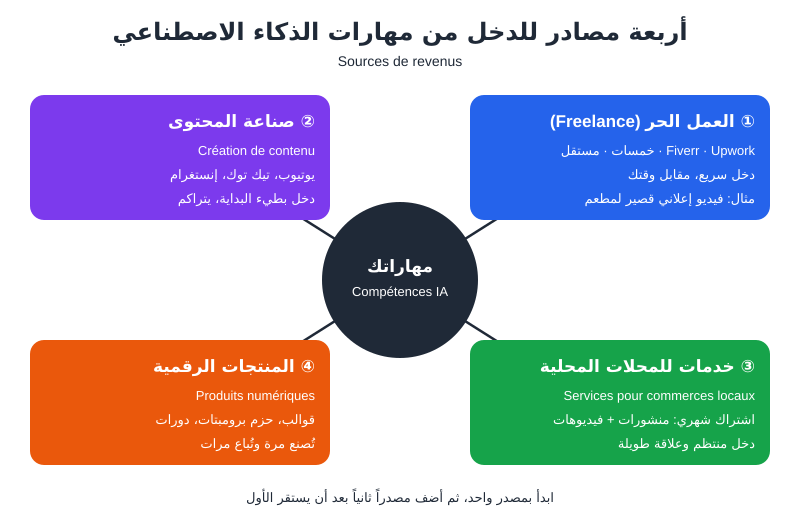
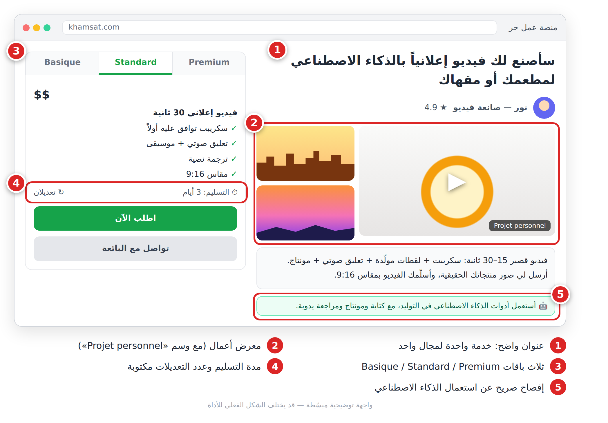
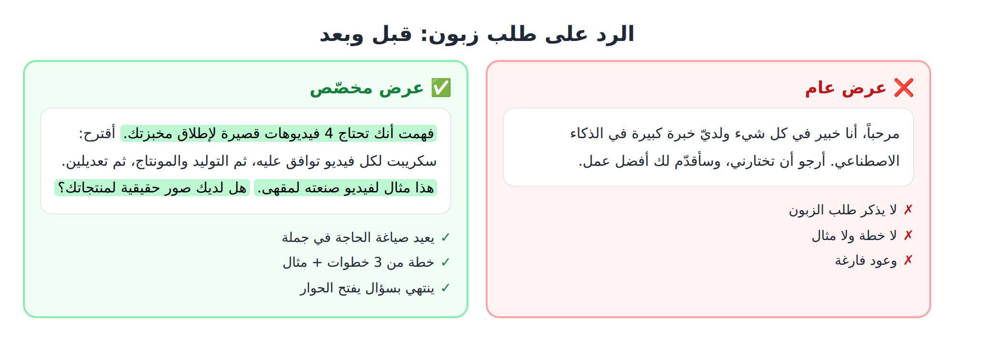
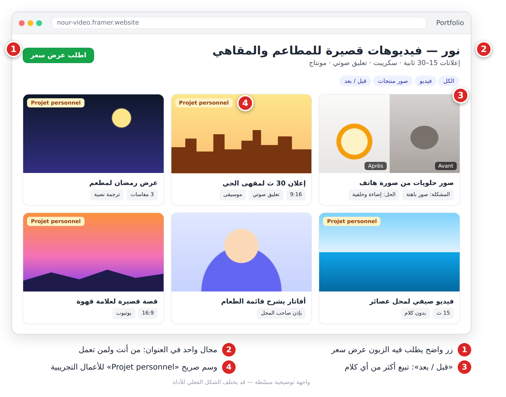
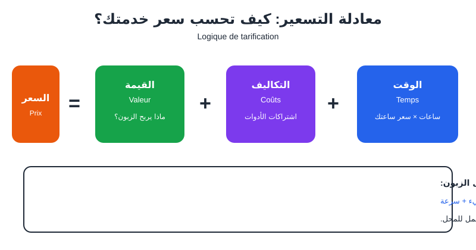

# الجزء الخامس: الاحتراف والربح

# الفصل 20: كيف تربح من مهارات الذكاء الاصطناعي

> الزبون لا يدفع مقابل «الذكاء الاصطناعي»، بل مقابل **نتيجة**: فيديو يجلب زبائن، منشورات تملأ صفحته، صور تبيع منتجه.

## أربعة طرق للربح



*الشكل 20-1: المصادر الأربعة للدخل. ابدأ بواحد ثم أضف الثاني.*

| المصدر | أول دخل | ما يتطلبه | مثال |
|---|---|---|---|
| العمل الحر (**Freelance**) | سريع | ملف أعمال + تواصل جيد | فيديو إعلاني لمطعم |
| خدمات للمحلات المحلية (**Commerces locaux**) | سريع | جرأة + عيّنة مجانية | اشتراك شهري لمخبزة |
| المنتجات الرقمية (**Produits numériques**) | متوسط | حل لمشكلة محددة | 30 برومبتاً لأصحاب المطاعم |
| صناعة المحتوى (**Création de contenu**) | بطيء | انتظام في النشر | قناة «أداة في 60 ثانية» |

> 💡 **نصيحة:** اختر **خدمة واحدة** لمجال واحد. «فيديو 30 ثانية للمقاهي» أقوى من «كل خدمات الذكاء الاصطناعي».

## العمل الحر: خدمتك الأولى

**المنصات:** خمسات ومستقل (زبائن عرب)، Fiverr وUpwork (زبائن من العالم). على خمسات وFiverr تعرض خدمة جاهزة (**Gig**) والزبون يأتيك؛ على مستقل وUpwork ترسل عروضاً (**Propositions**) على مشاريع منشورة.

1. سجّل باسم حقيقي وصورة واضحة.
2. اكتب نبذة قصيرة عمّا تقدّمه **للزبون**، لا عن نفسك.
3. أنشئ الخدمة: عنوان واضح، ثلاث باقات، مدة التسليم، عدد التعديلات.
4. أضف 3 أمثلة من ملف أعمالك.
5. ردّ بسرعة على الرسائل.



*الشكل 20-2: صفحة خدمة جيدة: عنوان لمجال واحد، معرض أعمال، ثلاث باقات، وإفصاح عن الذكاء الاصطناعي.*

> ⚠️ شروط المنصات وعمولاتها (**Commission**) وطرق السحب تتغير وتختلف حسب البلد. اقرأ الشروط الرسمية قبل التسجيل.

**برومبت وصف الخدمة:**

```
Agis comme un expert en rédaction pour plateformes freelance (Fiverr, Khamsat).
Rédige la description d'un service « vidéo publicitaire de 30 secondes pour restaurants ».
Format : titre (max 80 caractères), intro courte, 5 puces « ce que vous obtenez », 3 forfaits (Basique, Standard, Premium) avec délai et nombre de révisions.
Contraintes : ton professionnel et chaleureux, pas de promesses exagérées, mentionne clairement l'utilisation d'outils d'IA.
```

**برومبت الرد على مشروع منشور:**

```
Agis comme un freelance expérimenté.
Annonce du client : [colle l'annonce].
Rédige une proposition de 120 mots maximum qui : 1) reformule le besoin en une phrase, 2) propose une démarche en 3 étapes, 3) cite un exemple similaire : [ton exemple], 4) termine par une question précise.
Ton : direct, poli, sans formules toutes faites.
```



*الشكل 20-3: العرض الناجح قصير، يعيد صياغة حاجة الزبون، وينتهي بسؤال.*

## المحلات القريبة منك

أسرع طريق لدخل منتظم: أغلب المحلات على فيسبوك وإنستغرام بمحتوى ضعيف.

1. اختر 10 محلات في حيّك.
2. اصنع لكل محل **عيّنة مجانية** (صورة أو فيديو 10 ثوانٍ) من صور صفحته.
3. اعرضها: «صنعت لك هذا، إن أعجبك فلدي عرض شهري».
4. اقترح **اشتراكاً شهرياً** (**Abonnement mensuel**) بعدد محدد من المنشورات.

الخدمات الأكثر طلباً: صور منتجات من صور الهاتف، فيديو أسبوعي قصير، قوائم طعام (**Menu**) أنيقة، إعلانات رمضان والعيد والصيف.

## المنتجات الرقمية والمحتوى

- **المنتج الرقمي** يُصنع مرة ويُباع مرات: حزمة برومبتات متخصصة، قوالب منشورات، دليل PDF. بِع حلاً لمشكلة محددة، لا «100 برومبت عام».
- **المحتوى** يبني جمهوراً (**Audience**) تملكه. 3 فيديوهات أسبوعياً لثلاثة أشهر أفضل من 20 في أسبوع ثم الاختفاء.

> ⚠️ قبل بيع أي شيء مولّد، اقرأ **شروط الاستعمال** (**Conditions d'utilisation**) للأداة: هل تسمح بالاستعمال التجاري؟ هل يلزم اشتراك مدفوع؟

## ملف الأعمال (Portfolio)

لا زبون بلا أعمال، ولا أعمال بلا زبون؟ الحل: **مشاريع تجريبية** (**Projets personnels**).

1. اختر مجالاً واحداً (مطاعم، ملابس، تجميل...).
2. اصنع 5 أعمال، انطلاقاً من مشاريع الفصل 19.
3. لكل عمل: المشكلة، ما فعلته، النتيجة.
4. انشرها في صفحة واحدة بسيطة (الفصل 12).
5. أضف لقطات «قبل / بعد» (**Avant / Après**): تبيع أكثر من أي كلام.



*الشكل 20-4: ملف أعمال لمجال واحد، مع «قبل/بعد» ووسم صريح للأعمال التجريبية.*

> ⚠️ اكتب «Projet personnel» على كل عمل تجريبي. لا تضع شعار علامة حقيقية ولا تدّعِ أنها كانت زبونتك.

## منطق التسعير

لا أرقام هنا: الأسعار تختلف بين البلدان والمنصات. لكن طريقة التفكير واحدة.



*الشكل 20-5: السعر = الوقت + التكاليف + القيمة.*

- **الوقت** (**Temps**): بما فيه التواصل والتعديلات. ضاعف تقديرك الأول.
- **التكاليف** (**Coûts**): حصة الاشتراكات، الإنترنت، عمولة المنصة.
- **القيمة** (**Valeur**): ماذا سيربح الزبون؟ إطلاق مطعم أهم من منشور عادي.

| الباقة | مثال: فيديو إعلاني | الهدف |
|---|---|---|
| **Basique** | 15 ث، موسيقى، تعديل واحد | جذب المتردد |
| **Standard** | 30 ث، سكريبت، تعليق صوتي، تعديلان | الباقة التي يختارها أغلب الزبائن |
| **Premium** | 3 مقاسات، ترجمة نصية، تسليم أسرع | المستعجلون والميزانيات الأكبر |

ابحث عن خدمات مشابهة في المنصة، وضع نفسك في الوسط المنخفض للبداية، ثم ارفع أسعارك كلما امتلأ جدولك وتراكمت التقييمات (**Avis clients**).

> 💡 اكتب دائماً **عدد التعديلات** (**Révisions**) ومدة التسليم. «التعديل الصغير الأخير» الذي لا ينتهي هو أصل أغلب المشاكل.

## الصدق: قاعدة عمل لا خيار

1. **أفصح** في وصف خدمتك: «أستعمل أدوات الذكاء الاصطناعي، مع كتابة ومونتاج ومراجعة يدوية».
2. **لا تَعِد** بحصرية أو حقوق كاملة دون التحقق من شروط الأدوات.
3. **اطلب موافقة مكتوبة** قبل استعمال وجه أو صوت أي شخص.
4. **لا تبِع** صوراً مولّدة على أنها «تصوير في الاستوديو».
5. **أظهر المنتج كما هو**: لا حجم أكبر ولا مكونات غير موجودة.

## 📝 الخلاصة

- الزبون يدفع مقابل النتيجة، لا الأداة.
- ابدأ بمصدر دخل واحد وخدمة واحدة لمجال واحد.
- ملف الأعمال يُبنى بمشاريع تجريبية معلنة بصدق.
- السعر = الوقت + التكاليف + القيمة، مع تعديلات ومدة مكتوبة.
- الإفصاح والموافقة واحترام الحقوق أساس سمعتك.

## 🛠️ تمرين

**أطلق عرضك في 7 أيام:** اختر خدمة ومجالاً (يوم 1)، اصنع 3 أعمال تجريبية (يوما 2–3)، اكتب وصف الخدمة بالبرومبت أعلاه (يوم 4)، صمّم باقاتك الثلاث (يوم 5)، انشرها على منصة واحدة (يوم 6)، ثم اعرض عيّنة مجانية على 3 محلات (يوم 7).

---

➡️ الفصل التالي: [الفصل 21: خطة تعلّم 30 يوماً](ch21.md)
