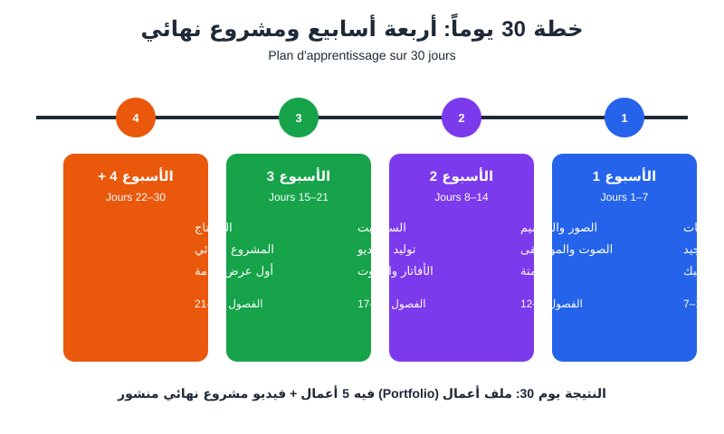
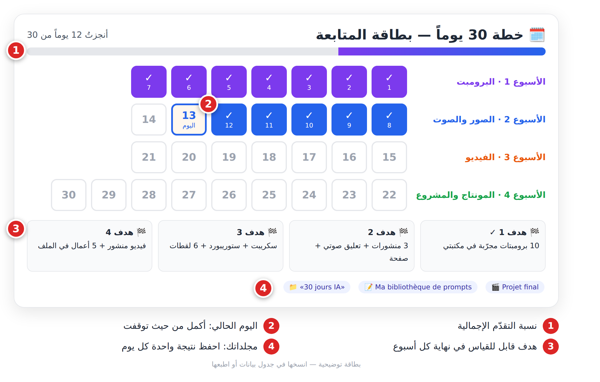

# الفصل 21: خطة تعلّم 30 يوماً (**Plan de 30 jours**)

## 🎯 ماذا ستتعلم في هذا الفصل

- خطة يومية لـ 30 يوماً مرتبطة بفصول الكتاب.
- أهداف كل أسبوع.
- المشروع النهائي.

> القراءة تمنحك **معرفة**، والممارسة اليومية تمنحك **مهارة**. هذه خطة لـ30 إلى 60 دقيقة يومياً، بالنسخ المجانية من الأدوات.



*الشكل 21-1: الأسابيع الأربعة، من الأساسيات إلى المشروع النهائي.*

## 21-1 قبل اليوم الأول

1. أنشئ مجلداً «30 jours IA» فيه مجلد لكل أسبوع ومجلد «Projet final».
2. افتح ملف «Ma bibliothèque de prompts» واحفظ فيه كل برومبت نجح.
3. حدّد ساعة ثابتة كل يوم، واحفظ **نتيجة واحدة** يومياً على الأقل.

## 21-2 الجدول

| اليوم | الهدف | الأداة | الفصل |
|---|---|---|---|
| 1 | فهم ما هو الذكاء الاصطناعي | ChatGPT / Claude / Gemini | [1](ch01.md) |
| 2 | فهم النماذج اللغوية وحدودها | مساعد نصي | [2](ch02.md) |
| 3 | تدقيق أخلاقي لمنشور (تمرين الفصل 3) | مساعد نصي | [3](ch03.md) |
| 4 | برومبت بالعناصر الستة | مساعد نصي | [4](ch04.md) |
| 5 | Few-shot والتفكير خطوة بخطوة | مساعد نصي | [5](ch05.md) |
| 6 | مكتبة من 10 قوالب | ملف ملاحظات | [6](ch06.md) |
| 7 | البرومبت نفسه لأداتين ومقارنة | مساعدان نصيان | [7](ch07.md) |
| 8 | صورة منتج محلي بثلاثة أساليب | مولّد صور مجاني (Ideogram أو صور ChatGPT/Gemini)؛ Midjourney مدفوع | [8](ch08.md) |
| 9 | الإضاءة والزاوية والمقاس | أداة صور | [8](ch08.md) |
| 10 | إزالة خلفية + منشور إعلاني | Canva | [9](ch09.md) |
| 11 | تعليق صوتي بصوتين | ElevenLabs | [10](ch10.md) |
| 12 | موسيقى خلفية 30 ثانية | Suno | [10](ch10.md) |
| 13 | أتمتة مهمة واحدة | أداة أتمتة | [11](ch11.md) |
| 14 | صفحة تعرض أعمالك | أداة No-code | [12](ch12.md) |
| 15 | خريطة إنتاج فيديو 30 ثانية | ورقة وقلم | [13](ch13.md) |
| 16 | سكريبت بخطّاف (**Accroche**) | مساعد نصي | [14](ch14.md) |
| 17 | ستوريبورد من 6 لقطات | مساعد + أداة صور | [14](ch14.md) |
| 18 | 3 لقطات فيديو من صورك | Runway أو Kling | [15](ch15.md) |
| 19 | لقطة واحدة بثلاث حركات كاميرا | أداة فيديو | [15](ch15.md) |
| 20 | أفاتار 20 ثانية بنصك | HeyGen | [16](ch16.md) |
| 21 | تعليق + موسيقى + مؤثرات | أداة صوت | [17](ch17.md) |
| 22 | أول مونتاج كامل | CapCut | [18](ch18.md) |
| 23 | ترجمة نصية + تصدير 9:16 و16:9 | CapCut | [18](ch18.md) |
| 24 | اختيار المشروع النهائي | — | [19](ch19.md) |
| 25 | المشروع: ملخّص الطلب (**Brief**: الهدف، الجمهور، المدة، الرسالة) + سكريبت + ستوريبورد | مساعد نصي | [14](ch14.md) |
| 26 | المشروع: توليد اللقطات والصوت | أدوات الصور والفيديو والصوت | [15](ch15.md) |
| 27 | المشروع: المونتاج + قائمة التحقق | أداة مونتاج | [الملاحق](ch22-annexes.md) |
| 28 | النشر مع الوسم + 3 آراء | منصة تواصل | [3](ch03.md) |
| 29 | ملف الأعمال + وصف خدمة | صفحتك | [20](ch20.md) |
| 30 | مراجعة وهدف الشهر القادم | ملف ملاحظات | — |

> ⚠️ أسماء الأدوات أمثلة. إن لم تتوفر أداة في بلدك، استعمل بديلاً من الفصل نفسه. المهم هو التمرين.



*الشكل 21-2: بطاقة متابعة: لوّن كل يوم تنجزه، وإن فاتك يوم أكمل من حيث توقفت.*

## 21-3 الأهداف الأسبوعية

- **🏁 الأسبوع 1:** 10 برومبتات مجرّبة، وبرومبت كامل في أقل من 5 دقائق.
- **🏁 الأسبوع 2:** 3 منشورات، تعليق صوتي، مقطوعة موسيقية، وصفحة على الإنترنت.
- **🏁 الأسبوع 3:** سكريبت + ستوريبورد + 6 لقطات + ملف صوتي جاهز.
- **🏁 الأسبوع 4:** فيديو نهائي منشور، و5 أعمال في ملفك، ووصف خدمة جاهز.

برومبت المراجعة في نهاية كل أسبوع:

```
Agis comme un coach en apprentissage de l'IA.
Cette semaine j'ai fait : [exercices et résultats]. Mes difficultés : [difficultés].
1) Évalue mes progrès sur 10. 2) Identifie mes 2 points faibles. 3) Propose 3 exercices de 20 minutes pour la semaine prochaine.
Sois honnête et concret, sans flatterie.
```

## 21-4 المشروع النهائي

- **الفكرة:** فيديو 30–60 ثانية لمحل حقيقي في حيّك (بإذن صاحبه) أو لمشروع خيالي.
- **المكوّنات:** Brief، سكريبت بخطّاف ودعوة لاتخاذ إجراء (**Appel à l'action**)، 6–10 لقطات بأسلوب موحّد، تعليق صوتي وموسيقى، ترجمة نصية، مقاسان.
- **التقييم:** قيّم من 1 إلى 5: الخطّاف، الوضوح بدون صوت، الانسجام البصري، وضوح الصوت، الصدق (منتج حقيقي + وسم). 20/25 فما فوق = جاهز لملف الأعمال.
- **الانطلاق:** استعمل هذا البرومبت:

```
Agis comme un réalisateur publicitaire.
Projet : vidéo de 45 secondes pour [type de commerce] à [ville]. Objectif : [ex. offre du ramadan]. Public : [description].
Crée : 1) un brief en 5 lignes, 2) un script avec accroche (0-3 s) et appel à l'action, 3) un storyboard de 8 plans en tableau (Plan | Durée | Visuel | Mouvement de caméra | Texte à l'écran | Son).
Contraintes : outils d'IA gratuits, pas de visage réel sans consentement, produits montrés fidèlement.
```

## 📝 الخلاصة

- أربعة أسابيع: البرومبت، الصور والصوت، الفيديو، المونتاج والمشروع.
- 30–60 دقيقة يومياً ونتيجة محفوظة كل يوم.
- هدف قابل للقياس في نهاية كل أسبوع.
- يوم 30: فيديو منشور، ملف أعمال، ووصف خدمة.

## 🛠️ تمرين

انسخ الجدول إلى جدول بيانات، أضف عمودَي «✅ تم» و«ملاحظات»، حدّد تاريخ اليوم 1، واكتب في الأعلى: «يوم 30 سأكون قد...».

---

➡️ التالي: [الملاحق](ch22-annexes.md)
