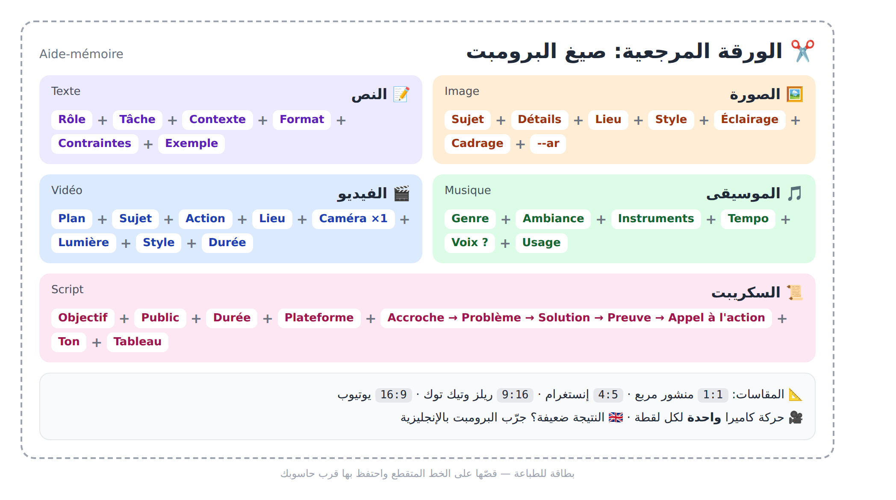
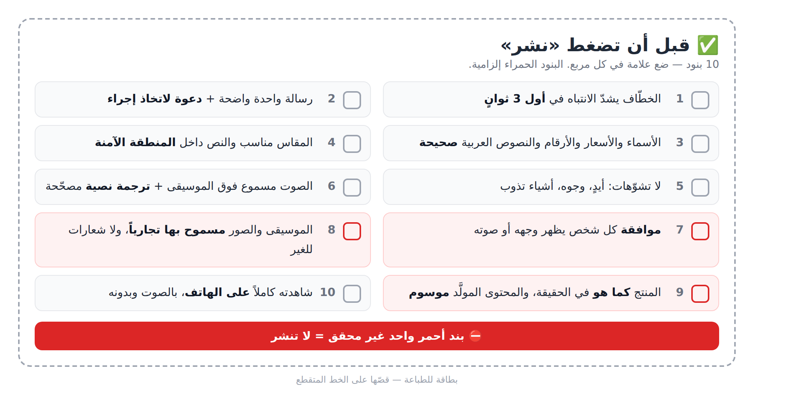

# الملاحق (**Annexes**)

> أربع أدوات مرجعية تعود إليها في كل مشروع: (أ) قاموس، (ب) روابط الأدوات، (ج) صيغ البرومبت، (د) قائمة تحقق قبل النشر.

## (أ) قاموس المصطلحات: 60 مصطلحاً

| عربي | Français | English |
|---|---|---|
| الذكاء الاصطناعي | Intelligence artificielle (IA) | Artificial Intelligence (AI) |
| التعلّم الآلي | Apprentissage automatique | Machine Learning |
| التعلّم العميق | Apprentissage profond | Deep Learning |
| الشبكة العصبية | Réseau de neurones | Neural Network |
| النموذج اللغوي الكبير | Grand modèle de langage | Large Language Model (LLM) |
| الذكاء الاصطناعي التوليدي | IA générative | Generative AI |
| بيانات التدريب | Données d'entraînement | Training data |
| الضبط الدقيق | Ajustement fin | Fine-tuning |
| الرمز | Jeton | Token |
| نافذة السياق | Fenêtre de contexte | Context window |
| الهلوسة | Hallucination | Hallucination |
| التحيّز | Biais | Bias |
| متعدد الوسائط | Multimodal | Multimodal |
| الوكيل الذكي | Agent IA | AI Agent |
| واجهة البرمجة | Interface de programmation (API) | API |
| التزييف العميق | Hypertrucage | Deepfake |
| العلامة المائية | Filigrane | Watermark |
| وسم المحتوى المولَّد | Étiquetage du contenu IA | AI content labeling |
| حقوق المؤلف | Droits d'auteur | Copyright |
| الموافقة | Consentement | Consent |
| شروط الاستعمال | Conditions d'utilisation | Terms of use |
| البرومبت | Prompt | Prompt |
| هندسة البرومبت | Ingénierie de prompt | Prompt engineering |
| الدور | Rôle | Role |
| السياق | Contexte | Context |
| القيود | Contraintes | Constraints |
| الأمثلة القليلة | Few-shot | Few-shot |
| سلسلة التفكير | Chaîne de pensée | Chain of thought |
| البرومبت المتسلسل | Enchaînement de prompts | Prompt chaining |
| البرومبت السلبي | Prompt négatif | Negative prompt |
| التكرار والتحسين | Itération | Iteration |
| القالب | Modèle de prompt | Prompt template |
| نص إلى صورة | Texte vers image | Text-to-image |
| نسبة الأبعاد | Format / Ratio | Aspect ratio |
| التكبير الذكي | Agrandissement | Upscaling |
| الإضاءة | Éclairage | Lighting |
| إزالة الخلفية | Détourage | Background removal |
| الملء التوليدي | Remplissage génératif | Inpainting / Generative fill |
| البذرة | Graine | Seed |
| الصورة المرجعية | Image de référence | Reference image |
| ثبات الشخصية | Cohérence du personnage | Character consistency |
| صورة إلى فيديو | Image vers vidéo | Image-to-video |
| السكريبت | Script / Scénario | Script |
| الستوريبورد | Storyboard / Scénarimage | Storyboard |
| الخطّاف | Accroche | Hook |
| الدعوة لاتخاذ إجراء | Appel à l'action | Call to action (CTA) |
| اللقطة | Plan | Shot |
| لقطة قريبة | Gros plan | Close-up |
| تقدّم الكاميرا | Travelling avant | Dolly in |
| الحركة الأفقية | Panoramique | Pan |
| الأفاتار | Avatar / Présentateur virtuel | Avatar |
| مزامنة الشفاه | Synchronisation labiale | Lip sync |
| التعليق الصوتي | Voix off | Voice-over |
| نص إلى كلام | Synthèse vocale | Text-to-speech (TTS) |
| استنساخ الصوت | Clonage vocal | Voice cloning |
| خفض الموسيقى تحت الكلام | Atténuation automatique | Ducking |
| المونتاج | Montage | Video editing |
| الترجمة النصية | Sous-titres | Subtitles / Captions |
| الصورة المصغّرة | Miniature | Thumbnail |
| ملف الأعمال | Portfolio | Portfolio |

> ⚠️ لا تخلط بين **Zoom** (تكبير بالعدسة والكاميرا ثابتة) و**Travelling avant** (الكاميرا نفسها تتقدّم فيتغيّر العمق).

## (ب) روابط الأدوات الرسمية

> ⚠️ اكتب العنوان بنفسك ولا تضغط على إعلانات تقلّد أسماء الأدوات: المواقع المزيفة تسرق الحسابات وبيانات الدفع. الأسعار والحدود المجانية تتغير، فراجع الموقع الرسمي.

- **نص وبحث:** ChatGPT `chatgpt.com` · Claude `claude.ai` · Gemini `gemini.google.com` · Copilot `copilot.microsoft.com` · Perplexity `perplexity.ai` · NotebookLM `notebooklm.google.com` · DeepL `deepl.com`
- **صور وتصميم:** Midjourney `midjourney.com` · Ideogram `ideogram.ai` · Leonardo `leonardo.ai` · Adobe Firefly `firefly.adobe.com` · Canva `canva.com` · remove.bg `remove.bg`
- **صوت وموسيقى:** ElevenLabs `elevenlabs.io` · Suno `suno.com` · Udio `udio.com` (شروطه تغيّرت مؤخراً؛ تحقّق قبل الاعتماد عليه)
- **فيديو وأفاتار ومونتاج:** Runway `runwayml.com` · Kling `klingai.com` · Luma `lumalabs.ai` · Pika `pika.art` · HeyGen `heygen.com` · Synthesia `synthesia.io` · CapCut `capcut.com` · Descript `descript.com` · Opus Clip `opus.pro` · Sora وVeo وHailuo: ابحث عن الموقع الرسمي من صفحة الشركة (OpenAI، Google، MiniMax)
- **إنتاجية وبدون برمجة:** Notion `notion.com` · Zapier `zapier.com` · Make `make.com` · n8n `n8n.io` · Gamma `gamma.app` · Framer `framer.com` · Lovable `lovable.dev` · Bolt `bolt.new` · Replit `replit.com` · v0 `v0.app`
- **عمل حر:** Fiverr `fiverr.com` · Upwork `upwork.com` · خمسات `khamsat.com` · مستقل `mostaql.com`

## (ج) ورقة مرجعية: صيغ البرومبت (Aide-mémoire)



*الشكل 22-1: الصيغ الخمس في بطاقة واحدة للطباعة.*

**1. النص (Texte):**

```
Agis comme [rôle / expert].
Tâche : [ce que tu veux exactement].
Contexte : [qui, pour qui, pourquoi].
Format : [liste / tableau / paragraphe / nombre de mots].
Contraintes : [ton, longueur, langue, à éviter].
Exemple : [un exemple du résultat attendu].
```

**2. الصورة (Image)** — 🇬🇧 بالإنجليزية: السطر الثاني في الكتلة.

```
[Sujet], [détails], [lieu], style [photo réaliste / illustration / 3D], éclairage [doux / lumière dorée / studio], [gros plan / plan large / vue de dessus], ambiance [chaleureuse / minimaliste], couleurs [palette] --ar 4:5
[Subject], [details], [location], [realistic photo / illustration / 3D] style, [soft / golden hour / studio] lighting, [close-up / wide shot / top view], [warm / minimalist] mood, [palette] colors --ar 4:5
```

**3. الفيديو (Vidéo)** — 🇬🇧 بالإنجليزية: السطر الثاني. حركة كاميرا **واحدة** لكل لقطة.

```
[Gros plan / Plan large] de [sujet] qui [action], dans [décor]. Éclairage [naturel / néon / coucher de soleil]. Caméra : [travelling avant lent / panoramique / plan fixe]. Style [cinématographique / publicitaire]. Ambiance [calme / énergique]. Durée : [5 s].
[Close-up / Wide shot] of [subject] [action], in [location]. Camera: [slow dolly in / pan / static shot]. [Natural / neon / sunset] lighting. [Cinematic / commercial] style. Duration: [5 s].
```

**4. الموسيقى (Musique)** — 🇬🇧 بالإنجليزية: السطر الثاني.

```
Musique [lo-fi / pop / gnawa moderne / orchestrale], ambiance [joyeuse / calme / épique], instruments [oud, darbouka, piano], tempo [lent / moyen / rapide], [instrumental / voix féminine en arabe], pour [publicité de 30 secondes].
[Lo-fi / pop / modern gnawa / orchestral] music, [joyful / calm / epic] mood, [oud, darbuka, piano], [slow / mid / fast] tempo, [instrumental / female vocals in Arabic], for [a 30-second ad].
```

**5. السكريبت (Script):**

```
Agis comme un scénariste de vidéos courtes.
Script d'une vidéo de [durée] pour [TikTok / YouTube / Instagram].
Objectif : [vendre / expliquer]. Public : [description].
Structure : Accroche (0-3 s) → Problème → Solution → Preuve → Appel à l'action.
Ton : [dynamique / chaleureux]. Langue : [darija / arabe standard / français].
Format : tableau Temps | Visuel | Voix off | Texte à l'écran | Son.
```

**المقاسات:** `--ar 1:1` منشور مربع · `--ar 4:5` Instagram · `--ar 9:16` Reels وTikTok · `--ar 16:9` YouTube.

## (د) قائمة تحقق قبل النشر



*الشكل 22-2: عشرة بنود للطباعة. البنود الحمراء إلزامية.*

- [ ] الخطّاف يشدّ الانتباه في أول 3 ثوانٍ.
- [ ] رسالة واحدة واضحة ودعوة لاتخاذ إجراء.
- [ ] الأسماء والأسعار والأرقام والنصوص العربية داخل الصور صحيحة.
- [ ] المقاس مناسب للمنصة، والنص داخل المنطقة الآمنة (**Zone de sécurité**).
- [ ] لا تشوّهات: أيدٍ بأصابع زائدة، وجوه مشوّهة، أشياء تذوب.
- [ ] التعليق مسموع فوق الموسيقى، والترجمة النصية مصحّحة ومتزامنة.
- [ ] ⛔ لديّ **موافقة** كل شخص يظهر وجهه أو صوته.
- [ ] ⛔ الموسيقى والصور **مسموح بها تجارياً**، ولا شعارات لغيري.
- [ ] ⛔ المنتج يظهر **كما هو**، والمحتوى المولَّد **موسوم** وفق قواعد المنصة.
- [ ] شاهدتُ الفيديو كاملاً على الهاتف، بالصوت وبدونه.

> ⚠️ بند واحد من البنود ⛔ غير محقق = لا تنشر.

## 📝 الخلاصة

- القاموس يجمع 60 مصطلحاً أساسياً بثلاث لغات.
- ادخل إلى الأدوات من روابطها الرسمية فقط.
- لكل نوع محتوى صيغة ثابتة: نص، صورة، فيديو، موسيقى، سكريبت.
- قائمة التحقق تحميك من الأخطاء التقنية والأخلاقية.

## 🛠️ تمرين

خذ مشروعاً واحداً (إطلاق قهوة جديدة في مقهى الحي) واملأ به الصيغ الخمس: نص منشور، صورة، لقطة فيديو، موسيقى خلفية، وسكريبت. ثم طبّق قائمة التحقق على النتيجة.

---

⬅️ العودة إلى [فهرس الكتاب](README.md)
